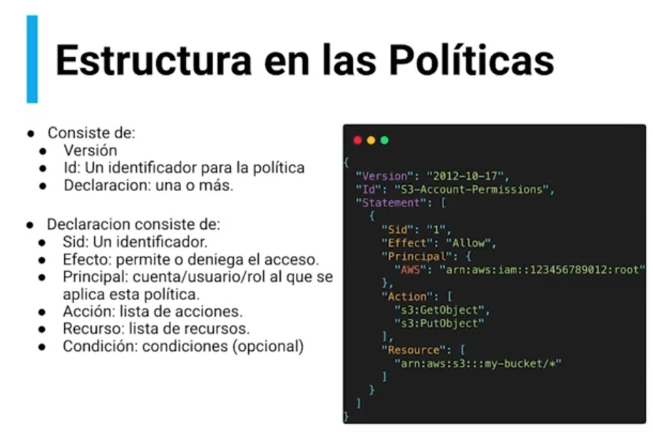

# AWS: Roles y Seguridad con IAM

## 1. Usuarios y Grupos

### 1.1. Introducción IAM: usuarios, grupos y políticas

IAM es un servicio global que nos va permitir administrar, controlar y dar permisos a todos nuestros usuarios dentro de la plataforma AWS.

* **Root account:** Es la cuenta que se crea de manea predeterminada.

* **Usuarios:** Son personas que tienen acceso a servicios de la organización, se pueden agrupar y no tienen que pertenecer solo a un grupo.

* **Grupos:** Solo contienen usuarios y no otros grupos.

* **Políticas:** A los usuarios o grupos de les puede asignar políticas como documentos JSON. Estas políticas definen los permisos de los usuarios o grupos para cualquiera de los servicios dentro de AWS y para definirlas de aplica el principio de privilegios mínimos, es decir, no otorgar más privilegios de los que un usuario necesita.


### 1.2. Práctica IAM Usuarios y Grupos

1. Ingresamos a IAM de amazon
2. entramos a usuarios (Amazon recomienda siempre crear a un usuario con permisos de administrador)
3. Creamos el usuario y cuando lleguemos a grupo, le damos a crear grupo y creamos uno que se llame Administrators y le damos una política predefinida que se llama AdministratorAccess.
4. Luego ingresamos al panel o dashboard para ingresar a Cuenta de AWS y darle un alias al ID de cuenta.
5. Copiamos la URL de inicio de sesión para los usuarios de IAM de esta cuenta y es con este link que van ingresar

### 1.3. Politicas IAM

Son documentos en JSON donde específicamos todos los accesos a los servicios de AWS.

#### Herencia de Politicas de IAM

Los accesos de un grupo se heredan a los usuarios miembros del grupo.

Se pueden crear politicas (inline politicy) para usuarios que no pertenecen a un grupo. (Es mejor practica crear un grupo y darle los permisos al grupo, no a usuarios). Un usuario puede compartir dos politicas, asi obtiene mas permisos.



#### Recursos

* [Generador de Políticas de AWS](https://awspolicygen.s3.amazonaws.com/policygen.html)

* [Simulador de Políticas de IAM](https://awspolicygen.s3.amazonaws.com/policygen.html)

### 1.4. Prácticas politicas IAM

Se puede asignar permisos directamente a un usuario, pero las buenas prácticas y lo que AWS recomienda, es crear primero a los grupos, asignarles las políticas de acceso, y recién agregar los usuarios a los grupos para que así ahorremos tiempo y errores al tratar de asignarle permiso a usuarios por inidvidual.

### 1.5. Visión general IAM MFA

#### Políticas de Contraseñas

* Contraseñas seguras
* Longitud mínima de contraseña
* Tipos de caracteres especiales
* Los usuarios cambien sus propias contraseñas
* Caducidad de la contraseña
* Evitar reutilización de contraseñas

#### Autenticador multifactor o MFA

Ayuda a proteger las cuentas y los usuarios

Es la suma de la contraseña conocida por el usuarios que además puede tener algunas de las políticas mencionadas anteriormente para mejorar la seguridad, pero, adicionalmente agrega un dispositivo de seguridad que es el que me permitirá acceder finalmente a la cuenta, luego de que la contraseña haya sido correcta

Si la contraseña es robada o pirateada la cuenta NO se verá comprometida

#### Dispositivos para MFA Virtuales

* Google Authenticator
* Authy (tokens guardados en diferentes dispositivos (aplicación))

#### Dispositivos

* YubiKey (puede almacenar usuarios Root, IAM)
* Gemalto: dispositivo de llavero de hardware
* SurePassID: llavero inteligente para acceder a la nube

### 1.6. Configuración IAM MFA

En la opción de credenciales de seguridad que esta en neustro perfil, podemos configurar el MFA con algunos de los aplicativos antes mencionados o con las llaves.

## 2. SDK, CLI y AWS Access Keys

### 2.1. AWS Access Keys, CLI y SDK

#### AWS Management Console

La Consola de administración de AWS es una aplicación web que comprende y hace referencia a una amplia colección de consolas de servicio para administrar los recursos de AWS.

#### AWS Access Keys

Las claves de acceso son las credenciales a largo plazo para un usuario de IAM o usuario raíz Cuenta de AWS. Puede utilizar las claves de acceso para firmar solicitudes mediante programación a la AWS CLI o a la API de AWS (directamente o mediante el SDK de AWS). Para obtener más información, consulte Firma de la solicitud de la API de AWS en la Referencia general de Amazon Web Services

* Access Key ID
* Secret Key ID
* NO compartir tus llaves de acceso

#### AWS Command Line Interface (CLI)

La AWS Command Line Interface (AWS CLI) es una herramienta de código abierto que le permite interactuar con los servicios de AWS mediante el uso de comandos en el shell de la línea de comandos

* Herramienta que le permite interactuar con los servicios de AWS mediante los comandos en su shell de linea de comandos
* Acceso directo a las API publicas de los servicios de AWS
* Puede desarrollar scripts para administrar sus recursos
* Es de codigo abierto

#### AWS Software Development Kits (SDK)

AWS SDK for JavaScript proporciona una API de JavaScript para los servicios de AWS. Puede usar la API de JavaScript para crear bibliotecas o aplicaciones para Node.js o el navegador.

Podemos usar los lenguajes mas demandados para los servicios de AWS.

### 2.2. Setup AWS CLI en Mac ,windows y Linux

1. Buscamos AWS CLI install en el navegador
2. Buscamos el instalador para mac
3. Despues de instalarlo, entramos a nuestra terminal y colocamos `aws --version`.

### 2.3 Configuración AWS CLI con Access Keys

1. Ingresamos a credenciales de seguridad en nuestro perfil de AWS
2. En clave de acceso creamos un access key y un access secret key
3. Luego nos vamos a la consola AWS CLI y con los comandos configuramos las claves secretas que nos ayudara a tener acceso a nuestro entorno AWS.

```bash
# Verificamos si esta instalado AWS CLI
aws --version
# Iniciamos la configuración
aws configure
# Colocamos nuestras claves
# -> AWS Access Key ID :
# -> AWS Secret Access Key:
# -> Default Region Name: Colocamos el alias de la region
# -> Default output format: Le damos enter y omitimos
# Con esto ya tenemos acceso a neustro entorno AWS
```

### 2.4 AWS CloudShell

AWS CloudShell es un shell basado en navegador que facilita la administración, exploración e interacción seguras con sus recursos de AWS. CloudShell se autentica previamente con las credenciales de su consola. Las herramientas comunes de desarrollo y operaciones están preinstaladas, por lo que no se requiere instalación ni configuración local. Con CloudShell, puede ejecutar scripts rápidamente con la interfaz de línea de comandos de AWS (AWS CLI), experimentar con las API de servicios de AWS mediante los SDK de AWS o utilizar una variedad de otras herramientas para ser productivo. Puede usar CloudShell directamente desde su navegador y sin costo adicional.

## 3. Seguridad dentro de AWS

### 3.1. Roles IAM para AWS

Los roles proporcionan una manera de conceder permisos temporales a usuarios, aplicaciones o servicios, sin necesidad de asignar permisos directamente a entidades permanentes o compartir credenciales de seguridad.

**Ejemplo:** Si queremos que una instancia EC2 envíe imágenes o archivos a un bucket de S3, deberemos crear el rol que le permita a la instancia realizar estas acciones con otros servicios, al rol se le deben agregar políticas que le den permisos (sólo los requeridos).

Nota: Es una mala práctica tener Access Key dentro de las máquinas virtuales porque entonces si entran a la instancia podrían tener acceso a los servicios que tenga registrado con los access keys.

### 3.2. Práctica de roles en IAM

Como vimos anteriormente los roles nos va ayudar a tener acceso temporal a los servicios AWS mediante políticas, además, a que ya no va a ver la necesidad de configurar nuestro access key en EC2 por lo que evitaremos ataques de hackers, solo necesitaremos añadir el rol al servicio que queremos tener acceso.

#### Crear un rol

1. Ingresar a IAM
2. Ingresar a rol y crear
3. Seleccionar "Servicio de AWS" -> Caso de uso EC2 -> siguiente
4. Escogemos la política en este caso S3 full access, para que desde una instanacia EC2 podamos enviar información a un S3 y luego siguiente.

### 3.3. Herramientas de seguridad en IAM

1. Credentials Report:

   Es un listado o reporte en CSV, que nos va a permitir revisar lo que está pasando con los usuarios; es decir, si tenemos credenciales actualizadas, cuando fue la última vez que las cambiaron, si tenemos el MFA habilitado entre otras cosas. El beneficio de este reporte es que nos permitirá tener un over-view general de cuantos usuarios tenemos en nuestra cuenta de AWS.

2. Acces Advisor:

   Nos va a mostrar a nivel granular todos los permisos por servicios. Esto quiere decir que si los usuarios tienen accesos a todos los servicios de AWS, nos generará un reporte de que servicios están ocupando realmente.

Estos reportes nos ayudan mucho a establecer el principio del mínimo privilegio para implementar políticas más adecuadas y seguras en nuestra cuenta AWS, como también generar auditorias de nuestra cuenta de manera más efectiva.

### 3.4. Práctica de las herramientas de seguridad

#### Credentials Report

1. Ingresamos a IAM
2. Nos vamos a Credential report y descargamos

### Acces Advisor

1. Se ingresa a IAM
2. Se ingresa a Users
3. Se ingresa al usuario que quieres analizar los servicios ocupados
4. Ingresas a Acces Advisor

### 3.5. Mejores prácticas dentro de IAM

* El usuario root no se debe usar.
  * Usarla únicamente para crear usuarios y asignarle permisos para poder operar.
* Se deben crear grupos, donde se metan usuarios.
* Crear políticas seguras para la creación de contraseñas.
* Utilizar el MFA, como 2do factor de autenticación.
* Los roles son poderosos, nos permiten ejecutar acciones a nuestro nombre.
* Utilizar servicios como: Access Key, Secret Key para CLI.
* Utilizar los reportes que nos ofrece la auditoria de los servicios.
* No compartir usuarios.

### 3.6. Modelo de responsabilidad compartida en IAM

#### Responsabilidad de AWS

* Infraestructura (seguridad de red global).
* Análisis de configuración y vulnerabilidad.
* Validación de cumplimiento.

#### Responsabilidad de los usuarios

* Gestión v seguimiento de Usuarios, Grupos. Roles y Políticas.
* Habilitar MFA en todas las cuentas.
* Rotar todas sus llaves con frecuencia
* Usar herramientas de IAM para aplicar los permisos apropiados.
