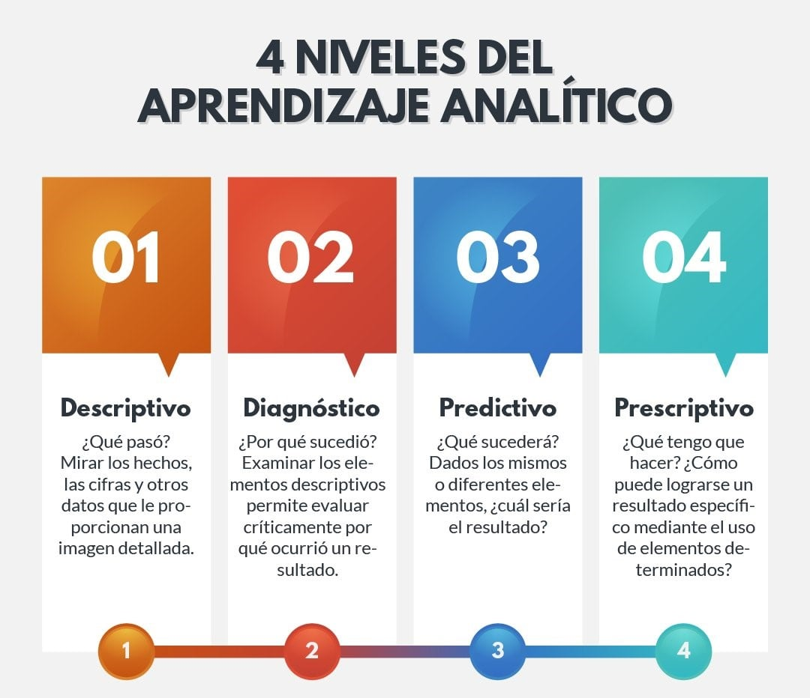
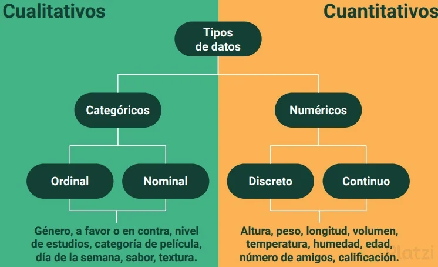

# Análisis explortorio de datos

El Análisis Exploratorio de Datos (EDA) es el proceso de conocer en detalle, darle sentido a los datos, visualizarlo por primera vez y ver como se comportan, cuantas variables existen, de que tipo son, indagar en ellos haciendo preguntas. En este proceso vamos a determinar como tratarlos, interrogarlos para obtener las respuestas necesarias y de esa manera transformarlo en información útil para la empresa o para resolver el problema al que te enfrentas.

## ¿Cómo hacer un análisis exploratorio de datos?

Con el análisis exploratorio de datos, vamos a poder:

* Organizar y entender las variables
* Establecer relaciones entre las variables
* Encontrar patrones ocultos en los datos
* Ayuda a escoger el modelo correcto para la necesidad correcta
* Ayuda a tomar decisiones informadas

### Pasos de una Análisis Exploratorio de Datos

#### Hacer preguntas sobe los datos

Hazte las siguientes preguntas para guiar el EDA:
Que te gustaria encontrar?
Que quisieras saber de los datos?
Cual es la razon para realizar el analisis?

#### Determinar el tamaño de los datos

Debes responder preguntas como:
Cuantas observaciones existen?
Cuantas variables hay?
Necesito todas las observaciones?
Necesito todas las variables?

#### Categorizar las variables

Debes preguntarte:
Cuantas variables categóricas existen?
Cuantas variables continuas existen?
Como puedo explorar cada variable dependiendo de su categoría?

#### Limpieza y validación de los datos

En ese paso debes preguntarte:
Tengo valores faltantes?
Cual es la proporción de datos faltantes?
Como puedo tratar a los datos faltantes?
Cual es la distribución de los datos?
Tengo valores atipicos?

#### Establecer relaciones entre los datos

Responde preguntas como:
Existe algun tipo de relacion entre mi variable X y Y?
Que pasa ahora si considero la variable Z en el analisis?
Que significa que las observaciones se agrupen?
Que significa el patron que se observa?

## Tipos de análisis de datos

## Tipos de datos y análisis de variables

En algunos casos puedes cambiar el tipo de datos, dependiendo del analisis que requiero hacer.

### Tipo de Análisis

## Recolección de datos, limpieza y validación

> La recolección de datos es la forma de recolectar información que permite obtener conocimiento de primera mano e ideas originales sobre el problema de investigación

### Tipos de Recolección de Datos

* Primaria: Datos colectados de primera mano a traves de encuestas, entrevistas, experimentos y otros. Puedes decidir que recolectas y que quiere medir. Tienes total control de los datos.
* Secundaria: Datos previamente recolectados por una fuente primaria externa al usuario primario. Son datos abiertos que puedes utilizar. No tienes control sobre lo que se mide o sobre el objetivo del estudio
* Terciaria: Datos que se adquieren de fuentes completamente externas al usuario primario. Son datos accesibles a todo el mundo por lo que pierde su valor y tienden a ser datos genericos

### Validación y limpieza de los datos

Es el proceso de asegurar la consistencia y precisión dentro de un conjunto de datos. Para asegurar la consistencia de los datos debemos validar:

**1. Modelo de datos:** si un tercero recolecto los datos, verifica que preguntas queria responder con los datos. Si eres quien recolecta los datos, hazte muchas preguntas y considera si esos datos son suficientes para responderlas

**2. Seguimiento de formato estándar de archivos:** verifica que la extensión de los archivos que estas manejando correspondan con el formato interno que tienen. Asegurate que los numeros se expresen en el formato que estas trabajando.

**3. Tipos de Datos:** verifica que los datos sen del tipo que se indica en el dataset

**4. Rango de variables:** verifica que las variables estén dentro del rango establecido en la recoleccion de datos. En caso de encontrar variables fuera del rango preguntate: como llegaron esos datos aqui? tienen algun significado alterno? debo preservarlos o eliminarlos?

**5. Unicidad:** verifica que tan unicos son los datos. detecta si existe duplicidad en los datos y corrige.

**6. Consistencia de expresiones:** se refiere a como la persona que recolecta los datos define sus variables. Formato de fecha, de hora, variables escritas de la misma forma en toda la tabla. No son datos erroneos, solo es cuestion de darle el formato adecuado.

**7. Valores nulos:** pueden estar explicitos o implicitos en el dataset. Son datos faltantes. Porque esta vacio? puedo rellenarlo con otro dato? esta vacio por un proceso aleatorio o tiene un sentido?
