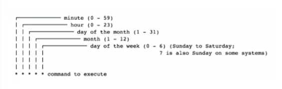
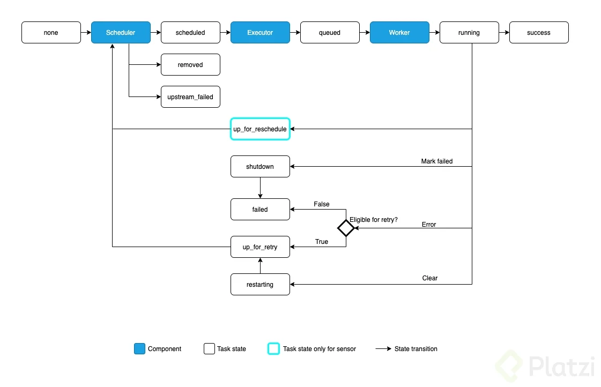
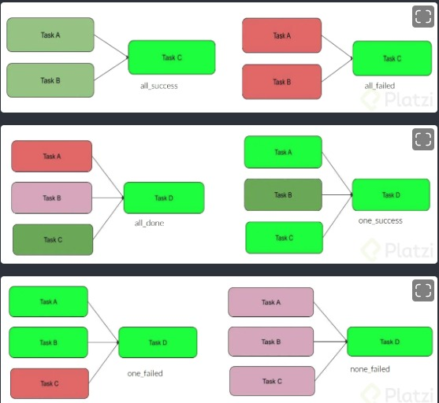

# Fundamentos de Apache Airflow

## 1. Introducción a Apache Airflow

### 1.1. ¿Que es Airflow?

Airfow es una plataforma creada por la comunidad para crear, programar y supervisar flujos de trabajo de forma programada.

- **Octubre de 2014:** Airflow fue lanzado.
- **Marzo de 2016:** Airflow se convirtió en un proyecto de código abierto.
- **Enero de 2019:** Airflow se convirtió en un proyecto de nivel superior en la Apache Software Foundation.
- **17 de diciembre de 2020:** Se lanzó Airflow 2.0.

### 1.2. ¿Para qué sirve airflow?

1. **Programación de tareas:** Permite definir flujos de trabajo como DAGs (Grafos Acíclicos Dirigidos), donde se pueden especificar tareas individuales y sus dependencias.

2. **Ejecución escalable:** Airflow puede ejecutar múltiples flujos de trabajo en paralelo y escalar para manejar grandes volúmenes de trabajo.

3. **Monitoreo y registro:** Proporciona una interfaz de usuario web que permite monitorear el progreso de los flujos de trabajo, ver el historial de ejecución y acceder a registros detallados de cada tarea.

4. **Reutilización de código y modularidad:** Permite reutilizar código y definir tareas como funciones Python, lo que facilita la modularidad y la reutilización en diferentes flujos de trabajo.

5. **Integración con herramientas y servicios:** Airflow se integra con una variedad de herramientas y servicios populares, como bases de datos, sistemas de almacenamiento, servicios en la nube, etc.

### 1.3. ¿Por qué usar airflow?

1. Es opensource
2. Podemos usar python
3. Provee una interfaz de usuario para monitorizar
4. el 54% de personas que lo usan son data engineer, y hay otros roles que lo usan como solutions architect, developer, devops, data scientist, support engineer, data analyst, business analyst
5. el 73% de personas que usan airflow lo usan todos los días que trabajan y el 17% una vez a la semana.

### 1.4. Resumen

1. Desarrollar workflows mediante python
2. Orquestar procesos
3. Monitorear ejecuciones
4. Una herramienta muy usada
5. Un "Job sheduler" con esteroides (CRON ++)

## 2. Conceptos Básicos

### 2.1. DAG

Para entender que es un DAG, debemos entender primero lo siguiente:

> 👉🏻 **Workflow:** Es una secuencia de tareas que nos ayuda a conseguir un objetivo

✨ Los DAG (Directed Acyclic Graph) es un concepto que proviene de las matemáticas y debe tener dos propiedades prinicipales:

1. Debe seguir una sola dirección
2. No debe tener ciclos

Esto se debe a que una tarea se puede ejecutar solo si la tarea anterior ya termino de ejecutarse, por ejemplo la tarea 2 va a depender de la tarea 3, y la tarea 4 depende de la tarea 3; en cambio si fuera un grafo cíclico, la tarea anterior numero 3 dependeria de la tarea4 formado un ciclo.

### 2.2. Tasks y Operators

✨ Los task son tareas que nos permite ejecutar cualquier operación que queramos como ejecutar scripts de python, traer datos de una api, entregar datos a un abase de datos, entre otros.

3 Tipos básicos de tasks:

      * Operators
      * Sensors
      * TaskFlow-decorated @task

✨ Los Operator nos permite crear tareas, y podemos usar diferentes tipo de operadores:

      * BashOperator
      * PythonOperator

### 2.3. Scheduler

✨ Es el corazón de Airflow, lo primero que sa un directorio donde esta nuestros DAGs creados con las tareas, estas tareas son asignadas a los ``workers`` que son los que se encargan de ejecutarlas, y el estado de si han sido ejecutadas o no se guardan en ``Metadata Database``, y finalmente tenemos a ``User Interface`` que es donde podremos monitorear todo el flujo.

**Resumen:**

1. Un flujo de trabajo se representa como un **DAG**
2. Un **task** es un componente interno para ejecutar operaciones.
3. Un **operator** representa una única unidad de trabajo.
4. EI **scheduler** se encarga de ejecutar los DAGs en intervalos de tiempo.

## 3. Instalación y configuración

### 3.1. Instalación de Apache Airflow usando Docker

👉🏻 Vamos a enfocarnos a instalar docker-compose.yaml, para ello debemos entrar a la [documentación](https://airflow.apache.org/docs/apache-airflow/stable/howto/docker-compose/index.html)

👉🏻 Según la documentación tenemos que crear una carpeta llamada airflow, y dentro de ella se crea las siguientes carpetas dags, logs, plugins, solutions y además se ejecuta el siguiente comando para crear el docker-compose.yaml

      ```bash
            curl -LfO "https://airflow.apache.org/docs/apache-airflow/2.8.3/docker-compose.yaml"
            docker-compose up
            # Y por ultimo se ingresa a localhost:8080
            # Te va a pedir usuario y contraseña, por defecto es airflow
      ```
✨ Debemos recordar que para levantar el servicio debemos tener instalado docker-compose o docker desktop

### 3.2. Posibles configuraciones

Las configuraciones se pueden establecer de dos formas:

✨ Mediante el archivo airflow.cfg

      ```bash
            # Para ver todos los contenedores
            docker ps
            # se escoge el contenedpr airflow-airflow-webserver-1 y se copia su ID
            docker exec -it <ID> bash
            # Con ese comando ingresamos a su terminal y con ls vemos los directorios
            ls
            # Escogemos airflow.cfg
      ```

✨ Mediante variables de entorno

      ```bash
            # Aca traemos las variables de la documentación y la pegamos en docker-compose.yaml en la parte de enviroment
            # La parte mas importante son los puertos y los volumenes
            # Los volumenes que estan debajo de enviroment deberían tener una configuración parecida a esta
            volumnes:
                  - ./dags:/opt/airflow/dags
                  - ./logs:/opt/airflow/logs
                  - ./plugins:/opt/airflow/plugins
      ```

### 3.3 Variables y conexiones

#### Variables

En airflow podemos crear variables, y esto nos va a servir para guardar cualquier cosa que necesitemos y reutilzarlas despues.

      ```bash
            #  Para crear una variable nos vamos a la interfaz grafica
            Admin > Variables > crear variable
            # Nos va a pedir key, val y description, ejemplo:
            key: organizacion
            val: curso
            Description: La ogranizacion se llama holm
      ```

Ahora para usar la variable en nuestro dag hacemos lo siguiente:

      ```python
            from airflow.models import Variable

            org = Variable.get("organizacion")
            foo_json = Variable.get("foo_baz", deserialize_json=True)
      ```

#### Conexion

      ```bash
            #  Para crear una variable nos vamos a la interfaz grafica
            Admin > Conexion > crear conexion
            # Nos va a pedir unos datos
            Conection id: posgres_conn
            Connection Type: postgres
            host: localhost
            port: "cualquiera" 5050
      ```

Ahora para obtener la conexión es el siguiente código

      ```python
            from airflow.providers.postqres.operators.postgres import PostgresOperator

            populate-pet-table = PostgresOperator(
                  task-id= " populate_pet_table" ,
                  postg res-conn-id= "my-postgres-conn" ,
                  sql= " sql/pet-schema . sql" ,
            )
      ```

## 4. Implementando un DAG

### 4.1. Implementando un DAG

Hay 3 formas de hacerlo:

👉🏻 forma 1: Standard Constructor

      ```python
            my_dag = DAG("ny-dag-name",
                              star_date=pendelum.datetime(2021.1.1. tz="UTC),
                              schedule_interval="daily",
                              catchup=False
                        )
            op = EmptyOperator( task_id="task", dag=my_dag)
      ```
👉🏻 forma 2: Context Manager

      ```python
            from airflow import DAG

            with DAG(
                  "my_dag_name",
                  star_date=pendelum.datetime(2021.1.1. tz="UTC),
                  schedule_interval="daily",
                  catchup=False
            ) as dag:
                  op = EmptyOperator( task_id="task")
      ```

👉🏻 forma 3: Dag Decorator

      ```python
            @dag( star_date=pendelum.datetime(2021.1.1. tz="UTC),
                  schedule_interval="daily",
                  catchup=False
                  )
            def generate-dag() :
                  op = EmptyOperator(task-id="task")

            dag = generate-dag()
      ```

#### Práctica

Primero tenemos que revisar la [documentación](https://airflow.apache.org/docs/apache-airflow/stable/installation/installing-from-pypi.html) y en el ambiente virtual debemos instalar las siguientes librerías.

      ```bash
            pip install "apache-airflow[celery]==2.8.3" --constraint "https://raw.githubusercontent.com/apache/airflow/constraints-2.8.3/constraints-3.8.txt"
      ```

Ahora el codigo se coloca en un archivo adentro de la carpeta dags, en este caso el archivo sera 0-primeradag.py, se guarda el codigo y el dag va aparecer automáticamente en la interfaz gráfica de usuario.

      ```python
            from airflow import DAG
            from airflow.decorators import dag
            from airflow.operators.empty import EmptyOperator
            from datetime import datetime

            # Forma 1
            with DAG(
            dag_id="dag1",
            description="dag1",
            start_date=datetime(2022, 10, 31),
            schedule_interval="@once",
            ) as dag1:
            t1 = EmptyOperator(task_id="dummy")

            # Forma 2
            dag2 = DAG(
            dag_id="dag2",
            description="2dag2",
            start_date=datetime(2022, 10, 31),
            schedule_interval="@once",
            )
            t2 = EmptyOperator(task_id="dummy2", dag=dag2)

            # Forma 3
            @dag(
            dag_id="dag3",
            description="dag3",
            start_date=datetime(2022, 10, 31),
            schedule_interval="@once",
            )
            def generate_dag():
            t3 = EmptyOperator(task_id="dummy3")

            dag3 = generate_dag()
      ```

### 4.2. Bash Operator

      ```python
            from airflow import DAG
            from airflow.operators.bash import BashOperator
            from datetime import datetime

            with DAG(dag_id="bashoperator",
                  description="utilizando bash operator",
                  start_date=datetime(2024, 3, 24)) as dag:

            t1 = BashOperator(
                  task_id="hello_with_bash",
                  bash_command="echo 'Hello gente soy gianmarco'"
            )
      ```
Ahora en la interrfaz gráfica, `activamos el dag`, luego le damos play en `Trigger DAG,` le damos click a `autorefresh,` le damos click a la tarea despues que se ejecuta y luego `Logs`, y veremos el comando ejecutado.

### 4.3. Python Operator

      ```python
            from airflow import DAG
            from airflow.operators.python import PythonOperator
            from datetime import datetime

            def print_hello():
            print("Hello gente, soy Gianmarco")

            with DAG(
            dag_id="pyhtonoperator",
            description="Nuestro primer DAG utilizando Python",
            schedule_interval="@once",
            start_date=datetime(2023, 3, 24)
            ) as dag:
            t1 = PythonOperator(
                  task_id="hello_with_python",
                  python_callable=print_hello
            )
      ```

### 4.4. Definiendo dependencias entre tareas

Hay 2 formas de realizar las dependencias entre tareas

      ```python
            from airflow import DAG
            from airflow.operators.python import PythonOperator
            from airflow.operators.bash import BashOperator
            from datetime import datetime

            def print_hello():
            print("Hello gente, soy Gianmarco")

            with DAG(
            dag_id="dependencias",
            description="Usando dependencias entre tareas",
            schedule_interval="@once",
            start_date=datetime(2023, 3, 24)
            ) as dag:
            t1 = PythonOperator(
                  task_id="tarea1",
                  python_callable=print_hello
            )
            t2 = BashOperator(
                  task_id="tarea2",
                  bash_command="echo 'tarea 2'"
            )
            t3 = BashOperator(
                  task_id="tarea3",
                  bash_command="echo 'tarea 3'"
            )
            t4 = BashOperator(
                  task_id="tarea4",
                  bash_command="echo 'tarea 4'"
            )

            # Forma 1 de realizar dependencias entre tareas
            # t1.set_downstream(t2)
            # t2.set_downstream([t3,t4])

            # Forma 2 de realizar dependencias entre tareas
            t1 >> t2 >> [t3, t4]
      ```

Luego podemos ir a la interfaz gráfica ingresar al dag creado y entrar a `Graph` para ver las dependencias

#### 4.5. Custom Operator

Consiste en crear nuestro propio operador, para ello se crea el dag y un archivo con la clase del Custom Operator

      ```python
            # DAG
            from airflow import DAG
            from datetime import datetime
            from hellooperator import HelloOperator

            with DAG(
            dag_id="customoperator",
            description="Creando un operador personalizado",
            start_date=datetime(2023, 3, 24)
            ) as dag:
            t1 = HelloOperator(task_id="hello",
                              name="Freddy")

            #hellooperator.py
            from airflow.models.baseoperator import BaseOperator

            class HelloOperator(BaseOperator):

            def __init__(self, name:str, **kwargs):
                  super().__init__(**kwargs)
                  self.name = name

            def execute(self, context):
                  print(f"Hola {self.name}")
      ```

## 5. Orquestar y monitorizar procesos

### 5.1. Orquestando un DAG I

| Preset    | Descripción                                 | Formato Cron      |
|-----------|---------------------------------------------|-------------------|
| None      | Sin programación predefinida, o que se ejecute cuando otro DAG lo llame | No aplica         |
| @once     | Se ejecuta una sola vez                    | N/A               |
| @hourly   | Se ejecuta cada hora en punto              | # ****         |
| @daily    | Se ejecuta una vez al día                  | # # ***         |
| @weekly   | Se ejecuta una vez a la semana             | # # ** #         |
| @monthly  | Se ejecuta una vez al mes                  | # # 1 **         |
| @quarterly| Se ejecuta una vez cada tres meses         | # # 1 */3*  |
| @yearly   | Se ejecuta una vez al año                  | # # 1 1 *         |

👉🏻 Formato Cron



Si queremos probar que hace nuestro formato CRON podemos ingresar a esta [pagina]([)](https://crontab.guru/)

#### Ejemplo de uso

      ```python
            from airflow import DAG
            from airflow.operators.bash import BashOperator
            from datetime import datetime

            # Tenemos que agregarle el atributo depends_on_past para que no se ejecute en forma paralela
            # Para que se ejecute día por día, colocamos active runs
            with DAG(
            dag_id="orquestation1",
            description="Orquestacion con Cron y Preset",
            schedule_interval="@daily",
            start_date=datetime(2024, 3, 24),
            end_date=datetime(2024,4,24),
            default_args={"depends_on_past":True},
            max_active_runs=1
            ) as dag:
            t1 = BashOperator(task_id="tarea1",
                              bash_command="sleep 2 && echo 'Tarea1'")
            t2 = BashOperator(task_id="tarea2",
                              bash_command="sleep 2 && echo 'Tarea2'")
            t3 = BashOperator(task_id="tarea3",
                              bash_command="sleep 2 && echo 'Tarea3'")
            t4 = BashOperator(task_id="tarea4",
                              bash_command="sleep 2 && echo 'Tarea4'")

            t1 >> t2 >> [t3,t4]
      ```

### 5.2. Orquestando un DAG II

      ```python
            from airflow import DAG
            from airflow.operators.empty import EmptyOperator
            from datetime import datetime

            # Usamos un CRON de todos los lunes a las 7am
            with DAG(
            dag_id="orquestation2",
            description="Orquestacion con Cron y Preset",
            schedule_interval="0 7 * * 1",
            start_date=datetime(2024, 2, 24),
            end_date=datetime(2024,4,24),
            ) as dag:
            t1 = EmptyOperator(task_id="tarea1")
            t2 = EmptyOperator(task_id="tarea2")
            t3 = EmptyOperator(task_id="tarea3")
            t4 = EmptyOperator(task_id="tarea4")

            t1 >> t2 >> t3 >> t4
      ```

### 5.3. Monitoring

Esta parte es importante porque nos permite identificar si una tarea falla y como solucionarlo:


      * Tenemos la parte de grid donde vamos a poder ver los logs.
      * Tnemos Graph, donde muestra el grafo de nuestras tareas.
      * Tenemos el Calendar, que nos muestra como se ha ejecutado las tareas en el calendario
      * Task duration, que nos muestra cuanto tardo cada tarea en ejecutarse y tomar decisiones en mejora de rendimiento

### 5.4. Task Actions



Los task action son todos los estados y acciones que podemos tener o hacer en Airflow:

✨ none: la tarea aún no se ha puesto en cola para su ejecución (todavía no se cumplen sus dependencias)

✨ scheduled: el programador ha determinado que se cumplen las dependencias de la tarea y debería ejecutarse

✨ queued: La tarea ha sido asignada a un Ejecutor y está esperando un trabajador

✨ running: La tarea se ejecuta en un trabajador (o en un ejecutor local/síncrono)

✨ success: La tarea terminó de ejecutarse sin errores

✨ shutdown: Se solicitó externamente que la tarea se cerrara cuando se estaba ejecutando

✨ restarting: Se solicitó externamente que la tarea se reiniciara cuando se estaba ejecutando

✨ failed: La tarea tuvo un error durante la ejecución y no pudo ejecutarse

✨ skipped: La tarea se omitió debido a bifurcación, LatestOnly o similar.

✨ upstream_failed: una tarea ascendente falló y la regla de activación dice que la necesitábamos

✨ up_for_retry: La tarea falló, pero quedan reintentos y se reprogramará.

✨ up_for_reschedule: La tarea es un Sensor que está en reschedulemodo

✨ deferred: La tarea se ha aplazado a un activador

✨ removed: La tarea ha desaparecido del DAG desde que comenzó la ejecución}

### 5.5. Trigger Rules



1. **all_success:** Este trigger se activa cuando todas las tareas antecesoras de una tarea dada han tenido éxito. En otras palabras, la tarea actual se ejecutará si todas las tareas anteriores han finalizado exitosamente.

2. **all_failed:** Se activa cuando todas las tareas antecesoras de una tarea dada han fallado. Esto significa que la tarea actual se ejecutará si todas las tareas anteriores han fallado.

3. **all_done:** Este trigger se activa cuando todas las tareas antecesoras de una tarea dada han finalizado, independientemente de su estado (éxito, falla, o en espera).

4. **one_success:** Se activa cuando al menos una de las tareas antecesoras de una tarea dada ha tenido éxito. La tarea actual se ejecutará si al menos una de las tareas anteriores ha finalizado con éxito.

5. **one_failed:** Se activa cuando al menos una de las tareas antecesoras de una tarea dada ha fallado. La tarea actual se ejecutará si al menos una de las tareas anteriores ha fallado.

6. **none_failed:** Este trigger es una opción que no viene por defecto en Apache Airflow. Sin embargo, parece ser una combinación lógica de los triggers anteriores. Se activaría cuando ninguna de las tareas antecesoras de una tarea dada haya fallado. La tarea actual se ejecutaría si ninguna de las tareas anteriores ha fallado.

#### Practica

      ```Python
            from airflow import DAG
            from airflow.operators.bash import BashOperator
            from airflow.operators.python import PythonOperator
            from datetime import datetime
            # Se necesita esta librería
            from airflow.utils.trigger_rule import TriggerRule


            def myfunction():
            raise Exception

            # Aca podemos colocar atributos que pueden afectar a todas las tareas
            # Por ejemplo si le agregamos un depend_on_past=False, esto afectaria a todas las tareas
            # default_args = {depend_on_past=False}
            default_args = {}

            # max_active_runs, significa que solo un worker o instancia debe estar trabajando,
            # y no trabajan mas de 2 instancias al mismo tiempo
            with DAG(dag_id="6.2-monitoring",
                  description="Monitoreando nuestro DAG",
                  schedule_interval="@daily",
                  start_date=datetime(2022, 1, 1),
                  end_date=datetime(2022, 6, 1),
                  default_args=default_args,
                  max_active_runs=1) as dag:

            # Como no depende de  ninguna se le va a dejar como All_Success
            # Retries es la cantidad de intentos que puede hacer una tarea
            # Entre cada intento podemos darle un delay, en este caso 5 seg
            # depends_on_past, si depende si se ejecuto anteriormente la misma tarea, en este caso no importa y por eso es False
            t1 = BashOperator(task_id="tarea1",
                              bash_command="sleep 5 && echo 'Primera tarea!'",
                              trigger_rule=TriggerRule.ALL_SUCCESS,
                              retries=2,
                              retry_delay=5,
                              depends_on_past=False)

            t2 = BashOperator(task_id="tarea2",
                              bash_command="sleep 3 && echo 'Segunda tarea!'",
                              retries=2,
                              retry_delay=5,
                              trigger_rule=TriggerRule.ALL_SUCCESS,
                              depends_on_past=True)

            t3 = BashOperator(task_id="tarea3",
                              bash_command="sleep 2 && echo 'Tercera tarea!'",
                              retries=2,
                              retry_delay=5,
                              trigger_rule=TriggerRule.ALWAYS,
                              depends_on_past=True)

            t4 = PythonOperator(task_id="tarea4",
                              python_callable=myfunction,
                              retries=2,
                              retry_delay=5,
                              trigger_rule=TriggerRule.ALL_SUCCESS,
                              depends_on_past=True)

            t5 = BashOperator(task_id="tarea5",
                              bash_command="sleep 2 && echo 'Quinta tarea!'",
                              retries=2,
                              retry_delay=5,
                              depends_on_past=True)


            t1 >> t2 >> t3 >> t4 >> t5
      ```

## 6. Sensores

### 6.1. ¿Qué son los sensores?

Los sensores son un tipo especial de operadores que están diseñados para hacer exactamente una cosa: **esperar a que ocurra algo.**

**Tipos de sensores:**

- ExternalTaskSensor
- FileSensor
- HttpSensor
- S3KeySensor
- SqlSensor

### 6.2. ExternalTaskSensor

Este sensor va a esperar o va a preguntar cada 10 segundos si la tarea ya se ejecuto o no, para que puede ejecutar la segunda tarea

DAG:

      ```python
            from airflow import DAG
            from airflow.operators.bash import BashOperator
            from datetime import datetime


            with DAG(dag_id="7.1-externalTaskSensor",
            description="DAG principal",
            schedule_interval="@daily",
            start_date=datetime(2022, 8, 10),
            end_date=datetime(2022, 8, 25)
            ) as dag:

            t1 = BashOperator(task_id="tarea_1",
                              bash_command="sleep 10 && echo 'DAG finalizado!'",
                              depends_on_past=True)
            t1
      ```

Sensor:

      ```python
            from datetime import datetime
            from airflow import DAG
            from airflow.operators.bash import BashOperator
            # Importamos la librería

            from airflow.sensors.external_task import ExternalTaskSensor


            with DAG(dag_id="7.2-externalTaskSensor",
            description="DAG Secundario",
            schedule_interval="@daily",
            start_date=datetime(2022, 8, 20),
            end_date=datetime(2022, 8, 25),
            max_active_runs=1
            ) as dag:

            t1 = ExternalTaskSensor(task_id="waiting_dag",
                                                      external_dag_id="7.1-externalTaskSensor",
                                                      external_task_id="tarea_1",
                                                      poke_interval=10 # Cada 10 segundos pregunta si ya termino la tarea
                                                      )

            t2 = BashOperator(task_id="tarea_2",
                                          bash_command="sleep 10 && echo 'DAG 2 finalizado!'",
                                          depends_on_past=True)

            t1 >> t2
      ```

### 6.3. FileSensor

      ```python
            from datetime import datetime
            from airflow import DAG
            from airflow.operators.bash import BashOperator
            # importamos la librería
            from airflow.sensors.filesystem import FileSensor


            with DAG(dag_id="7.3-filesensor",
            description="FileSensor",
            schedule_interval="@daily",
            start_date=datetime(2022, 8, 20),
            end_date=datetime(2022, 8, 25),
            max_active_runs=1
            ) as dag:

            t1 = BashOperator(task_id="creating_file",
                                          bash_command="sleep 10 && touch /tmp/file.txt")
            # Traemos el sensor, para ello debemos crear una conexion con file path en la interfaz de airflow
            # Esto significa que cada vez que encuentre el archivo se va a ejecutar la siguiente tarea, en este caso el archivo es file.txt
            t2 = FileSensor(task_id="waiting_file",
                                          filepath="/tmp/file.txt")

            t3 = BashOperator(task_id="end_task",
                                          bash_command="echo 'El fichero ha llegado'")

            t1 >> t2 >> t3
      ```

## 7. Templates con Jinja

### 7.1. ¿Qué son los templates con Jinja?

- Nos permiten sustituir información durante la ejecución.
- Nos dan flexibilidad cuando definimos tareas.
- Son creados usando el "templating language" Jinja.

      ```python
            from datetime import datetime
            from airflow import DAG
            from airflow.operators.bash import BashOperator


            # Imprime la fecha actual y el nombre del archivo
            templated_command = """
            
            echo "{{ ds }}"
                  echo "{{ file }}"
            
            """


            with DAG(dag_id="8-templating",
            description="Example using templates",
            schedule_interval="@daily",
            start_date=datetime(2022, 8, 10),
            end_date=datetime(2022, 8, 25),
            max_active_runs=1
            ) as dag:

            t1 = BashOperator(task_id="tarea_1",
                                          bash_command=templated_command,
                                          params={"filenames": ["file1.txt", "file2.txt"]},
                                          depends_on_past=True)

            t1
      ```

### 7.2. ¿Qué son los Xcoms?

Los XComs (abreviatura de"cross-communications") son un mecanismo que permite que las tasks se comuniquen entre sí, ya que por defecto estas están totalmente aisladas y pueden estar ejecutándose en máquinas totalmente diferentes.

      ```python
            from datetime import datetime
            from airflow import DAG
            from airflow.operators.bash import BashOperator
            from airflow.operators.python import PythonOperator
            from airflow.models.xcom import XCom

            default_args = {"depends_on_past": True}

            # Si queremos compartir el output con python, se debe crear una función con context y luego llamar a la columna ti
            # ti significa task instance, en este caso se esta llamando al output de la tarea 2 y se resta 24
            def myfunction(**context):
            print(int(context["ti"].xcom_pull(task_ids='tarea_2')) - 24)

            with DAG(dag_id="9-XCom",
            description="Probando los XCom",
            schedule_interval="@daily",
            start_date=datetime(2022, 1, 1),
                  default_args=default_args,
            max_active_runs=1
            ) as dag:

            # Aca mostramos como se realiza el xcom con bash operator, en este caso la tarea 2 llama al resultado de la tarea 1
            t1 = BashOperator(task_id="tarea_1",
                                          bash_command="sleep 5 && echo $((3 * 8))")

            t2 = BashOperator(task_id="tarea_2",
                                          bash_command="sleep 3 && echo {{ ti.xcom_pull(task_ids='tarea_1') }}")

            t3 = PythonOperator(task_id="tarea_3", 
                                    python_callable=myfunction)

            t1 >> t2 >> t3
      ```

## 8. BranchPythonOperator

### 8.1. BranchPythonOperator

Aveces queremos que nuestros procesos tome un camino u otro, para ello debemos hacer un branching, que es una condicion y poder darle dos caminos, si se cumple o no se cumple la condición.

      ```python
            from airflow import DAG
            from airflow.operators.bash import BashOperator
            from airflow.operators.python import BranchPythonOperator
            from datetime import datetime, date

            default_args = {
            'start_date': datetime(2022, 8, 20),
            'end_date': datetime(2022, 8, 25)
            }

            # Para python se crea una funcion con la condicion
            # si la fecha de la logica es menor al 23 de agosto entonces se ejecutara la tarea finish_22_june sino start_23_june
            def _choose(**context):
            if context["logical_date"].date() < date(2022, 8, 23):
                  return "finish_22_june"
            return "start_23_june"

            with DAG(dag_id="10-branching",
            schedule_interval="@daily",
                  default_args=default_args
            ) as dag:

            branching = BranchPythonOperator(task_id="branch",
                                                python_callable=_choose)

            finish_22 = BashOperator(task_id="finish_22_june",
                                          bash_command="echo 'Running {{ds}}'")

            start_23 = BashOperator(task_id="start_23_june",
                                          bash_command="echo 'Running {{ds}}'")

            branching >> [finish_22, start_23]
      ```
