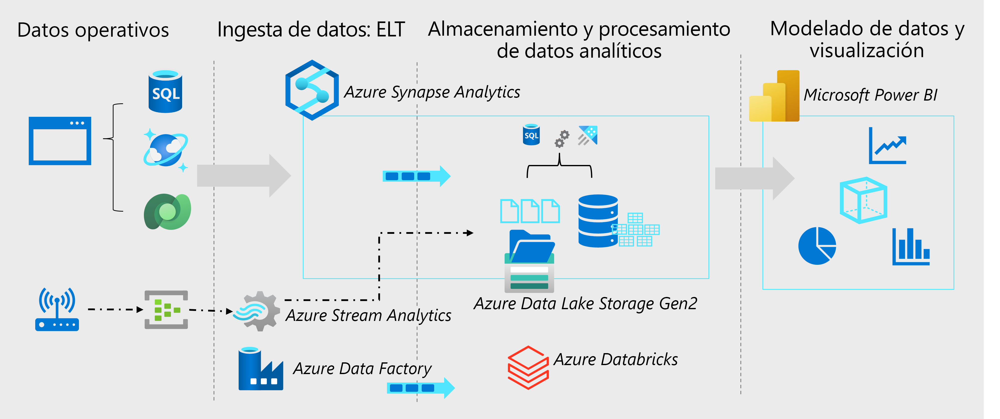

# Introducción a la ingeniería de datos en Azure

En la mayoría de las organizaciones, un ingeniero de datos es el responsable principal de integrar, transformar y consolidar datos de varios sistemas de datos estructurados y no estructurados en estructuras adecuadas para crear soluciones de análisis. Un ingeniero de datos de Azure también ayuda a garantizar que las canalizaciones de datos y los almacenes de datos son de alto rendimiento, eficientes, organizados y confiables, dado un conjunto específico de requisitos y restricciones empresariales.

## ¿En qué consiste la ingeniería de datos?⚡

El ingeniero de datos a menudo trabajará con varios tipos de datos para realizar muchas operaciones mediante muchos lenguajes de scripting o codificación adecuados para su organización individual.

### Tipos de datos

Hay tres tipos principales de datos con los que un ingeniero de datos trabajará.

| Estructurados | Semiestructurados	| Datos no estructurados |
|---------------|-------------------|------------------------|
|Los datos estructurados proceden principalmente de sistemas de origen basados en tablas, como una base de datos relacional o de un archivo plano, como un archivo separado por comas (CSV). El elemento principal de un archivo estructurado es que las filas y columnas se alinean de forma coherente en todo el archivo. | Los datos semiestructurados son datos como archivos de notación de objetos JavaScript (JSON), que pueden requerir acoplamiento antes de cargarlos en el sistema de origen. Cuando se aplanan, estos datos no tienen que ajustarse perfectamente a una estructura de tabla. | Los datos no estructurados incluyen datos almacenados como pares clave-valor que no cumplen los modelos relacionales estándar, y otros tipos de datos no estructurados que se usan normalmente incluyen formato de datos portátiles (PDF), documentos de procesador de texto e imágenes. |

### Operaciones de datos

Como ingeniero de datos, algunas de las tareas principales que realizará en Azure incluyen integración de datos, transformación de datos y consolidación de datos.

- **Integración de datos**

La integración de datos implica establecer vínculos entre los servicios operativos y analíticos y los orígenes de datos para permitir el acceso seguro y confiable a los datos en varios sistemas. Por ejemplo, un proceso empresarial podría depender de datos que se distribuyen entre varios sistemas, y se requiere un ingeniero de datos para establecer vínculos para que se puedan extraer los datos necesarios de todos estos sistemas.

- **Transformación de datos**

Los datos operativos normalmente deben transformarse en una estructura y formato adecuados para el análisis, a menudo como parte de un proceso de extracción, transformación y carga (ETL); aunque cada vez más se usa una variación en la que se extraen, cargan y transforman (ELT) los datos para ingerirlos rápidamente en un lago de datos y, a continuación, aplicar técnicas de procesamiento de "macrodatos" para transformarlos. Independientemente del enfoque usado, los datos están preparados para admitir las necesidades analíticas descendentes.

- **Consolidación de los datos**

La consolidación de datos es el proceso de combinar datos extraídos de varios orígenes de datos en una estructura coherente, normalmente para admitir análisis e informes. Normalmente, los datos de los sistemas operativos se extraen, transforman y cargan en almacenes analíticos, como un lago de datos o un almacenamiento de datos.

### Idiomas comunes

Los ingenieros de datos deben ser competentes con una variedad de herramientas y lenguajes de scripting, en particular SQL y Python, e idealmente con otros también.

- **SQL:** uno de los lenguajes más comunes que usan los ingenieros de datos es SQL o Lenguaje de consulta estructurado, que es un lenguaje relativamente fácil de aprender. SQL usa consultas que incluyen instrucciones SELECT, INSERT, UPDATE y DELETE para trabajar directamente con los datos almacenados en tablas.

- **Python:** Python es uno de los lenguajes de programación más populares y con un crecimiento más rápido del mundo. Se utiliza para todo tipo de tareas, incluida la programación web y el análisis de datos. Ha surgido como lenguaje que debe aprenderse para el aprendizaje automático y está aumentando en popularidad en la ingeniería de datos con el uso de cuadernos.

- **Otros:** según las necesidades de la organización y el conjunto de aptitudes individuales, también puede usar otros lenguajes populares dentro o fuera de cuadernos, como R, Java, Scala, .NET, etc. El uso de cuadernos está creciendo en popularidad y permite la colaboración mediante diferentes lenguajes dentro del mismo cuaderno.

## Conceptos importantes de ingeniería de datos ⚡

Hay algunos conceptos básicos con los que los ingenieros de datos deben estar familiarizados. Estos conceptos respaldan muchas de las cargas de trabajo que los ingenieros de datos deben implementar y admitir.

### 1. Datos operativos y analíticos

Los datos operativos suelen ser datos transaccionales generados y almacenados por aplicaciones, a menudo en una base de datos relacional o no relacional. Los datos analíticos son datos que se han optimizado para el análisis y los informes, a menudo en un almacenamiento de datos.

Una de las principales responsabilidades de un ingeniero de datos es diseñar, implementar y administrar soluciones que integran orígenes de datos operativos y analíticos o extraen datos operativos de varios sistemas, los transforman en estructuras adecuadas para el análisis y los cargan en un almacén de datos analíticos (normalmente denominados soluciones ETL).

### 2. Streaming de datos o Data Stream

Los datos de streaming hacen referencia a orígenes perpetuos de datos que generan valores de datos en tiempo real, a menudo relacionados con eventos específicos. Los orígenes comunes de datos de streaming incluyen dispositivos de Internet de las cosas (IoT) y fuentes de redes sociales.

A menudo, los ingenieros de datos necesitan implementar soluciones que capturen el flujo de datos en tiempo real e ingerirlos en sistemas de datos analíticos, a menudo combinando los datos en tiempo real con otros datos de aplicación que se procesan en lotes.

### 3. Canalizaciones de datos o Pipelines de datos

Las canalizaciones de datos se usan para orquestar actividades que transfieren y transforman datos. Las canalizaciones son la forma principal en la que los ingenieros de datos implementan soluciones de extracción, transformación y carga repetibles (ETL) que se pueden desencadenar en función de una programación o en respuesta a eventos.

### 4. Lagos de datos o Data Lake

Un lago de datos es un repositorio de almacenamiento que contiene grandes cantidades de datos en formatos nativos y sin procesar. Los almacenes de lagos de datos están optimizados para escalar a volúmenes masivos (terabytes o petabytes) de datos. Los datos provienen típicamente de múltiples orígenes heterogéneos y pueden ser estructurados, semiestructurados o no estructurados.

La idea con los lagos de datos es almacenar todo en su estado original, no transformado. Este enfoque difiere del almacenamiento de datos tradicional, que transforma y procesa los datos en el momento de la ingesta.

### 5. Almacenamientos de datos o Data Storage

Un almacenamiento de datos es un repositorio centralizado de datos integrados procedentes de uno o varios orígenes dispares. Los almacenes de datos almacenan datos actuales e históricos en tablas relacionales organizadas en un esquema que optimiza el rendimiento de las consultas analíticas.

Los ingenieros de datos son responsables de diseñar e implementar almacenes de datos relacionales y administrar cargas de datos normales en tablas.

### 6. Apache Spark

Apache Spark es un marco de procesamiento paralelo que aprovecha el procesamiento en memoria y un almacenamiento de archivos distribuido. Es una herramienta común de software de código abierto (OSS) para escenarios de macrodatos.

Los ingenieros de datos deben ser competentes con Spark, usar cuadernos y otros artefactos de código para procesar datos en un lago de datos y prepararlos para el modelado y el análisis.

## Ingeniería de datos de Microsoft Azure

Microsoft Azure incluye muchos servicios que se pueden usar para implementar y administrar cargas de trabajo de ingeniería de datos.

En el diagrama se muestra el flujo de izquierda a derecha de una solución típica de análisis de datos empresariales, incluidos algunos de los servicios clave de Azure que se pueden usar. Los datos operativos se generan mediante aplicaciones y dispositivos y se almacenan en servicios de almacenamiento de datos de Azure, como Azure SQL Database, Azure Cosmos DB y Microsoft Dataverse. Los datos de streaming se capturan en servicios de agente de eventos, como Azure Event Hubs.

Estos datos operativos deben capturarse, ingerirse y consolidarse en almacenes analíticos, desde donde se pueden modelar y visualizar en informes y paneles. Estas tareas representan el área principal de responsabilidad del ingeniero de datos. Las tecnologías principales de Azure que se usan para implementar cargas de trabajo de ingeniería de datos incluyen:

- Azure Synapse Analytics
- Azure Data Lake Storage Gen2
- Azure Stream Analytics
- Azure Data Factory
- Azure Databricks

Los almacenes de datos analíticos que se rellenan con datos generados por cargas de trabajo de ingeniería de datos admiten el modelado y la visualización de datos para informes y análisis, a menudo mediante herramientas de visualización sofisticadas, como Microsoft Power BI.

## Resumen

La ingeniería de datos es un rol del sector bien establecido que es compatible con varios servicios en Microsoft Azure. Los ingenieros de datos pueden usar estos servicios para trabajar con diferentes tipos de datos, crear soluciones de integración, transformación y consolidación para admitir el análisis empresarial.

Para más información sobre las soluciones de arquitectura de Azure para el análisis de datos, consulte [Diseño de la arquitectura de análisis](https://learn.microsoft.com/es-es/azure/architecture/solution-ideas/articles/analytics-start-here).
