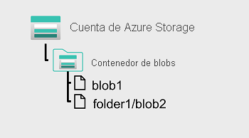
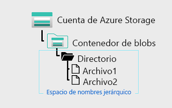

# Introducción a Azure Data Lake Storage Gen2

## Introducción ⚡

Muchas organizaciones han dedicado las dos últimas décadas a crear almacenamientos de datos y soluciones de inteligencia empresarial (BI) basados en sistemas de bases de datos relacionales. Muchas soluciones de inteligencia empresarial (BI) han perdido la oportunidad de almacenar datos no estructurados debido al costo y la complejidad de estos tipos de datos y bases de datos.

Los lagos de datos se han convertido en una solución común a este problema. Un lago de datos proporciona almacenamiento basado en archivos, normalmente en un sistema de archivos distribuido que admite una alta escalabilidad para grandes volúmenes de datos. Las organizaciones pueden almacenar archivos estructurados, semiestructurados y no estructurados en el lago de datos y, después, consumirlos desde ahí en tecnologías de procesamiento de macrodatos, como Apache Spark.

Azure Data Lake Storage Gen2 proporciona una solución basada en la nube para el almacenamiento en lago de datos en Microsoft Azure y sustenta muchas soluciones de análisis a gran escala basadas en Azure.

## Descripción de Azure Data Lake Storage Gen2

El término "data lake" define un repositorio de datos que se almacenan en su formato natural, normalmente como blobs o archivos. Azure Data Lake Storage es una solución de lago de datos completa, escalable de forma masiva, segura y rentable integrada en Azure para la realización de análisis de alto rendimiento.

Azure Data Lake Storage combina un sistema de archivos con una plataforma de almacenamiento para ayudar a identificar rápidamente conclusiones en los datos. Data Lake Storage se basa en la funcionalidad de Azure Blob Storage y lo optimiza específicamente para cargas de trabajo de análisis. Esta integración facilita el rendimiento analítico, las capacidades de administración del ciclo de vida de los datos y los niveles de Blob Storage y las capacidades de alta disponibilidad, seguridad y durabilidad de Azure Storage.

### Ventajas

Data Lake Storage está diseñado para afrontar esta variedad y este volumen de datos a escala de exabytes, a la vez que administra un procesamiento de cientos de gigabytes. Esto permite usar Data Lake Storage Gen2 como base para soluciones en tiempo real y de lotes.

- **Acceso compatible con Hadoop:**

Una ventaja de Data Lake Storage es que permite tratar los datos como si estuvieran almacenados en un Sistema de archivos distribuido de Hadoop (HDFS). Con esta característica, se pueden almacenar los datos en un solo lugar y acceder a ellos a través de tecnologías informáticas que incluyen Azure Databricks, Azure HDInsight y Azure Synapse Analytics sin mover los datos entre entornos. El ingeniero de datos también puede usar mecanismos de almacenamiento, como el formato parquet, que consigue una elevada compresión y funciona bien en varias plataformas usando un almacenamiento en columnas interno.

- **Seguridad:**
Data Lake Storage admite listas de control de acceso (ACL) y permisos POSIX (interfaz de sistema operativo portable) que no heredan los permisos del directorio primario. De hecho, puede establecer permisos en el nivel de directorio o de archivo para los datos almacenados en el lago de datos, lo que proporciona un sistema de almacenamiento mucho más seguro. Esta seguridad se puede configurar usando tecnologías como Hive y Spark, o utilidades como el Explorador de Azure Storage, que se ejecuta en Windows, macOS y Linux. Todos los datos almacenados se cifran en reposo mediante claves administradas por el cliente o por Microsoft.

- **Rendimiento:**

Azure Data Lake Storage organiza los datos almacenados en una jerarquía de directorios y subdirectorios muy similar a un sistema de archivos para facilitar la navegación. Como resultado, el procesamiento de datos requiere menos recursos informáticos, lo que reduce el tiempo y el costo.

- **Redundancia de datos:**

Data Lake Storage aprovecha los modelos de replicación de Azure Blob que proporcionan redundancia de datos en un solo centro de datos con almacenamiento con redundancia local (LRS), o bien en una región secundaria mediante la opción de almacenamiento con redundancia geográfica (GRS). Esta característica garantiza que los datos estén siempre disponibles y protegidos si se produce una catástrofe.

💡Sugerencia

>Siempre que planee un lago de datos, un ingeniero de datos debe pensar detenidamente en la estructura, la gobernanza de datos y la seguridad. Esto debe incluir la consideración de factores que pueden influir en la estructura y la organización del lago; por ejemplo:
>
> - Tipos de datos que se van a almacenar.
> - Cómo se transformarán los datos.
> - Quién debe acceder a los datos.
> - Cuáles son los patrones de acceso típicos.
>
>Este enfoque ayudará a determinar cómo planear la gobernanza del control de acceso en todo el lago. Los ingenieros de datos deben ser proactivos para asegurarse de que el lago no se convierta en el consabido pantano de datos que se vuelve inaccesible e inútil para los usuarios debido a la falta de medidas de gobernanza y calidad de los datos. Establecer una línea base y seguir los procedimientos recomendados para Azure Data Lake ayudará a garantizar una implementación adecuada y sólida que permita a la organización crecer y obtener información para alcanzar más logros.

## Habilitación de Azure Data Lake Storage Gen2 en Azure Storage

Azure Data Lake Storage Gen2 no es un servicio de Azure independiente, sino una funcionalidad configurable de Azure StorageV2 (de uso general V2).

Para habilitar Azure Data Lake Storage Gen2 en una cuenta de Azure Storage, puede seleccionar la opción Habilitar el espacio de nombres jerárquico en la página Opciones avanzadas cuando cree la cuenta de almacenamiento en Azure Portal.

Como alternativa, si ya tiene una cuenta de Azure Storage y desea habilitar la funcionalidad de Azure Data Lake Storage Gen2, puede usar el asistente Actualización de Data Lake Gen2 en la página del recurso de la cuenta de almacenamiento en Azure Portal.

## Comparación entre Azure Data Lake Storage y Azure Blob Storage

En ``Azure Blob Storage`` se pueden almacenar grandes cantidades de datos no estructurados ("objeto") en un espacio de nombres plano dentro de un contenedor de blobs. Los nombres de blobs pueden incluir caracteres "/" para organizar los blobs en "carpetas" virtuales, pero, para facilitar su administración, los blobs se almacenan como una jerarquía de nivel único en un espacio de nombres plano.

>Puede acceder a estos datos usando HTTP o HTTPs.

``Azure Data Lake Storage Gen2`` se basa en Blob Storage y optimiza la E/S de datos de gran volumen usando un espacio de nombres jerárquico que organiza los datos de los blobs en directorios y almacena metadatos sobre cada directorio y los archivos que contiene. Esta estructura permite que operaciones como las eliminaciones y los cambios de nombre de directorios se realicen en una sola operación atómica. Por el contrario, los espacios de nombres planos requieren varias operaciones proporcionales al número de objetos de la estructura. Los espacios de nombres jerárquicos mantienen los datos organizados, lo que resulta en un mejor rendimiento de almacenamiento y recuperación para un caso de uso de análisis y reduce el costo de análisis.

 💡Sugerencia

>Si quiere almacenar datos sin realizar un análisis de ellos, establezca la opción Espacio de nombres jerárquico en Deshabilitado para configurar la cuenta de almacenamiento como una cuenta de Azure Blob Storage. También puede usar Blob Storage para archivar datos que se usan con poca frecuencia o para almacenar recursos de sitios web, como imágenes y elementos multimedia.
>
>Si va a realizar un análisis de los datos, configure la cuenta de almacenamiento como una cuenta de Azure Data Lake Storage Gen2. Para ello, establezca la opción Espacio de nombres jerárquico en Habilitado. Dado que Azure Data Lake Storage Gen2 está integrado en la plataforma Azure Storage, las aplicaciones pueden usar las API de Blob o las API del sistema de archivos de Azure Data Lake Storage Gen2 para acceder a los datos.

## Fases del procesamiento de Big Data

Los lagos de datos tienen un papel fundamental en una amplia gama de arquitecturas de macrodatos. Estas arquitecturas pueden conllevar la creación de:

- Un almacén de datos empresarial.
- Análisis avanzados con macrodatos.
- Una solución de análisis en tiempo real.

Hay cuatro fases del procesamiento de soluciones de macrodatos que son comunes a todas las arquitecturas:

- ``Ingesta:`` la fase de ingesta identifica la tecnología y los procesos que se usan para adquirir los datos de origen. Estos datos pueden proceder de archivos, registros y otros tipos de datos no estructurados que deben ponerse en el lago de datos. La tecnología que se usa variará según la frecuencia con la que se transfieran los datos. Por ejemplo, para el movimiento de datos por lotes, las canalizaciones de Azure Synapse Analytics o Azure Data Factory pueden ser la tecnología más adecuada. En el caso de la ingesta de datos en tiempo real, Apache Kafka para HDInsight o Stream Analytics pueden ser una opción apropiada.

- ``Almacenamiento:`` la fase de almacenamiento identifica dónde se deben colocar los datos ingeridos. Azure Data Lake Storage Gen2 proporciona una solución de almacenamiento segura y escalable que es compatible con las tecnologías de procesamiento de macrodatos más utilizadas.

- ``Preparación y entrenamiento:`` la fase de preparación y entrenamiento identifica las tecnologías que se usan para llevar a cabo la preparación de los datos y el entrenamiento y la puntuación de modelos para soluciones de aprendizaje automático. Algunas tecnologías comunes que se usan en esta fase son Azure Synapse Analytics, Azure Databricks, Azure HDInsight y Azure Machine Learning.

- ``Modelado y entrega:`` por último, en la fase de modelado y entrega participan las tecnologías que van a presentar los datos a los usuarios. Estas tecnologías pueden incluir herramientas de visualización, como Microsoft Power BI, o almacenes de datos analíticos, como Azure Synapse Analytics. A menudo, se usa una combinación de estas tecnologías en función de los requisitos empresariales.

## Uso de Azure Data Lake Storage Gen2 en cargas de trabajo de análisis de datos

Azure Data Lake Store Gen2 es una tecnología de habilitación para varios casos de uso de análisis de datos. Veamos algunos tipos comunes de cargas de trabajo analíticas y cómo funciona Azure Data Lake Storage Gen2 con otros servicios de Azure para sustentarlos.

### Procesamiento y análisis de macrodatos

Los escenarios de macrodatos suelen hacer referencia a cargas de trabajo analíticas que implican volúmenes masivos de datos en una gran variedad de formatos que deben procesarse a una velocidad rápida, lo que se denomina "las tres uves". Azure Data Lake Storage Gen 2 proporciona un almacén de datos distribuido, escalable y seguro en el que los servicios de macrodatos, como Azure Synapse Analytics, Azure Databricks y Azure HDInsight, pueden aplicar marcos de procesamiento de datos, como Apache Spark, Hive y Hadoop. La naturaleza distribuida del almacenamiento y la capacidad de procesamiento permiten realizar tareas en paralelo, lo que proporciona un alto rendimiento y una elevada escalabilidad incluso cuando se procesan enormes cantidades de datos.

### Almacenamiento de datos

El almacenamiento de datos ha evolucionado en los últimos años para integrar grandes volúmenes de datos almacenados como archivos en un lago de datos con tablas relacionales en un almacenamiento de datos. En un ejemplo típico de solución de almacenamiento de datos, los datos se extraen de almacenes de datos operativos, como Azure SQL Database o Azure Cosmos DB, y se transforman en estructuras más adecuadas para cargas de trabajo analíticas. A menudo, los datos se almacenan provisionalmente en un lago de datos para facilitar el procesamiento distribuido antes de cargarlos en un almacenamiento de datos relacional. En algunos casos, el almacenamiento de datos usa tablas externas para definir una capa de metadatos relacionales en los archivos del lago de datos y crear una arquitectura híbrida de "almacén de lago de datos" o "base de datos de lago". Después, el almacenamiento de datos puede admitir consultas analíticas para la elaboración de informes y la visualización de los datos.

Hay varias maneras de implementar este tipo de arquitectura de almacenamiento de datos. En el diagrama se muestra una solución en la que Azure Synapse Analytics hospeda canalizaciones para realizar procesos de extracción, transformación y carga (ETL) con la tecnología de Azure Data Factory. Estos procesos extraen datos de orígenes de datos operativos y los cargan en un lago de datos hospedado en un contenedor de Azure Data Lake Storage Gen2. A continuación, los datos se procesan y cargan en un almacenamiento de datos relacional en un grupo de SQL dedicado de Azure Synapse Analytics, desde donde se pueden visualizar y usar para la elaboración de informes con Microsoft Power BI.

### Análisis de datos en tiempo real

Cada vez más, las empresas y otras organizaciones necesitan capturar flujos perpetuos de datos y analizarlos en tiempo real (o lo más cerca posible). Estos flujos de datos pueden proceder de dispositivos conectados (a menudo denominados dispositivos de Internet de las cosas o IoT) o de los datos generados por los usuarios en plataformas de redes sociales u otras aplicaciones. A diferencia de las cargas de trabajo tradicionales de procesamiento por lotes, los datos de streaming requieren una solución que pueda capturar y procesar un flujo ilimitado de eventos de datos a medida que se producen.

Los eventos de streaming a menudo se capturan en una cola para su procesamiento. Hay varias tecnologías que puede usar para realizar esta tarea; por ejemplo, Azure Event Hubs, como se muestra en la imagen. Desde aquí, los datos se procesan, a menudo para agregar datos a través de ventanas temporales (por ejemplo, para contar el número de mensajes de redes sociales con una etiqueta determinada cada cinco minutos, o para calcular el promedio de lecturas de un sensor conectado a Internet por minuto). Azure Stream Analytics permite crear trabajos que consultan y agregan datos de eventos a medida que llegan y escriben los resultados en un receptor de salida. Uno de estos receptores es Azure Data Lake Storage Gen2, desde donde se pueden analizar y visualizar los datos capturados en tiempo real.

### Ciencia de datos y aprendizaje automático

La ciencia de datos implica el análisis estadístico de grandes volúmenes de datos, a menudo mediante herramientas como Apache Spark y lenguajes de scripting, como Python. Azure Data Lake Storage Gen 2 proporciona un almacén de datos basado en la nube altamente escalable para los volúmenes de datos necesarios en las cargas de trabajo de ciencia de datos.

El aprendizaje automático es una subárea de la ciencia de datos que se ocupa del entrenamiento de modelos predictivos. El entrenamiento de modelos requiere grandes cantidades de datos y la capacidad de procesar esos datos de forma eficaz. Azure Machine Learning es un servicio en la nube en el que los científicos de datos pueden ejecutar código de Python en cuadernos usando recursos de proceso distribuidos asignados dinámicamente. Los recursos de proceso procesan los datos de los contenedores de Azure Data Lake Storage Gen2 para entrenar modelos, que luego se pueden implementar como servicios web de producción para admitir cargas de trabajo de análisis predictivo.

## Resumen

Azure Data Lake Storage Gen2 proporciona un servicio de almacenamiento en la nube que es disponible, seguro, duradero, escalable y redundante. Es una solución de data lake completa.

Azure Data Lake Storage aporta más eficacia para procesar cargas de trabajo de análisis de macrodatos y puede proporcionar datos a muchas tecnologías informáticas, como Azure Synapse Analytics, Azure HDInsight y Azure Databricks, sin necesidad de mover los datos. La creación de un almacén de datos de Azure Data Lake Storage Gen2 puede ser una herramienta importante a la hora de compilar una solución de análisis de macrodatos.

💡Sugerencia

>Para obtener más información sobre Azure Data Lake Storage Gen2, consulte [Introducción a Azure Data Lake Storage Gen2](https://learn.microsoft.com/es-es/azure/storage/blobs/data-lake-storage-introduction) en la documentación de Microsoft Azure.

## Fuente

[Microsft Learn](https://learn.microsoft.com/es-mx/training/modules/introduction-to-azure-data-lake-storage/)
