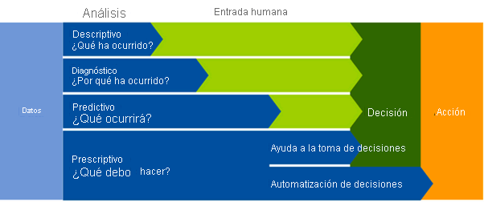

# Introducción a Azure Synapse Analytics

## Introducción

El volumen de datos que generan los individuos y las organizaciones está creciendo a una velocidad vertiginosa. Estos datos impulsan a las empresas y otras organizaciones al proporcionarles una base para encontrar soluciones analíticas descriptivas, de diagnóstico, predictivas y prescriptivas que apoyan la toma de decisiones y los sistemas autónomos suministrando información en tiempo real sobre patrones establecidos y emergentes.

Las organizaciones tienen muchas herramientas y técnicas para el análisis de datos, que a menudo requieren experiencia en varios sistemas e una integración compleja de la infraestructura y las operaciones administrativas. Azure Synapse Analytics proporciona una única plataforma a escala en la nube que admite varias tecnologías analíticas, lo que permite una experiencia consolidada e integrada para ingenieros de datos, analistas de datos, científicos de datos y otros profesionales que necesitan trabajar con datos.

En este módulo aprenderá a:

- Identificación de los problemas empresariales que Azure Synapse Analytics soluciona.
- Descripción de las funcionalidades principales de Azure Synapse Analytics.
- Determinación de cuándo usar Azure Synapse Analytics.

## Qué es Azure Synapse Analytics

La empresa tecnológica de investigación y consultoría Gartner define cuatro tipos comunes de técnica analítica que las organizaciones suelen usar:

- ``El análisis descriptivo``, que responde a la pregunta "¿Qué está ocurriendo en mi negocio?". Normalmente, los datos para responder a esta pregunta se crean mediante la creación de un almacenamiento de datos en el que los datos históricos se conservan en tablas relacionales para el modelado y los informes multidimensionales.

- ``El análisis de diagnóstico``, que se centra en responder a la pregunta "¿Por qué sucede esto?". Esto puede implicar la exploración de información que ya existe en un almacenamiento de datos, pero normalmente conlleva una búsqueda más amplia del estado de los datos para encontrar más datos que admitan este tipo de análisis.

- ``El análisis predictivo``, que permite responder a la pregunta “¿Qué es probable que suceda en el futuro en función de las tendencias y los patrones anteriores?”.

- ``El análisis prescriptivo``, que permite la toma de decisiones autónomas en función del análisis de los datos en tiempo real o casi en tiempo real mediante análisis predictivo.

Azure Synapse Analytics proporciona una plataforma en la nube para todas estas cargas de trabajo analíticas mediante la compatibilidad con varias tecnologías de almacenamiento, procesamiento y análisis de datos en una única solución integrada. El diseño integrado de Azure Synapse Analytics permite a las organizaciones aprovechar las capacidades y las inversiones en varias tecnologías de datos usadas habitualmente, como SQL o Apache Spark, entre otras y, al mismo tiempo, proporcionar un servicio administrado centralmente y una única interfaz de usuario coherente.

## Cómo funciona Azure Synapse Analytics

Para admitir las necesidades de análisis de las organizaciones actuales, Azure Synapse Analytics combina un servicio centralizado para el almacenamiento y el procesamiento de datos con una arquitectura extensible mediante la cual los servicios vinculados permiten integrar los almacenes de datos, las plataformas de procesamiento y las herramientas de visualización que se usan habitualmente.

### Creación y uso de un área de trabajo de Azure Synapse Analytics

Un área de trabajo de Synapse Analytics define una instancia del servicio Synapse Analytics en la que se pueden administrar los servicios y los recursos de datos necesarios para la solución de análisis. Puede crear un área de trabajo de Synapse Analytics en una suscripción de Azure de forma interactiva mediante Azure Portal o automatizar la implementación mediante Azure PowerShell, la interfaz de línea de comandos (CLI) de Azure o con una plantilla de Azure Resource Manager o Bicep.

Una vez creada el área de trabajo de Synapse Analytics, puede administrar los servicios en ella y realizar tareas de análisis de datos con los servicios mediante Synapse Studio (un portal basado en la web para Azure Synapse Analytics).

### Trabajo con archivos en un lago de datos

Uno de los recursos principales de un área de trabajo de Synapse Analytics es el lago de datos, donde los archivos de datos se pueden almacenar y procesar a gran escala. Normalmente, un área de trabajo tiene un lago de datos predeterminado, que se implementa como servicio vinculado a un contenedor de Azure Data Lake Storage Gen2. Puede agregar servicios vinculados para varios lagos de datos basados en distintas plataformas de almacenamiento, según sea necesario.

### Ingesta y transformación de datos con canalizaciones

En la mayoría de las soluciones de análisis de datos empresariales, los datos se extraen de varios orígenes operativos y se transfieren a un lago de datos central o almacenamiento de datos para el análisis. Azure Synapse Analytics incluye compatibilidad integrada para crear, ejecutar y administrar canalizaciones que orquesten las actividades necesarias para recuperar datos de una variedad de orígenes, transformar los datos según sea necesario y cargar los datos transformados resultantes en un almacén analítico.

Las canalizaciones de Azure Synapse Analytics se basan en la misma tecnología subyacente que Azure Data Factory. Si ya está familiarizado con Azure Data Factory, puede aprovechar las aptitudes existentes para crear soluciones de ingesta y transformación de datos en Azure Synapse Analytics.

### Consulta y manipulación de datos con SQL

El lenguaje de consulta estructurado (SQL) es un lenguaje omnipresente para consultar y manipular datos, y es la base de las bases de datos relacionales, incluida la popular plataforma de base de datos Microsoft SQL Server. Azure Synapse Analytics admite la consulta y manipulación de datos basados en SQL mediante dos tipos de grupo de SQL basados en el motor de base de datos relacional de SQL Server:

Un grupo sin servidor integrado optimizado para usar la semántica de SQL relacional para consultar los datos basados en archivos en un lago de datos.
Los grupos de SQL dedicados personalizados que hospedan almacenes de datos relacionales.

El sistema Azure Synapse SQL usa un modelo de procesamiento de consultas distribuidas para paralelizar las operaciones SQL, lo que da lugar a una solución altamente escalable para el procesamiento de datos relacionales. Puede usar el grupo sin servidor integrado para el análisis y el procesamiento rentables de los datos de archivo en el lago de datos, y grupos de SQL dedicados, para crear almacenes de datos relacionales para el modelado y los informes de datos empresariales.

### Procesamiento y análisis de datos con Apache Spark

Apache Spark es una plataforma de código abierto para el análisis de macrodatos. Spark realiza el procesamiento distribuido de archivos en un lago de datos mediante la ejecución de trabajos que se pueden implementar con cualquiera de una variedad de lenguajes de programación admitidos. Entre los lenguajes admitidos en Spark se incluyen Python, Scala, Java, SQL y C#.

En Azure Synapse Analytics, puede crear uno o varios grupos de Spark y usar cuadernos interactivos para combinar código y notas a medida que crea soluciones para el análisis de datos, el aprendizaje automático y la visualización de datos.

### Exploración de datos con el explorador de datos

El explorador de datos de Azure Synapse es un motor de procesamiento de datos en Azure Synapse Analytics que se basa en el servicio Azure Data Explorer. El explorador de datos usa una sintaxis de consulta intuitiva denominada Lenguaje de consulta Kusto (KQL) para habilitar el análisis de alto rendimiento y baja latencia de los datos por lotes y de streaming.

### Integración con otros servicios de datos de Azure

Azure Synapse Analytics se puede integrar con otros servicios de datos de Azure para soluciones de análisis integrales. Entre las soluciones integradas se incluyen:

- Azure Synapse Link permite la sincronización casi en tiempo real entre los datos operativos en Azure Cosmos DB, Azure SQL Database, SQL Server y Microsoft Power Platform Dataverse y el almacenamiento de datos analíticos que se puede consultar en Azure Synapse Analytics.
- La integración de Microsoft Power BI permite a los analistas de datos integrar un área de trabajo de Power BI en un área de trabajo de Synapse y realizar una visualización interactiva de datos en Azure Synapse Studio.
- La integración de Microsoft Purview permite a las organizaciones catalogar los recursos de datos en Azure Synapse Analytics y facilita a los ingenieros de datos encontrarlos y realizar un seguimiento del linaje de datos al implementar canalizaciones de datos que ingieren datos en Azure Synapse Analytics.
- La integración de Azure Machine Learning permite a los analistas de datos y a los científicos de datos integrar el entrenamiento y el consumo predictivos del modelo en soluciones analíticas.

## Cuándo usar Azure Synapse Analytics

En todas las organizaciones y sectores, los casos de uso comunes de Azure Synapse Analytics se identifican por la necesidad de lo siguiente:

- Almacenamiento de datos a gran escala

El almacenamiento de datos comprende la necesidad de integrar todos los datos, incluidos los macrodatos, para razonar sobre los datos para fines de análisis e informes desde una perspectiva de análisis descriptivo, independientemente de su ubicación o estructura.

- Análisis avanzado

Permite a las organizaciones realizar análisis predictivos con las características nativas de Azure Synapse Analytics y la integración con otras tecnologías, como Azure Machine Learning.

- Exploración y detección de datos

La funcionalidad de grupo de SQL sin servidor que proporciona Azure Synapse Analytics permite a los analistas de datos, ingenieros de datos y científicos de datos explorar el patrimonio de datos. Esta funcionalidad admite la detección de datos, el análisis de diagnóstico y el análisis de datos exploratorio.

- Análisis en tiempo real

Azure Synapse Analytics puede capturar, almacenar y analizar datos en tiempo real o casi en tiempo real con características como Azure Synapse Link, o bien mediante la integración de servicios como Azure Stream Analytics y Azure Data Explorer.

- Integración de datos

Las canalizaciones de Azure Synapse permiten ingerir, preparar, modelar y proporcionar los datos que se van a usar en los sistemas de nivel inferior. Los componentes de Azure Synapse Analytics pueden usar esto de forma exclusiva.

- Análisis integrado

Con la variedad de análisis que se pueden realizar en los datos a su disposición, reunir los servicios en una solución cohesiva puede ser una operación compleja. Azure Synapse Analytics elimina esta complejidad mediante la integración del escenario de análisis en un servicio. De este modo, puede dedicar más tiempo a trabajar con los datos para aportar ventajas empresariales, en lugar de dedicar gran parte del tiempo al aprovisionamiento y mantenimiento de varios sistemas para lograr los mismos resultados.
