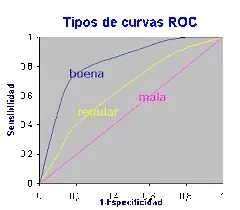
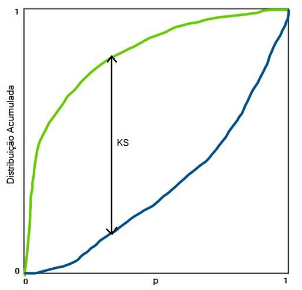

# Evaluación del modelo

## 1. Matriz de confusión
---

Una de las formas para evaluar nuestro modelo es medirlo bajo la curva de ROC. Aca podemos medir un mayor AUC ya que significa un mayor performance. Y para construir el área bajo la curva se necesita un insumo que es ``la matriz de confusión``.

Para obtener esta matriz se debe de calcular en base a nuestra data de test, ya que aquí tenemos los datos etiquetados y podemos compararlo con nuestras predicciones, para ello se elabora una tabla de doble entrada:

| Datos predichos | | | |
|---------------- | - | - | - |
| | |Cliente malo | Cliente bueno |
|**Datos reales** | Cliente malo | ``Verdadero Negativo`` | ``Falso Positivo``     
| | Cliente bueno | ``Falso Negativo`` | ``Verdadero Positivo``

Las métricas más importantes de la matriz de confusión son:

* Accuracy: $$\frac{Verdadero Negativo + Verdadero Positivo}{Total}$$
* Sensibilidad: $$\frac{Verdadero Negativo}{Verdadero Negativo + Falso Positivo}$$
* Especifidad: $$\frac{Verdadero Positivo}{Falso Negativo + Verdadero Positivo}$$
 
**Interpretación:**

- Accuracy: 80% --> Significa que el 80% de mis predicciones han sido correctas
- Sensibilidad: 90% --> De cada 100 clientes morosos, mi modelo identifica correctamente el 90%
- Especifidad: 85% --> De cada 100 clientes buenos mi modelo identifica el 85%

## 2. Criterio para elegir el modelo
---

La curva roc se forma en base a la sensibilidad y especifidad, se considera el mejor modelo mientras que la curva se aleja más de la recta 45 grados.

> Interpretación: La recta buena tiene una mejor discriminación de los clientes malos de los buenos.



El area que se forma debajo de cada recta se llama ``area AUC``; esto quiere decir debemos elegir el modelo con mayor AUC.

## 3. Curva ROC y Area AUC en R
---

> Con este código vemos que modelo tiene mejor AUC
```R
library(ROCR)
library(pROC)

roc_mn = roc(response = y_test, predictor = y_prob_mn)
roc_mc = roc(response = y_test, predictor = y_prob_mc)
roc_ml = roc(response = y_test, predictor = y_prob_ml)

# Area bajo la curva ROC
roc_mn$auc
roc_mc$auc #mejor ajuste
roc_ml$auc

```

> Para el gráfico tenermos el siguiente código

```R
pred_mn = prediction(y_prob_mn,y_test)
pred_mc = prediction(y_prob_mc,y_test)
pred_ml = prediction(y_prob_ml,y_test)

perf_mn = performance(pred_mn,"tpr","fpr")
perf_mc = performance(pred_mc,"tpr","fpr")
perf_ml = performance(pred_mc,"tpr","fpr")

par(mfrow = c(2,2))
plot.roc(roc_mn, print.auc=TRUE, main = "Niveles",
         print.thres = "best",  col="#CB4335",
         xlab="1-Especificidad",ylab="Sensibilidad")

plot.roc(roc_mc, print.auc=TRUE, main = "Categoricas",
         print.thres = "best", col="#884EA0",
         xlab="1-Especificidad",ylab="Sensibilidad")

plot.roc(roc_ml, print.auc=TRUE, main = "Logaritmo",
         print.thres = "best", col="#F39C12",
         xlab="1-Especificidad",ylab="Sensibilidad")
```

## 4. Curva K-S
---



La curva KS (Kolmogorov-Smirnov) en credit scoring mide qué tan bien un modelo clasifica a los buenos y malos pagadores. Específicamente:

1. Qué hace la curva KS:

   * Muestra la diferencia acumulada entre la tasa de verdaderos positivos (buenos pagadores) y la tasa de falsos positivos (malos pagadores) en cada punto de un ranking de scores.
   * El valor KS es la máxima diferencia entre estas dos tasas. Este valor indica qué tan bien el modelo separa los dos grupos.
 
2. Cómo elegir el mejor modelo:

   * Compara los valores KS de varios modelos. Un valor KS más alto indica una mejor capacidad de separación entre buenos y malos pagadores.
   * Un KS de 40% a 70% es generalmente considerado bueno para modelos de credit scoring. Un KS muy bajo (<20%) puede indicar que el modelo no es útil.
   * Además, revisa en qué parte del score ocurre el pico KS (donde está la máxima separación), ya que este punto puede ayudar a identificar umbrales de decisión.

El modelo con el KS más alto es, en términos generales, el mejor para separar a los buenos y malos pagadores. Sin embargo, siempre complementa esta evaluación con métricas adicionales como el AUC-ROC o los costos asociados a las decisiones.

```R
# Indicador KS
(KS_mn = max(attr(perf_mn,'y.values')[[1]]-attr(perf_mn,'x.values')[[1]]))
(KS_mc = max(attr(perf_mc,'y.values')[[1]]-attr(perf_mc,'x.values')[[1]]))
(KS_ml = max(attr(perf_ml,'y.values')[[1]]-attr(perf_ml,'x.values')[[1]]))
```

## Sensibilidad y Especifidad

Sensibilidad y especificidad son métricas clave para evaluar el desempeño de un modelo y determinar el punto de corte adecuado para la clasificación de buenos y malos pagadores.

El punto de corte (threshold) es el valor del score a partir del cual se decide si un cliente es bueno o malo pagador.

Balance entre sensibilidad y especificidad:

* A medida que ajustas el punto de corte:
  * Si lo bajas, aumenta la sensibilidad (detectas más malos pagadores), pero disminuye la especificidad (rechazas más buenos pagadores).
  * Si lo subes, aumenta la especificidad, pero disminuye la sensibilidad.
* El punto ideal depende de la estrategia del negocio y el costo asociado a los errores:
  * Errores de tipo I (Falsos Positivos): Aprobar a alguien que no paga.
  * Errores de tipo II (Falsos Negativos): Rechazar a alguien que sí paga.

Conclusiones: 

El punto de corte optimo se basa en la interseccion de las rectas de especifidad y sensibilidad en el plano cartesiano.

```R

# Grafico Sensibilidad-Especificidad (best Models)
sensibilidad = roc_mc$sensitivities
especificidad = roc_mc$specificities
punto_corte = roc_mc$thresholds

data_roc = data.frame(sensibilidad, especificidad, punto_corte)
data_roc %>% 
  gather(-punto_corte, key = "indicador", value = "valor") %>% 
  ggplot(aes(x = punto_corte, y = valor, color = indicador))+
  geom_line(size = 2)+
  #geom_point()+
  ggtitle("Sensibilidad vs Especificidad")+
  theme_ipsum()

# Punto de Corte (sens = Espe)
data_roc %>% 
  mutate(diff_risk = abs(sensibilidad - especificidad) ) %>% 
  filter(!(is.infinite(punto_corte))) %>% 
  arrange(diff_risk) %>% 
  head(1)

# Punto de Corte por Percentiles
quantiles = quantile(y_prob_mc, probs = c(0.1,0.2,0.3,0.4,0.5,0.6,0.7,0.8,0.9,1))

rango_prob = case_when(y_prob_mc<= quantiles[1] ~ round(quantiles[1]*100,2),
                       y_prob_mc<= quantiles[2] ~ round(quantiles[2]*100,2),
                       y_prob_mc<= quantiles[3] ~ round(quantiles[3]*100,2),
                       y_prob_mc<= quantiles[4] ~ round(quantiles[4]*100,2),
                       y_prob_mc<= quantiles[5] ~ round(quantiles[5]*100,2),
                       y_prob_mc<= quantiles[6] ~ round(quantiles[6]*100,2),
                       y_prob_mc<= quantiles[7] ~ round(quantiles[7]*100,2),
                       y_prob_mc<= quantiles[8] ~ round(quantiles[8]*100,2),
                       y_prob_mc<= quantiles[9] ~ round(quantiles[9]*100,2),
                       y_prob_mc<= quantiles[10] ~round(quantiles[10]*100,2))
table(rango_prob)

# tabla cruzada de Default por rango de probabilidad
(tabla_rango = table(rango_prob, test$Default))

(tabla_rango_prob=round(prop.table(tabla_rango, margin = 1)*100,2))
(tabla_rango_prop =round(prop.table(tabla_rango, margin = 2)*100,2))

#graf de de prob de defaul por rango
data_rango_prop = data.frame(tabla_rango_prop)
data_rango_prop = rename(data_rango_prop, c(punto_corte = "rango_prob",
                                            Default = "Var2",
                                            proporcion ="Freq"))

data_rango_prop$punto_corte = as.numeric(as.character(data_rango_prop$punto_corte))

# Proporcion de malos vs Proporcion de buenos
ggplot(data_rango_prop, aes(x= punto_corte,
                            y = proporcion,
                            color = Default))+
  geom_line(size = 1.2)+
  geom_point(size = 2)+
  ggtitle("Proporcion de buenos vs malos por corte")+
 scale_color_manual(values = c("#7D3C98", "#7FB3D5"), 
                     labels =c("buenos","malos") )+
  theme_ipsum()+
  theme(legend.position = "top")


# Distancia minima de riesgo por Corte
data_rango_prop %>% 
  spread(key = Default, value =  proporcion) %>% 
  mutate(dif = `1`-`0`) %>% 
  ggplot(aes(as.factor(punto_corte), dif))+
  geom_bar(aes(fill = dif),stat = "identity", position = "dodge")+
  geom_label(aes(label = round(dif,2)))+
  theme_ipsum()+
  ggtitle("Distancia entre buenos y malos por corte")+
  theme(legend.position = "none")

```