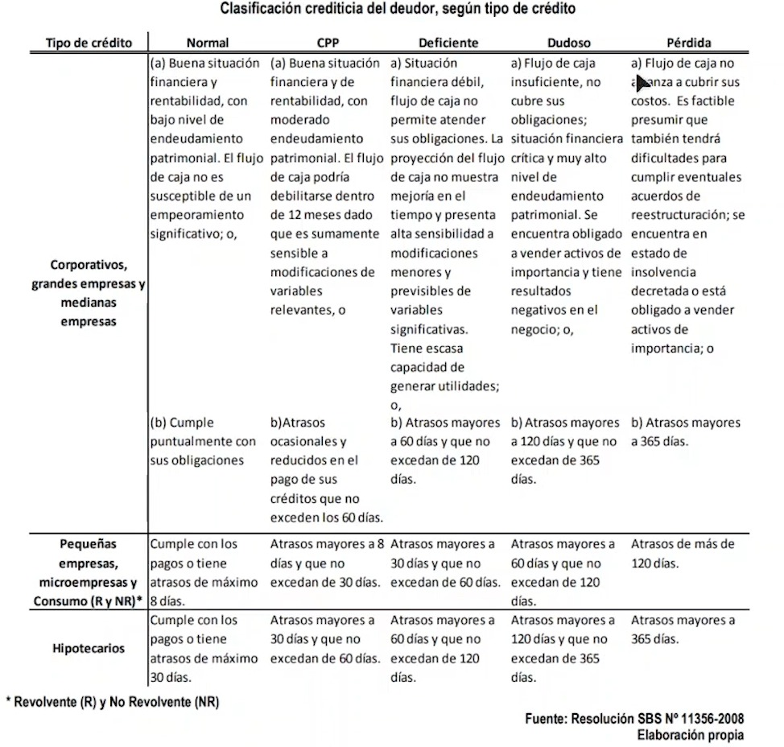

# Matrices de transición

## 1. ¿Qué son las transiciones?
---

En términos generales, una **transición** se refiere al proceso de cambio de un estado, etapa o condición a otro. Puede aplicarse en diferentes contextos, como la tecnología, el diseño, o incluso en situaciones personales o sociales.

En Credit Scoring sería cambiar de un estado Normal(Que tiene menor de 8 días de atraso) a otro estado como Dudoso( Mayor días de atraso)

## 2. Calificación de los clientes
---

[Referencia SBS](chrome-extension://efaidnbmnnnibpcajpcglclefindmkaj/https://www.sbs.gob.pe/Portals/0/jer/rebper_2012_vol_vi/20150908_Aparicio-Gutierrez-Jaramillo-Moreno.pdf)

## 3. Transiciones por calificación y dias de atraso
---

1. **Periodo inicial**:
   - Calificación: **Normal**.
   - Atraso en días: **-5 días** (es decir, ha pagado antes de la fecha límite).
   - **Condición Normal** según la SBS: Menor a 8 días de atraso.  

2. **Siguiente periodo**:
   - Se acumulan **30 días adicionales** de atraso: -5 + 30 = **25 días de atraso**.
   - Nueva calificación: **CPP** (Cliente con Problemas Potenciales), ya que la SBS clasifica a los clientes con atrasos entre 8 y 30 días como CPP.  

### Importancia de las transiciones:
Este tipo de transición es fundamental para:
- **Monitorear el riesgo**: Detectar cuándo un cliente pasa de una categoría de menor riesgo (Normal) a una de mayor riesgo (CPP).
- **Acciones preventivas**: Permite al banco implementar estrategias como recordatorios de pago o renegociación de deudas antes de que el cliente pase a categorías más críticas.

## 4. Cálculo de matriz de transición
---

Una matriz de transición es una herramienta que muestra cuantas personas pasaron de un estado a otro.

### Para ello debemos hacer lo sisguiente

1. Definir los estados: En este caso, las calificaciones (Normal, CPP, Deficiente, Dudoso, Perdida).
2. Calcular las transiciones: Observar cuántos clientes pasan de un estado a otro entre dos periodos.
3. Normalizar los datos: Las probabilidades de transición desde cada estado deben sumar 1.

| cod_cliente | perido t-1 | periodo t |
| --- | --- | --- |
| 1 | N | N |
| 2 | CPP | N |
| 3 | CPP | CPP |
| 4 | DUD | PERD |
| 5 | N | N |
| ... | ... | ... |

### Matriz de transición

| Estado Actual → Estado Futuro | Normal | CPP  | Deficiente | Dudoso | Pérdida |
|-------------------------------|--------|------|------------|--------|---------|
| **Normal**                   | 0.75   | 0.20 | 0.03       | 0.01   | 0.01    |
| **CPP**                      | 0.10   | 0.60 | 0.20       | 0.05   | 0.05    |
| **Deficiente**               | 0.05   | 0.15 | 0.50       | 0.20   | 0.10    |
| **Dudoso**                   | 0.02   | 0.05 | 0.15       | 0.60   | 0.18    |
| **Pérdida**                  | 0.01   | 0.02 | 0.05       | 0.12   | 0.80    |

### Interpretación

1. Los clientes **Normales** tienen un 75% de probabilidad de mantenerse en esa categoría, pero un 20% de migrar a **CPP**.
2. Los clientes **CPP** tienen una probabilidad significativa del 60% de permanecer en esa categoría, pero un 20% de caer en **Deficiente**.
3. Los clientes en **Pérdida** tienen una alta probabilidad (80%) de mantenerse en ese estado, con bajas probabilidades de mejora.

## 5. Ejemplo Práctico
---

En el siguiente ejemplo veremos como se realiza un análisis de una matriz de transición.

[Análisis de Matriz de Transición](./recursos/matriz_de_transici%C3%B3n.xlsm)

1. La data debe de estar modelada como en la pestaña de "DATA"

2. Si bien es cierto que tenemos las 5 calificaciones que nos indica el sbs (normal, cpp, deficiente, ...), tambien debemos de resaltar que el perfil de una persona que tiene 0 días de atraso es diferente a una que tiene menor a 8 días de atraso, es por ello que le asignamos rangos.

    | Días de atraso | Rango |
    | --- | --- |
    | 0d | 1 |
    | 0-8d | 2 |
    | 9-15d | 3 |
    | 16-30d | 4 |
    | 31-60d | 5 |
    | 61-90d | 6 |
    | 91-120d | 7 |
    | +121d | 8 |

3. En la pestaña de "Tabla Dinámica" se crea la matriz de transición, pero, en lugar de la calificación se coloca el rango; luego en base a esta matriz se realiza la tabla de roll rate, donde vemos 2 nuevos  conceptos:

    * Deterioro: _Es el porcentaje de clientes o creditos que pasaron de su estado actual a un estado de mayor morosidad._
    * Mejora: _Representa el porcentaje de créditos que pasaron a un estado de menor morosidad o volvieron a estar al día._
    * Permanece: _Es el porcentaje de créditos que no cambiaron de estado en el periodo analizado._

    > Tabla de roll rate

    | Estado      | T      | Deterioro (%) | Mejora (%) | Permanece (%) |
    |-------------|--------|---------------|------------|----------------|
    | 0d          | 16,271 | 3.4%          | -          | 96.6%          |
    | 0-8d        | 488    | 9.6%          | 33.0%      | 57.4%          |
    | 9-15d       | 86     | 26.7%         | 41.9%      | 31.4%          |
    | 16-30d      | 72     | 52.8%         | 23.6%      | 23.6%          |
    | 31-60d      | 124    | 86.3%         | 11.3%      | 2.4%           |
    | 61-90d      | 129    | 93.0%         | 3.1%       | 3.9%           |
    | 91-120d     | 2,065  | 98.9%         | 0.0%       | 1.1%           |
    | +121d       | 261    | -             | 0.0%       | 100.0%         |

    > Ejemplo  de interpretacion: 

    * En la fila "0-8d", el 9.6% de los créditos se deterioró, es decir, avanzó a un estado de mora superior, como "9-15d" o más.
    * En la fila "0-8d", el 33.0% mejoró, lo que significa que estos créditos se movieron a "0d" (es decir, volvieron al día).

4. En la pestañas de "Graficos" se realiza el grafico de roll rate, donde se ve la recta del deterioro y de mejora y una comparación con la recta institucional que es la recta del deterioro a nivel de toda la institución.

    * Podemos concluir que a mayor días de morosidad es bien dificil que haya una mejora.
    * Podemos realizar un mayor esfuerzo en recuperar un crédito en el punto de equilibrio de la recta de mejora y deterioro.
