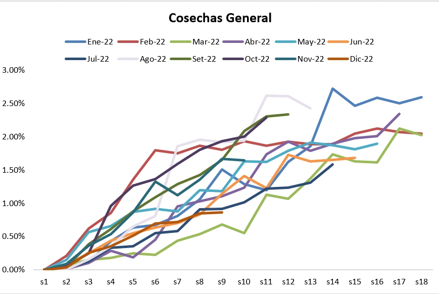
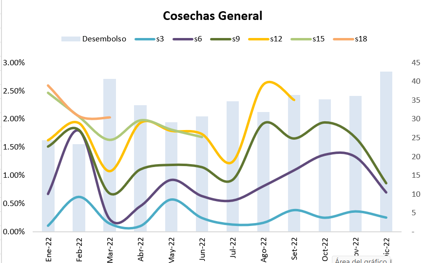

# Análisis de Cosechas

## 1. El enfoque de las cosechas
---

### Cosecha

Se refiere a un grupo de créditos que fueron originados durante un periodo específico de tiempo, como un mes, un trimestre o un año. La idea es agrupar estos créditos para analizar cómo evolucionan sus métricas (como tasas de morosidad o incumplimiento) a lo largo del tiempo desde su emisión.

### Análisis de cosecha

Es una técnica utilizada para evaluar el rendimiento y la calidad de una cartera de créditos a lo largo del tiempo. Se organiza en función de grupos de créditos originados en un periodo específico (cohortes o cosechas) y se mide cómo evolucionan indicadores clave, como la morosidad o las pérdidas, en cada cohorte.

## 2. Mora en las cosechas
---

Mientras que en un análisis de transición observas los cambios de estado y un porcentaje de deterioro en base a la calificación (normal, cpp, deficiente, ...), en el análsis de cosecha vez el ``% de mora y un % de deterioro( entro en mora o no)``. 

### Ejemplo

Si le prestamos a un cliente 1000$ en 12 meses y en el 4 mes tiene 35 días de atraso y todavía le falta pagar 800$, entonces se realiza el siguiente análisis

| Mes1   | -----> | Mes 4   | -----> | Mes 12   |
|----|----|----|----|----|
| Prestamo = 1000$ | -----> | Debe = 800$ | -----> | ... |

>El % de deterioro se calcula en base a si los días de atraso son mayores a 30 días, se coloca el flag 1, caso contrario se coloca 0.

> El % de mora se realiza en base al siguiente calculo.
$$
\text{\%mora} = \frac{800}{1000} = 80\%
$$

## 3. Datos de atrasos en excel
---

El modelo de la tabla debe de tener el siguiente formato.

[Datos](./recursos/Atrasos.xlsx)

**Donde se muestra lo siguiente:**

* Monto de desembolso
* Días de atraso
* Saldo del crédito

## 4. Mora en base a las cosechas
---

$$
\text{Porcentaje de Mora} = \frac{\sum (\text{Saldo con Atraso} \geq \text{X días})}{\sum (\text{Desembolso Total})} \times 100
$$

Donde:
- $ \text{Saldo con Atraso} $: Es el saldo de los créditos con más de $ X $ días de atraso; **normalmente es mayor a 30 días**.
- $ \text{Desembolso Total} $: Es la suma de los montos desembolsados en la cartera de créditos.
- $ X $: El número de días de atraso para considerar un crédito como en mora.

## 5. Gráfico de las cosechas
---

Hay dos tipos de gráficos que nos ayuda con este análisis

### 5.1. Curva de maduración de la mora

> Podemos ver que la cosecha de la linea gris tuvo un deterior mas veloz que la línea verde, que paso en esa cosecha? talvez hubo una campaña que entro créditos sin haber tenido una buena evaluación del perfil de riesgo de los clientes?

**Descripción:**

* **Eje X (meses de maduración):** Representa el tiempo transcurrido desde el desembolso del crédito.
* **Eje Y (porcentaje de mora):** Indica el porcentaje de créditos en mora en cada periodo.
* **Líneas (cosechas):** Cada línea representa un grupo de créditos desembolsados en un mismo periodo (una "cosecha"), mostrando cómo evoluciona su mora con el tiempo.

**¿Qué muestra?**

* Permite comparar cómo diferentes cosechas de créditos acumulan mora en función del tiempo.
* Identifica tendencias: por ejemplo, si las cosechas recientes tienen una maduración de mora más rápida que las anteriores, puede indicar que cosecha tiene mayor deterioro.

### 5.2. Análisis de Mora por Cosecha con Desembolsos

> Podemos ver que en may, abr, jun y jul la mora de las cosechas han estado reducida, en cambio las cosechas de set, oct, nov; la brecha de se ha incrementado presentando un mayor deterioro. Tambien se puede ver en que meses se da más créditos y la relación que tiene con la mora.

**Descripción:**

* **Eje X (meses de cosecha):** Muestra los meses en los que se originaron las cosechas de créditos (grupos de créditos otorgados en un periodo específico).
* **Eje Y (porcentaje de mora):** Indica el porcentaje de créditos en mora para cada cosecha.
* **Líneas (meses de maduración):** Representan cómo la mora evoluciona en cada mes de maduración para las cosechas analizadas.
* **Rectas paralelas (desembolsos):** Muestran el volumen de los créditos desembolsados en cada cosecha, generalmente sobreimpuestas o en un eje secundario.

**¿Qué permite analizar?**

* Nos permite analizar limites de deterioro en comparación al gráfico anterior.
* Relación entre los desembolsos y el comportamiento de la mora: Si cosechas con mayores desembolsos tienen un peor desempeño crediticio.
* Comparación de la calidad de las cosechas a lo largo del tiempo, observando cómo evolucionan la mora y los desembolsos simultáneamente.
* Identificación de patrones o anomalías en los niveles de mora y su relación con los desembolsos realizados.

## 6. Estructura de las cosechas en excel
---

El modelo de la tabla debe ser como la de la pestaña "Data Cosechas" en el siguiente [excel](./recursos/Analisis_de_Cosechas.xlsx).

* Es recomendable tener la condición del crédito como:
    * AMPLIADO: Extensión de un crédito ya existente.
    * CAR: Crédito vehicular u otro tipo específico.
    * INACTIVO: Crédito sin uso o liquidado.
    * NUEVO: Primer crédito de un cliente.
    * PARALELO: Múltiples créditos activos a la vez.
    * PROMOCIONAL: Crédito con condiciones especiales (campañas).
    * RECURRENTE: Crédito para clientes habituales o confiables.

* Tambien tener el Estado de crédito actual como:
    * CANCELADO: Crédito completamente pagado por el cliente.
    * CASTIGADO: Crédito incobrable que se da de baja contablemente.
    * JUDICIAL: Crédito en proceso legal para su recuperación.
    * VIGENTE: Crédito activo con pagos al día o dentro del plazo permitido.

* Para obtener el porcentaje de mora o de deterioro debe de estar los saldos en mora y días de atraso según los meses de maduración.

* Se debe de obtener el máximo atraso para obtener el default.
* Además se debe de tener el dato de cuantos meses de maduración va a tienendo esa cosecha.

## 7. Estimación de Cosechas
---

Es una técnica utilizada para analizar el comportamiento de los créditos otorgados en diferentes periodos de tiempo (llamados "cosechas") y predecir su desempeño futuro tal como nos indica en la pestaña de "tabla cosechas" en el El modelo de la tabla debe ser como la de la pestaña "Data Cosechas" en el siguiente [excel](./recursos/Analisis_de_Cosechas.xlsx).

### Datos:
| Mes de Cosecha | Desembolso Inicial | Mora al Mes 1 | Mora al Mes 2 | Mora al Mes 3 |
|-----------------|--------------------|---------------|---------------|---------------|
| Enero           | 100,000           | 2%            | 4%            | 5%            |
| Febrero         | 120,000           | 3%            | 6%            | 8%            |
| Marzo           | 150,000           | 1%            | 3%            | 5%            |

### Análisis:
1. **Enero:** La cosecha de Enero comienza con una mora del 2% y crece gradualmente hasta el 5% en el tercer mes de maduración.
2. **Febrero:** La cosecha de Febrero tiene un peor desempeño, alcanzando una mora del 8% en el tercer mes. Esto podría indicar un deterioro en la calidad de los créditos otorgados.
3. **Marzo:** Mejora en la calidad crediticia, ya que la mora es menor comparada con las cosechas anteriores (5% al tercer mes).

### Proyección:
Con estos datos, el banco puede estimar:
- Si las políticas de otorgamiento están mejorando o empeorando.
- El nivel de mora esperado para futuras cosechas.
- Cuánto riesgo financiero representa cada cosecha.

## 8. Porque las cosechas son escalonada

Las cosechas son escalonadas porque representan créditos otorgados en diferentes periodos de tiempo (como meses, trimestres o años). Este enfoque permite analizar de manera independiente cómo evoluciona la calidad crediticia para cada grupo de créditos según el momento en que fueron desembolsados.

**Ejemplo de cosechas escalonada**

Supongamos que estamos en Mayo, solo tenemos información de un mes de la cosecha de Marzo y asi sucesivamente con las demás cosechas.

| Mes de Cosecha | Desembolso Inicial | Mora al Mes 1 | Mora al Mes 2 | Mora al Mes 3 |
|-----------------|--------------------|---------------|---------------|---------------|
| Enero           | 100,000           | 2%            | 4%            | 5%            |
| Febrero         | 120,000           | 3%            | 6%            |             |
| Marzo           | 150,000           | 1%            |            |            |

## 9. Definición de Default
---

El default ocurre cuando un deudor no cumple con sus obligaciones de pago según los términos acordados en un contrato de crédito. Esto incluye el impago de capital, intereses o ambos.

Cada institución financiera lo maneja de forma diferente, pero, generalmente **se le considera default si ha excedido de los 30 días de atraso**.

En el excel [excel](./recursos/Analisis_de_Cosechas.xlsx), en la parte de datos, se calcula primero el máximo días de atraso, y luego si supera los 30 días, se le asigna el flag de ``1``.

## 10. Cálculo de PD o probabilidad de deterioro
---

Para este calculo solo se toma en cuenta todos los créditos que tenga un nivel de maduración o mes mayor o igual a 12.

Luego se Suma los créditos que tienen el flag 1 y el flag 0

| Default | Ctd de créditos |
| ------- | --------------- |
| 0 | 4226 |
| 1 | 1591 |
| Total | 5817 |

El PD general se calcula de la siguiente manera:

$$
PD = \frac{Default(1)}{Total} = 27\% 
$$