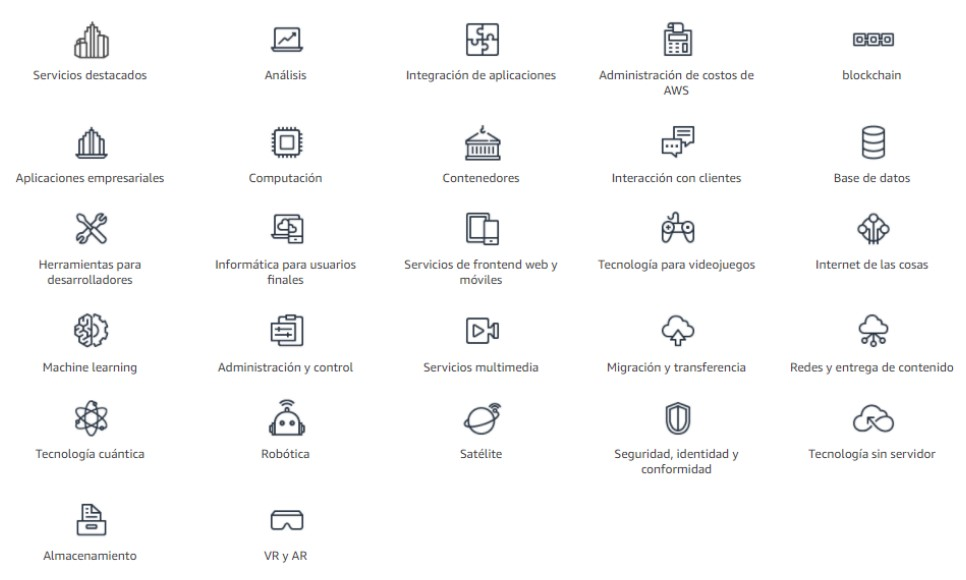
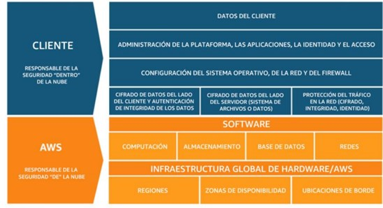

# Introducción a la Nube AWS

Esta certificación está destinada a individuos que tengan las habilidades y el conocimiento necesarios para demostrar efectivamente una comprensión general del funcionamiento de la nube de AWS, la infraestructura general de la nube de AWS, los principios arquitectónicos de la nube de AWS y los aspectos básicos de conformidad y seguridad de la plataforma de AWS. Los candidatos deben contar con una comprensión básica de los servicios de TI y sus casos de uso en la plataforma de la nube de AWS.

## 1. Descripcción de la nube AWS
---

**La informática en la nube** es la entrega bajo demanda de potencia de cómputo, base de datos, almacenamiento, aplicaciones y otros recursos de TI, a través de internet, con un sistema de precios de pago por uso.

La informática en la nube nos permite dejar de considerar la **infraestructura como** hardware y, en cambio, verla y usarla como **software**.

### 📌 **1.1 Modelos de servicios en la nube**    

Existen tres modelos principales de servicios en la nube. Cada modelo ofrece un nivel diferente de control sobre sus recursos de TI:

* **Infraestructura como servicio:** hace referencia a los servicios básicos y son el pilar fundamental de la nube. Con ellos, se accede a las características de redes, a los equipos (virtuales o en hardware dedicado) y al espacio de almacenamiento de datos. IaaS ofrece el mayor nivel de flexibilidad y control de administración en relación con sus recursos de TI.
* **Plataforma como servicio (PaaS):** aquí se concentran los servicios que reducen la necesidad de gestionar la infraestructura (normalmente, el hardware y los sistemas operativos) y facilitan el desarrollo de aplicaciones.
* **Software como servicio (SaaS):** son servicios que ofrecen un producto completo mediante aplicaciones para el usuario final. No hay que administrar ni gestionar la infraestructura y mantener el servicio. El servicio de correo electrónico de Google es un ejemplo de SaaS.

### 📌 **1.2. Implementaciones en la nube**

Por otra parte, también conviven tres implementaciones de servicios en la nube:

* **Nube:** todas las partes de una aplicación o desarrollo se encuentran completamente en la nube y usan todos sus servicios.
* **Híbrida:** una solución implementada conectando la infraestructura propia y los recursos en la nube para extender sus soluciones.
* **En las instalaciones:** también conocida como nube privada. Es casi idéntico al modelo de infraestructura propia y clásica que puede aprovecharse para lanzar tecnologías de virtualización y administración.

### 📌 **1.3. Ventajas de la informática en la nube**

El interés de migrar hacia la nube de muchas empresas viene motivado por las siguientes ventajas:  

- **💰 Cambio de gastos de capital (CAPEX) por gastos variables (OPEX):**  
  En lugar de invertir en centros de datos según previsiones de recursos físicos que luego hay que mantener, un gasto variable es más asumible y controlable.  

- **📉 Beneficio de economías de escala:**  
  Cuantos más consumos realicen miles de usuarios, los proveedores pueden aplicar economías de escala, lo que se traduce en una reducción de precios.  

- **⚡ No asumir estimaciones sobre capacidad necesaria:**  
  Acceso rápido a los recursos necesarios, sean pocos o muchos, sin necesidad de hacer estimaciones previas.  

- **🚀 Aumento de la velocidad y agilidad:**  
  A golpe de clic, se reduce de semanas a minutos el tiempo necesario para acceder y poner en marcha los servicios requeridos para desarrollar y experimentar.  

- **🛠️ No seguir gastando dinero en el mantenimiento de centros de datos:**  
  Permite centrarse en los clientes en lugar de montar y gestionar servidores.  

- **🌍 Ser global en minutos:**  
  AWS tiene múltiples regiones en todo el mundo, lo que permite acceder a más clientes con bajas latencias y menor costo.  

### 📌 **1.4. Aplicaciones AWS**

Por servicio web se entiende cualquier componente software que está disponible a través de Internet mediante una interacción con una interfaz de programación de aplicaciones (API). AWS es una plataforma en la nube segura con un amplio abanico de productos globales listo para usarse en cuestión de minutos. La figura 1 muestra algunos de las categorías de servicios listados en el AWS Overview (2021).

### 📌 **1.5. Interacción con los servicios**

Para interactuar con los servicios, AWS ofrece 3 tipos de opciones basadas en API de AWS:

Consola de administración de AWS: interfaz gráfica completa para la mayoría de las características que ofrece AWS.
Interfaz de línea de comandos de AWS (CLI de AWS): un conjunto de utilidades que se pueden lanzar desde un script de comandos en Linux, macOS o Microsoft Windows.
Kits de desarrollo de software (SDK): paquetes que permiten obtener acceso a AWS en diferentes lenguajes de programación.
Las tres opciones se basan en una API REST que se ejecuta como un componente esencial de todo el ecosistema de AWS.

### 📌 **1.6. Adopción de la nube**

Para una empresa que desea adoptar un marco de trabajo en la nube, esta adopción no es rápida y necesita de una correcta estrategia alienando intereses dentro de todas las capas de una organización.

AWS tiene a su disposición un marco de adopción en la nube (AWS CAF, 2017) para ofrecer ayudas y orientación en la forma migrar desarrollos a la nube y acelerar la puesta en marcha de los servicios. Este marco se basa en seis perspectivas y cada una en un conjunto de capacidades a nivel funcional o de propiedad.

## 2. Facturación y economía en la nube
---

### 📌 **2.1. Aspectos generales de los precios**

AWS fundamenta sus costos en 3 fuentes fundamentales: la informática (computación) en la que se cobra por hora o por segundo, el almacenamiento de datos (por GB) y la transferencia de datos de salida (por GB). En la mayoría de los casos, no se aplican cargos por la transferencia de datos de entrada ni por la transferencia de datos entre servicios de AWS dentro de la misma región (con excepciones). El modelo de precios implica pagar por lo que se usa, pagar menos al reservar servicios, pagar menos cuanto más uso se le dé y pagar aún menos a medida que AWS crece.

Por ejemplo, en servicios como Amazon Elastic Compute Cloud (Amazon EC2) y Amazon Relational Database Service (Amazon RDS) se puede reservar capacidad y ahorrar hasta un 75 % en comparación con la capacidad bajo demanda. Las instancias reservadas están disponibles bajo:

* Instancia reservada con pago inicial completo (AURI).
* Instancia reservada con pago inicial parcial (PURI).
* Instancia reservada sin pago inicial (NURI).

En AWS se ahora a medida que aumenta el uso. En servicios como Amazon Simple Storage Service (Amazon S3) se paga menos por GB cuando usa más. La transferencia de datos entrante es siempre gratuita. El uso de varios servicios de almacenamiento ofrece menores costos según sus necesidades. AWS también ofrece precios personalizados para satisfacer cada cliente.

AWS ofrece a nuevos clientes una capa gratuita (https://aws.amazon.com/es/free/) durante 1 año para determinados servicios y opciones. Además, servicios como Amazon Virtual Private Cloud (Amazon VPC), AWS Identity and Access Management (IAM), Auto Scaling, AWS CloudFormation, AWS OpsWorks y AWS Elastic Beanstalk se ofrecen sin cargo adicional, si bien es posible que haya otros cargos por los servicios que usen con ellos.

### 📌 **2.2. Coste total de propiedad**

El Total Cost of Ownership (TCO) en AWS es una metodología que compara los costos de operar infraestructura en la nube versus mantener un entorno tradicional on-premise. El TCO Calculator de AWS te ayuda a estimar el ahorro potencial en costos al migrar a la nube, considerando aspectos como:

* ✅ Costo de hardware (servidores, almacenamiento, redes).
* ✅ Costo de energía y refrigeración.
* ✅ Costo de administración y mantenimiento.
* ✅ Costo de licencias y software.
* ✅ Costo de redundancia y seguridad.

AWS proporciona una herramienta gratuita llamada [AWS TCO Calculator](https://calculator.aws/#/) que te permite ingresar detalles sobre tu infraestructura actual y obtener una comparación con los costos en AWS.

### 📌 **2.3. Facturación**

Para facilitar la facturación de AWS, se ofrece el servicio gratuito AWS Organizations el cual permite la administración de cuentas de forma unificada entre varias cuentas de AWS en una organización que se crea y administra de manera centralizada. AWS Organizations permite crear políticas de control de servicios, crear grupos de cuentas, administrar aplicaciones mediante APU y simplificar el proceso de facturación mediante factura unificada. AWS Organizations no reemplaza las políticas de AWS Identity and Access Management con usuarios, grupos y roles en una cuenta de AWS pero si permitir o denegra servicios a cuentas específicas.

Dentro del grupo de servicios de Administración de costos y facturación de AWS , se encuentran herramientas que le permiten acceder y optimizar los costes y el uso de AWS. Entre esas herramientas, se encuentran:

* Panel de facturación: ver el estado de los gastos hasta fecha por servicio, identificar los servicios que representan la mayor parte del gasto total y comprender tendencias.
* AWS Cost Explorer: visualizar gráficos con detalle, generar un informe de todos los costes de los últimos 3 meses y ver datos de costes de los últimos 13 meses. Además de descubrir patrones de costes.
* Presupuestos de AWS: proporcionar previsiones y crear alertas en Amazon * Simple Notificacion Service (Amazon SNS).
* Informes de uso y costo de AWS: información completa por día y servicio que se puede almacenar en un bucket de S3.

### 📌 **2.4 AWS Support
**
AWS ofrece una combinación única de herramientas para soporte y planes de soporte para brindar experimentación y soporte en servicios de producción. Entre ellas está AWS Trusted Advisor, donde los clientes pueden obtener recomendaciones sobre sus gastos mensuales, identificar problemas de seguridad y aumentar su productividad.

Si se desea obtener una orientación proactiva, AWS Support cuenta con directores de cuentas técnicas (TAM) que son designados como el punto de contacto principal de los usuarios. El TAM puede ayudar en la orientación, revisión de la arquitectura y comunicación continua a medida que planifica, implementa y optimiza sus soluciones. A su vez el equipo de soporte de Concierge es un equipo experto en cuentas y facturación con análisis rápidos y eficaces.

Se ofrecen 4 tipos de planes de soporte:

Basic: acceso al centro de recursos, panel de estado de servicio, 6 comprobaciones de Trusted Advisor y foros de debate.
Developer: soporte para desarrollos iniciales, orientación y cargas de trabajo no de producción
Business: cargas de trabajo en producción.
Enterprise: cargas de trabajo críticas.

## 3. Infraestructura global de AWS y modelo de responsabilidad compartida
---

### **3.1. Infraestructura global de AWS**

AWS tiene desplegada su infraestructura por todo el mundo (https://aws.amazon.com/es/about-aws/global-infrastructure/) diseñada para crear un entorno en la nube seguro, flexible, confiable, escalable con un rendimiento de alta calidad. La infraestructura de la nube de AWS se basa en regiones. Una región es una ubicación geográfica física con una o varias zonas de disponibilidad. Las zonas de disponibilidad, a su vez, constan de uno o varios centros de datos. Para ver el estado de las regiones, visite la siguiente página https://aws.amazon.com/es/about-aws/global-infrastructure/regions_az/

Para lograr la tolerancia a errores y estabilidad, las regiones están aisladas unas de otras. Los recursos en una región no se replican automáticamente en otras regiones. Cuando almacena datos en una región específica, no se replica fuera de esa región. Si las necesidades del negocio así lo requieren, es la responsabilidad de los usuarios replicar los datos en las regiones. La selección de regiones se determina según la gobernanza de los datos, la proximidad a los clientes, los servicios, los costes y la latencia.

Cada región cuenta con ubicaciones aisladas llamadas zonas de disponibilidad que ofrece ofrecen la posibilidad de operar bases de datos y aplicaciones con disponibilidad, tolerancia a errores y escalabilidad mayores que las que ofrecería un único centro de datos. Cada zona de disponibilidad puede incluir varios centros de datos y cientos de miles de servidores. Son particiones completamente aisladas de la infraestructura global de AWS. Las zonas de disponibilidad tienen su propia infraestructura de energía y están físicamente separadas por como mucho 100 kilómetros.

Es importante destacar como la infraestructura de AWS es:

* ✅ **Elástica:** Ajusta automáticamente los recursos según la demanda (ej. Auto Scaling en EC2).

* 📈 **Escalable:** Puede aumentar o disminuir la capacidad sin afectar el rendimiento (ej. DynamoDB y S3).

* ⚠️ **Tolerante a errores:** Diseñado para resistir fallos, con replicación entre zonas de disponibilidad (ej. RDS Multi-AZ).

* 🌍 **Alta disponibilidad:** Usa múltiples zonas de disponibilidad y regiones para asegurar el uptime (ej. S3 y Route 53).

### **3.2. Modelo de responsabilidad compartida**

Es esencia entender el modelo de responsabilidad compartida entre AWS y el cliente ya que atañe a la responsabilidad de algunos aspectos de la seguridad general. La diferencia de quién es responsable entre lo que comúnmente se denomina seguridad «de» la nube frente a seguridad «en» la nube.

AWS es responsable de la seguridad «de» la nube: proteger los servicios, el hardware, las redes y las instalaciones. También vigilar la seguridad física de los centros de datos y de la conectividad de sus regiones. El cliente es responsable de la seguridad «en» la nube: cifrar los datos en reposo o en tránsito, credenciales de seguridad. La responsabilidad depende de las características del servicio.

Así, por ejemplo, en los servicios bajo el paraguas IaaS (EC2), los clientes son responsables de las tareas de configuración y administración de los sistemas operativos y parches de seguridad. En servicios como AWS Lambda (Pass), AWS opera la capa de infraestructura y sistema operativo.

## 4. AWS IAM. Aspectos de seguridad
---

### **4.1. AWS IAM**

Un servicio esencial de AWS es el AWS Identity and Access Management (IAM), un servicio sin cargos adicionales. Este servicio permite controlar el acceso a los servicios de informática, almacenamiento, base de datos y aplicaciones en la nube de AWS. Con IAM, se administra el acceso a un recurso (entidad en una cuenta de AWS) mediante un conjunto de derechos sobre quien puede acceder al recurso, a qué recursos, qué puede hacer y cómo se puede obtener el acceso.

Puede conceder diferentes permisos a diferentes personas para diferentes recursos. Por ejemplo, puede permitir que determinados usuarios tengan acceso completo a Amazon EC2, Amazon S3 y otros servicios de AWS. Sin embargo, para otros usuarios, puede permitir el acceso de solo lectura a determinados buckets de S3. También puede permitir que algunos usuarios obtengan acceso únicamente a la información de facturación de la cuenta, pero nada más.

El modelo IAM se compone de los siguientes componentes:

* **Usuario de IAM:** persona o aplicación que se puede autenticar con una cuenta de AWS.
* **Grupo de IAM:** colección de usuarios
* **Política de IAM:** documento que define que recursos se pueden acceder y el nivel.
* **Rol de IAM:** mecanismo para conceder permisos temporales a fin de realizar solicitudes de servicios.

Los usuarios IAM accede o bien mediante programación (id con clave acceso y clave secreta) o mediante la consola (id de cuenta, nombre de usuario y contraseña). Para proporcionar más seguridad, se recomienda habilitar el Multi-Factor Authentication (MFA) para obtener un código único para los servicios.

A la hora de asignar autorizaciones, hay que acudir al principio del mínimo privilegio que se fomenta en que hay que conceder únicamente los mínimos privilegios a los usuarios en virtud de sus necesidades.

### **4.2. Protección de cuentas y datos en AWS**

La seguridad en AWS es un pilar fundamental y para ello se recomienda consultar la documentación oficial en AWS Security Pillar (2020).

Se llama cuenta de usuario raíz a la cuenta que se crear en AWS la primera vez. Estas cuentas tienen acceso completo a todos los recursos y AWS recomienda las siguientes prácticas para salvaguardarla:

* Habilitar Multi-Factor Authentication (MFA).
* Eliminar las claves de acceso de usuario raíz de la cuenta.
* Cree usuarios de IAM individuales y otorgue permisos de acuerdo con el principio de mínimo privilegio.
* Utilice grupos para asignar permisos a usuarios de IAM.
* Configure una política de contraseñas robusta y seria.
* Emplear roles en lugar del uso compartido de credenciales.
* Monitorear la actividad de la cuenta con AWS CloudTrail.

A continuación, se muestra brevemente algunos servicios de AWS que facilitan la labor de seguridad.

* **AWS Organizations:** con ese servicio se puede también agregar políticas de control de servicios ya que se integra con IAM mediante las políticas de control de servicios (SCP).
* **AWS Key Management Service (AWS KMS):** facilita la gestión de claves de cifrado para los servicios de AWS (https://aws.amazon.com/es/kms/features/)
* **Amazon Cognito:** control de acceso a la aplicaciones móviles o web, con autoescalado e integrado con Facebook, Google y Amazon.
* **AWS Shield:** servicio de protección contra ataques de denegación de servicio.
* **AWS Certificate Manager:** gestionar certificados SSL o TLS. Útil para el cifrado de datos en tránsito, datos que se mueven a través de la red.
* **AWS Storage Gateway:** almacenamiento de nube híbrida que proporciona acceso en las instalaciones al almacenamiento en la nube de AWS.

Respecto a las actividades de conformidad con las diferentes regulaciones, AWS colabora con los organismos externos y auditores independientes para ofrecer política y herramientas fáciles de aplicar:

* **AWS Config:** servicio para evaluar y analizar las configuraciones de los recursos en AWS.
* **AWS Artifact:** descargas de documentos bajo demanda como certificaciones ISO o informes del sector y control de organizaciones.
* **AWS Service Catalog:** administrar catálogos de servicios para su uso en IT
* **Amazon Macie:** proteger información personal
* **Amazon Inspector:** definir estándares y prácticas recomendadas.
* **Amazon GuardDuty:** detección de amenazas.

## 5. Documentación oficial
---

1. [Adopción cloud](https://d1.awsstatic.com/whitepapers/es_ES/aws-cloud-adoption-framework_XL.pdf)
2. [Precios](https://docs.aws.amazon.com/pdfs/whitepapers/latest/how-aws-pricing-works/how-aws-pricing-works.pdf)
3. [Arquitectura](https://docs.aws.amazon.com/pdfs/wellarchitected/latest/security-pillar/wellarchitected-security-pillar.pdf)
4. [Resumen de servicios](https://d1.awsstatic.com/whitepapers/aws-overview.pdf)
5. [Amazon VPC](https://docs.aws.amazon.com/vpc/latest/userguide/vpc-ug.pdf#vpc-eips)
6. [Gateways](https://docs.aws.amazon.com/vpc/latest/userguide/vpc-ug.pdf#VPC_Internet_Gateway)

