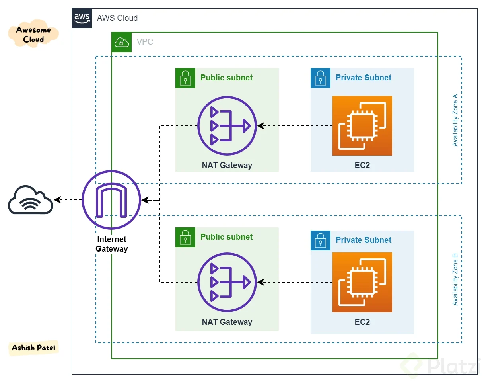

# Servicios de Almacenamiento y Computo

## 1. Servicio de redes y entrega de contenido
---

### **1.1. Amazon VPC**

Amazon Virtual Private Cloud (Amazon VPC) es un servicio básico de Amazon que permite aislar de forma lógica una sección de la infraestructura de Amazon para lanzar otros servicios de AWS. Gracias a Amazon VPC se pueden controlar el intervalo de direcciones IP de los servicios, puesta en marcha de subredes y la configuración de las tablas de enrutamiento y puertas de enlace (gateway) de las redes. Amazon VPC permite habilitar diferentes capas de control de acceso (ACL de red) para controlar mejor las instancias de Amazon EC2 en cada subred.

Con este servicio se pueden crear redes privadas, aisladas de otros VPC, que pertenecen a una única región y pueden estar desplegadas por varias zonas de disponibilidad. Las subredes que se generan se clasifican en públicas (tienen acceso a internet) o privadas. Las instancias de una VPC obtienen una dirección IP privada de forma automática y se puede solicitar asignar una dirección IP pública al crear la instancia. Las direcciones IP elásticas son estáticas y públicas y pueden implicar costes adicionales.

Otro concepto importante en Amazon VPC es de interfaz de red elástica, interfaz de red virtual que puede asociarse a una instancia en una VPC o desconectarse de una. Los atributos de una interfaz de red también se asocian cuando se vuelve a asociar a otra instancia. Cuando mueve una interfaz de red de una instancia a otra, el tráfico de la red se redirige a la nueva instancia.

La puesta en marcha de una VPC requiere también de una tabla de enrutamiento, conjunto de reglas que dirigen el tráfico de red de su subred, mediante un destino y un objetivo. Cada subred debe tener una tabla de enrutamiento y varias subredes se pueden unir a la misma tabla de enrutamiento.

### **1.2. Redes VPC y seguridad**

Tras generar una red VPC, se describen a continuación diferentes herramientas y componentes para gestionar de forma interesante el tráfico dentro de la VPC. Una gateway de Internet es un componente que habilita la comunicación de instancias de la VPC con Internet. Sirve para suministrar un objetivo a las tablas de enrutamiento y realizar traducciones de las direcciones de red. Por ejemplo, para hacer pública una subred hay que agregar una entrada a la tabla de enrutamiento para enviar el tráfico a la dirección 0.0.0.0/0. Por otra parte, una gateway de traducción de las direcciones (NAT) permite a las instancias de subred privada conectarse a Internet y otros servicios.

Las redes VPC también permiten usos compartidos entre cuentas de AWS de la misma organización en AWS Organizations. A su vez, se permite establecer interconexiones entre dos VPC para dirigir el tráfico entre ellas.

Herramientas o servicios de gestión de VPC:

* AWS Site-to-Site VPN: servicio que permite habilitar conexiones entre una AWS VPC y una red remota.
* AWS Direct Connect: permite mejorar el rendimiento para establecer conexiones de una red privada y un centro de datos corporativa.
* Punto de enlace de VPC: dispositivo virtual que habilitar la conexión de forma privada de una VPC mediante la tecnología AWS PrivateLink.
* AWS Transit Gateway: servicio para centralizar. y simplificar un modelo red que permita la gestión de varias Amazon VPC.
* Amazon Route 53 es un servicio de nombres de dominio con gran disponibilidad y escalabilidad para redirigir el tráfico a usuarios finales, compatible con IPv4 e IPv6.
* Amazon CloudFront: servicio de entrega de contenido (CDN) global y con precios de pago por uso.

Finalmente, es esencial configurar lo llamados grupos de seguridad, cortafuegos a nivel de instancia para controlar tráfico de entrada y salida. Tiene reglas que habilitan o deniegan el tráfico que trabajan a nivel de instancias. Sin embargo, para trabajar a nivel de red están las listas de control de acceso a la red (ACL) como cortafuegos de una o varias redes.

## 2. amazon elastic compute cloud (EC2)
---

### **2.1. Amazon EC2Amazon EC2**

Amazon Elastic Compute Cloud (Amazon EC2) es un servicio básico (IaaS) que proporciona máquinas virtuales en las que puede alojar cualquier tipo de aplicaciones. La sigla EC2 implican:

* Elastic: capacidad de aumentar o reducir fácilmente la cantidad de servidores, así como para aumentar o reducir el tamaño de los servidores existentes.
* Compute: procesar datos mediante capacidad de procesamiento (CPU) y la memoria (RAM).
* Cloud: las instancias se alojan en la nube.

#### **Lanzamiento de instancias**

Con Amazon EC2, se puede lanzar cualquier cantidad de instancias de cualquier tamaño en cualquier zona de disponibilidad del mundo y en pocos minutos. Los pasos para lanzar una instancia son:

* Escoger una imagen Amazon Machine (AMI): plantillas de máquinas virtuales (Linux o Windows) proporcionadas por AWS, por otras AMI que se han creado, por un Marketplace o de una comunidad de usuarios
* Tipo de instancia: existen varios tipos de instancias que se optimizan para diferentes casos de uso. Son combinaciones de CPU, memoria, almacenamiento y red.
* Especificar la configuración de red: seleccionar la región, configurar la VPC, la subred y la dirección IP pública.
* Asocial rol: en caso de que la instancia interactúe con otros servicios de EC2 (por ejemplo, acceder a un bucket S3), será necesario asociar un rol de AWS Identity and Access a esa instancia.
* Datos de usuario: definir un script durante el lanzamiento de la instancia.
* Opciones de almacenamiento: configurar el volumen raíz, lugar donde está instalado el sistema operativo invitado. Opciones
* Amazon Elastic Block Store (EBS): a nivel de bloque persistentes. Los datos no se pierden si se detiene o inicia la instancia.
* Almacén instancias: asociados al equipo host y si se detiene la instancia, se pierden los datos.
* Amazon Elastic File System (Amazon EFS): sistema de archivos, pero no para el volumen raíz
* Amazon Simple Storage Service (S3): tampoco para volumen raíz.
Agregar etiquetas: marca para gestionar recursos con metadatos.
* Grupos de seguridad: reglas de firewall para controlar el tráfico.
* Par de claves: para conectarse a ella.
* Para monitorear las instancias se emplear Amazon CloudWatch, que proporciona métricas casi en tiempo real, ofrece gráficas y mantiene datos históricos durante meses.

### **2.2. Modelos de precios**

Amazon ofrece los siguientes modelos de precios para ejecutar instancias EC2 en las que la facturación por segundo solo está disponible para las instancias bajo demanda, las instancias reservadas y las instancias de spot que ejecutan Amazon Linux o Ubuntu.

* Instancias bajo demanda: menor costo inicial y la mayor flexibilidad. No requiere compromisos iniciales ni contratos a largo plazo. Buena opción para aplicaciones con cargas de trabajo a corto plazo, con picos o impredecibles.
* Hosts dedicados: servidores físicos con capacidad para instancias dedicadas que permiten utilizar sus licencias de software.
* Instancias dedicadas: instancias que se ejecutan en una VPC en hardware dedicado para un solo cliente. Están físicamente aisladas en el nivel de hardware del host de las instancias que pertenecen a otras cuentas de AWS.
* Instancias reservadas: para reservar capacidad informática durante un plazo de 1 o 3 años con reducción del coste por hora. Para usos intensivos, predecibles y uniformes son recomendadas. Las instancias reservadas programadas le permiten comprar reservas de capacidad que se repiten diaria, semanal o mensualmente, con una duración especificada, por un periodo de 1 año. Paga por el tiempo de programación de las instancias, aunque no las utilice.
* Instancias de spot: aprovechar instancias EC2 no utilizadas para conseguir reducir el precio en gran medida. El precio por hora de una instancia de spot varía en función de la oferta y la demanda.

### **2.3. Pilares de optimización**

Para optimizar el coste de las instancias se deben tener en cuenta cuatro factores:

* Adaptación del tamaño: buscar el equilibrio adecuado de los tipos de instancias y emplear Amazon CloudWatch para tener métricas de rendimiento.
* Aumento de elasticidad: desactive instancias cuando no están en uso y habilitar el escalado automático para satisfacer las necesidades.
* Modelo de precios óptimo: analizar patrones de uso para poder ejecutar instancias EC2 con la combinación adecuada de opciones de precios o valorar usar soluciones sin servidor como AWS Lambda.
* Optimización de las opciones de almacenamiento: analizar los requisitos de almacenamiento, cambiar el tamaño de los volúmenes de EBS y reducir la sobrecarga de sus implementaciones.

## 3. Otros servicios de cómputo. Contenedores
---

### **3.1. Servicios de contenedores**

En informática, los contenedores son un método de virtualización del sistema operativo que permite ejecutar una aplicación y sus dependencias en un entorno controlado y asilado empaquetando todo el código y sus configuraciones. Son más pequeños que las máquinas virtuales y no contienen un sistema operativo completo, sino que comparten un sistema operativo virtualizado y se ejecutan como procesos de recursos aislados.

Una de las plataformas más importantes de contenedores es Docker que proporciona comandos sencillos para crear, detener y gestionar los contenedores. Docker se puede instalar en cualquier servidor y virtualiza el sistema operativo. Una de las formas de usar Docker podría ser el lanzar instancias de Amazon EC2 e instalar Docker en cada instancia. Sin embargo, esta opción fuerza a que tengamos que administrar la instancia, así como Docker. Para evitar esto, AWS ofrece un variado conjunto de servicios de contenedores para simplificar la administración.

### **3.2. Amazon Elastic Container Service (ECS)**

ECS es un servicio de administración de contenedores escalable y rápido compatible con Docker eliminando la necesidad de la infraestructura. Permite lanzar decenas de miles de contenedores en minutos además de que está integrado con Elastic Load Balancing, con los grupos de seguridad, los volúmenes y los roles.

Amazon ECS ejecuta los contendores en un clúster de ECS. Cada clúster es un grupo de instancias de EC2 y cada una es un agente de contendor que se puede gestionar. Para evitar, AWS Fargate es un servicio que gestionara el clúster de solo redes que eliminar la necesidad de elegir el tipo de servidores y decidir cuándo escalar y optimizar el clúster.

### **3.3. Amazon Elastic Kubernetes Service (Amazon EKS)**

Kubernetes (https://kubernetes.io/) es un software de código abierto para la organización de contenedores que trabaja con muchas tecnologías incluida Docker. Es un proyecto muy respaldo por una gran comunidad de desarrolladores y muy reconocido, donde las empresas crean extensiones y complementos que mantienen el software. Amazon EKS es un servicio administrado de Kubernetes que admite contenedores de Linux y Windows y es compatible con las herramientas de la comunidad de Kubernetes.

### **3.4. Amazon Elastic Container Registry (Amazon ECR)**

Registro de contenedores de Docker administrado que facilitar las tareas de almacenamiento, administración e implementación de imágenes de contenedores Docker.

### **3.5. AWS Lambda**

A diferencia de ECS o los servicios de contendores, existe otro enfoque en informática que es el de informática sin servidores. Gracias a AWS Lambda, se puede ejecutar código de programación sin necesidad de aprovisionar ni gestionar servidores.

AWS Lambda (https://aws.amazon.com/es/lambda/) está basado en eventos. AWS solo cobra por el tiempo de uso (en incrementos de 100 milisegundos) de los recursos y no cobrará cuando el código no se ejecute. Es compatible con varios lenguajes de programación (Java, Go, C#, etc) que pueden usar cualquier biblioteca nativa o de terceros. Es un servicio con tolerancia a errores que permite coordinar flujos de trabajo con AWS Step Functions basados en eventos. Lambda también puede sondear recursos en otros servicios que no publican eventos en Lambda. Por ejemplo, se pueden extraer registros de una cola de Amazon Simple Queue Service (Amazon SQS) y ejecutar una función de Lambda para cada mensaje recuperado. De manera similar, Lambda puede leer eventos desde Amazon DynamoDB.

### **3.6. AWS Elastic Beanstalk**
AWS Beanstalk es una forma sencilla de poner en marcha aplicaciones web. Se enmarca en el paradigma plataforma como servicio (PaaS). El servicio es administrado y gestiona automáticamente las instancias, el balanceo de carga, el escalado automático, monitoreo, análisis y registros. Se paga solo por los recursos subyacentes que se utilizan, no por utilizar Elastic Beanstalk.

Admite aplicaciones web escritas en Java, .NET, PHP, Node.js, Python, Ruby, Go y Docker. Dependiendo del lenguaje, AWS Beanstalk implementa el código en Apache Tomcat, Apache HTTP Server, Nginx, Passenger, Puma y Microsoft Internet Information Services (IIS). Usar AWS Beanstalk es rápido y aumenta la productividad de los desarrolladores centrándose únicamente en escribir el código. Se pueden elegir el tipo de instancia de Amazon EC2 y escala de forma ascendente o descendente en función de las necesidades.

## 4. Servicios de almacenamiento
---

### **4.1. Amazon EBS**

En el contexto de Amazon EC2, el almacenamiento efímero es un almacenamiento temporal que se agrega a cada instancia de Amazon EC2. Una forma de almacenamiento persistente lo ofrece Amazon EBS ofreciendo volúmenes de almacenamiento en bloques para utilizarlos con instancias de Amazon EC2. Se denomina almacenamiento persistente a cualquier dispositivo de almacenamiento de datos que retenga datos una vez que se apaga la alimentación de ese dispositivo. En otras ocasiones, también se lo denomina almacenamiento no volátil.

Con Amazon EBS todos los volúmenes replican automáticamente dentro de su zona de disponibilidad para protegerlo de cualquier error que se produzca en los componentes. Se puede ampliar o reducir el uso en cuestión de minutos, mientras se paga un precio reducido solamente por lo que aprovisiona.

La diferencia fundamental entre este tipo de almacenamiento y otro a nivel de objetos radica en que, para cambiar por ejemplo un carácter de un archivo, en el almacenamiento en bloques solo cambia el bloque donde está el carácter mientras que en el otro cambia el objeto. Esta diferencia tiene un gran impacto en el rendimiento, la latencia y el coste. Las soluciones de almacenamiento en bloques suelen ser más rápidas y utilizan menos ancho de banda, pero pueden ser más costosas que el almacenamiento a nivel de objetos.

Una copia de seguridad de un volumen de Amazon EBS se denomina instantánea. Los volúmenes de Amazon EBS se incluyen como parte de las copias de seguridad de las instancias en las imágenes de Amazon Machine (o AMI). Las AMI se almacenan en Amazon S3 y se pueden reutilizar para crear nuevas instancias de Amazon EC2 más adelante. Los volúmenes van cifrados y son muy elásticos aumentando la capacidad cuando se desee. Existen diferentes tipos de volúmenes: SSD para cargas de trabajo habituales y HDD para cargas de trabajo con rendimiento uniforme y precio bajo.

### **4.2. Amazon S3**

Amazon S3 (https://aws.amazon.com/es/s3/) es un servicio de almacenamiento a nivel de objetos, lo que significa que, si desea cambiar una parte de un archivo, tiene que realizar la modificación y luego volver a cargar todo el archivo modificado. Amazon S3 almacena los datos como objetos dentro de recursos conocidos como buckets y reproduce los objetos en varias zonas de disponibilidad dentro de la misma región. Es una solución administrada de almacenamiento en la nube que se diseñó para brindar un escalado sin problemas y 99,999999999 % de durabilidad. Los nombres de los buckets son universales y deben ser únicos entre todos los nombres de buckets existentes en Amazon S3. Los objetos pueden ser de hasta 5 TB. Los datos en Amazon S3 no están asociados a ningún servidor en particular y no se necesita administrar ninguna.

De forma predeterminada, no se comparte ninguno de los datos públicamente. También se pueden cifrar los datos en tránsito y elegir habilitar el cifrado del lado del servidor en los objetos. Se puede acceder a Amazon S3 a través de la consola de administración de AWS, de forma programática a través de la API y los SDK, o con soluciones de terceros que utilizan la API o los SDK. Amazon S3 incluye notificaciones de eventos que permiten configurar notificaciones automáticas cuando se producen determinados eventos, como la carga o la eliminación de un objeto en un bucket específico. Se pueden enviar estas notificaciones o pueden utilizarse para desencadenar otros procesos, como funciones de AWS Lambda.

La figura 4 muestra las clases de almacenamiento. Cada clase esta optimizada según la frecuencia de acceso a los datos y la latencia requerida. Así, por ejemplo, Amazon S3 Glacier Deep Archive es la clase más económica recomendada para accesos de una o dos veces al año.

| **Tipo de S3**                  | **Costo**  | **Latencia** | **Durabilidad** | **Casos de Uso** |
|---------------------------------|------------|-------------|----------------|-----------------|
| **S3 Standard**                 | Alto       | Baja        | 99.999999999%  | Datos de uso frecuente, sitios web, aplicaciones en producción |
| **S3 Intelligent-Tiering**      | Variable   | Baja        | 99.999999999%  | Datos con acceso impredecible, optimización automática de costos |
| **S3 Standard-IA (Infrequent Access)** | Medio | Media       | 99.999999999%  | Backups, recuperación ante desastres, datos de acceso poco frecuente |
| **S3 One Zone-IA**              | Bajo       | Media       | 99.99%         | Datos de acceso poco frecuente almacenados en una sola zona de disponibilidad |
| **S3 Glacier**                  | Muy bajo   | Alta (min-horas) | 99.999999999%  | Archivos de largo plazo, cumplimiento normativo, datos históricos |
| **S3 Glacier Deep Archive**     | Extremadamente bajo | Muy alta (12-48h) | 99.999999999%  | Archivos y datos de largo plazo con acceso casi nulo |

### **4.3. Amazon EFS**

Amazon EFS proporciona un almacenamiento de archivos simple, escalable y elástico para utilizarlo con los servicios de AWS y los recursos disponibles en las instalaciones. Ofrece una interfaz sencilla que permite crear y configurar sistemas de archivos de forma rápida y simple. Se puede utilizar Amazon EFS para crear un sistema de archivos para big data y análisis, flujos de trabajo de procesamiento multimedia, administración de contenido, servidores web y directorios principales.

Los sistemas de archivos de Amazon EFS pueden escalar automáticamente desde gigabytes hasta petabytes de datos sin necesidad de aprovisionar almacenamiento. Cientos de instancias de Amazon EC2 pueden acceder al mismo tiempo a un sistema de archivos de Amazon EFS. Este servicio está diseñado para proporcionar un rendimiento uniforme a cada una de estas instancias. Amazon EFS también está diseñado para ofrecer alta disponibilidad y larga duración. Con Amazon EFS, no hay tarifas mínimas ni costos de configuración; solo se paga por el almacenamiento que utiliza.

## 5. Documentación oficial
---

1. [Tipos de instancias EC2](https://aws.amazon.com/es/ec2/instance-types/)
2. [Docker](https://aws.amazon.com/es/docker/)
3. [Amazon EBS](https://aws.amazon.com/es/ebs/features/)
4. [Amazon EC2](https://www.youtube.com/watch?v=7W12MB22PCQ)
5. [Amazon S3](https://www.youtube.com/watch?v=e6w9LwZJFIA)
6. [Amazon VPC](https://docs.aws.amazon.com/es_es/AmazonRDS/latest/UserGuide/CHAP_Tutorials.WebServerDB.CreateVPC.html)