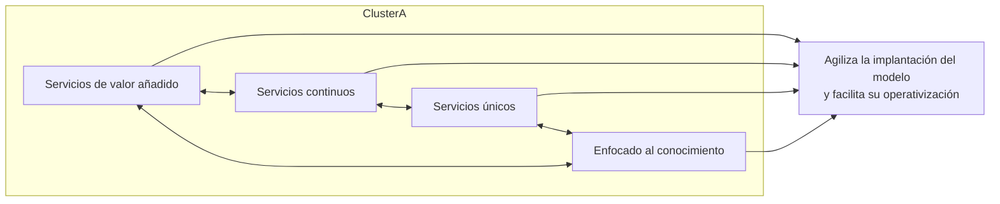
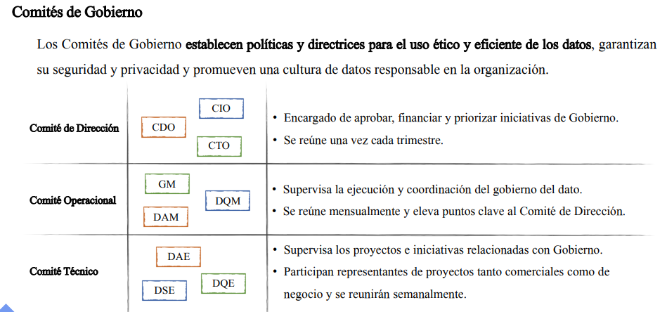
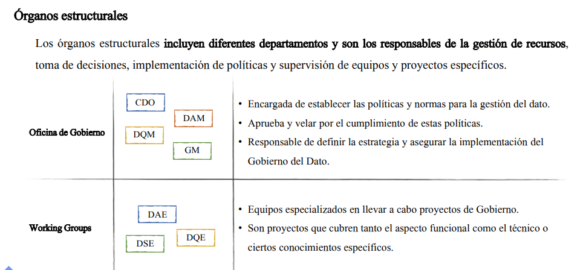
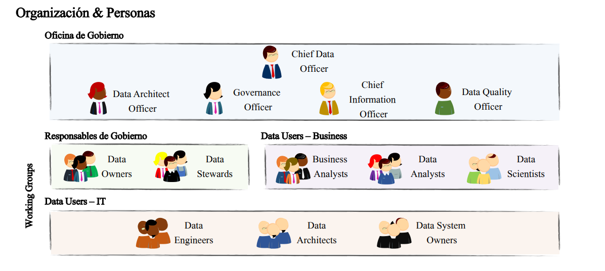
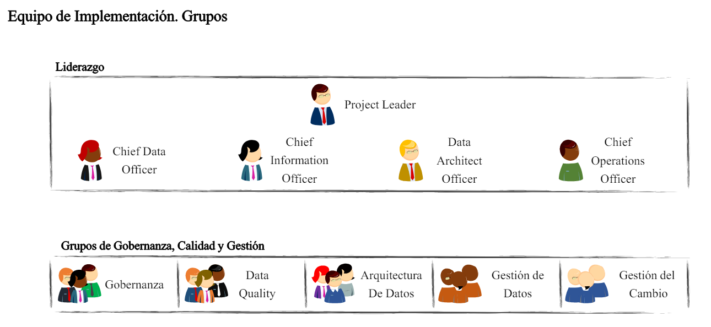

# Data Governance

## 1. Introducción

En este curso, aprenderás qué son y cómo establecer políticas de calidad de datos, crear un flujo de trabajo de gobierno de datos efectivo y garantizar la seguridad y el cumplimiento normativo en torno a tus datos. Aprenderás cuales son las principales herramientas de Data Governance en la actualidad, y cómo liderar conversaciones en torno a la gestión de datos en tu empresa.

Además, descubrirás cómo identificar y resolver problemas de calidad de datos, cómo establecer procesos de mejora continua y cómo aumentar la eficiencia en la gestión de datos. Este curso también te enseñará cómo mejorar la colaboración entre departamentos y cómo establecer un lenguaje común en torno a los datos.

Este curso es para aquellos que buscan llevar su conocimiento de Data Governance al siguiente nivel y quieren aprender cómo aplicar las mejores prácticas en sus empresas. Los estudiantes tendrán la oportunidad de aprender de expertos en el campo y participar en actividades prácticas para aplicar lo que aprenden en situaciones reales.

**Lo que aprenderás:**

* ¿Qué es el Data Governance?
* Importancia del Data Governance en la actualidad empresarial
* Estándares de gobierno: Data Governance, Data Mesh y Data Management
* Modelos operativos del Data Governance
* Políticas y comités de gobierno
* Roles, Ownership y estructura
* Desarrollo e implementación de un modelo de Gobierno del Dato en una empresa
* Principales herramientas de Data Governance: Collibra, Talend, Informatica, Alation e IBM
* Cómo plantear un modelo de gobierno del dato desde 0

## 2. Que es el gobierno de dato?

### 2.1 La misión del gobierno de dato en la actualidad I

#### Contexto Actual

* **Era Digital**: Gran cantidad de datos generados y gestionados.
* **Crucialidad**: El gobierno del dato se ha vuelto crucial debido a este incremento masivo de datos.

#### Gestión Efectiva de Datos

* **Toma de Decisiones Informada**: La gestión efectiva es esencial para decisiones bien fundamentadas.
* **Cumplimiento de Regulaciones**: Importante para adherirse a regulaciones y normas vigentes.

#### Beneficios del Buen Gobierno del Dato

* **Eficiencia y Productividad**: Mejora notable en la eficiencia y productividad empresarial.
* **Maximización del Valor de los Datos**: Los datos bien gestionados aportan más valor.
* **Confianza y Transparencia**: Mejora en la confianza y transparencia con los stakeholders.

#### Naturaleza del Gobierno del Dato

* **Práctica Continuada**: No es un proyecto puntual, sino una práctica continua.
* **Integración Cultural**: Debe integrarse en la cultura organizacional.

### 2.2. Que es el gobierno de datos

#### Definición General

* **Gobierno del Dato**: Enfoque sistemático y estratégico para administrar los datos de una organización.
  * **Objetivos**: Mejorar eficiencia, transparencia y confianza en la toma de decisiones.
  * **Componentes**: Incluye políticas, procesos y tecnologías para la gestión de información y su uso ético y responsable.

#### Diferentes Definiciones del Gobierno del Dato

* **DMBOK (Data Management Body of Knowledge)**:
  * **Descripción**: Guía estandarizada sobre mejores prácticas, procesos y terminologías en la gestión de datos.
  * **Definición**: Desarrollo, ejecución y supervisión de planes, políticas, programas y prácticas que entregan, controlan, protegen y mejoran el valor de los datos y los activos de información a lo largo de sus ciclos de vida.

* **Empresas del Sector**:
  * **Definición**: Estructura organizativa formada por normas, políticas y procesos.
  * **Objetivos**: Asegurar que los datos sean correctos, fiables, seguros y útiles.

#### Importancia de Conocer las Diferentes Definiciones

* **Variaciones**: Existen sutiles diferencias en la definición de gobierno del dato.
* **Comprensión Completa**: Vital conocer y comprender todos los componentes del gobierno del dato.

### 2.3 La misión del gobierno de dato en la actualidad II

#### Utilidad y Ventajas del Gobierno del Dato

* **Comprensión de las Necesidades de Información**:
  * Identificar datos críticos para el éxito de la empresa.
  * Establecer requisitos de calidad y seguridad para esos datos.
  * Asegurar disponibilidad y accesibilidad de datos para quienes los necesiten de manera oportuna.

* **Almacenamiento y Protección de Datos**:
  * Integración efectiva y segura de los datos.
  * Protección contra la pérdida o accesos no autorizados.

* **Mejora Continua en la Calidad de la Información**:
  * Verificación de la precisión y relevancia de los datos.
  * Eliminación de datos duplicados u obsoletos.

* **Seguridad de la Información**:
  * Implementación de medidas de seguridad como la encriptación de datos sensibles.
  * Cumplimiento de regulaciones y normas relevantes.
  * Parte importante de la gestión de riesgos de la organización.

#### Promoción del Uso y Valor de los Datos

* **Enfoque Estratégico y Sistemático**:
  * Gestión de los datos en toda la organización.
  * Uso efectivo y eficiente de la información para apoyar la toma de decisiones y mejorar procesos de negocio.

* **Infraestructura Adecuada**:
  * Comprensión clara de las necesidades de información.
  * Encontrar, almacenar y gestionar los datos de manera efectiva.

* **Optimización de los Gastos de Gestión de Datos**:
  * Minimización de costos asociados a la adquisición, almacenamiento, procesamiento y gestión de datos.
  * Implementación de prácticas eficientes y utilización de tecnologías adecuadas.

#### Mejora en la Comprensión del Valor de los Activos de Datos

* **Conciencia de la Importancia de los Datos**:
  * Uso de datos para mejorar el desempeño y alcanzar objetivos.
  * Identificación de nuevas oportunidades de negocio y mejora de la eficiencia operacional.

* **Gobierno Correcto de la Información**:
  * Desarrollo de políticas, procesos y estándares claros para la gestión de datos.
  * Designación de responsables para supervisar el cumplimiento de estos estándares.
  * Involucrar a todas las partes interesadas en el proceso.

#### Aplicación de las Reglas SMART

* **Establecimiento de Objetivos SMART**:
  * **Específico**: Definición clara y precisa de los objetivos.
  * **Medible**: Objetivos cuantificables.
  * **Alcanzable**: Objetivos realistas y alcanzables.
  * **Relevante**: Alineación con los objetivos comerciales generales.
  * **Limitado en el Tiempo**: Objetivos con un plazo definido.

* **Beneficios de las Reglas SMART**:
  * Asegura el uso efectivo de los recursos.
  * Garantiza resultados sostenibles a largo plazo.

### 2.4 Necesidad de implementar un modelo de negocio

#### Razones para Implementar el Gobierno del Dato

* **Mejora de la Toma de Decisiones**:
  * Gestión efectiva de la información.
  * Visión clara y precisa de procesos y operaciones.
  * Decisiones más informadas y acertadas.

* **Reducción de Costes**:
  * Optimización de procesos.
  * Eliminación de duplicidades y redundancias en el manejo de la información.

* **Mejora de la Eficiencia**:
  * Acceso rápido y sencillo a la información relevante.
  * Mejora de la velocidad y eficacia de los procesos y la toma de decisiones.

* **Mayor Confianza en la Información**:
  * Garantía de integridad, seguridad y privacidad de la información.
  * Generación de mayor confianza en la capacidad de la empresa para proteger la información.

* **Mejora de la Reputación**:
  * Transmisión de una imagen de transparencia, responsabilidad y compromiso con la privacidad de la información.

#### Importancia del Modelo de Gobierno del Dato

* **Visión Global y Planificación**:
  * Visión global de los datos y su gestión.
  * Planificación y organización adecuadas para garantizar calidad, integridad y seguridad de los datos.

* **Definición de Políticas y Procedimientos**:
  * Establecimiento de políticas y procedimientos claros para la gestión de datos e información.
  * Fomento de la eficiencia en la toma de decisiones.
  * Optimización de los procesos empresariales.

### 2.5.  Issues mas habituales para implementar un modelo en una empresa

#### Problemas Comunes

* **Falta de Visión Estratégica**:
  * Obstáculo por falta de comprensión sobre la importancia del gobierno del dato.
  * Necesidad de una visión clara.

* **Datos Dispersos y Silos de Información**:
  * Dificultades para integrar y centralizar datos.
  * Impacto negativo en la toma de decisiones y optimización del valor de los datos.

* **Falta de Capacidades Técnicas**:
  * Necesidad de un equipo capacitado y una infraestructura adecuada.
  * Desafío significativo para muchas empresas.

* **Establecimiento de Responsabilidades y Autoridades**:
  * Necesidad de definir claramente quién será responsable de la gestión de los datos.
  * Importancia de definir políticas y prácticas claras para el uso de los datos.

* **Colaboración y Alineación entre Departamentos**:
  * Necesidad de visión y comprensión por parte de la dirección y empleados sobre la importancia y valor de los datos.

* **Insuficiencia de Recursos**:
  * Falta de recursos humanos y financieros para la implementación y mantenimiento del modelo de gobierno del dato.
  * Igual de crítica que otros desafíos mencionados.

* **Falta de Estandarización y Homogeneización de los Datos**:
  * Dificultades en la integración y correcta gestión de los datos debido a la falta de estandarización.

#### Conclusión

* **Desafíos en la Implementación**:
  * La resistencia al cambio.
  * Fragmentación y silos de datos.
  * Falta de claridad en la estructura de la información.
  * Falta de liderazgo y estrategia clara.

* **Superación de Obstáculos**:
  * Superar estos desafíos es clave para aprovechar al máximo el valor de los datos.
  * Mejora en la toma de decisiones empresariales.

### 2.6. Porque suelen fallar los modelos de gobierno de datos?

#### Factores Clave para el Éxito

* **Claridad en la Definición e Implementación**:
  * Coherencia con los objetivos y estrategias de la empresa.
  * Implementación correcta de políticas y procedimientos.
  * Evitar incertidumbre y confusión en los departamentos.

* **Prioridad en la Empresa**:
  * Reconocer la importancia del modelo de gobierno del dato.
  * Asignación adecuada de recursos y tiempo.
  * Compromiso y apoyo de la alta gerencia.

* **Toma de Decisiones Centralizada**:
  * Evitar decisiones individuales de departamentos sin una perspectiva general.
  * Garantizar la consistencia y calidad de los datos.
  * Contribuir a una mejor toma de decisiones en la empresa.

* **Visión Transversal del Gobierno del Dato**:
  * Evitar delegar únicamente en el departamento de TI.
  * Comprender que es una responsabilidad compartida y estratégica de toda la organización.

* **Visión y Compromiso de la Capa Directiva**:
  * Importancia del apoyo y liderazgo de los altos ejecutivos.
  * Inversión en recursos necesarios para la implementación.
  * Implementación efectiva de políticas y prácticas de gobierno del dato.

#### Problemas Comuness

* **Falta de Claridad y Precisión**:
  * Definición e implementación confusas del modelo.
  * Impacto negativo en la eficacia y eficiencia de la empresa.

* **Percepción del Gobierno del Dato como Tarea Secundaria**:
  * Prioridades empresariales que desplazan la importancia del modelo de gobierno del dato.
  * Falta de recursos y tiempo dedicados a su implementación.

* **Decisiones Descentralizadas**:
  * Conflictos y problemas de integración de datos.

* **Falta de Comprensión del Alcance del Gobierno del Dato**:
  * Implementación incorrecta o insuficiente.
  * Falta de adopción y éxito a largo plazo.

* **Falta de Visión de la Alta Dirección**:
  * Falta de comprensión del valor del gobierno del dato.
  * Falta de inversión y apoyo necesario.

### 2.7. Estandares y paradigmas

#### Definición de Estándares y Paradigmas

* **Estándares y Paradigmas**:
  * Directrices y enfoques para gestionar, proteger y utilizar datos de manera efectiva y ética.
  * Incluyen:
    * Clasificación de datos.
    * Gestión de metadatos.
    * Seguridad de la información.
    * Privacidad y gobernabilidad.

* **Fuentes de Estándares**:
  * Regulados por agencias gubernamentales.
  * Establecidos por la industria.

* **Paradigmas**:
  * **Datos Abiertos**:
    * Enfoque que promueve el acceso y uso libre de datos.
  * **Datos como Activos**:
    * Filosofía que trata los datos como un recurso valioso y estratégico para la organización.

* **Beneficios de Implementar Estándares y Paradigmas**:
  * Mejora de la calidad de los datos.
  * Aumento de la eficiencia y transparencia.
  * Cumplimiento de regulaciones y leyes aplicables.

### Frameworks de Gestión del Dato

#### Definición y Ejemplos de Frameworks

* **Frameworks de Gestión del Dato**:
  * Estructuras que definen los procesos y mecanismos para la gestión eficaz y eficiente de los datos.

* **Ejemplos de Frameworks**:
  * **DAMA (Data Management Association)**:
    * Organización internacional dedicada a la gestión de datos.
    * Proporciona el modelo de gobierno DAMA-DMBOK.
  * **DCAM (Data Management Capacity Assessment Model)**:
    * Desarrollado por la Universidad de Waterloo.
    * Evalúa la madurez y capacidad de la gestión de datos en una organización.
  * **COBIT (Control Objective for Information and Related Technology)**:
    * Marco de referencia para la gestión de TI y la gobernanza de los datos.
  * **Zachman Framework**:
    * Marco de referencia para la clasificación de activos empresariales, incluyendo datos.

### 2.8. Discrepancias entre DAMA y DCAM

#### Modelos Principales del Gobierno del Dato

* **Modelo DAMA**:
  * **Descripción**:
    * Estructura de principios, normas y procedimientos para gobernar efectivamente los datos.
    * Basado en la guía para la gestión de datos de la Asociación para el Avance de la Inteligencia de Negocios (DAMA).
  * **Enfoque**:
    * Integridad, seguridad y calidad de los datos.
    * Gobierno del dato responsable del control y gestión de la información.
  * **Objetivos**:
    * Toma de decisiones informada.
    * Mejora continua en la gestión de datos.
  * **Beneficios**:
    * Mejores prácticas y herramientas para abordar desafíos en la gestión de datos.
    * Ayuda a alcanzar objetivos estratégicos.

* **Modelo DCAM (Data Management Capacity Assessment Model)**:
  * **Descripción**:
    * Marco de referencia para la gestión de la información en organizaciones.
    * Basado en mejores prácticas.
  * **Enfoque**:
    * Evaluación del nivel de madurez en la gestión de activos de datos.
    * Control adecuado de la información.
  * **Objetivos**:
    * Mejorar la eficiencia y efectividad en la toma de decisiones.
  * **Beneficios**:
    * Visión clara y alcance detallado para la implementación del gobierno del dato.
    * Herramienta valiosa para un marco sostenible de Data Management.

#### Diferencias Clave entre DAMA y DCAM

* **Enfoque**:
  * **DAMA**:
    * Marco de trabajo para la gestión de datos.
    * Amplia variedad de áreas: clasificación de datos, gestión de metadatos, seguridad de la información, privacidad, y gobernabilidad.
  * **DCAM**:
    * Comprensión integral del conocimiento y habilidades técnicas necesarias para la gestión de datos.
    * Énfasis en aspectos técnicos de la gestión de datos.

* **Alcance**:
  * **DAMA**:
    * Marco de trabajo amplio.
    * Adecuado para profesionales que buscan una comprensión integral de la gestión de datos.
  * **DCAM**:
    * Enfocado en aspectos técnicos.
    * Adecuado para profesionales técnicos que buscan una comprensión profunda de la gestión técnica de datos.

* **Certificación**:
  * **DAMA**:
    * Ofrece certificación para profesionales de la gestión de datos.
    * Demuestra competencia y conocimiento en la gestión de datos.
  * **DCAM**:
    * No ofrece certificación.

### 2.9. Data Mesh

Presenta un nuevo paradigma en el Gobierno del Dato al
orientar los datos como un producto, introduciendo nuevos
conceptos como:

#### Introducción a Data Mesh

* **Data Mesh**:
  * **Descripción**:
    * Trata los datos como un producto en lugar de un recurso subyacente o un activo.
    * Enfocado en entender los datos como una entidad con valor propio y un ciclo de vida.
    * Organizado de forma descentralizada en pequeños equipos y silos autónomos.
  * **Objetivos**:
    * Gestión más efectiva y flexible de los datos.
    * Fomentar una cultura de datos sólida y una visión de negocios orientada a los datos.
  * **Beneficios**:
    * Mejora de la eficiencia y la innovación mediante la colaboración y el uso compartido de datos.

#### El Data Mesh introduce nuevos conceptos

* **Gobierno Descentralizado del Dato**:
  * **Descripción**:
    * Colaboración y responsabilidad compartida en la gestión de datos.
    * Distribución de la responsabilidad y control de los datos a través de la organización.
  * **Objetivo**:
    * Reconocer los datos como un recurso valioso para toda la organización.

* **Gobierno Federado del Dato**:
  * **Descripción**:
    * Acuerdos y políticas para la gestión y uso de datos en una organización con múltiples departamentos o unidades empresariales.
  * **Objetivo**:
    * Mantener flexibilidad y control sobre los datos, asegurando integridad, privacidad y seguridad.

* **Data OwnerShip, Arquitectura Descentralizada**:
  * **Arquitectura Descentralizada**:
    * Permite la gestión eficiente y efectiva de los datos de manera descentralizada.
  * **Orientación a Dominios**:
    * Gestión de datos desde una perspectiva específica de cada dominio.
    * Mejora la toma de decisiones y aumenta la transparencia y confianza en la gestión de datos.

* **Data Mesh en Entornos Cloud**:
  * **Descripción**:
    * Mejor gestión y eficiencia en la entrega de soluciones basadas en datos en entornos cloud.

#### Comparación entre Data Mesh y DAMA

* **Enfoque**:
  * **DAMA**:
    * Top-down con estructura jerárquica y centralizada.
    * Enfoque en la definición de políticas, estándares y prácticas para la gestión de información.
  * **Data Mesh**:
    * Descentralizado y bottom-up.
    * Colaboración y participación activa de todas las partes interesadas.
    * Creación de Data Products y orientación a dominios.

* **Estructura**:
  * **DAMA**:
    * Jerarquía de procesos y funciones en tres capas: estrategia, dirección y táctica.
  * **Data Mesh**:
    * Enfoque descentralizado y orientado a dominios.
    * Gestión de datos por equipos autónomos responsables de un dominio específico.

* **Orientación a Dominios**:
  * **Data Mesh**:
    * Datos son propiedad de un dominio específico y gestionados por ese dominio.
  * **DAMA**:
    * No tiene un enfoque específico en dominios.

* **Arquitectura**:
  * **DAMA**:
    * Arquitectura centralizada para la gestión de datos.
  * **Data Mesh**:
    * Arquitectura descentralizada basada en microservicios.
    * Enfoque en la gestión de datos en entornos cloud.

* **Procesos**:
  * **Data Mesh**:
    * Enfoque en procesos ágiles y continuos de mejora y evolución.
  * **DAMA**:
    * Enfoque más tradicional y jerárquico para la gestión de datos.

## 3. Estrategia del Dato Corporativo

### 3.1. En que consiste una estrategia del dato corporativo

* Es un plan integral para la gestión de datos de una empresa.
* Abarca aspectos técnicos, legales, definición de roles, responsabilidades, etc.
* Integrar la gestión de datos permite maximizar su valor y su uso ético y responsable.
* Mejora la toma de decisiones y el desempeno de la organización.

### 3.2. El plan estratégico

Un Plan Estratégico a largo plazo es un documento detallado que describe los objetivos a largo
plazo de una organización, cómo planea alcanzarlos y asignará a los responsables de llevar a
cabo las acciones necesarias.
Es de vital importancia que la estrategia de datos esté alineada con la estrategia general de la
organización para maximizar su impacto y ser flexible ante cambios futuros

* Objetivos a largo plazo. Se deben definir los objetivos de crecimiento, nuevos mercados, etc. a varios años vista.
* Acciones a corto, medio y largo plazo. Se deben cubrir las acciones necesarias para cumplir con los objetivos.
* Roles y responsabilidades. Se deben asignar los owners de cada acción.
* Estrategia global. Se debe alinear con la estrategia general de la Organización.
* Flexibilidad. Debe ser lo suficientemente flexible para adaptarse a cambios y oportunidades del mercado.

Ahora vamos a definir los principales beneficios de tener un plan estratégico de datos en nuestra empresa.

## 3.3 Impacto en el negocio

Algunos de los impactos mas comunes:

* Modelos de negocios mas eficientes
* Nuevos modelos de negocios = Rentabilidad
* Inovación a travez de nuevas tendencias
* Toma de decisiones a travez del dato

### 3.4. Roadmap integral

EI Roadmap debe tener como objetivo específico detallar todas las acciones necesarias para llevar a cabo el Plan Estratégico en una organización, con un enfoque en metas a corto, medio y largo plazo.

* Corto Plazo (1-2 años)
  * Assesstmen de la organización
  * Implementar soluciones buscando la mejora de toma de desiciones
  * Fomentar una cultura del dato
* Medio plazo (2-3 años)
  * Automatizar procesos manuales
  * Implementar nuevos productos y servicios
  * Mejora la seguridad de los datos
* Largo Plazo (3-5 años)
  * Transformación del negocio
  * Ecosistema basado en la transformación digital
  * Implementar mejora continua

### 3.5. Cultura del dato

EI hecho de implementar una estrategia del dato a lo largo de una organización busca **fomentar una cultura de datos integrada y uniforme** en toda la organización. Para ello:

* Debe involucrar a las áreas de negocio.
* Debe garantizar el alineamiento entre las distintas áreas de negocio.
* Debe homogeneizar los procesos de trabajo.
* Debe inculcar la filosofia de que los datos son un activo de inmenso valor a los integrantes de la organización.
* Debe instaurar una comunicación efectiva entre las áreas de la organización.

### 3.6. Mejora en la toma de desiciones

Mediante el desarrollo de una Estrategia del Dato a medida, la organización puede fortalecer
significativamente su capacidad de toma de decisiones, generando un impacto positivo a lo largo de la misma:

* Teniendo acceso a datos completos y de alta calidad
* Eliminando silos y promoviendo una comunicación efectiva, se mejora el acceso y la calidad de los datos
* Al disponer de datos mejores, éstos se pueden analizar, arrojando resultados que antes podríanno ser visibles
* Apoyándose en la "estrategia de datos", la estrategia general de la organización puede tomar decisiones óptimas

### 3.7. Eficiencia en el uso de datos

Un enfoque al que menos atención se le presta en la Estrategia del Dato, es buscar la optimación del uso de los datos para lograr una mayor eficiencia y reducción de costes, creando una suerte de economía de escala:

* Datos bajo un estándar
* Procesos Automatizados
* Tecnología al servicio de la gestión
* Control de uso
* Integración de soluciones
* Planes de Mejora Continua

>La implementación de un catálogo de datos puede ser útil ya que ayuda a la mejora de la eficiencia en el consumo de los datos. Los usuarios pueden encontrar los datos que necesitan de manera más rápida y eficiente, 10 que reduce el tiempo y los costes asociados con la búsqueda y el uso de datos.

## 4. Modelo de gobierno del dato

### 4.1. El Marco

**EI Modelo debe conectar los datos con el Negocio** a través un modelo operativo, de la aplicación de políticas, procedimientos y estándares claros y actualizados, alineados con los servicios de apoyo de la organización.

| Modelo Operativo | Políticas y Procedimientos | Servicios de Dato |
|------------------|----------------------------|-------------------|
| - Enfoque estructurado y sistemático - Implementa políticas, estándares y procesos - Uso ético y seguro de los datos - Conecta los datos con el negocio | - Describen el manejo, uso y la protección de datos - Marco para decisiones informadas - Elemento crítico para modelo - Revisadas y actualizadas regularmente | - Estrategia de Gobierno del Dato en línea con servicios - Su alineación agiliza proceso de implementación - Asegura operatividad en el día a día |

Ahora vamos a explicar lso diferentes modelos de gobierno del dato que hay en la actualidad

### 4.2. Modelo Operativo Centralizado

Este modelo se caracteriza principalmente por **una estructura jerárquica y centralizada** que controla la gestión de datos en toda la organización, de forma que las unidades no pueden tomar decisiones por su cuenta.

| Características | Inconvenientes |
|-----------------|----------------|
| - Una única autoridad con el control - Toma de decisiones rápidas - Mayor transparencia en las políticas y procedimientos - Facilidad de gestión | - Falta de autonomía de las áreas para tomar decisiones - Dificultad de adaptar cambios en la organización - Desplegar los cambios puede ser lento |

### 4.3. Modelo Operativo Descentralizado

Este modelo, mucho más flexible que el centralizado, **no dispone de una autoridad centralizadora y las unidades de negocio pueden tomar las decisiones** y lanzar iniciativas de gobierno de forma autónoma.

| Características | Inconvenientes |
|-----------------|----------------|
| - Cada unidad de negocio decide sobre sus datos - Especialización en los datos - Respuesta rápida ante los cambios en el negocio | - Duplicidades de esfuerzo - Posible pérdida de la visión general de la organización - Mayor dificultad en mantener la calidad del dato |

### 4.4. Modelo Federado

Se encuentra entre el modelo centralizado y el descentralizado. La estrategia se define de forma centralizada y la operativa de ejecución es descentralizada, unificando la autonomía con la unidad de la organización.

| Características | Inconvenientes |
|-----------------|----------------|
| - Autonomía y colaboración - Alta flexibilidad y amoldamiento personalizado - Mejora de la eficiencia a través de la colaboración | - Complejidad a la hora de definir políticas y procedimientos - Mayor dificultad en la gestión de los datos - Reducción de la eficiencia si la colaboración no se implementa correctamente |

EI Modelo Federado puede ser una gran opción para:

* **Organizaciones que tienen una estructura descentralizada** y que buscan mejorar la gestión de sus datos
* **Organizaciones muy grandes**, ya que permite una cierta libertad en la gestión interna de los
datos en cada área mientras que desde el órgano centralizador se define el marco global.

### 4.5. Comparativa entre los modelos

| Modelo               | Ventajas                                             | Desventajas                                     |
|----------------------|------------------------------------------------------|-------------------------------------------------|
| **Modelo Centralizado** | - Mayor control sobre los datos - Mayor eficiencia en la gestión de los datos | - Menor flexibilidad - Puede ser más lento y costoso - Menor potencial de innovación |
| **Modelo Descentralizado** | - Mayor autonomía de las áreas - Menor coste de implementación - Más potencial de innovación | - Menor control y coordinación - Mayor riesgo de incumplimiento normativo |
| **Modelo Federado**  | - Equilibrio entre control y autonomía - Alto grado de flexibilidad - Combina la centralización y la descentralización | - Mayor complejidad de implementación - Mayor necesidad de estandarización - Mayor coste de implementación |

Se cree que se puede crear modelos hibridso combinando dos o tres de estos modelos según las necesidades de la organización.

### 4.6. Políticas de gobierno

Las políticas y procedimientos definen las directrices y objetivos para la gestión de los datos y proporcionan un
marco de referencia para asegurar la protección y el uso eficiente de los datos en la organización

* Tratan las necesidades y áreas críticas para eI gobierno del dato en la organización
* Ayudan a establecer un marco de referencia para la gestión de los datos
* Definen reglas para la recopilación, eI almacenamiento,
el uso, la protección de los datos, etc.
* Proponen la revisión y actualización periódica de para
garantizar efectividad.

Pasos para implementar políticas y procedimientos de datos solidas:

**Paso 1 ->** Definir el marco de gobierno del dato: Este paso implica definir los objetivos, los principios y los procesos clave que se utilizarán para gobernar los datos.

**Paso 2 ->** Identificar los datos críticos para eI negocio: Esto puede incluir datos sensibles, confidenciales o regulados.

**Paso 3 ->** Desarrollar las políticas y los procedimientos: Esto incluye reglas y directrices sobre la recopilación, el almacenamiento, el uso, la protección y la divulgación de los datos.

**Paso 4 ->** Implementar y monitorizar las políticas y procedimientos: Esto incluye la sensibilización y la capacitación del personal, la revisión y el seguimiento de los procesos y la identificación y solución de los desafíos y las áreas de mejora.

**Paso 5 ->** Evaluar periódicamente las políticas y los procedimientos: Esto incluye la revisión de los objetivos, la identificación de nuevas oportunidades de mejora y la adaptación a los cambios en el entorno y en las necesidades de la organización.

### 4.7. Servicios de datos

Busca mejorar la eficiencia y efectividad en la utilización de los datos alineando la estrategia de datos con las políticas y procedimientos, orientando los datos a los diferentes servicios que ofrece la organización.

* Aportan información adicional para tomar decisiones informadas
* Brindan información en tiempo real y permiten monitorear continuamente el estado de los datos.
* Ofrecen soluciones personalizadas para las necesidades específicas de la organización
* Enfocado a aprovechar el conocimiento y la experiencia de expertos en datos

Estos servicios se dividen en 4 categorías principales:

* Servicios de valor añadido: Estos servicios se enfocan en proporcionar información adicional o análisis que permitan tomar decisiones más informadas y mejorar la eficiencia de los procesos.

* Servicios continuos: Estos servicios brindan información en tiempo real y permiten monitorear continuamente el desempeño de una organización.

* Servicios únicos: Estos servicios brindan soluciones personalizadas para una organización en función de sus necesidades específicas.

* Enfocado al Conocimiento: Este enfoque se enfoca en aprovechar el conocimiento y la experiencia de los expertos en datos para mejorar la calidad de la información y el rendimiento de la organización.

Al alinear la estrategia de datos con los diferentes servicios orientados a los datos, se **agiliza la implantación del modelo de gobierno y se facilita su operatividad.**

### 4.8. Comites de gobierno I

La gestión de datos **es un aspecto crítico para cualquier organización**, y para asegurarse de que se maneje de manera efectiva, se requiere de la **colaboración y coordinación de diferentes órganos dentro de la organización**.

* **Los órganos de gobierno** son responsables de definir e implementar políticas, estándares y procedimientos para el manejo de datos, supervisar la privacidad y seguridad de los datos, promover una cultura de responsabilidad en la gestión de datos y asesorar a la alta dirección sobre la gestión de datos.
* **Los órganos estructurales** son unidades dentro de la organización que tienen responsabilidades, tareas y objetivos específicos focalizados a su propio área. Incluyen departamentos de IT, finanzas, recursos humanos, operaciones, ventas, etc., y cada uno puede tener sus propios equipos internos.

### 4.9. Comites de gobierno II

### 4.10. Organización y personas

Los aspectos clave para una implementación efectiva del modelo, incluyen la importancia de la colaboración y coordinación entre la organización y las personas, la identificación clara de roles y responsabilidades

* La colaboración y la coordinación entre la organización y las personas
* La organización debe establecer políticas, estándares y procesos claros
* La identificación clara de los roles y responsabilidades es crucial
* La estructura de los roles y responsabilidades debe tener en cuenta las necesidades tanto del negocio como de IT

### 4.11. Chief Data Officer CDO

Garantiza que **los datos sean valorados, protegidos y utilizados de manera ética y eficaz. Lidera la definición de políticas y
estándares**, supervisar la implementación de soluciones de tecnología y **asesorar a los líderes de la organización** sobre cómo
utilizar los datos para mejorar la toma de decisiones, fomentando la Cultura del Dato en la organización.

* Debe definir, aprobar y asegurar el cumplimiento de políticas y procedimientos de gobierno.
* Responsable de definir el perímetro de datos bajo gobierno.
* Convertir el dato en un activo diferenciador para la compañía.
* Presidir los comités de dirección de gobierno.
* Sponsorship de iniciativas de cultura, promoviendo su uso ético y eficaz.

### 4.12. Governance Officer GO

Es responsable de **la planificación e implementación de las políticas y procedimientos de gobierno**, además de asegurar su cumplimiento. También puede estar involucrado en la **definición del perímetro de datos bajo gobierno** y en fomentar **la implantación de la Cultura del Dato** en la organización.

* Es responsable de definir las políticas y procedimientos de gobierno.
* Trabaja en estrecha colaboración con otros Officers para garantizar una implementación efectiva.
* Responsable de implementar las herramientas de gobierno.
* Responsable de la gestión e integración de los metadatados.
* Define y ejecuta casos de uso para incorporar al perímetro de Gobierno.
* Sponsorship de iniciativas de gobierno, promoviendo su uso ético y eficaz

### 4.13. Chief Information Officer CIO

**Garantizar que las TI y los datos sean utilizados de manera efectiva** para respaldar la estrategia de la organización. Incluye la
gestión de datos y **la implementación de soluciones para apoyar al Gobierno del Dato**. El CIO **trabaja mano a mano con el
CDO y otros C-Level** para definir las políticas de datos y garantizar que se cumplan los estándares.

* Lidera la estrategia de tecnología de la información de la organización.
* Garantizar la disponibilidad, integridad, confidencialidad y cumplimiento normativo .
* Asegura la asignación de recursos para el desarrollo y mantenimiento de la infraestructura IT.
* Colabora con otros líderes de la organización, para definir las políticas de gestión de datos.
* Evalúa y selecciona las tecnologías y soluciones de datos más adecuadas.

### 4.14. Data Arquitect Officer DAO

**Diseña y mantiene la arquitectura del dato y los sistemas de la organización**, garantizando que sean estratégicamente
adecuados y eficientes para cumplir con las necesidades de la organización, además de asegurar la integridad y la
consistencia de los datos en toda la organización.

* Diseña y mantiene la arquitectura del dato y sistemas de la organización.
* Garantiza la integridad y consistencia de los datos en toda la organización.
* Establece políticas y direcciones para la arquitectura y sistemas de la organización.
* Asegura que la arquitectura de datos cumpla con los objetivos estratégicos de la organización.
* Velar por la implementación de políticas y procedimientos de acceso a los sistemas y datos.

### 4.15. Working Groups

| Roles | Caracteristicas |
|--|--|
| Data Owner | - Es el responsable del conocimiento detallado de los datos bajo su propiedad.   - Conoce el ciclo de vida de los datos bajo su responsabilidad.   - Define las validaciones de calidad y el mantenimiento en el catálogo de dato desde el Negocio. |
| Data Stewards | - Es el responsable de mantener y actualizar la información de sus datos.   - Analiza la viabilidad técnica de los requisitos funcionales relacionados con los datos.   - Colabora con otras áreas para que sus datos se utilicen de manera efectiva. |
| Data Users | - Business analysts: Utiliza los datos para entender las necesidades y objetivos del negocio.   - Data Scientists: Recopila, limpia, diseña, explora, interpreta y explica qué cuentan los datos.   - Data Engineers: Diseña, construye, mantiene y optimiza los sistemas de gestión de datos.   - Data Architects: Define y supervisa la implementación de la arquitectura de datos. |

## 5. Desarrollo e implementación de un modelo de gobierno

* Esencial para mejorar la gestión de la información en una organización
* Objetivos claros, la selección de un modelo apropiado y la creación del comité de gobierno
* Soportado por una oficina central que establezca los estándares y
procedimientos
* La implementación es un proceso que requiere de mejora continua

### 5.1. Identificación del propósito y objetivos

La identificación clara de los objetivos y metas de la organización, junto a un liderazgo activo son
fundamentales para alinear el Modelo con la estrategia y la cultura que se desean implementar:

* Comprender cómo la gestión de datos contribuye al éxito de la estrategia global
* Identificar los objetivos a través del análisis de las necesidades de la Organización
* Evaluar minuciosamente los planes estratégicos, iniciativas y objetivos a corto y largo plazo
* Establecer una comunicación efectiva con los Stakeholders para monitorizar la implementación
* Promover la colaboración entre las partes interesadas: Negocio, IT y Liderazgo,

### 5.2. Situación actual de la empresa

Teniendo claros los objetivos y metas de la organización, el siguiente paso clave es analizar en profundidad el estado de la Organización para obtener nuestro Punto de Partida:

* Reunir la información más relevante: estado financiero, estructura, procesos, mercado, etc.
* Analizar la información para identificar las fortalezas y debilidades
* Evaluar las oportunidades y las amenazas que rodean a la Organización
* En base al estado de la Organización y sus condiciones de mercado, revisar la misión y visión
* Recopilar en un informe los resultados y exponerlos internamente

### 5.3. Creación del equipo

Conociendo los objetivos y el estado actual de la Organización, se ha de definir el equipo que transformará la Organización e implementará el Gobierno del Dato en la misma, en caso de ser necesario:

* Definir y alinear el propósito del equipo con la estrategia de la Organización
* Identificar los roles clave y elegir a las personas más adecuadas
* Establecer los canales de comunicación adecuados entre el equipo y la dirección
* Establecer las responsabilidades de cada miembro del equipo
* Desarrollar el método de trabajo y establecer un proceso de monitorización del equipo

### 5.4. Políticas y estándares

Es hora de centrarse en la definición e implantación de las políticas del Modelo, buscando establecer el marco de trabajo más claro y coherente posible para la gestión de los datos:

* Revisión y estudio de las necesidades de la empresa y sus objetivos para proponer políticas
* Crear rondas de consultas con todas las áreas para alinear las políticas propuestas
* Alineadas las propuestas, el equipo de Gobierno crea estándares y políticas específicas
* Comunicar e implementar las políticas desarrolladas a través planes de gestión del cambio
* Establecer una metodología de seguimiento de las políticas a modo de verificación

### 5.5. Nuevas Tecnologias

A través de las tecnologías de Gobierno, se puede automatizar y estandarizar gran parte de los procesos de la gestión de datos, lo que permitirá garantizar la calidad, la integridad y la seguridad de los datos:

* Analizar y documentar los requisitos técnicos y funcionales
* Realizar un benchmark analizando costes, capacidad, integración actual, etc.
* Evaluar minuciosamente los planes estratégicos, iniciativas y objetivos de la organización
* Desarrollar las PoC necesarias y seleccionar las herramientas más adecuadas
* Implementar las tecnologías decididas y establecer un plan de soporte, que será critico.

### 5.6. Gestión del cambio

La identificación clara de los objetivos y metas de la organización, junto a un liderazgo activo son **fundamentales para alinear el Modelo con la estrategia y la cultura** que se desean implementar:

* Preparar materiales que expliquen de manera clara las políticas y estándares de Gobierno
* Ofrecer trainings evaluados para aprender sobre las políticas y estándares de manera interactiva
* Distribuir planes de información regulares sobre las políticas y estándares de Gobierno
* Implantar un modelo de incentivación para los empleados que cumplen con las políticas
* Integrar paulatinamente las políticas y estándares de Gobierno en la cultura de la empresa

### 5.7. Mejora Continua

El siguiente paso es lograr que el modelo sea próspero a lo largo del tiempo. Para ello, debemos de desarrollar un proceso de mejora continua, de revisión y actualización:

* Identificar los KPIs necesarios para determinar el éxito de la implantación del Modelo
* Crear un calendario para realizar el seguimiento y evaluación regular del Modelo
* Recopilar información relevante para evaluar el desempeño y el progreso del Modelo
* Identificar las áreas que requieren un reajuste y establecer un plan de acción
* Seguir con el plan de mejora continua, añadiendo y reajustando 10 necesario

### 5.8. Herramientas

Son herramientas que se utilizan para mejorar y automatizar los procesos del Gobierno del Dato en una Organización. Estas herramientas ayudan a establecer políticas y estándares para la gestión, el uso y protección de los datos, asegurando su precisión, coherencia y seguridad

#### 5.8.1. Collibra

La plataforma de gobierno Collibra ofrece diversas funcionalidades para mejorar la calidad, seguridad y colaboración en torno a los datos de una empresa, lo que permite establecer políticas y procesos claros, mejorar la calidad de los datos, y asegurarse de que se utilicen de manera segura y ética, ayudando así a las empresas a mejorar la eficiencia de sus operaciones y tomar decisiones basadas en datos más informadas

* Permite a las organizaciones garantizar la calidad y la confiabilidad de sus datos, al mismo tiempo que mejoran la
colaboración y la eficiencia
* Cuenta con una interfaz de usuario intuitiva y fácil de usar que permite a los usuarios navegar y gestionar los datos de
manera eficiente.
* Se integra con una amplia variedad de herramientas y sistemas empresariales, como sistemas Cloud o bases de datos de
diferentes tecnologías
* Ofrece una funcionalidad robusta para definir y gestionar políticas y estándares de datos, lo que ayuda a garantizar la
calidad, la integridad y la consistencia de los datos en toda la organización

### 5.8.2. Talend

Talend es una plataforma de integración de datos open source que simplifica y automatiza el flujo de datos entre sistemas y aplicaciones, y es una buena opción para empresas que buscan una solución de integración de datos escalable y flexible, aunque es importante evaluar las opciones disponibles y elegir la que mejor se
adapte a sus necesidades específicas.

* Interfaz de usuario intuitiva que permite definir y automatizar procesos de integración de datos sin la necesidad de tener
conocimientos de programación.
* Presenta una alta compatibilidad con una amplia gama de sistemas y aplicaciones, incluyendo bases de datos, aplicaciones Cloud y big data.
* Es capaz de manejar grandes volúmenes de datos, 10 que permite a las organizaciones gestionar grandes flujos de datos y procesarlos de manera eficiente.
* Se integra fácilmente con herramientas de análisis y reporting para un mejor análisis de los datos

### 5.8.3. Informatica

* Permite a los usuarios explorar y entender los datos y sus metadatos en detalle.
* Es capaz proponer modelos de normalización de datos, y de detectar y corregir errores en los mismos.
* Proporciona herramientas para garantizar la privacidad y seguridad de los datos

### 5.8.4. Alation

* Utiliza la automatización para descubrir y catalogar los datos en la organización.
* Permite analizar los datos para enconfrar patrones, anomalías y hacer recomendaciones sobre los datos.
* Permite a los usuarios hacer comentarios, dar "me gusta" y
compartir conocimientos.
* Se integra con una amplia variedad de tecnologías de dato

### 5.8.5. IBM

* Buena opción para empresas que buscan una solución completa e integrada con otras soluciones de IBM (como InfoSphere DataStage y InfoSphere QualityStage)
* Buena opción para empresas con grandes volúmenes de datos y requisitos de gobernanza de datos complejos
* Permite establecer políticas y reglas para el acceso, uso y manejo de los datos en toda la empresa
* Proporciona un marco de trabajo para eI monitoreo y cumplimiento de políticas y regulaciones, con alertas y notificaciones
* Puede ser una buena opción para empresas que buscan una solución completa e integrada con otras soluciones de IBM

## 6. Caso Practico

[Enlace](./Caso+Práctico.pdf)

Solucion:

* **Implementar DataMesh:** Debido a que se necesitan soluciones que fomenten la comunicación y colaboración entre departamentos
y sistemas. Como ya sabemos, el data mehs se centra en la descentralización de los datos, permitiendo a los equipos y departamentos poseer y gestionar sus propios dominios de datos. Esto fomenta la autonomía y la responsabilidad de los equipos en la gestión y el uso de sus propios datos, lo que puede mejorar la calidad de los datos y la rapidez de acceso a los mismos. Además de que promueve la colaboración y la comunicación entre los equipos y departamentos, lo que puede ayudar a resolver los problemas de falta de comunicación y sinergia mencionados por los empleados.

* **Modelo operativo (Combinación de una estructura de data mesh con un enfoque de gobierno centralizado):** El modelo operativo que propondríamos sería una combinación de la estructura del data mesh. Con un enfoque de gobierno centralizado y coordinado, se establecerían políticas y estándares claros para la gestión de datos en toda la organización que nacerían de la capa directiva y se crearía una oficina de gobierno del dato con roles y responsabilidades definidos para garantizar el cumplimiento de estas políticas y estándares.

* **Estructura (Cuerpo directivo, Data engineers, Data Arquitects, Data users):** La estructura de la Oficina de Gobierno del Dato incluiría un CDO como líder de la estrategia y gobierno de datos. Un equipo de arquitectos de datos para garantizar la calidad y consistencia de los datos y un equipo de ingenieros de datos para implementar las soluciones tecnológicas necesarias. Se establecerían comités de coordinación entre los departamentos para asegurar la colaboración y la comunicación y se fomentaría la transparencia y la responsabilidad en la gestión de los datos.

* **Oficina (Chief Data Officer, Data Arquitect Officer, Governance Officer, Data Protection Officer, Data Quality Officer):** Para establecer una estructura de gobierno de datos efectiva, propondríamos la creación de la Oficina de Gobierno del Dato encargada de definir, implementar y supervisar las políticas y estándares de gestión de datos en toda la organización.
Esta oficina estaría dirigida por el CDO y estaría compuesta por los siguientes roles y responsabilidades uno.
  * Data Architect Officer, responsable de diseñar la arquitectura de datos y establecer los estándares técnicos para la gestión de datos en toda la organización.
  * Data Quality Officer responsable de supervisar la calidad de los datos en toda la organización y trabajar con los propietarios de datos para mejorar la calidad de los mismos.
  * Governance Officer responsable de liderar y supervisar la implementación de políticas y procedimientos para garantizar el cumplimiento de los objetivos de Gobierno de datos de la organización.
  * Data Protection Officer. Responsable de garantizar que la organización cumpla con las normativas de privacidad, seguridad y protección de datos en todo momento, trabajando con los equipos de seguridad para minimizar los riesgos.

* **Comite de Gobernanza (CEO, CDO, CIO, BA rep), Comite de calidad: (CDO, DQO, BA rep):** Comité de Gobernanza de datos que estaría encargado de supervisar y aprobar las políticas y estándares de gestión de datos. Este comité estaría compuesto por miembros clave de la organización, incluyendo representantes de cada departamento o área de negocio el CEO, el CDO y el CEO. Por otro lado, también sugeriría mos la creación de un comité de calidad de datos que estaría encargado de supervisar y evaluar la calidad de los datos en toda la organización. ste comité estaría compuesto por miembros clave de la organización, incluyendo representantes de cada departamento o área de negocio, el gestor de calidad de datos y el CDO. Estos comités trabajarían en estrecha colaboración con la Oficina de Gobierno y estarían encargados de garantizar que las políticas y estándares de gestión de datos sean implementados y cumplidos en toda la organización.

## 7. Self Assestment

[Nivel Junior](./Self+Assessment+I.pdf)
[Nivel Senior](./Self+Assessment+II.pdf)
