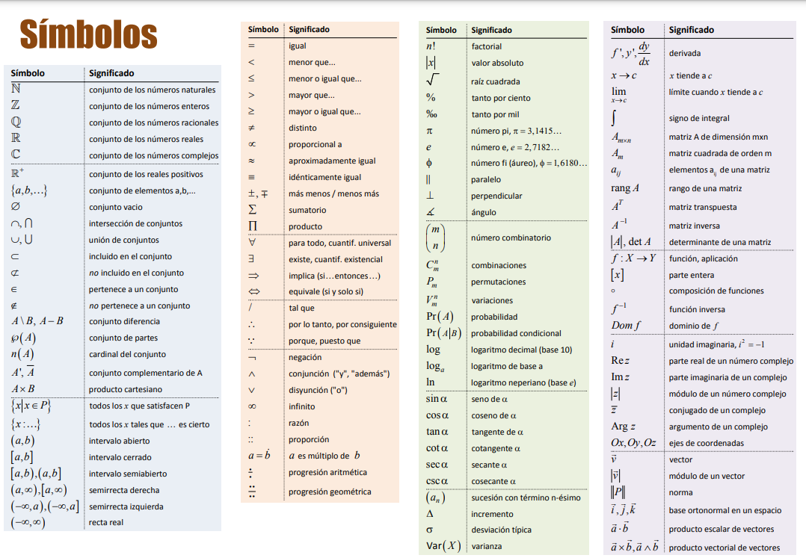
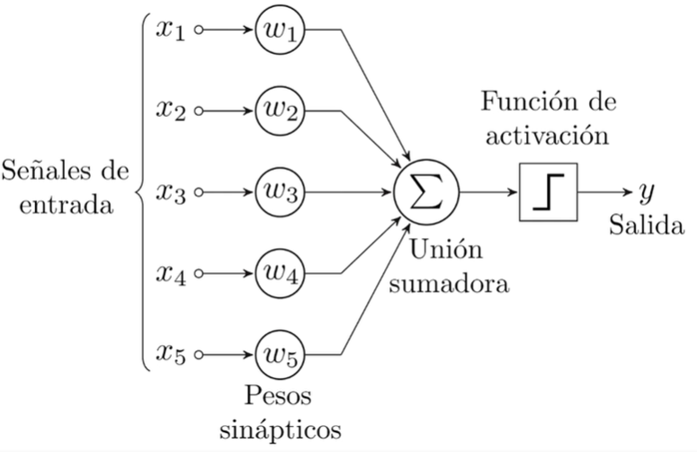

# Funciones Matemáticas para Data Science e Inteligencia Artificial

## 1. Basico

### 1.1. ¿Qué es una función?

En matematicas una función es la relación de los elemento de un conjunto llamado **"Dominio"** asignados por una unica vez a otro conjunto llamado "**Imagen**" siguiente una "**Regla de correspondencia**".

#### Ejemplo

Tomemos como ejemplo la función $ f(x) = x^2 $

* Para $ x = 1,\ f(1) = 2(1) + 3 = 5 $.
* Para $ x = 2,\ f(2) = 2(2) + 3 = 7 $.

### 1.2. Tipos de variables

- **Variables Cualitativas**
  - **Nominales**
    - No tienen un orden específico.
    - Ejemplos:
      - Color de ojos
      - Género
  - **Ordinales**
    - Tienen un orden o jerarquía.
    - Ejemplos:
      - Clasificación en competiciones
      - Niveles de satisfacción
  - **Binarios**
    - Puede ser 1 o 0

- **Variables Cuantitativas**
  - **Discretas**
    - Toman valores específicos y contables.
    - Ejemplos:
      - Número de hijos
      - Resultados de lanzar un dado
  - **Continuas**
    - Pueden tomar cualquier valor dentro de un rango.
    - Ejemplos:
      - Altura
      - Peso

### 1.3. Dominio y rango de una función

#### Dominio

Son todos los valores que toma $X$ y que estan definidos en la función $f(X).$

#### Rango

Son todos los reultados que puede tener la función.

### 1.4. Cómo leer las matemáticas: Símbolos generales

### 1.5. Cómo leer las matemáticas: Conjuntos

1. Símbolos Básicos
   - **$\{\}$** : Llaves que indican un conjunto. Ejemplo: $\{1, 2, 3\}$ representa el conjunto con los elementos 1, 2 y 3.
   - **$\in$** : Indica que un elemento pertenece a un conjunto. Ejemplo: $3 \in \{1, 2, 3\}$ significa que $3$ es un elemento de $\{1, 2, 3\}$.
   - **$\notin$** : Indica que un elemento *no* pertenece a un conjunto. Ejemplo: $4 \notin \{1, 2, 3\}$.

2. Tipos de Conjuntos
   - **Conjunto vacío** ($\emptyset$): Un conjunto sin elementos. Ejemplo: $\{\}$ o $\emptyset$.
   - **Conjunto de números naturales** ($\mathbb{N}$): Generalmente, $\mathbb{N} = \{1, 2, 3, \dots\}$.
   - **Conjunto de números enteros** ($\mathbb{Z}$): Incluye números negativos, cero y positivos, es decir, $\mathbb{Z} = \{\dots, -2, -1, 0, 1, 2, \dots\}$.
   - **Conjunto de números reales** ($\mathbb{R}$): Todos los números en la recta numérica, tanto racionales como irracionales.
   - **Conjunto de números racionales** ($\mathbb{Q}$): Números que pueden expresarse como fracciones.

3. Operaciones con Conjuntos
   - **Unión** ($\cup$): Todos los elementos que están en uno u otro conjunto. Ejemplo: Si $A = \{1, 2\}$ y $B = \{2, 3\}$, entonces $A \cup B = \{1, 2, 3\}$.
   - **Intersección** ($\cap$): Elementos comunes en ambos conjuntos. Ejemplo: Si $A = \{1, 2\}$ y $B = \{2, 3\}$, entonces $A \cap B = \{2\}$.
   - **Diferencia** ($\setminus$): Elementos que están en un conjunto pero no en el otro. Ejemplo: Si $A = \{1, 2\}$ y $B = \{2, 3\}$, entonces $A \setminus B = \{1\}$.
   - **Complemento** ($A^c$): Todos los elementos que no están en el conjunto $A$, en relación a un conjunto universal $U$.

4. Subconjuntos
   - **Subconjunto** ($\subseteq$): Un conjunto $A$ es subconjunto de $B$ si todos los elementos de $A$ están en $B$. Ejemplo: $\{1, 2\} \subseteq \{1, 2, 3\}$.
   - **Subconjunto propio** ($\subset$): Un conjunto $A$ es subconjunto propio de $B$ si $A \subseteq B$ y $A \neq B$.
   - **Conjunto potencia** ($\mathcal{P}(A)$): Conjunto de todos los subconjuntos posibles de $A$. Ejemplo: si $A = \{1, 2\}$, entonces $\mathcal{P}(A) = \{\emptyset, \{1\}, \{2\}, \{1, 2\}\}$.

5. Notación Especial de Conjuntos
   - **Notación por comprensión**: Expresa un conjunto usando una propiedad. Ejemplo: $\{ x \in \mathbb{N} \mid x > 5 \}$ representa el conjunto de números naturales mayores que $5$.
   - **Conjunto unitario**: Un conjunto con un solo elemento. Ejemplo: $\{a\}$.

## 2. Todo Sobre Funciones

### 2.1. Tipos de Funciones

[Enlace a Google Colab](https://drive.google.com/file/d/1i5Rn3uP_Edv3U4pEDRDMQllP-eQNI5ha/view?usp=sharing)

### 2.2. Manipulación de Funciones

[Enlace a Google Colab](https://drive.google.com/file/d/1oQ9pN82eSHe1GPOX3dx4b7oALUMs0mPo/view?usp=drive_link)

### 2.3. Características de Funciones

_Se les llama funciones reales porque tanto su dominio como el codominio (recuerda que al codominio también se le puede llamar rango o imagen) están contenidos en el conjunto de los números reales. Es decir, el conjunto que contiene a los números racionales e irracionales._

#### 2.3.1. Función Par
Una función es par si cumple la relación:
$$ f(x) = f(-x) $$
Esto significa que es **simétrica al eje Y**. Por ejemplo, una parábola es una función par.

#### 2.3.2. Función Impar
Una función es impar si cumple:
$$ f(-x) = -f(x) $$
Esto indica **simetría al eje X**. Un ejemplo de función impar es una función cúbica.

#### 2.3.3. Función Acotada
Una función es acotada si su **codominio** se encuentra entre dos valores. Existe un número \( m \) tal que para todo valor en el dominio de la función:
$$ |f(x)| \leq m $$
Ejemplo: Las funciones seno y coseno están acotadas en el intervalo \([-1, 1]\).

#### 2.3.4. Funciones Monótonas
Una función es monótona si no presenta variaciones en su crecimiento o decrecimiento dentro de un intervalo \( I \) de los números reales:

1. **Monótona y estrictamente creciente**: Si \( x_1 < x_2 \Rightarrow f(x_1) < f(x_2) \)
2. **Monótona y estrictamente decreciente**: Si \( x_1 < x_2 \Rightarrow f(x_1) > f(x_2) \)
3. **Monótona y creciente**: Si \( f(x_1) \leq f(x_2) \) cuando \( x_1 < x_2 \)
4. **Monótona y decreciente**: Si \( f(x_1) \geq f(x_2) \) cuando \( x_1 < x_2 \)

#### 2.3.5. Funciones Periódicas
Son funciones que se repiten cada cierto período \( T \), cumpliendo la relación:
$$ f(x + T) = f(x) $$
Ejemplo: Las funciones seno y coseno son periódicas con un periodo \( T = 2\pi \).

#### 2.3.6. Funciones Cóncavas y Convexas
- **Función Convexa**: Dentro de un intervalo, “abre hacia arriba”.
- **Función Cóncava**: Dentro de un intervalo, “abre hacia abajo”.

Puedes analizar la **segunda derivada** de la función para determinar la concavidad de forma analítica.

## 3. Funciones en Ciencias de Datos

### 3.1. Perceptron

[Paper del Perceptron](https://drive.google.com/file/d/1PwEczfFqF8sfx_-zAWFwjXB0QDv0ldQA/view?usp=sharing)

### 3.2. Funciones de activación

_En un perceptrón, una función de activación es una transformación matemática que toma la suma ponderada de las entradas y determina la salida de la neurona. Su propósito es introducir no linealidad, permitiendo que el modelo aprenda relaciones complejas. Sin ella, el perceptrón solo podría modelar relaciones lineales. Las funciones de activación comunes son sigmoide, ReLU y tangente hiperbólica._

[Enlace](https://drive.google.com/file/d/1WxXn_xFdahWnls83Va4wqJAhZG0AKDm0/view?usp=sharing)