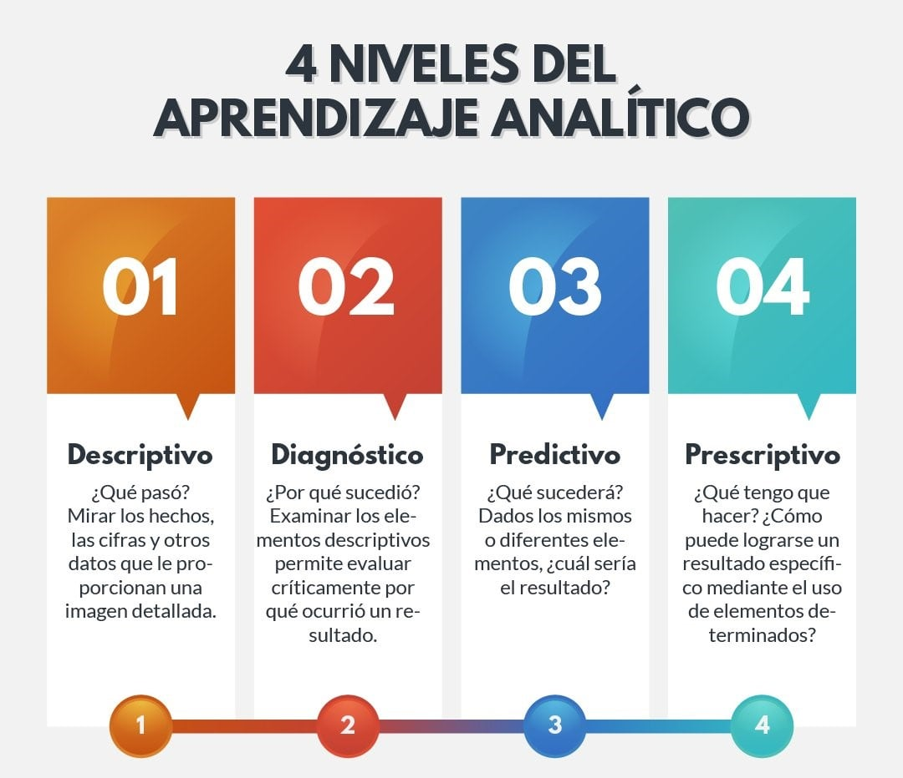
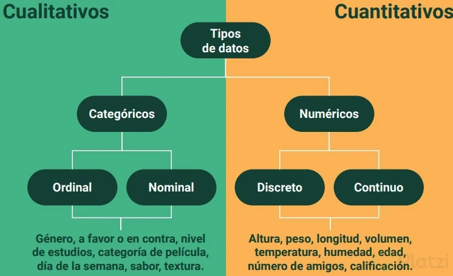
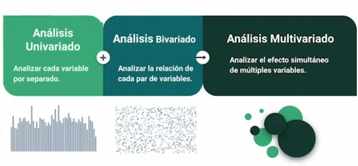

# Análisis explortorio de datos

El Análisis Exploratorio de Datos (EDA) es el proceso de conocer en detalle, darle sentido a los datos, visualizarlo por primera vez y ver como se comportan, cuantas variables existen, de que tipo son, indagar en ellos haciendo preguntas. En este proceso vamos a determinar como tratarlos, interrogarlos para obtener las respuestas necesarias y de esa manera transformarlo en información útil para la empresa o para resolver el problema al que te enfrentas.

## ¿Cómo hacer un análisis exploratorio de datos?

Con el análisis exploratorio de datos, vamos a poder:

* Organizar y entender las variables
* Establecer relaciones entre las variables
* Encontrar patrones ocultos en los datos
* Ayuda a escoger el modelo correcto para la necesidad correcta
* Ayuda a tomar decisiones informadas

### Pasos de una Análisis Exploratorio de Datos

#### Hacer preguntas sobe los datos

Hazte las siguientes preguntas para guiar el EDA:
* Que te gustaria encontrar?
* Que quisieras saber de los datos?
* Cual es la razon para realizar el analisis?

#### Determinar el tamaño de los datos

Debes responder preguntas como:
* Cuantas observaciones existen?
* Cuantas variables hay?
* Necesito todas las observaciones?
* Necesito todas las variables?

#### Categorizar las variables

Debes preguntarte:
* Cuantas variables categóricas existen?
* Cuantas variables continuas existen?
* Como puedo explorar cada variable dependiendo de su categoría?

#### Limpieza y validación de los datos

En ese paso debes preguntarte:
* Tengo valores faltantes?
* Cual es la proporción de datos faltantes?
* Como puedo tratar a los datos faltantes?
* Cual es la distribución de los datos?
* Tengo valores atipicos?

#### Establecer relaciones entre los datos

Responde preguntas como:
* Existe algun tipo de relacion entre mi variable X y Y?
* Que pasa ahora si considero la variable Z en el analisis?
* Que significa que las observaciones se agrupen?
* Que significa el patron que se observa?

## Tipos de análisis de datos

## Tipos de datos y análisis de variables

En algunos casos puedes cambiar el tipo de datos, dependiendo del analisis que requiero hacer.

### Tipo de Análisis

## Recolección de datos, limpieza y validación

> La recolección de datos es la forma de recolectar información que permite obtener conocimiento de primera mano e ideas originales sobre el problema de investigación

### Tipos de Recolección de Datos

* Primaria: Datos colectados de primera mano a traves de encuestas, entrevistas, experimentos y otros. Puedes decidir que recolectas y que quiere medir. Tienes total control de los datos.
* Secundaria: Datos previamente recolectados por una fuente primaria externa al usuario primario. Son datos abiertos que puedes utilizar. No tienes control sobre lo que se mide o sobre el objetivo del estudio
* Terciaria: Datos que se adquieren de fuentes completamente externas al usuario primario. Son datos accesibles a todo el mundo por lo que pierde su valor y tienden a ser datos genericos

### Validación y limpieza de los datos

Es el proceso de asegurar la consistencia y precisión dentro de un conjunto de datos. Para asegurar la consistencia de los datos debemos validar:

**1. Modelo de datos:** si un tercero recolecto los datos, verifica que preguntas queria responder con los datos. Si eres quien recolecta los datos, hazte muchas preguntas y considera si esos datos son suficientes para responderlas

**2. Seguimiento de formato estándar de archivos:** verifica que la extensión de los archivos que estas manejando correspondan con el formato interno que tienen. Asegurate que los numeros se expresen en el formato que estas trabajando.

**3. Tipos de Datos:** verifica que los datos esten del tipo que se indica en el dataset

**4. Rango de variables:** verifica que las variables estén dentro del rango establecido en la recoleccion de datos. En caso de encontrar variables fuera del rango preguntate: como llegaron esos datos aqui? tienen algun significado alterno? debo preservarlos o eliminarlos?

**5. Unicidad:** verifica que tan unicos son los datos. detecta si existe duplicidad en los datos y corrige.

**6. Consistencia de expresiones:** se refiere a como la persona que recolecta los datos define sus variables. Formato de fecha, de hora, variables escritas de la misma forma en toda la tabla. No son datos erroneos, solo es cuestion de darle el formato adecuado.

**7. Valores nulos:** pueden estar explicitos o implicitos en el dataset. Son datos faltantes. Porque esta vacio? puedo rellenarlo con otro dato? esta vacio por un proceso aleatorio o tiene un sentido?

## Deepnote de practicas

Estas notas van acompañadas de este EDA que se encuentra en Deepnote

[Notebook de practicas](./Ejercicios/3.EDA_de_dataset_pinguins.ipynb)

1. Colecta de datos
2. Validación de datos

### Análisis Univariado

1. Conteos y proporciones
2. Medidas de tendencia central
3. Medidas de dispersión
4. Estadística descriptiva aplicada: distribuciones

    * Funcion de Probabilidad de masas (PMFs)
    Nos dice la probabilidad de que una variable aleatoria discreta tome un valor determinado. Ejemplo, la probabilidad de que en un salon hayan personas con una edad especifica

    * Funcion de Distribucion Acumulada (CDFs)
    Devuelve la probabilidad de que una variable sea igual o menor que un valor determinado. Ejemplo, la probabilidad de que en un salon hayan personas menores o iguales a una edad especifica.

    * Función de Probabilidad de Densidad (PDFs)
    Determine la probabilidad de que una variable continua tome un valor determinado. Ejemplo, la probabilidad de que en el salón hayan personar con una altura especifica

5. Teorema de los grandes números:

    La probabilidad experimental tiende a la probabilidad teorica a medida que aumenta el numero de repeticiones del experimento. Es muy util cuando no se conoce la probabilidad teorica de un evento y tenemos la capacidad de aumentar la muestra. Mediante este teorema, al incrementar la muestra la probabilidad experimental al final se convertira en la probabilidad teorica.
    > Esto significa a que si tienes una probabilidad al inicio, y si aumenta la muestra, esta probabilidad va a seguir siendo la misma

6. Teorema del Limite Central:

    La media de las muestras tiende aproximadamente a una distribución normal
    La suma de n variables aleatorias independientes con medias y varianzas finitas converge en distribucion a una variable aleatoria normal

### Análisis Bivariado

Nos permite ver la relación que hay entre 2 variables y visualizar como afecta una a la otra

1. Graficos para el análisis bivariado
2. Matrices de correlación
3. Impacto de la relación
    > Si bien es cierto que el coeficiente de correlación nos ayuda a saber si existe una relación entre 2 variables pero no sabemos el impacto de de esta relación, es decir si tenemos 2 variables x, y , si cambiamos o aumentamos el valor de x que tanto aumentaria el valor de y, a esto le llamamos la fuerza o el impacto de la relación, y se hace mediante una ecuación o análisis d eregresión simple, que es representada por una recta en el gráfico, si la recta es más empinada significa que hay un mayor impacto.

4. Análisis de regresión simple
5. Limitaciones de regresión simple
    * La regresión lineal simple de A-B no es la misma que B-A.
    * Si dos variables crecen o decrecen siguiendo las mismas pautas, no implica necesariamente que una cause a la otra.
    * Solo puede manejar relaciones lineales y no maneja relaciones como parabolas.

### Análisis Multivariado

1. Análisis de regresión multiple
    > Se utiliza para predecir una variable numérica continua basada en dos o más variables predictoras continuas o categóricas.

2. Visualización de regresión múltiple
3. Análisis de regresión lógica
    > Se utiliza para predecir la probabilidad de que ocurra un evento binario (por ejemplo, sí/no, 1/0) basado en una o más variables predictoras continuas o categóricas.

4. Paradoja de Simpson:
    > Fenómeno en el cual es posible concluir dos cosas totalmente opuestas a partir de los mismos datos, dependiendo el como se clasifican estos, en el caso de deppnote vimos una regresión multiple muy distinta a cuando colocamaos especies, y a esto se le llama la paradoja de simpson

5. Visuaalización de datos
    * <https://www.data-to-viz.com/>
    * <https://datavizproject.com/>

### Que hacer cuando tengo muchas variables?

Cuando se tiene muchas variables, un analisis de pares de variables puede ser confuso por lo que tenemos que recurrir a tecnicas que nos ayudan a entender la variacion de todos los datos de manera simple: Reduciendo las dimensiones para obtener un unico espacio (Pasar de 10 variables a solo 2). Algunas de estas tecnicas son:

* Analisis de Componentes Principales (PCA): un ejemplo de utilidad es la demostracion de que los genes reflejan la geografia de Europa
* TSNE (T - Distributed Stochastic Neighbor Embedding): Separacion de todos los tipos de cancer
* UMAP (Uniform Manifold Approximation and Projection for Dimension Reduction): intenta capturar la estructura global preservando la estructura local de los datos utlizando proyecciones en un plano
* Comparacion: algoritmo de reduccion de dimension vs conjunto de datos

## Conclusiones

* Las preguntas son la fuente de toda exploracion. Asegurate de definir qué quieres encontrar y quien necesita consultar los resultados desde un comienzo del EDA.
* Es fundamental identificar el tipo de analisis de datos y variables que se requieren. Explora las dimensiones de tu conjunto de datos y qué tipo de variables contienen.
* Siempre visualiza los estadisticos. Todos los conjuntos de datos son diferentes, concelos mas alla de sus numeros de resumen
* Visualiza una o varias variables de distintas maneras. La diversidad de graficas te permitira conocer a detalle los matices de los datos

## Resumen

1. ¿Qué es y para qué sirve el análisis exploratorio de datos?

    > *Proceso de conocer a detalle tus datos, darle sentido. Determinar como tratarlos. Hacer preguntas y transformarlo en información util*

2. Conocer el origen de tus datos es vital para:

    >* Saber si los datos son confiables
    >* Entender porque se colectaron los datos y que buscaban responder
    >* Poder realizar preguntas mas detalladas sobre lo que quieres buscar o encontrar en tus datos

3. ¿Cuáles son los tipos de recolección de datos?

    > *Primaria, Secundaria y terciaria*

4. ¿Cuáles son los tipos de recolección de datos?

    >* Encontrar patrones ocultos en los datos
    >* Establecer relaciones entre las variables
    >* Escoger el modelo correcto para la necesidad correcta
    >* Organizar y entender las variables

5. ¿Cuáles son los pasos principales al realizar un análisis exploratorio de datos?

    > *Hacer preguntas; Determinar el tamaño de los datos, Categorizar las variables; Limpieza y validación de datos; Establece relaciones; y comunicar resultados*

6. ¿Qué son las proporciones?

    > Relación de correspondencia entre las partes y el todo.

7. ¿Qué es la Ley de los Grandes numéros?

    > La probabilidad experimental tienda a la probabilidad teórica a medidad que aumente el número de repeticiones del experimento

8. ¿Qué nos indica la función de probabilidad de masas (PMFs?)

    > Nos indica la probabilidad de que una variable aleatoria discreta tome un valor determinado

9. ¿Para qué sirven las medidas de tendencia central?

    > Para representar una distribución o un conjunto de datos a un único valor. Su objetivo es proveer una forma acertada de describir todos los datos en la distribución

10. ¿Que elementos no permite visualizar una distribución?

    > Medidas de tendencia central

11. ¿Qué cuantifica un coeficiente de correlación?

    > Cuanatifica la intensidad de relación entre dos variabales en un análisis de correlación

12. Una característica extra de los coeficientes de correlación es que nos habla del impacto de la relación. ¿Esto es verdadero o falso?

    Falso

13. ¿Qué significa que exista una correlación entre dos variables?

    > Expresa hasta que punto dos variables estan relacionadaas entre si. Es decir, si cambian cambian conjuntamente

14. En un análisis de regresión múltiple siempre es mejor incluir más variables explicativas.

    > Falso, más datos no garaanatizan mejores resultados. Puede ser contraproducente.

15. Un análisis de regresión múltiple nos permite incluir variables categóricas. ¿Verdadero o falso?

    > Verdadero

16. El modelo de regresión logística nos puede ayudar a modelar un evento binario con sencillez. ¿Es verdad o falso?

    > Verdadero

17. Visualizar y explorar tus datos es fundamental y puede ___.

    > Verificar relaciones entre variables, ahorrar tiempo de trabajo extra, permitir tomar decisioens informadas

18. Existe una infinidad de visualizaciones y estadísticos que puedes utilizar al momento de realizar un análisis exploratorio. ¿Cuál es más importante?

    > Las preguntas, las visualizaciones y los estadísticos son solo medio de transición