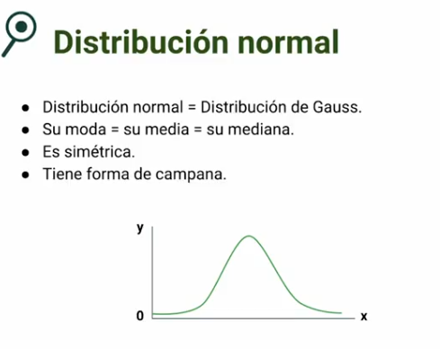

# Estadística Inferencial para Data Science e Inteligencia Artificial

> 1. Fundamentos de Estadística Inferencial

## 1.1. Estadística inferencial vs. descriptiva

---

### Estadística descriptiva

* Nos ayuda a entender, describir nuestros datos, arregla los datos de forma que
puedan ser analizados e interpretados.

* Podemos saber la tendencia central, la variabilidad y la distribución.

### Estadística inferencial

* Parte de la estadística que busca predecir o deducir
características o resultados esperados de una población,
basados en los datos obtenidos de una muestra de esa
población.

* Muestreo, intervalo de confianza, validación de hipotesis y evitar sesgos.

## 1.2. Estadísticos Principales

---

### Experimento

Procedimiento que puede repetirse infinitamente y tiene un conjunto bien definido de resultados posibles, conocido como espacio muestral.

* Aleatorio: si tiene más de un resultado posible.
* Determinista: si solo tiene un resultado posible.

### Población y muestra

Muestra: subconjunto de datos perteneciente a una población.

Condiciones:

* Número suficiente de registros para ser estadísticamente significativo.
* Representación no sesgada de la información total.

### Evento

Cada uno de los posibles resultados del experimento.

### Variable

Es una característica que puede obtener diferentes valores.

**Tipos:**

* Cualitativas: atributos (no medibles).
* Cuantitativas: números (medibles).
    * Discretas
    * Continuas

### Probabilidad

Mide qué tan posible es que ocurra un evento determinado.
EI análisis de los eventos probabilísticos se denomina **estadística.**

### Probabilidad condicionada

Posibilidad de que ocurra un evento como consecuencia de que otro evento haya sucedido.

## 1.3. Distribución Normal
---

Tienen forma de campana y es almedio donde se concentra la mayor población.

## 1.4. Muestreo y Teorema del Límite Central
---

### **¿Qué son las muestras y por qué son importantes?**

La estadística nos permite comprender y analizar fenómenos complejos mediante el estudio de poblaciones y muestras. Una muestra es un subconjunto representativo de una población más grande que se utiliza para derivar conclusiones. Sin embargo, no todas las muestras son iguales. Deben cumplir dos condiciones: ser estadísticamente significativas, es decir, lo suficientemente grandes para sacar conclusiones válidas, y no estar sesgadas, abarcando una diversidad de atributos dentro de la población.

### **¿Cuáles son los tipos principales de muestreo?**
Existen varios métodos de muestreo que se adaptan a diferentes objetivos y tipos de estudios. Entre los principales se encuentran:

* **Muestreo aleatorio simple:** Cada miembro de la población tiene la misma probabilidad de ser seleccionado. Un ejemplo clásico es una lotería, donde todos los números tienen igual oportunidad de ganar.

* **Muestreo sistemático:** Los sujetos se seleccionan siguiendo un intervalo o regla preestablecida. Por ejemplo, premiar a cada 100 personas o a quien envíe un mensaje a una hora específica.

* **Muestreo estratificado:** Se basa en segmentar la población en categorías o variables específicas, y luego se toma una muestra de cada segmento. Por ejemplo, seleccionar individuos por grupos de edad o país de origen para obtener conclusiones dentro de esa categoría.

* **¿Qué es el teorema del límite central?**

El teorema del límite central es un concepto fundamental en estadística que describe cómo, al repetir un experimento muchas veces, la distribución de la media de las muestras se aproxima a una distribución normal, sin importar la distribución original de la población. Esto es especialmente útil en la práctica, ya que permite hacer inferencias precisas sobre una población a partir de muestras.

Por ejemplo, si lanzamos una moneda mil veces, es probable que las caras y las cruces se distribuyan de manera similar, reflejando una forma de campana con mayor densidad en el centro.

## 1.5. Funciones de Muestreo en Python
---

[Notebook](https://colab.research.google.com/drive/1Jj-LoQ876bYY7ulr5eLTqskhAO5xXisF?usp=sharing)

> 2. Estadísticas y Cálculo

## 2.1. Media Muestral y Media Poblacional
---

### **Media Poblacional (μ)**
La **media poblacional** es el **promedio de todos los valores** en una población completa. Se denota con la letra griega **μ (mu)** y se calcula con la fórmula:

$$ \mu = \frac{\sum X_i}{N} $$

Donde:
- $X_i$ son los valores individuales de la población.
- $N$ es el tamaño total de la población.

✅ **Ejemplo**: Si en una población de 5 personas sus edades son **20, 25, 30, 35 y 40**, la media poblacional es:
$$ \mu = \frac{20+25+30+35+40}{5} = 30 $$

### **Media Muestral ($\bar{X}$)**
La **media muestral** es el **promedio de los valores en una muestra extraída de la población**. Se denota con **$\bar{X}$ (X barra)** y se calcula como:

$$ \bar{X} = \frac{\sum x_i}{n} $$

Donde:
- $x_i$ son los valores individuales de la muestra.
- $n$ es el tamaño de la muestra ($n < N$).

✅ **Ejemplo**: Si tomamos una muestra de 3 personas con edades **20, 30 y 40**, la media muestral sería:
$$ \bar{X} = \frac{20+30+40}{3} = 30 $$

## 2.2. Varianza y Desviación Estándar Muestral y Poblacional
---

### **Varianza Poblacional ($\sigma^2$)**
La **varianza poblacional** mide la dispersión de los datos respecto a la **media poblacional (μ)**. Se calcula como:

$$ \sigma^2 = \frac{\sum (X_i - \mu)^2}{N} $$

Donde:
- $X_i$ son los valores individuales de la población.
- $\mu$ es la media poblacional.
- $N$ es el tamaño total de la población.

✅ **Ejemplo**: Si la población tiene los valores **2, 4, 6, 8, 10**, la media es $\mu = 6$, y la varianza poblacional es:
$$ \sigma^2 = \frac{(2-6)^2 + (4-6)^2 + (6-6)^2 + (8-6)^2 + (10-6)^2}{5} = 8 $$

### **Varianza Muestral ($s^2$)**
La **varianza muestral** estima la dispersión de los datos en una muestra respecto a la **media muestral ($\bar{X}$)**. Su fórmula es:

$$ s^2 = \frac{\sum (x_i - \bar{X})^2}{n-1} $$

Donde:
- $x_i$ son los valores de la muestra.
- $\bar{X}$ es la media muestral.
- $n$ es el tamaño de la muestra.

⚠ **¿Por qué se divide entre $n-1$ en lugar de $n$?**
- Usar $n$ **subestima** la varianza real de la población porque la muestra tiene menos variabilidad que la población completa.
- Dividir entre $n-1$ corrige este sesgo y hace que **la varianza muestral sea un estimador insesgado de la varianza poblacional**.

✅ **Ejemplo**: Si tomamos la muestra **2, 4, 6, 8**, la media es $\bar{X} = 5$, y la varianza muestral es:
$$ s^2 = \frac{(2-5)^2 + (4-5)^2 + (6-5)^2 + (8-5)^2}{4-1} = 6.67 $$

### **Desviación Estándar Poblacional ($\sigma$) y Muestral (s)**
La **desviación estándar** es la raíz cuadrada de la varianza:
- **Poblacional**: $\sigma = \sqrt{\sigma^2}$
- **Muestral**: $s = \sqrt{s^2}$

✅ **Ejemplo**: Para la varianza muestral de **6.67**, la desviación estándar es:
$$ s = \sqrt{6.67} \approx 2.58 $$

## 2.3. Varianza y desviación estándar muestral en Python
---
[Enlace de Google Colab](https://colab.research.google.com/drive/1tYkI-Fg1o2rgdQU7jToEyRTBH1VB_Lr6?usp=sharing)

## 2.4. Intervalo de Confianza y Nivel de Significación
---

### **Intervalo de Confianza (IC)**
El **intervalo de confianza** es un rango de valores dentro del cual se espera que esté el **parámetro poblacional** (como la media) con una cierta probabilidad. Se calcula como:

$$ IC = \bar{X} \pm Z \cdot \frac{s}{\sqrt{n}} $$

Donde:
- $\bar{X}$ es la **media muestral**.
- $Z$ es el valor crítico de la distribución normal para el nivel de confianza.
- $s$ es la **desviación estándar muestral**.
- $n$ es el **tamaño de la muestra**.

✅ **Ejemplo**: Si la media muestral es **50**, la desviación estándar es **10**, el tamaño de la muestra es **100** y queremos un **95% de confianza** (Z = 1.96):
$$ IC = 50 \pm 1.96 \cdot \frac{10}{\sqrt{100}} = 50 \pm 1.96 \cdot 1 = (48.04, 51.96) $$

Esto significa que con un **95% de confianza**, la verdadera media poblacional está entre **48.04 y 51.96**.

### **Nivel de Significación ($\alpha$)**
El **nivel de significación** es la probabilidad de cometer un **error tipo I** (rechazar una hipótesis nula cuando es verdadera). Se define como:

$$ \alpha = 1 - \text{Nivel de confianza} $$

✅ **Ejemplo**:
- Si usamos un **nivel de confianza del 95%**, el **nivel de significación** es:
$$ \alpha = 1 - 0.95 = 0.05 $$
- Esto significa que hay un **5% de probabilidad de error** al rechazar la hipótesis nula.

📌 **Notas:** La hipótesis nula es la suposición inicial, y el error tipo I es el riesgo de equivocarse al rechazarla incorrectamente.

### **Relación entre IC y $\alpha$**
- **A mayor nivel de confianza (99%)**, el intervalo de confianza es **más amplio** y $\alpha$ es **menor**.
- **A menor nivel de confianza (90%)**, el intervalo de confianza es **más estrecho** y $\alpha$ es **mayor**.

| **Nivel de Confianza** | **Valor Z** | **Nivel de Significación ($\alpha$)** |
| ---------------------- | ----------- | ------------------------------------- |
| 90%                    | 1.645       | 0.10                                  |
| 95%                    | 1.96        | 0.05                                  |
| 99%                    | 2.576       | 0.01                                  |

📌 **Conclusión**: El intervalo de confianza proporciona un rango de estimación, mientras que el nivel de significación mide el riesgo de error al tomar decisiones estadísticas.

## 2.5. Índice Z: Cálculo y Significado
---

### **¿Qué es el Índice Z?**
El **índice Z** (o **puntaje Z**) es una medida que indica cuántas **desviaciones estándar** está un valor respecto a la **media de la distribución**. Se utiliza para estandarizar datos y comparar valores en distintas distribuciones.

Se calcula con la fórmula:

$$ Z = \frac{X - \mu}{\sigma} $$

Donde:
- $X$ es el valor a evaluar.
- $\mu$ es la **media poblacional**.
- $\sigma$ es la **desviación estándar poblacional**.

✅ **Ejemplo**: Si en una población con media $\mu = 50$ y desviación estándar $\sigma = 10$, un individuo tiene un valor de **70**:
$$ Z = \frac{70 - 50}{10} = \frac{20}{10} = 2 $$
Esto significa que **70 está a 2 desviaciones estándar por encima de la media**.

### **Cómo escoger el Índice Z en la Tabla Z**
Como vimos anteriormente es importante el índice z porque nos ayuda a calcular los valores del intervalo de confianza

#### **Pasos para usar la Tabla Z**:
1. Se busca el intervalo de confianza en la tabla sumado con el nivel de significacia de la izquierda, es decir si el IC es de 95% entonces a la izquierda habra 2.5%, entonces hay que buscar 0.975.
2. La primera  columna nos muestra el entero y el primer decimal del índice Z
3. La cabecera indica el segundo decimal, si buscar 0.975 entonces el indice z sera +-1.96

## 2.6 Intervalo de confianza en Python
---

[Notebook de Colab](https://colab.research.google.com/drive/1j05yelau9o4IufNBTqCeUNtpEHvpCltM?usp=sharing)

> 3. Prueba de Hipotesis y Validación

## 3.1. Prueba de Hipótesis
---

### **¿Qué es una Prueba de Hipótesis?**
Una **prueba de hipótesis** es un procedimiento estadístico para tomar decisiones sobre una población basándose en una muestra. Se usa para determinar si hay suficiente evidencia para **aceptar o rechazar una afirmación** sobre un parámetro poblacional.

### **Pasos en una Prueba de Hipótesis**
1. **Formular las hipótesis:**
   - **Hipótesis nula (H₀):** Es la afirmación que se quiere probar. Se asume verdadera hasta que se demuestre lo contrario.
   - **Hipótesis alternativa (H₁):** Es la afirmación opuesta a H₀ y se acepta si hay suficiente evidencia contra H₀.

2. **Elegir el nivel de significación ($\alpha$)**:
   - Comúnmente **0.05 (5%)** o **0.01 (1%)**.
   - Representa la probabilidad de rechazar H₀ cuando es verdadera (**error tipo I**).

3. **Seleccionar la prueba estadística adecuada:**
   - **Prueba Z** (cuando la población tiene distribución normal y se conoce la varianza poblacional).
   - **Prueba t** (cuando la población tiene distribución normal, pero la varianza es desconocida).
   - **Pruebas chi-cuadrado y ANOVA** para otros escenarios.

4. **Calcular el estadístico de prueba y el valor p:**
   - Se calcula el estadístico de prueba con la muestra.
   - Se obtiene el **valor p**, que indica la probabilidad de obtener los resultados observados si H₀ es cierta.

5. **Tomar una decisión:**
   - Si **valor p ≤ $\alpha$** → Se **rechaza** H₀ (hay evidencia suficiente para aceptar H₁).
   - Si **valor p > $\alpha$** → No se rechaza H₀ (no hay evidencia suficiente contra H₀).

### **Ejemplo de Prueba de Hipótesis**
**Situación:** Se quiere probar si el tiempo promedio de atención en una tienda es **menor a 10 minutos**.

- **H₀:** El tiempo promedio de atención es **10 minutos o más**.
- **H₁:** El tiempo promedio de atención es **menor a 10 minutos**.
- Se toma una muestra y se encuentra que la media muestral es **9 minutos**, con una desviación estándar de **2 minutos** y tamaño de muestra de **30 clientes**.
- Se usa una **prueba t** para comprobar si la diferencia es estadísticamente significativa.
- Si el **valor p** calculado es **0.03** y el nivel de significación es **0.05**, entonces **se rechaza H₀**, concluyendo que el tiempo promedio es menor a 10 minutos con un **95% de confianza**.

### **Errores en la Prueba de Hipótesis**
| **Tipo de Error**           | **Descripción**                                   |
| --------------------------- | ------------------------------------------------- |
| **Error Tipo I ($\alpha$)** | Rechazar H₀ cuando es verdadera (falso positivo). |
| **Error Tipo II ($\beta$)** | No rechazar H₀ cuando es falsa (falso negativo).  |

📌 **Conclusión**: La prueba de hipótesis es una herramienta clave para la toma de decisiones estadísticas, permitiendo evaluar la validez de afirmaciones sobre una población con base en una muestra.

## 3.2. Tipos de Pruebas de Hipótesis
---

### **1️⃣ Prueba Z**

Se usa cuando la muestra es grande (n > 30) y la población sigue una distribución normal con varianza conocida.

📌 **¿Cuándo usarlo?**
- Comparar una media muestral con una media poblacional.
- Evaluar diferencias entre dos proporciones.

✅ **Ejemplo:** Determinar si la altura promedio de una población es diferente de 1.70m con una muestra de 50 personas.

### **2️⃣ Prueba t (t de Student)**

Se usa cuando la muestra es pequeña (n < 30) y la varianza poblacional es desconocida.

📌 **¿Cuándo usarlo?**
- Comparar la media de una muestra con la media poblacional.
- Comparar dos medias de muestras independientes o relacionadas.

✅ **Ejemplo:** Evaluar si el rendimiento de un grupo de estudiantes cambió después de aplicar una nueva metodología de enseñanza.

### **3️⃣ Prueba Chi-Cuadrado (χ²)**

Se usa para analizar **relaciones entre variables categóricas** (cualitativas).

📌 **¿Cuándo usarlo?**
- Comparar **frecuencias observadas vs. esperadas** en una tabla de contingencia.
- Evaluar si hay **asociación** entre dos variables cualitativas.

✅ **Ejemplo:** Determinar si el color de un producto influye en la decisión de compra de los clientes.

### **4️⃣ ANOVA (Análisis de Varianza)**

Sirve para comparar las medias de **más de dos grupos**.

📌 **¿Cuándo usarlo?**
- Comparar tres o más tratamientos o condiciones experimentales.
- Determinar si las diferencias entre grupos son estadísticamente significativas.

✅ **Ejemplo:** Evaluar si hay diferencias en la productividad de empleados según el turno de trabajo (mañana, tarde, noche).

### **5️⃣ Coeficiente de Correlación de Pearson (r)**

Mide la **relación lineal** entre dos variables cuantitativas.

📌 **¿Cuándo usarlo?**
- Analizar si existe una relación positiva o negativa entre dos variables numéricas.

✅ **Ejemplo:** Determinar si existe relación entre el número de horas de estudio y la calificación obtenida en un examen.

### **Resumen de Cuándo Usar Cada Prueba**

| **Prueba**                 | **¿Cuándo usarla?**                                       |
| -------------------------- | --------------------------------------------------------- |
| **Prueba Z**               | Muestras grandes (n > 30), varianza poblacional conocida. |
| **Prueba t**               | Muestras pequeñas (n < 30), varianza desconocida.         |
| **Chi-Cuadrado**           | Relación entre variables cualitativas.                    |
| **ANOVA**                  | Comparar más de dos medias de grupos.                     |
| **Coeficiente de Pearson** | Medir correlación entre dos variables cuantitativas.      |

📌 **Conclusión:** Elegir la prueba correcta depende del **tipo de datos, tamaño de la muestra y objetivo del análisis**.

## 3.3. Pruebas de Hipotesis en Python
---

[Enlace de Google Colab](https://colab.research.google.com/drive/1QCdmCNinsTmi1Gi8W03JEXyG_ftNcnhr?usp=sharing)

## 3.4. ¿Qué es el Bootstrapping?
---

El bootstrapping es una técnica estadística ingeniosa que te permite lidiar con poblaciones pequeñas de manera efectiva. Cuando te enfrentas a muestras limitadas, el bootstrapping se convierte en una herramienta esencial para evitar sesgos en tus conclusiones.  

Imagina que trabajas en una empresa que opera en distintas ciudades, algunas de ellas enormes y otras extremadamente pequeñas. ¿Cómo obtener una muestra representativa de una ciudad pequeña donde la diversidad puede no estar garantizada? Aquí es donde el bootstrapping entra en acción.  

## ¿Cómo funciona el bootstrapping?

El bootstrapping es una técnica de remuestreo diseñada para generar más datos a partir de una muestra original. El método se desarrolla siguiendo estos pasos:

1. **Muestra inicial**: Seleccionas una muestra aleatoria de tu población objetivo. Esta muestra inicial debe ser lo más representativa posible de tu población.  
2. **Remuestreo**: Repetidamente extraes muestras aleatorias de la muestra inicial. Esta técnica de "muestra de muestra" te permite generar múltiples subconjuntos de datos, lo que facilita la creación de una distribución de probabilidad.  

A través del remuestreo, puedes finalizar con una distribución normal que represente adecuadamente la población más amplia.  

## ¿Cuándo aplicar bootstrapping?

El bootstrapping es especialmente beneficioso en los siguientes escenarios:

- **Poblaciones pequeñas**: En poblaciones limitadas donde la diversidad no está garantizada, el bootstrapping ayuda a mitigar posibles sesgos, brindándote datos estadísticos más fiables.  
- **Distribuciones sesgadas**: Cuando la población tiene una distribución que no muestra adecuadamente los múltiples segmentos necesarios para tu análisis, el remuestreo puede ofrecer una imagen más clara.  
- **Recursos limitados**: Cuando no cuentas con los recursos para acceder a una muestra diversa y grande, el bootstrapping te ofrece una solución económica y efectiva.  

## ¿Por qué es efectiva esta técnica?

El objetivo del bootstrapping es lograr una comprensión más cercana a la realidad de la población general, identificando patrones con una distribución final sin sesgos. Esta técnica es especialmente poderosa porque:

- **Genera varianza**: Ayuda a simular la variabilidad de tus datos de manera más efectiva.  
- **Proporciona confiabilidad**: Ofrece estimaciones de intervalos de confianza más realistas con muestras pequeñas.  

Al final, la meta es hacer que la muestra limitada represente, lo mejor posible, la diversidad y variabilidad de una población más grande, permitiéndote sacar conclusiones más sólidas y aplicables a escenarios reales.

[Enlace de Google Colab](https://colab.research.google.com/drive/1XyMv0yncSu0eDomHM-0M-v1Ht2-eRvyB?usp=sharing)

## 3.5. Validación Cruzada
---

La validación cruzada es una técnica esencial en el análisis de modelos de inteligencia artificial. Su objetivo principal es asegurar que los datos de prueba sean independientes de los datos de entrenamiento, lo cual es clave para validar la efectividad de un modelo. Al dividir los datos en grupos específicos para entrenamiento y prueba, logramos un ajuste más preciso del modelo.

### ¿Cómo se implementa la validación cruzada?

La implementación de la validación cruzada comienza con la división aleatoria de los datos en **K grupos**, donde **K** puede ser cualquier número como 10, 15 o 20. Estas divisiones, o subgrupos, deben ser de tamaño similar. Un grupo se separa (denominado **K-1**) para entrenar el modelo, y luego se utiliza para validar el modelo una vez entrenado. Este proceso se repite con cada uno de los grupos, permitiendo así comparar diversas validaciones y optimizar el modelo.

### Pasos de la validación cruzada:

1. **Creación de grupos**: Se divide la data en **K partes** asegurando que sean de tamaños similares.
2. **Entrenamiento y validación**: Utilizamos **K-1** para entrenar y 1 para validar. Este proceso se extiende hasta que los grupos de entrenamiento y prueba se ajusten lo más posible.
3. **Iteraciones múltiples**: Se realizan iteraciones continuas para mantener la consistencia del modelo.

### ¿Cuáles son los beneficios de la validación cruzada?

La validación cruzada no solo mejora la habilidad de nuestro modelo al ajustarse al origen con más precisión, sino que también ofrece la oportunidad de evaluar el modelo numerosas veces sin sesgos, lo cual es crucial para obtener resultados confiables.

### Beneficios clave:

- **Independencia de datos**: Garantiza que los datos de prueba sean independientes de los datos de entrenamiento.
- **Optimización del modelo**: Repite el proceso múltiples veces para encontrar el mejor ajuste del modelo.
- **Mejor evaluación**: Ofrece una manera sólida de medir el desempeño del modelo al aplicar diferentes validaciones.

### ¿Por qué es necesaria una validación repetida?

Repetir el proceso **N veces** o **K veces** permite al modelo evolucionar y adaptarse mejor. Al usar diferentes muestras y iteraciones, podemos observar cómo se comporta el modelo bajo diversas circunstancias, optimizando así la precisión y efectividad del modelo final en escenarios reales.

La validación cruzada es una herramienta potente y eficaz para desarrolladores e investigadores en el campo de la inteligencia artificial, y aprender a implementarla correctamente es clave para el éxito en el análisis de datos. 

Al dominar esta técnica, estarás mejor preparado para enfrentar desafíos complejos y aumentar la calidad predictiva de tus modelos.  

¡Sigue aprendiendo y experimentando para convertirte en un experto en validación cruzada! 🚀

[Ejemplo en Google Colab](https://colab.research.google.com/drive/1MCnMz_9f2l0jZwCDShzfCTCaPJTwyZa7?usp=sharing)