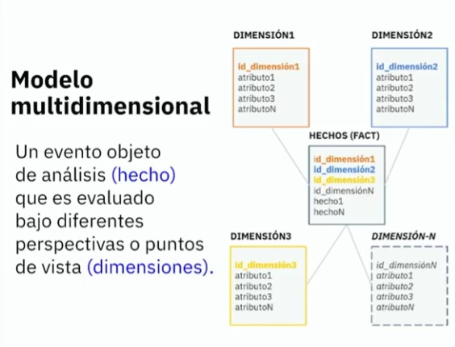
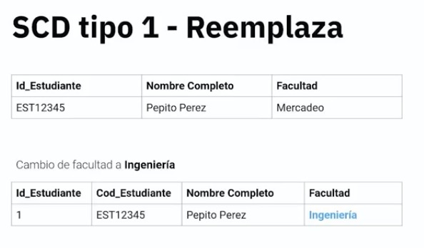
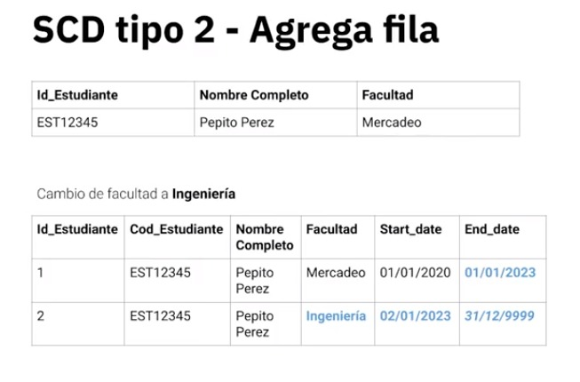
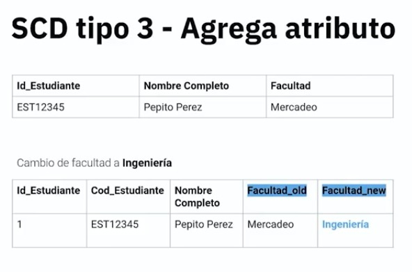
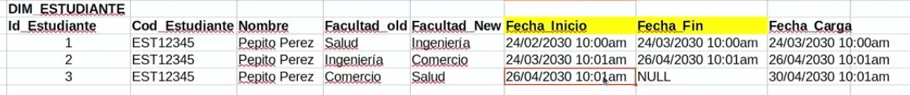
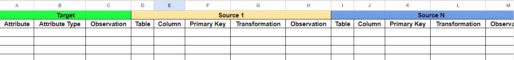

# CURSO DE DATA WAREHOUSING Y MODELADO OLAP

## 1. Introducción a BI y Data Warehousing

### 1.1. ¿Qué es BI y Data Warehousing?

#### 1.1.1. BI (Business Intelligence)

Es un conjunto de tecnologías, procesos y herramientas que permiten recopilar, analizar y presentar datos para apoyar la toma de decisiones en una organización. BI busca transformar datos brutos en información significativa, proporcionando insights para mejorar el rendimiento empresarial.

#### 1.1.2. Data Warehousing

Es el proceso de recopilación, almacenamiento y gestión de datos de diversas fuentes en un único repositorio centralizado, conocido como almacén de datos. El data warehousing facilita el acceso y análisis eficiente de grandes volúmenes de datos para respaldar las operaciones y la toma de decisiones estratégicas en una organización.

### 1.2. Niveles de analítica y jerarquía del conocimiento

#### 1.2.1. Niveles de Analítica

* Descriptiva:

  * Describe y resume datos pasados para entender qué ha sucedido en el pasado.
  * Proporciona una visión retrospectiva de los eventos.

* Diagnóstica:

  * Analiza datos para determinar por qué ocurrieron ciertos eventos.
  * Identifica patrones y causas subyacentes.

* Predictiva:

  * Utiliza modelos y algoritmos para prever eventos futuros.
  * Emplea análisis predictivo para anticipar tendencias y comportamientos.

* Prescriptiva:

  * Ofrece recomendaciones y acciones para influir en resultados futuros.
  * Sugiere decisiones óptimas basadas en datos y modelos.

#### 1.2.2. Jerarquía del Conocimiento

* Dato:

Representación cruda de hechos o cifras.
Carece de contexto y significado por sí mismo.

* Información:

Datos organizados y procesados para proporcionar contexto.
Ofrece significado y relevancia.

* Conocimiento:

Información interpretada y entendida.
Implica la comprensión de patrones, relaciones y causas.

* Sabiduría:

Aplicación del conocimiento de manera efectiva.
Incluye la capacidad de tomar decisiones sabias y utilizar el conocimiento de manera ética y efectiva.

### 1.3. Conceptos de BI: Data Warehouse, Data Mart, Dimensiones y Hechos

* Data Warehouse:

  * Un repositorio centralizado que almacena grandes cantidades de datos de diversas fuentes.
  * Diseñado para facilitar el análisis y la generación de informes para respaldar la toma de decisiones.

* Data Mart:

  * Una versión más pequeña y específica de un almacén de datos.
  * Centrado en un área funcional o departamento particular de una organización.

* Dimensiones:

  * Características o aspectos específicos que describen los datos almacenados.
  * Utilizadas para organizar y categorizar datos en un almacén de datos, proporcionando contexto.
  * Es el que nos va ayudar a responder las preguntas de negocio como el ¿Quien?, ¿Qué?, ¿Como?, ¿Cuando? y ¿Dónde?

* Hechos:

  * Datos numéricos o métricas que representan las medidas de interés.
  * Asociados a dimensiones para proporcionar información completa y contextualizada.

Estos conceptos son fundamentales en la construcción y utilización de sistemas de Business Intelligence para transformar datos en información significativa y apoyar la toma de decisiones empresariales.

### 1.4. Base de datos OLTP vs. OLAP

| **Aspecto**         | **Base de Datos OLTP (Procesamiento de Transacciones en Línea)**                                                                                                                | **Base de Datos OLAP (Procesamiento Analítico en Línea)**                                                                                                |
| ------------------- | ------------------------------------------------------------------------------------------------------------------------------------------------------------------------------- | -------------------------------------------------------------------------------------------------------------------------------------------------------- |
| **Propósito:**      | - Diseñada para el procesamiento eficiente de transacciones en tiempo real. <br> - Optimizada para realizar operaciones de inserción, actualización y eliminación de registros. | - Diseñada para el análisis y la generación de informes. <br> - Optimizada para consultas complejas y analíticas.                                        |
| **Estructura:**     | - Normalización de datos para minimizar la redundancia. <br> - Relacional y centrada en la consistencia de los datos.                                                           | - Desnormalización de datos para facilitar el análisis. <br> - Utiliza estructuras multidimensionales como cubos.                                        |
| **Consulta:**       | - Maneja consultas simples y transacciones individuales. <br> - Busca mantener la integridad de los datos durante operaciones diarias.                                          | - Maneja consultas complejas que involucran grandes conjuntos de datos. <br> - Centrada en proporcionar una visión analítica y estratégica de los datos. |
| **Rendimiento:**    | - Orientada a la velocidad y eficiencia de transacciones. <br> - Mantiene un alto nivel de concurrencia para admitir múltiples usuarios simultáneos.                            | - Orientada al rendimiento de consulta y análisis. <br> - Puede sacrificar la velocidad de transacción en favor de un rendimiento analítico eficiente.   |
| **Bases de datos:** | - MySQL <br> - PostgreSQL <br> - Oracle                                                                                                                                         | - Amazon Redshift <br> - Azure Synapse Analytics <br> - Google Big Query                                                                                 |

### 1.5. Metodologías de Data Warehouse

#### 1.5.1. Metodología Inmon


Como podemos observar la metodología inmon conocida por ser la primera en el data warehousing, recopila toda la información de diversas fuentes en una base de datos llamada **Staging** para así no afectar a las transacciones de las bases de datos OLTP,liego con un proceso ETL se lleva la data transformada un **Data WareHouse** y luego se segmenta en los **Data Mart**.

#### 1.5.2 Metodología Kimball


En esta metodología no se usa Data WareHouse porque se cree que no es necesario. Además nos suguiere el siguiente flujo


Como se observa en el flujo primero se debe determinar el proposito, los objetivos y el alcance del proyecto BI y luego sigue los requerimientos.

#### 1.5.3 Metodología Efesto


Sabiendo estas metodologías, puedes personalizar una propia.

## 2. Modelos Dimensionales

### 2.1 Data Warehouse, Data Lake y Data Lakehouse: ¿Cuál utilizar?

}

#### Data Lakehouse

* Propósito:

Combina características de Data Warehouse y Data Lake, buscando superar las limitaciones de ambos en términos de escalabilidad y flexibilidad.

* Estructura:

Ofrece la capacidad de mantener datos estructurados y no estructurados.
Proporciona una capa de procesamiento para mejorar la calidad de los datos.

* Uso:

Puede ser una opción intermedia para aquellas organizaciones que desean aprovechar la flexibilidad de un Data Lake y la estructura de un Data Warehouse.


### 2.2 Tipos de esquemas dimensionales



Como se ve en la imagen, un esquema dimensional esta compuesta por una tabla de hechos y sus dimensiones que la contextualizan, recordemos que en la tabla hecho es donde estan los datos númericos y métricas que son las medidas de interes. Ahora el esquema dimensional se divide en tipos:

* Esquema Estrella (Star Schema):

  * Características:
    * Estructura centralizada con una tabla de hechos rodeada de tablas de dimensiones.
    * Las dimensiones se conectan directamente a la tabla de hechos.
  * Ventajas:
    * Diseño simple y fácil de entender.
    * Rendimiento optimizado para consultas de agregación.

* Esquema Copo de Nieve (Snowflake Schema):

  * Características:
    * Similar al esquema estrella, pero las dimensiones se normalizan en múltiples tablas.
    * Puede haber jerarquías de dimensiones más profundas.
  * Ventajas:
    * Ahorro de espacio al normalizar dimensiones.
    * Mayor consistencia en los datos dimensionales.

* Esquema Constelación (Galaxy Schema):

  * Características:
    * Múltiples tablas de hechos comparten dimensiones comunes.
    * Adecuado para situaciones donde diferentes procesos comerciales comparten algunas dimensiones.
  * Ventajas:
    * Flexibilidad para representar relaciones complejas entre hechos y dimensiones.

### 2.3 Dimensiones lentamente cambiantes

Las Dimensiones Cambiantes Lentamente (Slowly Changing Dimensions o SCD) son un concepto en la gestión de datos que se refiere a cómo manejar los cambios en los atributos de las dimensiones a lo largo del tiempo. En un almacén de datos, las dimensiones proporcionan contexto a las medidas o métricas en las tablas de hechos.

Existen diferentes tipos de dimensiones cambiantes lentamente, dependiendo de cómo se gestionen los cambios en los atributos de las dimensiones:

* **Tipo 1 SCD:**

En este tipo, los atributos de la dimensión se sobrescriben con los nuevos valores cuando ocurren cambios. Esto significa que los datos históricos no se conservan y la dimensión refleja únicamente los valores más recientes. Los Tipo 1 SCD son adecuados cuando la información histórica no es importante o cuando se puede recuperar de otras fuentes.



* **Tipo 2 SCD:**

En este tipo, se inserta un nuevo registro en la tabla de dimensiones para representar los valores modificados de los atributos. Esto permite conservar los datos históricos, ya que cada registro representa una versión diferente de la dimensión. Por lo general, se utilizan claves sustitutas y fechas efectivas para rastrear las diferentes versiones. Los Tipo 2 SCD se utilizan comúnmente cuando se requiere análisis histórico y la dimensión cambia con relativa poca frecuencia.



* **Tipo 3 SCD:**

Este tipo implica agregar columnas a la tabla de dimensiones para almacenar tanto los valores actuales como los valores anteriores de ciertos atributos. Este enfoque permite un seguimiento limitado de los cambios a lo largo del tiempo, pero puede que no capture la historia completa de la dimensión. Los Tipo 3 SCD se utilizan cuando es importante realizar un seguimiento de cambios específicos de atributos mientras se mantiene la simplicidad en el modelo de datos.



* **Tipo 6 SCD:**

Este tipo se le conoce como 6 por la multiplicacion de 1 X 2 X 3 ya que combina los 3 tipos en uno.



La elección del tipo de dimensión cambiante lentamente a utilizar depende de los requisitos específicos del almacén de datos y las necesidades de análisis. Es importante considerar factores como la importancia de los datos históricos, la frecuencia de los cambios en la dimensión y las implicaciones de almacenamiento y rendimiento de cada enfoque.

Las SCD son un aspecto crucial de los almacenes de datos, ya que permiten representar datos a lo largo del tiempo, lo que permite un análisis e informes históricos precisos.

### 2.4 Tabla de hechos (fact)

* Contienen información cuantitativa de un proceso de negocio
* Medidas - Métricas
* Contiene claves foráneas de las dimensiones

Estas son las dimenciones:


Y estas es la tabla hecho fabricada:


### 2.5 Configuración de herramientas para Data Warehouse y ETL

¡Hola, te doy la bienvenida a este tutorial! Configurarás las bases de datos y herramientas que usaremos para el ETL y crear un data warehouse.

Usaremos PostgreSQL con la base de datos Adventureworks. Será nuestra base de datos transaccional y la fuente de información para llevar al data warehouse.

Ejecuta las siguientes instrucciones para configurar esto:

#### Ruby

Instalación de Ruby en Ubuntu o WSL con Ubuntu:

1. Abre la terminal de Ubuntu
2. Ejecuta el siguiente comando en la terminal para actualizar la lista de paquetes disponibles:

    `sudo apt-get update`

3. Una vez actualizada la lista de paquetes, instala Ruby ejecutando el siguiente comando en la terminal:

    `sudo apt-get install ruby-full`

4. Verifica que Ruby se haya instalado correctamente ejecutando `ruby -v` en la terminal.

#### Instalación de Ruby en Windows

1. Descarga el instalador de Ruby desde la página oficial de Ruby para Windows: https://rubyinstaller.org/downloads/
2. Selecciona la versión de Ruby que deseas instalar.
3. Ejecuta el instalador y sigue las instrucciones del asistente de instalación.
4. Una vez completada la instalación, abre la línea de comandos de Windows (cmd.exe) y escribe `ruby -v` para verificar que la instalación se haya realizado correctamente.

#### Instalación de Ruby en macOS

1. Abre la terminal de macOS.
2. Instala Homebrew ejecutando el siguiente comando en la terminal:

    ```BASH
    /bin/bash -c "$(curl -fsSL https://raw.githubusercontent.com/Homebrew/install/HEAD/install.sh)"
    ```

3. Una vez instalado Homebrew, ejecuta el siguiente comando en la terminal para instalar Ruby:

    `brew install ruby`

4. Verifica que Ruby se haya instalado correctamente ejecutando `ruby -v` en la terminal.

Con estos pasos ya has instalado Ruby.

#### PostgreSQL y pgAdmin o DBeaver

Estas herramientas ya deberías tenerla instaladas. Si no las tienes, vuelve a revisar esta clase tutorial o sigue la documentación de PostgreSQL. ⬅️💡

1. Ingresa a https://www.postgresql.org/
2. Descargar -> Descargar el instalador
3. Instala, y no selecciones StackBuilder

#### Descarga y configuración de la base de datos AdventureWorks

1. Descarga el repositorio en https://github.com/lorint/AdventureWorks-for-Postgres

    Ejecuta el siguiente comando de Git:

    `git clone https://github.com/lorint/AdventureWorks-for-Postgres.git`

    Este repositorio contiene los archivos para crear las tablas y vistas de la base de datos.

2. Descarga [Adventure Works 2014 OLTP Script](https://github.com/Microsoft/sql-server-samples/releases/download/adventureworks/AdventureWorks-oltp-install-script.zip).

    Contiene los archivos para llenar las tablas de la base de datos.

3. Copia y pega el archivo AdventureWorks-oltp-install-script.zip en el directorio AdventureWorks-for-Postgres.

4. En tu terminal úbicate en el directorio AdventureWorks-for-Postgres y descomprime AdventureWorks-oltp-install-script.zip:

    ```BASH
    cd AdventureWorks-for-Postgres/
    unzip AdventureWorks-oltp-install-script.zip
    ```

5. En la terminal, ubicándote en el directorio AdventureWorks-for-Postgres, ejecuta el siguiente comando para convertir los archivos csv:

    `ruby update_csvs.rb`

6. Activa la conexión con postgresql, si postgresql esta instalado en windows, puedes activar el servicio llendo a servicios y luego clic derecho, iniciar, despues creas la base de datos con psql o ingresas a la shell de postgress con el comando `psql -U postgres`:

    `sudo service postgresql start`

7. Crea la base de datos con el siguiente comando de PostgreSQL:

    `psql -c "CREATE DATABASE \"Adventureworks\";"`

    o

    `psql -c "CREATE DATABASE \"Adventureworks\";" -U postgres -h localhost`

8. Ejecuta el script que llena las tablas de la base de datos:

    `psql -d Adventureworks < install.sql`

    o

    `psql -d Adventureworks < install.sql -U postgres -h localhost`

9. Conecta tu base de datos en DBeaver o pgAdmin.

   1. Abre DBeaver o pgAdmin.

   2. Selecciona la opción para crear una nueva conexión.

   3. Selecciona PostgreSQL en la lista de bases de datos.

   4. Ingresa la información de conexión necesaria en la pestaña.

      * Host: localhost
      * Port: 5432
      * Base de datos: Adventureworks
      * Nombre de usuario: postgres
      * Password: la que tengas de tu user de postgresql.

10. Haz clic en **Test Connection** para asegurarte de que los detalles de conexión sean correctos y que puedas conectarte a la base de datos.

11. Si la prueba de conexión es exitosa, haz clic en "Finalizar" para guardar la configuración de la conexión.

#### Configuración de Pentaho

Esta herramienta la utilizaremos para crear las ETL de los datos transaccionales (DB Adventureworks) en Postgres a el Data Warehouse en AWS Redshift.

1. Instala pentaho https://sourceforge.net/projects/pentaho/
2. Instala Java https://www.java.com/es/download/ie_manual.jsp
3. Ejecuta Spoon

    Para acceder al programa solo hace falta abrir el archivo “Spoon” del tipo Batch file (con la extensión .bat).

#### Instalación y configuración de AWS CLI

Este servicio lo usarás para realizar la conexión a S3 y cargar archivos planos que luego serán cargados a AWS Redshift con el comando COPY.

* Instalar AWS CLI: https://docs.aws.amazon.com/cli/latest/userguide/getting-started-install.html
* Configurar AWS CLI: https://docs.aws.amazon.com/cli/latest/userguide/cli-configure-quickstart.html

#### Configuración de AWS Redshift

AWS Redshift será utilizado como data warehouse. Será el lugar donde construiremos las dimensiones, tablas de hechos y llevaremos los datos modelados y limpios que se obtuvieron del sistema transaccional.

* Crea un nuevo clúster de AWS Redshift

### 2.6. Modelado dimensional: identificación de dimensiones, métricas, preguntas de negocio y reglas de negocio

#### Pregunta de negocio

Una pregunta de negocio se refiere a una consulta específica relacionada con las operaciones, estrategias o desafíos de una empresa, buscando obtener información clave para la toma de decisiones.


#### Regla de negocio

Por otro lado, una regla de negocio es una declaración que describe una política, restricción o requerimiento que guía o controla las actividades dentro de una organización, estableciendo cómo deben realizarse ciertas acciones o procesos en el contexto empresarial.

Ejemplo:

* Crear un campo con el nombre completo del cliente
* El campo de observación del producto es demasiado largo. Recortar los primeros 100 caracteres.
* Si un vendedor tiene personas a cargo marcarlo como beneficiario del bono

### 2.7 Modelado dimensional: diseño de modelo

Para elaborar el diseño dimensional ingresamos a:

https://dbdiagram.io/home

En este caso elaboraremos el siguiente modelo dimensional, solo escribimos este codigo y el diagrama se elaborara automáticamente:

```sql
Table dwh.dim_clientes {
  id_cliente int pk
  codigo_cliente varchar
  nombre varchar
  apellido varchar
  nombre_completo varchar
  numero_celular varchar
  numero_casa varchar
  numero_trabajo varchar
  ciudad_casa varchar
}
Ref: dwh.dim_clientes.id_cliente < dwh.fact_ventas.id_cliente

Table dwh.dim_productos {
  id_producto int pk
  codigo_producto varchar
  nombre varchar
  color varchar
  tamano varchar
  categoria varchar
}
Ref: dwh.dim_productos.id_producto < dwh.fact_ventas.id_producto

Table dwh.dim_territorios {
  id_territorio int pk
  codigo_territorio varchar
  nombre varchar
  continente varchar
}
Ref: dwh.dim_territorios.id_territorio < dwh.fact_ventas.id_territorio

Table dwh.dim_vendedores {
  id_vendedor int pk
  codigo_vendedor varchar
  identificacion varchar
  nombre varchar
  apellido varchar
  nombre_completo varchar
  rol varchar
  fecha_nacimiento date
  genero varchar
  ind_activo boolean
  ind_bono boolean
  fecha_inicio date
  fecha_fin date
}
Ref: dwh.dim_vendedores.id_vendedor < dwh.fact_ventas.id_vendedor

Table dwh.fact_ventas {
  id_fecha int pk
  id_territorio int pk
  id_cliente int pk
  id_vendedor int pk
  id_producto int pk
  codigo_venta_detalle varchar
  codigo_venta_encabezado varchar
  cantidad int
  valor decimal
  descuento decimal
}
```

## 3. ETL para inserción en Data WareHouse

### 3.1. Documento de mapeo para el ETL

En el contexto de data warehousing, un documento de mapeo, o "mapping document", es un registro detallado que describe cómo los datos se transforman y se mueven desde las fuentes de origen hasta el almacén de datos. Este documento es esencial para comprender y gestionar el proceso de extracción, transformación y carga (ETL) en un entorno de data warehousing.

[Mapeo Fisico del proyecto](https://docs.google.com/spreadsheets/d/12SBx0xv-z2e6hIqDnv-aHLeQx6kQJRaM/edit?usp=sharing&ouid=103575516771010742985&rtpof=true&sd=true)




### 3.2 Creación del modelo físico

```SQL
  --drop table dim_clientes;
  create table dim_clientes
  (
    id_cliente integer
    ,codigo_cliente varchar(20)
    ,nombre varchar(50)
    ,apellido varchar(50)
    ,nombre_completo varchar(100)
    ,numero_telefono_celular varchar(20)
    ,numero_telefono_casa varchar(20)
    ,numero_telefono_trabajo varchar(20)
    ,ciudad_casa varchar(50)
    ,fecha_carga timestamp
    ,fecha_actualizacion timestamp
    ,primary key (id_cliente)
  )
  ;


  --drop table dim_productos;
  create table dim_productos
  (
    id_producto integer
    ,codigo_producto varchar(20)
    ,nombre varchar(50)
    ,color varchar(50)
    ,tamanio varchar(50)
    ,categoria varchar(50)
    ,fecha_carga timestamp
    ,fecha_actualizacion timestamp
    ,primary key (id_producto)
  )
  ;


  --drop table dim_territorios;
  create table dim_territorios
  (
    id_territorio integer
    ,codigo_territorio varchar(20)
    ,nombre varchar(50)
    ,continente varchar(50)
    ,fecha_carga timestamp
    ,fecha_actualizacion timestamp
    ,primary key (id_territorio)
  ) 
  ;


  --drop table dim_vendedores;
  create table dim_vendedores
  (
    id_vendedor integer
    ,codigo_vendedor varchar(20)
    ,identificación varchar(20)
    ,nombre varchar(50)
    ,apellido varchar(50)
    ,nombre_completo varchar(50)
    ,rol varchar(50)
    ,fecha_nacimiento date
    ,genero varchar(10)
    ,ind_activo boolean
    ,fecha_inicio date
    ,fecha_fin date
    ,version integer
    ,fecha_carga timestamp
    ,primary key (id_vendedor)
  ) 
  ;


  --drop table fact_ventas;
  CREATE TABLE dwh_adventureworks.fact_ventas (
    id_venta integer NOT NULL,
    codigo_venta_detalle varchar(10) NOT NULL,
    codigo_venta_encabezado varchar(10) NOT NULL,
    id_fecha integer NULL,
    id_territorio integer NULL,
    id_cliente integer NULL,
    id_vendedor integer NULL,
    id_producto integer NULL,
    cantidad integer NULL,
    valor numeric(18,2) NULL,
    descuento numeric(18,2) NULL,
    fecha_carga timestamp NULL,
    fecha_actualizacion timestamp NULL,
    CONSTRAINT fact_ventas_pkey PRIMARY KEY (id_venta)
  )


  --drop table dim_tiempo;
  create table dim_tiempo
  (
      id_fecha int not null,
      fecha date not null, 
      dia smallint not null,
      mes smallint not null,
      anio smallint not null,
      dia_semana smallint not null,
      dia_anio smallint not null,
    PRIMARY KEY (id_fecha)
  )

  --Ejecutar luego de realizar la primera carga de datos en las dimensiones con Pentaho!!!!

  INSERT INTO dwh_adventureworks.dim_clientes
  (id_cliente, codigo_cliente, nombre, apellido, nombre_completo, numero_telefono_celular, numero_telefono_casa, numero_telefono_trabajo, ciudad_casa, fecha_carga, fecha_actualizacion)
  VALUES(-1, '-1', 'Sin Información', 'Sin Información', 'Sin Información', '', '', '', '', '1900/01/01 00:00:00', '1900/01/01 00:00:00');


  INSERT INTO dwh_adventureworks.dim_productos
  (id_producto, codigo_producto, nombre, color, tamanio, categoria, fecha_carga, fecha_actualizacion)
  VALUES(-1, '-1', 'Sin Información', '', '', '', '1900/01/01 00:00:00', '1900/01/01 00:00:00');


  INSERT INTO dwh_adventureworks.dim_territorios
  (id_territorio, codigo_territorio, nombre, continente, fecha_carga, fecha_actualizacion)
  VALUES(-1, '-1', 'Sin Información', '', '1900/01/01 00:00:00', '1900/01/01 00:00:00');


  INSERT INTO dwh_adventureworks.dim_vendedores
  (id_vendedor, codigo_vendedor, identificación, nombre, apellido, nombre_completo, rol, fecha_nacimiento, genero, ind_activo, fecha_inicio, fecha_fin, version, fecha_carga)
  VALUES(-1, '-1', null, 'Sin Información', 'Sin Información', 'Sin Información', null, '1900/01/01 00:00:00', null, true, '1900/01/01 00:00:00', '9999/12/31 00:00:00', 1, '1900/01/01 00:00:00');
```

### 3.3 Extracción: querys en SQL

Armamos una de las tablas dimensión con un query

```SQL
  SELECT
  c.customerid as cod_cliente,
  p.firstname as nombre,
  p.lastname as apellido,
  p.firstname || ' ' || p.lastname as nombre_completo,
  case when pp.phonenumbertypeid = 1 then pp.phonenumber else null end as numero_telefono_celular,
  case when pp.phonenumbertypeid = 2 then pp.phonenumber else null end as numero_telefono_casa,
  case when pp.phonenumbertypeid = 3 then pp.phonenumber else null end as numero_telefono_trabajo,
  a.city
  FROM sales.customer c
  LEFT JOIN person.person p
  on c.personid = p.businessentityid
  LEFT JOIN person.personphone pp
  on p.businessentityid = pp.businessentityid
  LEFT JOIN person.businessentity b
  on p.businessentityid = b.businessentityid
  LEFT JOIN person.businessentityaddress b2
  on (b.businessentityid = b2.businessentityid and b2.addresstypeid = 2)
  LEFT JOIN person.address a
  on b2.addressid = a.addressid
```

### 3.4 Extracción en Pentaho
