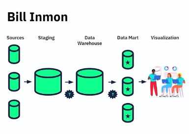
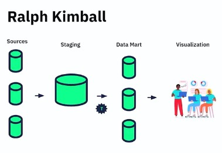
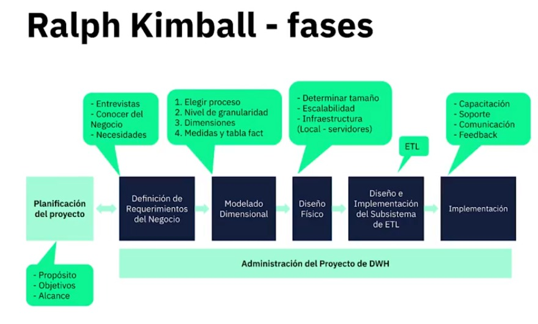
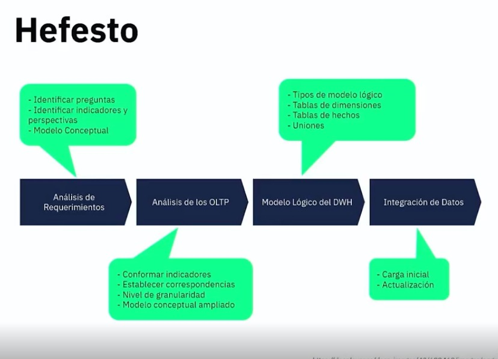
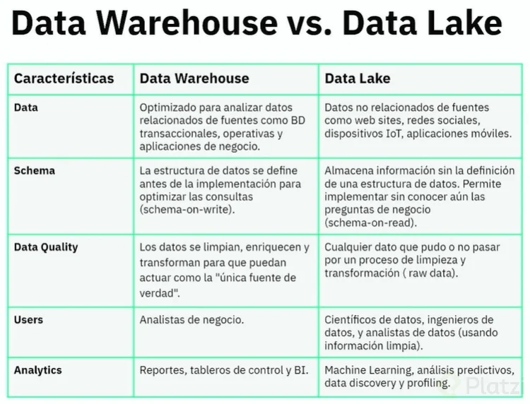

# CURSO DE DATA WAREHOUSING Y MODELADO OLAP

## 1. Introducción a BI y Data Warehousing

### 1.1. ¿Qué es BI y Data Warehousing?

#### 1.1.1. BI (Business Intelligence)

Es un conjunto de tecnologías, procesos y herramientas que permiten recopilar, analizar y presentar datos para apoyar la toma de decisiones en una organización. BI busca transformar datos brutos en información significativa, proporcionando insights para mejorar el rendimiento empresarial.

#### 1.1.2. Data Warehousing

Es el proceso de recopilación, almacenamiento y gestión de datos de diversas fuentes en un único repositorio centralizado, conocido como almacén de datos. El data warehousing facilita el acceso y análisis eficiente de grandes volúmenes de datos para respaldar las operaciones y la toma de decisiones estratégicas en una organización.

### 1.2. Niveles de analítica y jerarquía del conocimiento

#### 1.2.1. Niveles de Analítica

* Descriptiva:

  * Describe y resume datos pasados para entender qué ha sucedido en el pasado.
  * Proporciona una visión retrospectiva de los eventos.

* Diagnóstica:

  * Analiza datos para determinar por qué ocurrieron ciertos eventos.
  * Identifica patrones y causas subyacentes.

* Predictiva:

  * Utiliza modelos y algoritmos para prever eventos futuros.
  * Emplea análisis predictivo para anticipar tendencias y comportamientos.

* Prescriptiva:

  * Ofrece recomendaciones y acciones para influir en resultados futuros.
  * Sugiere decisiones óptimas basadas en datos y modelos.

#### 1.2.2. Jerarquía del Conocimiento

* Dato:

Representación cruda de hechos o cifras.
Carece de contexto y significado por sí mismo.

* Información:

Datos organizados y procesados para proporcionar contexto.
Ofrece significado y relevancia.

* Conocimiento:

Información interpretada y entendida.
Implica la comprensión de patrones, relaciones y causas.

* Sabiduría:

Aplicación del conocimiento de manera efectiva.
Incluye la capacidad de tomar decisiones sabias y utilizar el conocimiento de manera ética y efectiva.

### 1.3. Conceptos de BI: Data Warehouse, Data Mart, Dimensiones y Hechos

* Data Warehouse:

  * Un repositorio centralizado que almacena grandes cantidades de datos de diversas fuentes.
  * Diseñado para facilitar el análisis y la generación de informes para respaldar la toma de decisiones.

* Data Mart:

  * Una versión más pequeña y específica de un almacén de datos.
  * Centrado en un área funcional o departamento particular de una organización.

* Dimensiones:

  * Características o aspectos específicos que describen los datos almacenados.
  * Utilizadas para organizar y categorizar datos en un almacén de datos, proporcionando contexto.

* Hechos:

  * Datos numéricos o métricas que representan las medidas de interés.
  * Asociados a dimensiones para proporcionar información completa y contextualizada.

Estos conceptos son fundamentales en la construcción y utilización de sistemas de Business Intelligence para transformar datos en información significativa y apoyar la toma de decisiones empresariales.

### 1.4. Base de datos OLTP vs. OLAP

| **Aspecto** | **Base de Datos OLTP (Procesamiento de Transacciones en Línea)** | **Base de Datos OLAP (Procesamiento Analítico en Línea)** |
| --- | --- | --- |
| **Propósito:** | - Diseñada para el procesamiento eficiente de transacciones en tiempo real.   - Optimizada para realizar operaciones de inserción, actualización y eliminación de registros. | - Diseñada para el análisis y la generación de informes.   - Optimizada para consultas complejas y analíticas. |
| **Estructura:** | - Normalización de datos para minimizar la redundancia.   - Relacional y centrada en la consistencia de los datos. | - Desnormalización de datos para facilitar el análisis.   - Utiliza estructuras multidimensionales como cubos. |
| **Consulta:** | - Maneja consultas simples y transacciones individuales.   - Busca mantener la integridad de los datos durante operaciones diarias. | - Maneja consultas complejas que involucran grandes conjuntos de datos.   - Centrada en proporcionar una visión analítica y estratégica de los datos. |
| **Rendimiento:** | - Orientada a la velocidad y eficiencia de transacciones.   - Mantiene un alto nivel de concurrencia para admitir múltiples usuarios simultáneos. | - Orientada al rendimiento de consulta y análisis.   - Puede sacrificar la velocidad de transacción en favor de un rendimiento analítico eficiente. |
| **Bases de datos:** | - MySQL   - PostgreSQL   - Oracle | - Amazon Redshift   - Azure Synapse Analytics   - Google Big Query |

### 1.5. Metodologías de Data Warehouse

#### 1.5.1. Metodología Inmon

Como podemos observar la metodología inmon conocida por ser la primera en el data warehousing, recopila toda la información de diversas fuentes en una base de datos llamada **Staging** para así no afectar a las transacciones de las bases de datos OLTP,liego con un proceso ETL se lleva la data transformada un **Data WareHouse** y luego se segmenta en los **Data Mart**.

#### 1.5.2 Metodología Kimball

En esta metodología no se usa Data WareHouse porque se cree que no es necesario. Además nos suguiere el siguiente flujo

Como se observa en el flujo primero se debe determinar el proposito, los objetivos y el alcance del proyecto BI y luego sigue los requerimientos.

#### 1.5.3 Metodología Efesto

Sabiendo estas metodologías, puedes personalizar una propia.

## 2. Modelos Dimensionales

### 2.1 Data Warehouse, Data Lake y Data Lakehouse: ¿Cuál utilizar?

}

#### Data Lakehouse

* Propósito:

Combina características de Data Warehouse y Data Lake, buscando superar las limitaciones de ambos en términos de escalabilidad y flexibilidad.

* Estructura:

Ofrece la capacidad de mantener datos estructurados y no estructurados.
Proporciona una capa de procesamiento para mejorar la calidad de los datos.

* Uso:

Puede ser una opción intermedia para aquellas organizaciones que desean aprovechar la flexibilidad de un Data Lake y la estructura de un Data Warehouse.

### 2.2 Tipos de esquemas dimensionales
