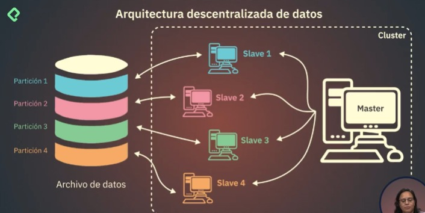
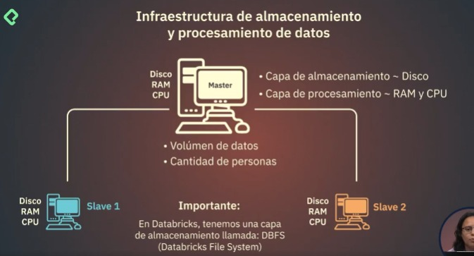
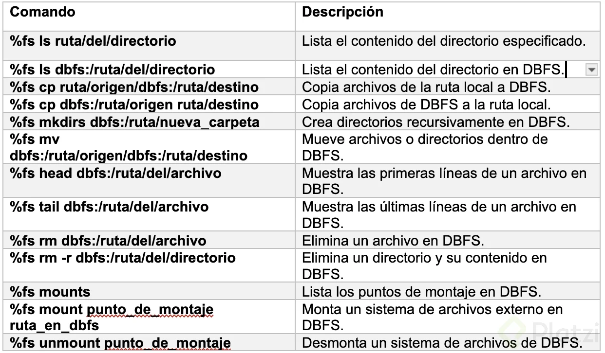
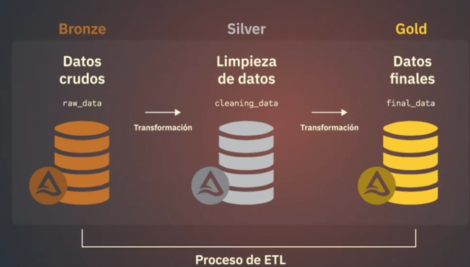

# Curso de Databricks: Arquitectura Delta Lake

## 1. Fundamentos del Data Management con Databricks

### 1.1. Databricks como solución integral

Databricks una plataforma que esta transformando el analisis de big data y el aprendizaje automático, es una solución integral diseñada para enfrentar los retos mas complejos:

* Análisis
* Visualización
* Machine Learning
* Procesamiento de datos

> Aprenderemos tambien Delta Lake, ya que es esencial para construir sistemas de datos robustos y escalables que soporten la toma de decisiones.

### 1.2. ¿Qué es Databricks y para qué sirve?

#### 1.2.1. Databricks

* Es una solución de analisis de datos en la nube.
* Simplifica y acelera la gestión de datos.
* Ofrece un sistema de procesamiento distribuido de datos sobre Spark.

Características:

* Soluciones de big data.
* Trabajo en equipo.
* Desarrollos de modelos de ML.
* Integraciones con otras soluciones de datos.
* utilización de código como Python o Scala.

#### 1.2.2. Para que sirve

* Procesamiento de big data eficiente.
* Desarrolllo de modelos de aprendizaje automático.
* Escalabilidad.
* Felixibilidad.

Funcionalidades:

* Data management
* Data warehousing
* Procesos de datos en tiempo real
* Ingeniería de datos
* Ciencia de Datos
* Machine learning
* Inteligencias artificial

>Notas:
>Databricks es la solución por excelencia para bigdata.
>Además tiene la facilidad de unificar diferentes tipos de tecnologías y usarla en la misma plataforma.
>En la capa de pago puedes integrarlo con AWS, Azure o GCP.

### 1.3. Infraestructura de almacenamiento y procesamiento en Databricks

#### 1.3.1. Arquitectura centralizada de datos

Es donde tenemos un nodo principal y es el unico que se encarga de procesar archivos de gran volumne.

Problemas:

* Se necesita mucho tiempo de procesamiento.
* Tenemos un único punto de falla.

#### 1.3.2. Arquitectura desentralizada o distribuida de datos

Aca dividimos el archivo de datos de gran volumen en particiones, y tenemos nodos que se encarga de procesar cada particion del datos, estos nodos que procesan estas particiones se llaman `Slave` y además tenemos un nodo principal llamado `master` que se encarga de orquestar todo el proceso asignando las cargas a cada slave, este conjunto de slave con el master se llama cluster.



* El procesamiento de datos es mas eficiente
* Ya no va a ver un punto de falla, ya que si un nodo se malogra, podemos asignarle mas nodo o asignar esa carga a otro nodo.

Beneficios de utilizar esta arquitectura:

* Paralalelismo y mayor rendimiento.
* Escalabilidad en la solución.
* Tolerancia a fallos.
* Mejor manejo de grandes volúmenes de datos.



> Aca nos muestra los detelles que debemos tener en cuenta al elaborar nuestra arquitectura, como la capa de almacenamiento y de procesamiento.

### 1.4. Spark como motor de procesamiento Big Data

#### Apache Hadoop

* Marco de software de código abierto, se divide en dos capas.
* capa de procesamiento en donde se utiliza el algoritmo de MapReduce
* capa de almacenamiento llamada HDFS (Hadoop distributed file system)
* la primera herramienta de Big Data

#### Apache Spark

* La evolución de Apache Hadoop
* Marco de procesamiento de datos y análisis
* Desarrollado en Scala
* Objetivo Principal: Ejecutar procesos lo más rápido posible

##### Características de Spark

* Procesamiento en RAM
* APIs en R, Python, Scala y SQL
* Escalabilidad y tolerancia a fallos
* Interoperabilidad con Hadoop
* Procesamiento de datos en tiempo real.
* Componentes de Spark

##### 4 componentes principales

Spark SQL (Interactuar con Spark usando SQL)
Spark Streaming (Tiempo real)
Mllib (Modelos de ML distribuidos)
Graph X (Trabajar con grafos)

Todo se monta sobre Spark Core, el ABC de Spark.
Se recomienda hacer foco en Spark SQL y en MLLIB
Spark vs Hadoop
Spark procesa en Ram y Hadoop en disco. Spark es más rápido debido a su procesamiento en RAM.
Integración: Spark se integra con Python, R, Scala… Hadoop se integra con JAVA
Spark tiene muchas integraciones con tecnologías en la nube como Azure GCP y AWS, Hadoop no tiene tantas integraciones.

> Hadoop y Spark se usa en conjunto, a hadoop por su HDFS que es sistema para almacenar grandes volumenes de datos y a Spark para el procesamiento y analisis de esos grandes volumenes de datos.

## 2. Administración y gestión de la platoforma de DAtabricks

### 2.1. Preparación de cluster de procesamiento

```sh
    # Estando en Databricks nos vamos a la seccion de Compute
    # Luedo nos vamos a Create compute
    # le ponemos un nombre y le damos a crear
    # Debemos tener en cuenta que como es gratis solo tenemos 15gb y 2 nodos, además si no se usa en una o dos horas se eliminar el cluster
    # Esperamos unos minutos hasta que salga el check verde de creado.
```

### 2.2. Preparación de cluster de almacenamiento

Databricks nos da la opción de crear lo siguiente:_

1. Directorio o folder: que nos ayuda a mantener organizado el proyecto, esto se realiza en `workspace > create > folder > colocar nombre`
2. Notebook: es una notebook que funciona como colab o deepnote, para ello se realiza el mismo paso que el anterior `workspace > create > notebook`
3. En la notebook puedes importar archivos con `file > upload data to DBFS > escoges el directorio > sueltas los archivos`
4. Para ver estos archivos cargados tienes que habilitar la opcion de DBFS, para ello debes ir a `Admin settings > Workspace admin > Advanced > habilitar DBFS file browser`
5. En catalogo en la parte arriba te va aparecer la opcion de DBFS y ahi podras ver los archivos recien cargados
6. Otra manera de cargar datos, configurar y genera el codigo para manipularlo es en `catalogo > create table`

### 2.3. ¿Qué son las transformaciones y acciones en Spark?

#### 2.3.1. Transformaciones

Son modificaciones que se hacen a un objeto en spark. Ejecuciones lógicas a realizar sobre un objeto en Spark.

Tipos:

* Nativas: Son transformaciones propias que ya existen en Spark
* UDF

#### 2.3.2. Acciones

Son operaciones son operaciones que desencadenan la ejecución de las transformaciones.

### 2.4. ¿Qué son los RDD en Apache Spark?

RDD o Resilient Distributed Dataset:

* Colecciones inmutables (que no se puede cmodificar) y distribuida (porque se puede ejecutar de forma paralela en nuestro cluster).
* Se puede crear de cero o desde un archivo externo de datos.
* RDD dentro de Spark, admite transformaciones y acciones.
* Un RDD en Apache Spark es una colección de objetos que puede ejecutar de manera paralela en un cluster de computadoras y además tiene la capacidad de recuperarse ante fallos.

### 2.5. Apache Spark: transformaciones y acciones

En este notebook podremos ver a detalles sobre las funciones principales de PySpark para transformaciones.

[enlace](https://drive.google.com/file/d/1TQFyW5oVluNW5lk7lwrHFVMAPoATeOSP/view?usp=sharing)

### 2.6. Lectura de datos con Spark

[Enlace](https://drive.google.com/file/d/1sCc-oNcxQuNPFNpt8p99hRQ3nbKCXK4Y/view?usp=sharing) donde veras todo sobre lectura de datos.

### 2.7. ¿Qué es la Spark UI?

En Databricks, Spark UI es una interfaz de usuario proporcionada por Apache Spark que permite monitorear y diagnosticar las operaciones y el rendimiento de las aplicaciones que se ejecutan en un clúster de Spark. Es una herramienta crucial para entender cómo se están ejecutando las tareas y procesos en un entorno distribuido de Spark, lo que facilita la identificación de cuellos de botella, optimizaciones y la depuración de posibles problemas.

Spark UI proporciona una variedad de pestañas y paneles que muestran información detallada sobre la ejecución de trabajos, etapas, tareas, uso de recursos y estadísticas de ejecución. Algunas de las funcionalidades y características que ofrece Spark UI incluyen:

1. Visualización de trabajos y etapas: Permite ver la estructura de los trabajos y sus etapas, así como la relación entre ellas.
2. Detalles de tareas individuales: Proporciona información detallada sobre cada tarea, como su estado, tiempo de ejecución, localización y recursos utilizados.
3. Monitoreo de recursos: Muestra el uso de recursos del clúster, incluyendo CPU, memoria y almacenamiento, lo que ayuda a identificar posibles cuellos de botella o problemas de escalabilidad.
4. Visualización de ejecuciones en tiempo real: Permite monitorear el progreso de las ejecuciones en tiempo real, lo que facilita el seguimiento del estado de las aplicaciones y la identificación de posibles problemas de rendimiento.

En resumen, Spark UI es una herramienta fundamental para el desarrollo y la optimización de aplicaciones Spark en Databricks, ya que proporciona una visión detallada del comportamiento y el rendimiento de las aplicaciones distribuidas, lo que facilita la toma de decisiones informadas para mejorar la eficiencia y la escalabilidad.

#### 2.8. ¿Cómo instalar una librería en Databricks?

1. Para instalar una librería que databricks no tiene en preinstalada, podemos ir al repositorio de maven a buscarla, que esta en este [enlace](https://mvnrepository.com/).
2. Luego escogemos la version de la librería que sea compatible con la version de scala de nuestro cluster, en mi caso el scala es 2.12, asi que descargare Spark XML 0.18.0 que es compatible con Scala 2.12.
3. Luego nos vamos a la version de Maven

    ```XML
        <!-- https://mvnrepository.com/artifact/com.databricks/spark-xml -->
        <dependency>
            <groupId>com.databricks</groupId>
            <artifactId>spark-xml_2.13</artifactId>
            <version>0.18.0</version>
        </dependency>
    ```

4. Se aqui sacamos las coordenadas, en este caso las coordenadas sería.

    `com.databricks:spark-xml_2.13:0.18.0`

5. Luego en Databricks adentro del cluster, vas a `Libraries > Install new > Maven > colocas la coordenada > install`

### 2.9. Spark en local vs. en la nube

Puedes usarlo en local, pero en producción siempre sera a nivel de la nube.

Beneficios de local:

* Facilidad de desarrollo
* Aprendizaje y experimentación rápida
* No necesidad de usar servicio cloud con internet

Desventaja:

* Limitaciones de escalabilidad
* Instalación compleja
* No refleja entornos de producción

>Proveedores de la nube y regiones donde más se utilizan: - Amazon EMR: México & EEUU - GCP Dataproc: Latinoamérica - Azure HDInsight: Europa

## 3. Apache Spark SQL y UDF

### 3.1. ¿Qué son los Dataframes en Apache Spark?

En Apache Spark, un DataFrame es una estructura de datos distribuida que se organiza en filas y columnas. Es una abstracción de datos tabulares que se asemeja a una tabla en una base de datos relacional o a un DataFrame en lenguajes de programación como R o Python.

Resulta importante mencionar que un DataFrame en Spark puede ser creado a partir de diversas fuentes de datos como archivos CSV, JSON, Parquet, bases de datos SQL, entre otros. Por supuesto, también lo podemos crear desde 0.

En esencia, un dataframe proporciona una interfaz de programación para manipular y procesar datos de manera distribuida en un clúster de computadoras. A este tipo de objeto también es posible aplicarle transformaciones y acciones en Spark.

Algunas características clave de los DataFrames en Apache Spark son:

1. Inmutabilidad: Al igual que en otros contextos de Spark los DataFrames son inmutables, lo que significa que no se pueden modificar directamente después de su creación. Las transformaciones en un Dataframe crean otro nuevo.
2. Optimización de consultas: Spark optimiza automáticamente las consultas en los DataFrames utilizando su motor de ejecución Catalyst. Esto permite realizar operaciones de manera eficiente y optimizada.
3. Soporte para varios lenguajes: Los DataFrames en Spark están disponibles en varios lenguajes de programación como Scala, Java, Python y R, lo que facilita su uso en diferentes entornos.
4. Integración con fuentes de datos externas: Pueden leer y escribir datos desde y hacia una variedad de fuentes de datos, lo que facilita la integración con diferentes sistemas y formatos.
5. API rica: Los DataFrames proporcionan una API rica que permite realizar operaciones complejas de manipulación y análisis de datos de manera declarativa, lo que facilita la expresión de la lógica de procesamiento.

Por lo tanto, podemos concluir que los DataFrames en Apache Spark ofrecen una interfaz de alto nivel para el procesamiento de datos distribuidos, facilitando la manipulación y el análisis de grandes conjuntos de datos de manera eficiente en clústeres de computadoras.

Escritura y lectura de dataframes en Spark

En Apache Spark, la lectura y escritura de DataFrames se realiza utilizando las API correspondientes proporcionadas por Spark.

**Lectura de DataFrames:**

A. Desde un archivo CSV:

```python
 from pyspark.sql import SparkSession

 spark = SparkSession.builder.appName("example").getOrCreate()

 df = spark.read.csv("ruta/del/archivo.csv", header=True, inferSchema=True)
```

En este ejemplo, header=True indica que la primera fila del archivo CSV contiene nombres de columnas, y inferSchema=True intentará inferir automáticamente los tipos de datos de las columnas.

B. Desde un archivo Parquet:

```python
 df = spark.read.parquet("ruta/del/archivo.parquet")
```

Parquet es un formato de almacenamiento eficiente para datos estructurados y es compatible con Spark.

C. Desde una tabla de base de datos SQL:

```python
df = spark.read.jdbc(url="jdbc:mysql://localhost:3306/base_de_datos", table="nombre_tabla", properties={"user": "usuario", "password": "contraseña"})
```

En este ejemplo se lee desde una tabla de una base de datos SQL.

**Escritura de DataFrames:**

A un archivo CSV:

```python
df.write.csv(“ruta/de/destino”, header=True)
```

Esto escribirá el DataFrame en formato CSV en la ruta especificada.

A un archivo Parquet:

```python
df.write.parquet(“ruta/de/destino”)
```

Escribir en formato Parquet es eficiente y puede ser una buena opción para el almacenamiento a largo plazo.

A una tabla de base de datos SQL:

```python
df.write.jdbc(url=“jdbc:mysql://localhost:3306/base_de_datos”, table=“nombre_tabla”, mode=“overwrite”, properties={“user”: “usuario”, “password”: “contraseña”})
```

En este ejemplo, mode=“overwrite” indica que se sobrescribirán los datos si la tabla ya existe. Otras opciones incluyen “append” y “ignore”.

### 3.2. Laboratorio - PySpark SQL - Parte 1

[Enlace](https://drive.google.com/file/d/1caMwbWHADxjjsfvFn5PjXaKCe-uTfpBo/view?usp=sharing)

### 3.3. Laboratorio - PySpark SQL - Parte 2

[Enlace](https://drive.google.com/file/d/1ASw3d3ENhzNlopZjGBaNn5Qo2hBnr3U7/view?usp=sharing)

### 3.4. UDF en Apache Spark

[Enlace](https://drive.google.com/file/d/1oyRwTpDgLlUPUZdNl_gaKC0HM24Ecj5S/view?usp=sharing)

## 4. Implementación de un Delta Lake en Databriks

### 4.1. Arquitectura Data Lake vs Delta Lake

Data lake y Delta lake es muy utilizado en el contexto de bigdata ya que nos permite gestionar y almacenar datos a gran escala.

#### 4.1.2. Arquitectura de Data Lake

Aca nos encontramos en un esquema de 3 capas fundamentales

`Landing o Zona de aterrizaje de archivos:` se almacena los datos en un formato de texto plano, donde vamos a tener todos los conectores y los origenes de datos externos, luego se ingesta esos datos en un formato raw(es decir sin ningún preproceso previo).

`Universal o zona de limpieza o modelamiento o binarizacion:` Tiene muchos nombres y es donde se realiza el modelamiento y trasnformaciones y se almacena en formato parquet.

`Solution o zonas de soluciones de negocio:` Aca tambien se alamcen a en formato parquet y es donde se deja disponible para que puedan utilizar.

#### 4.1.2. Arquitectura DeltaLake

Toma los mismo conceptos de la arquitectura Data Lake y lo mejora

`Bronce o Zona de aterrizaje:` Aca nos conectamos en los origenes de datos y lo guardamos en un formato row.
`Silver o Zona de limpieza` Aca se realiza la etapa de modelado, transformación y binarizacion, luego se almacena un formato Delta.
`Gold o Zona de soluciones` Aca dejamos listo los datos para se pueda aplicar en el negocio y en formato Delta.

Las dos grandes diferencia son el formato parquet(Es un formato binario mas estandar) vs el formato Delta(Es un parquet mejorado y permite las actualizaciones de registro, su desventaja que no es compatible con todas las herramientas de bigdata pero es la mas utilizada). [Enlace](https://drive.google.com/file/d/1cK1MbwM8eEZScfUWaOKg2LPWlQrRGaLh/view).

### 4.2. Características y beneficios del Delta Lake

Como ya hemos visto, Delta Lake es una solución de almacenamiento de datos basada en un sistema de archivos distribuido diseñado para mejorar la calidad, la confiabilidad y el rendimiento de los datos en entornos de big data.

**Características de Delta Lake:**

* Transacciones ACID:
Delta Lake proporciona soporte nativo para transacciones ACID (atomicidad, consistencia, aislamiento y durabilidad), lo que garantiza un rendimiento fluido de lectura y escritura, y consistente incluso en entornos distribuidos.

* Control de versiones:
Admite un historial de versiones completo de los datos almacenados, lo que le permite analizar los cambios a lo largo del tiempo y volver a versiones anteriores si es necesario.

* Operaciones de fusión y actualización:
Facilita las operaciones de fusión y actualización de datos, lo que simplifica el procesamiento y la edición de datos.

* Optimizaciones de lectura y escritura:
Contiene optimizaciones que aceleran las operaciones de lectura y escritura, como la indexación y la gestión de estadísticas que mejoran el rendimiento en comparación con el uso del sistema de archivos directamente sin estas optimizaciones.

* Compatibilidad con Apache Spark:
Delta Lake es totalmente compatible con Apache Spark lo que facilita la integración en el ecosistema Spark y aprovecha las capacidades de procesamiento distribuido.

* Evolución del esquema:
Facilita la evolución del esquema de datos a lo largo del tiempo, permitiendo cambios en la estructura de datos sin afectar la compatibilidad con versiones anteriores.

* Gestión de metadatos:
Delta Lake almacena metadatos internos que proporcionan información sobre los datos, facilitando la gestión y el control de los datos.

**Beneficios del Delta Lake:**

* Integridad y coherencia de los datos:
La gestión de transacciones ACID garantiza la integridad y la coherencia de los datos, lo cual es fundamental en entornos donde la precisión de los datos es fundamental.

* Mejor rendimiento:
Las optimizaciones internas, como la indexación y la gestión de estadísticas, mejoran el rendimiento de las operaciones de lectura y escritura y permiten un acceso más eficiente a los datos.

* Historial de versiones para revisión:
El historial de versiones le permite monitorear y analizar los cambios de datos a lo largo del tiempo y proporciona una descripción detallada de la evolución de los conjuntos de datos.

* Flexibilidad en el desarrollo de esquemas:
La capacidad de evolucionar sin problemas el esquema de datos facilita una adaptación perfecta a los cambios comerciales.

* Operaciones simplificadas:
Delta Lake simplifica operaciones como la fusión y la actualización lo que facilita el trabajo con datos.

* Compatibilidad con herramientas de big data:
Al admitir Apache Spark, Delta Lake se puede utilizar fácilmente con otras herramientas de big data, ampliando su aplicabilidad en entornos distribuidos.

Para concluir, estas características y beneficios hacen que Delta Lake sea una solución poderosa para el almacenamiento y la gestión de datos en entornos de big data, proporcionando un conjunto de funcionalidades avanzadas para abordar desafíos comunes en la administración de grandes volúmenes de datos.

### 4.3. Medallion architecture

Esta arquitectura es ampliamente utilizada en la definición de un lakehouse = Data lake + Data Warehouse. Este saca lo mejor de cada una de estas implementaciones.

Es un enfoque para el diseño de modelos de datos que fomenta la organización lógica
de los datos dentro de un data lakehouse. Estructura los datos en un enfoque
multicapa (bronce, plata y oro). Este tipo de arquitectura es muy bueno dado que
fomenta la calidad de los datos a medida que avanzan en el proceso de
transformación y su aplicación dentro de un contexto de ETL.

A continuación, comentaremos en mayor detalle las capas de esta arquitectura
propuesta:

1. Capa de bronce
    Es la capa de entrada de datos. Aquí se almacenan los datos en su estado original, sin
    ningún tipo de transformación o limpieza. Esta capa es importante para garantizar que
    todos los datos estén disponibles para su análisis, independientemente de su calidad.

2. Capa de plata
    Es la capa de transformación de datos. Aquí se realizan las primeras transformaciones
    y limpiezas de los datos para mejorar su calidad. Estas transformaciones pueden
    incluir la eliminación de datos duplicados, la corrección de errores, la estandarización
    de formatos y la aplicación de reglas de negocio.

3. Capa de oro
    Es la capa de datos listos para el análisis. Aquí se almacenan los datos que han sido
    completamente transformados y limpiados. Es la que se utiliza para realizar análisis
    avanzados y generar insights empresariales.
    En esencia, este esquema ofrece una serie de ventajas, entre las que se incluyen:
    ● Flexibilidad: La arquitectura permite almacenar datos de diferentes fuentes y
    formatos en una sola plataforma.
    ● Escalabilidad: La arquitectura puede escalarse fácilmente para adaptarse al
    crecimiento de los datos.
    ● Eficiencia: La arquitectura utiliza tecnologías de almacenamiento y
    procesamiento de datos eficientes para proporcionar un rendimiento óptimo.
    ● Calidad de los datos: La arquitectura fomenta la calidad de los datos mediante
    la aplicación de procesos de transformación y limpieza a medida que los datos
    avanzan por las capas.

Podemos hacer uso de esta arquitectura en aquellas empresas que buscan una
plataforma de datos moderna que pueda satisfacer sus necesidades de
almacenamiento, procesamiento y análisis de datos.

### 4.4. Comandos esenciales de DBFS

Comandos esenciales de DBFS

Databricks File System (DBFS) es un sistema de archivos distribuido integrado en la plataforma de Apache Spark y Databricks. Proporciona acceso a datos y archivos almacenados en un entorno de Databricks.

A continuación, se presentan algunos comandos esenciales de DBFS que puedes utilizar en un notebook de Databricks o a través de Databricks CLI, en el caso de utilizar la versión de pago de Databricks:



Estos comandos son ejecutados en celdas de código en un notebook de Databricks y utilizan el prefijo %fs para indicar que se están ejecutando comandos de sistema de archivos.

También, es posible utilizar los comandos basados en “dbutils”:

[Enlace](https://docs.databricks.com/en/dev-tools/databricks-utils.html)

Importante: Cuando se ejecuta el comando %fs, no se puede colocar ningún código adicional en la celda, únicamente el comando de DBFS.

### 4.5. Implementación de un Delta Lake sobre Databrikcs

Aca creamos las 3 capas que son representadas por carpetas o directorios:

deltalake
|_bronze
    |_raw_data
|_silver
    |_cleaning_data
|_gold
    |_final_data

[Enlace](https://drive.google.com/file/d/1hTFZEHPw3lD8IGMIDbXfm59p05sP2ihe/view?usp=sharing)



1. Bronze Layer (Capa de Bronce):
Esta capa generalmente contiene los datos en su forma cruda, tal como se capturan de las fuentes de origen. Los datos en esta capa no han sido procesados ni transformados, y pueden incluir duplicados, valores faltantes o errores de formato.

2. Silver Layer (Capa de Plata):
En esta capa, los datos se someten a procesos de limpieza, transformación y normalización. La carpeta "cleaning_data" dentro de la capa de plata almacena los datos que ya han sido procesados y limpiados, pero aún no han sido enriquecidos o agregados con datos adicionales.

3. Gold Layer (Capa de Oro):
La carpeta "final_data" en la capa de oro contiene los datos listos para ser consumidos por las aplicaciones finales o los usuarios. Estos datos han pasado por procesos de enriquecimiento, agregación y refinamiento, y están listos para ser utilizados en análisis, informes o aplicaciones de producción.
