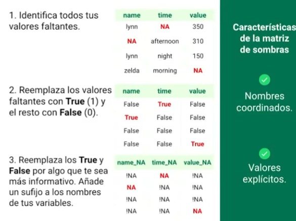
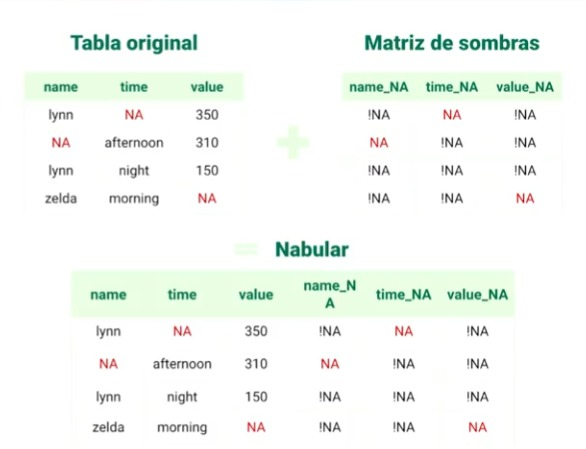

# Manejo de Datos Faltantes: Detección y Exploración

## 1. Introducción a los Valores Faltantes

### 1.1 ¿Por qué explorar y lidiar con valores faltantes?

* Ignorar los valores faltantes puede introducir sesgos en tu analisis y modelo.

* Multiple de los algoritmos disponibles fallaran. Los algoritmos no saben lidiar con los valores faltantes por lo que terminaran eliminadolo.

* La mejor manera de tratar los datos que faltan es no tenerlos, pero la realidad es que muchos conjuntos de datos van a tener valores faltantes por lo que debes saber tratarlos y entenderlos.

### 1.2 Operaciones con valores faltantes

[Notebook Práctivo](./deteccion_exploracion_de_datos_faltantes/exploration-missing-values-app.ipynb)

### 1.3 Correr una notebook dentro de otra

> Para correr la notebook dentro de otra, tiene que ejecutar el comando de la magia de Jupyter, para ello si estas en deepnote, tienes que colocar la notebook que deseas ejecutar en la parte de files, y si es vscode, debemos apuntar bien a la ruta del directorio

```bash
%run ruta/a/otra/notebook.ipynb
```

### 1.4 Extendiendo la API de Pandas

> La api de pandas se puede extender para manejar los datos faltantes, para ello necesitamos crear una clase y añadirle un decorador, sobre eso podemos crear funciones para poder manejar estos datos faltntes, por ejemplo:

```bash
@pd.api.extensions.register_dataframe_accessor("missing")  #Decorador
class MissingMethods:                                      #clase
    def __init__(self, pandas_obj):
        self._df = pandas_obj

    def number_missing(self):                        #metodo para contar datos faltantes
        return self._df.isna().sum().sum()

    def number_complet(self):                        #metodo para contar datos completos
        return self._df.size - self._df.missing.number_missing()
```

> Esto lo podemos ver mas adetalle en el siguiente notebook

[Notebook de uso de Pandas Missing](./deteccion_exploracion_de_datos_faltantes/tutorial_to_extend_pandas_api.ipynb)

> Además podemos usar el siguiente notebook y correrlo dentro de nuestro proyecto ya con todas las funciones realizadas de Pandas Missing

[Notebooks con todas las funciones de Pandas Missing](./deteccion_exploracion_de_datos_faltantes/pandas-missing-extension.ipynb)

> Recordemos que este notebook se puede correr con la magia de jupyter %run

### 1.5 Tabulación de valores faltantes

[Notebook Práctivo](./deteccion_exploracion_de_datos_faltantes/exploration-missing-values-app.ipynb)

```python
riskfactors_df.missing.missing_variable_summary()
# Con esta función podemos explorar, por ejemplo que pregnant tiene el 87% de valores faltantes

riskfactors_df.missing.missing_variable_table()
# En este caso vemos la cantidad de variables que tienen datos faltantes, por ejemplo hay 10 variables que no tienen ningun valor faltante

riskfactors_df.missing.missing_case_summary()
# Esta función nos permite ver cuantos valores faltantes tiene cada observación o fila

riskfactors_df.missing.missing_case_table()
# En este ejemplo vemos que hay 49 filas que tienen 4 faltantes y representa el 20%
```

### 1.6 Visualización de valores faltantes

[Notebook Práctivo](./deteccion_exploracion_de_datos_faltantes/exploration-missing-values-app.ipynb)

## 2. Manipulación Inicial de Valores Faltantes

### 2.1 Codificación de valores faltantes

> Asumir que los datos faltantes siempre vendran en un unico formato es un error.

Algunas formas en que se representa los datos faltantes son: NA, N/A, na, Missing, -1, -77, no available

Valores comunmente asociados a valores faltantes. Cadenas de texto

[Notebook Práctivo](./deteccion_exploracion_de_datos_faltantes/exploration-missing-values-app.ipynb)

### 2.2 Conversión de valores faltantes implícitos en explícitos

Va a ver casos donde no vamos a encontrar valores faltantes en nuestra base, pero se va entender que las hay, por ejemplo si tenemos la siguiente tabla.

| name  | time      | value |
|-------|-----------|-------|
| lynn  | morning   | 350.0 |
| lynn  | afternoon | 310.0 |
| lynn  | night     | NaN   |
| zelda | morning   | 320.0 |

Aca vemos que name esta siendo medido 3 veces como morning, afternoon y night, pero tenemos Zelda que esta siendo medido 1 vez, es decir que falta ser medido 2 veces más pero no esta explícito en la tabla. para darnos cuenta tenemos que pivotear.

[Notebook Práctivo](./deteccion_exploracion_de_datos_faltantes/exploration-missing-values-app.ipynb)

### 2.3 Exponer filas faltantes implícitas en explícitas

[Notebook Práctivo](./deteccion_exploracion_de_datos_faltantes/exploration-missing-values-app.ipynb)

### 2.4 Tipos de valores faltantes

Tenemos tres tipos de mecanismo de valores faltantes:

* Missing Completely at Random (Perdidos completamente al azar)
* Missing at Random (Perdidos al azar)
* Missing not at Random (Perdidos no al azar)

1. Missing Completely at Random (MCAR)
Son datos ocasionados por herramientas que dejan de funcionar sin ninguna razon detras. La localizacion de los valores faltantes ocurre completamente al azar, esto no depende de ningun otro dato

2. Missing at Random (MAR)
Las herramientas necesitan mantenimiento periodico para asegurar su funcionamiento constante. En las fechas donde se le hace mantenimiento sabemos que ocurrira una falta de datos por lo que esos datos faltantes son localizados. La localizacion de los valores faltantes en el conjunto de datos depende de otros valores observados

3. Missing not at Random (MNAR)
Las herramientas tienen limites. Al tratar de hacer seguimientos fuera de su rango de medicion, se generan valores faltantes. La localizacion de los valores faltantes en el conjunto de datos dependen de los valores faltantes en si mismos

**Puedo tener seguridad sobre que mecanismo de valores faltantes es correcto para mis datos?**

No, no podemos tener seuridad sobre cual mecanismo incidio sobre los datos, pero a traves de analisis y conocimiento del tema puedes hacer suposiciones razonables

### 2.5 MCAR, MAR, MNAR en Python

[Notebook Práctivo](./deteccion_exploracion_de_datos_faltantes/exploration-missing-values-app.ipynb)

## 3. Busqueda de Relaciones de Valores Faltantes

### 3.1 Matriz de sombras: shadow matrix

Para contruir nuestra matriz de sombra se necesita lo siguiente



Luego se debe obtener lo siguiente:



[Notebook Práctivo](./deteccion_exploracion_de_datos_faltantes/exploration-missing-values-app.ipynb)

### 3.2 Visualización de valores faltantes en una variable

[Notebook Práctivo](./deteccion_exploracion_de_datos_faltantes/exploration-missing-values-app.ipynb)

## 4. Tratamiento de Valores Faltantes
