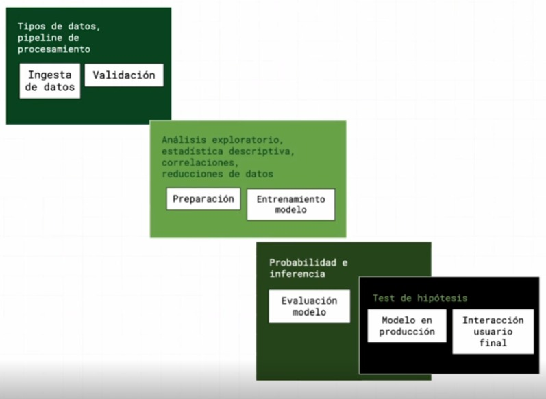

# 📈 Estadística Descriptiva para Ciencia de Datos

## Introducción

La estadística es importante aprenderlo, ya que, en todo el workflow de la ciencia de datos se usa, como veremos más abajo la estadística descriptiva se usa en las dos primeras fases: `Ingesta y Procesamiento de datos` y `Exploración y Analítica de datos`; en cambio la estadística inferencial se usa en la dos ultimas fases: `En la evaluación y producción del modelo` e `Interacción con el usuario final`

Debido a esto, este estudio se va a dividir en 2 grandes grupos:

* Estadísticos para ingesta y procesamiento

* Estadísticos para analítica y exploración

### Estadística descriptiva vs. inferencial

| Aspecto                 | Estadística Descriptiva                 | Estadística Inferencial                    |
|-------------------------|-----------------------------------------|--------------------------------------------|
| **Objetivo**            | Describir y resumir un conjunto de datos | Hacer inferencias sobre una población      |
| **Métodos**             | Medidas resumen (media, mediana, etc.)   | Estimación de parámetros y pruebas de hipótesis |
| **Enfoque**             | Organización y resumen de datos          | Inferir características de una población a partir de una muestra |
| **Ejemplos de Métodos** | Media, mediana, moda, rango, etc.        | Estimación de la media poblacional, pruebas de hipótesis |

**¿Puede mentir la estadística?**

La estadística descriptiva tiene un problema al momento de definir que métrica es la que nos va a brindar la mayor relevancia para nuestro estudio.

* El resultado podría estar sesgado a nuestro criterio personal, mostrando mayor interés a un cierto parámetro. dejando de lado a otro que también podría ser relevante. Mostramos solo una cara de la moneda.
* No existen definiciones objetivas en estadística, sin embargo sobre estas definiciones podemos realizar cálculos exactos lo cual es un problema
* Los diferentes estadísticos descriptivos dan nociones diferentes sobre los mismos datos.

**¿Por que aprender estadística?**

A pesar de los problemas que pueda presentar es muy importante entender que la estadística nos puede ayudar a:

* Resumir grandes cantidades de información
* Tomar mejores decisiones
* Responder preguntas con relevancia social
* Reconocer patrones en los datos
* Descubrir a quien usan estas herramientas con fines nefastos

### Flujo de trabajo en data science

El flujo de trabajo del data science esta compuesto de

>Puede existir profesiones que se enfoquen mas a cada una de fases, no existe un perfil de data science que se encargue a todo el flujo de trabajo. .

#### ¿En que partes del flujo de trabajo se necesita de estadística?

Todos las partes del flujo requiere del conocimiento en ciertas ramas de la estadística. La estadística descriptiva se va a emplear más en los dos primeros bloques de trabajo.

***Ingesta de datos y Validación :** Se encarga de todo el procesamiento de ETL (Extract Transform Load) obtener los datos, limpiarlos y estructurarlos, crear pipelines de análisis automatizado, es decir que transformaciones vamos a realizar a los datos para que estén listos para el caso especifico de estudio que vamos a realizar.*

***Preparación y entrenamiento del modelo:** En este bloque se va a realizar un análisis exploratorio de los datos con estadística descriptiva, entender correlaciones y realizar posibles reducciones de datos.*

***Evaluar el modelo, Producción e Interacción:** esta parte del flujo se basa mas en la estadística inferencial.*

## Estadísticos para ingesta y procesamiento

[Tipos de Datos 🫵🏻](https://deepnote.com/workspace/gianmarco-holm-421cbaf8-26f8-4328-a3b6-8e02322986c3/project/Estadistica-descriptiva-en-la-Ciencia-de-Datos-4ae198ff-84f2-47b6-a278-e41621250eb4/notebook/02-tipos-de-datos-c16d8d19e24148c997ba2b85f44c6b1f)

## Estadísticos para analítica y exploración
