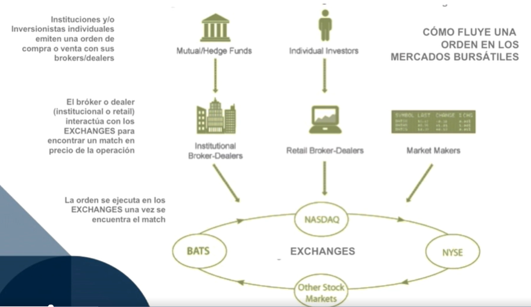

# Introducción al Trading

>1. Antecedentes Históricos

## 1.1. Breve historia de la inversión y los mercados bursátiles: Mesopotamia

* Cuna de la civilización, ubicada entre el río Tigris y Eufrates.
* 2250 - 2000 A.C. Inicia la renta de las tierras.
* La élite Sumeria manejaba las tierras donde había superávit con inmensos accesos a aguas.
* La dinastía Ur recibía impuestos de los Remanentes en 2000 A.C.
* Nacieron los interes cuando no pagaban los impuestos.
* Hammurabi en su código ya se hablaba de la deuda.

## 1.2. Breve historia de la inversión y los mercados bursátiles: Grecia

* En el siglo IV AC, en la antigua Grecia surge el libro "Oeconomicus" donde se hacen preguntas para llegar a conclusiones propias (Mayéutica) con relación a la contratación de granjeros (no esclavitud) y surgen los primeros 'manager' o administradores de tierras.
* Surge otro libro: "Alegorías de la granja, de Grecia a Roma" donde se inicia a comprar tierras con problemas, para después trabajarlas y las vendían con alguien interesado (así surgen los márgenes de ganancia). Nota: House flipping: Es la actividad de comprar propiedades arruinadas, se trabajan y se mejoran, para luego venderlas con un margen atractivo (lo que hoy conocemos como inversionistas de bienes raíces).
* En **Roma **(ya una república bien establecida), en el año 200 AC, se consolidad la inversión en bienes raíces, haciendo ricas a muchas familias de la élite romana.

## 1.3. Breve historia de la inversión y los mercados bursátiles: El interés y la corporación

* El interés es el motivo por el que una institución esta interesada en /prestarte/ dinero.
* Roma fue financiando la expansión hacia los primeros años del imperio, gracias al movimiento préstamo-interés de la clase noble para que financiaran campañas de conquista.
* Durante la Edad Media y el Renacimiento el fenómeno usurero (préstamo con una carga de interés altísimo) gano popularidad.
* De todas las categorías o tipo de inversión en la antigüedad el comercio fue el mas riesgoso y a la vez el que mas retorno podía ofrecer.
* La corporación nació como una entidad que protegía del riesgo que tenia pagar una expedición completa, las corporaciones eran como un escudo para las personas que financiaban esas expediciones.
* La primera corporación que existió fue The British East India Company que fue fundada en 1600, y fue cerrada después de 1800. Fue una de las pioneras de la entidad corporativa.
* The British East India Company fue la primera que instituyo el modelo de propiedad a través de acciones(shares of stock). Y esta empresa vino a cambiar al mundo.
* The British East India Company fue también la primera en usar un sistema de protección contra responsabilidad legal, protegiendo a sus inversionistas. Así nació la responsabilidad limitada (Limited Liability).
* Las corporaciones se convirtieron en el vehículo ideal para invertir y financiar las riesgosas expediciones.
* En 1602, nació The Dutch East India Company, y se convirtió en la primera empresa “pública”, poniendo a disposición del público inversionista sus acciones en el Amsterdam Stock Exchange.

## 1.4. Breve historia de la inversión y los mercados bursátiles: Mercados bursátiles

* En un principio la compra-venta de acciones públicas en los primeros Stock Exchange de Europa (Amsterdam, Bélgica) sucedía en los cafés y en algunas plazas públicas.
* La primera bolsa de valores que emitió de manera formal acciones al pública similar a cómo se hacia con emisiones de deuda de gobierno fue la bolsa de valores de Londres.
* El London Stock Exchange fue creado en 1801 y rápidamente el New York Stock Exchange fue inaugurado en 1817 y se convirtió en la Bolsa más importante y poderosa del Mundo.
* Las Bolsas de Valores del mundo encuentran su razón de existir en el concepto de 2 temas: el manejo de riesgos y cómo la corporación es una entidad que nació para protegerse del riesgo, y dos la búsqueda de desarrollo económico y de negocios.

## 1.5. Categorías y tipos de inversión más relevantes: bienes inmuebles, productos bancarios, bonos

* **Bienes inmuebles(Real State):** Inversión en tierra y los edificios construidos sobre ella y/o el ecosistema natural habitado dentro de sus limites. Las 2 intenciones de los bienes inmuebles son COMERCIAL o RESIDENCIAL (comprando propiedades, o invirtiendo en instrumentos financieros relacionados). Se puede generar valor a través de: Flujo de efectivo, La apreciación a través del paso del tiempo(aquí seria la ganancia de capital). Es afectada por factores locales/geográficos.

* **Productos bancarios(Bank Products):** Productos adquiridos de la banca. Lo bueno de los productos bancarios es que son muy líquidos pero ofrecen un bajo interés.

* **Cuenta de ahorros:** Alta liquidez, bajo costo pero bajo interés. 

* **Certificados de depósito:** Mayor interés que las cuentas de ahorro pero menos líquido.

* **Cuentas de Mercado de Dinero:** Cuentas de deposito similar a la cuenta de ahorro pero con mayor interés y generalmente con mayores restricciones administrativas.

* **Bonos(Bonds):** Instrumento de deuda donde un inversionista le hace un préstamo a una institución publica/agencia federal/institución privada, a cambio de un pago de interés en un cierto plazo más el repago del capital a la fecha de vencimiento del banco.

## 1.6. Categorías y tipos de inversión más relevantes: acciones y otros tipos de inversión

* **Acciones (Stocks, ETFs):** Inversión que representa la propiedad proporcional de una entidad corporativa o empresa pública. Las acciones son la división de títulos de propiedad de una entidad corporativa o empresa pública. La manera en la que un inversionista obtiene un retorno de inversión (o una pérdida en su caso) es a través de dos vías: 
    - Dividendos de la empresa en caso de que los distribuya.
    - Apreciación en el valor de la acción tras una transacción de venta(Capital Gains). El valor de la acción depende de varios factores que hacen que la inversión en el mercado bursátil de acciones sea de los instrumentos más volátiles y riesgosos: 
        - Ambiente del mercado en general(politica, economia, ambiente social). 
        - Ganancias de la compañía o del sector. 
        - Demanda o “hype” del sector o de la empresa(IPO, FANG).
        - Factores “irracionales” o completamente random (como un tweet de su CEO).

* **Fondos de Inversión y Retiro:** Vehículo de inversión donde se agrega a varios inversionistas con un fin o estrategia de inversión específica y generalmente dejando su administración y diversificación en manos de un “fund manager“ 
    - Tipos de fondos: 
        - Mutual Funds.
        - ETFs.
        - Venture Capital Funds.
        - Fondos de Fondos. 
        - Fondos de Pensión.
        - Hedge Funds(Fondos de cobertura, es decir, fondos de inversión de alto riesgo, como Bridgewater Associates).

* **Insurance(Seguros de vida):** aunque no sea común considerarlos como una inversión, su popularidad está aumentando como estrategia de inversión.

* **Derivados:** Intrumentos de inversión cuyo valor está basado en el precio o valor de otro activo subyacente (Para entenderlos de manera sencilla: Cuando exprimes una naranja, él jugo sale. El jugo es el derivado de la naranja).

* **Vehículos alternativos de inversión:** son más complejos y poco comunes. Ayudan a la diversificación de inversionistas sofisticados. Como por ejemplo, el Bitcoin.

## 1.7. Tipos de Inversionistas

* **Inversionistas activos:** Son quienes se informan para tomar las decisiones que le interesan. El objetivo de este curso es generar inversionistas activos. Pueden ser moderados o Agresivos con respecto al riesgo. Se categorizan en: cognitivos y reactivos.

* **Inversionistas pasivos:** Son quienes hacen inversiones sin informarse o educarse para poder tomar las decisiones. Le dejan el trabajo de toma de decisión a un tercero. Pueden ser moderados o conservadores con respecto al riesgo. Se categorizan en: cognitivos, reactivos y emocionales. “El que tiene emociones en este negocio pierde”. Una forma más útil de dividir a los inversionistas es categorizarlos por su horizonte y objetivo de inversión.

> 2. La diferencia entre un inversionista y un trader

## 2.1. Inversionistas: Su objetivo y estrategias

Ser inversionista significa destinar dinero a proyectos, empresas, activos financieros o bienes con la expectativa de obtener un rendimiento o ganancia en el futuro. Los inversionistas buscan generar beneficios a partir del crecimiento de valor de sus inversiones, los pagos de intereses o dividendos, o mediante la revalorización de los activos.

* El Tiempo es el mejor amigo del inversionista.
* El corto plazo no es tan importante para el inversionista a menos que sea para generar flujo de efectivo.
* Gracias al tiempo existe el interés compuesto.
* El interés compuesto es el interés sobre el interés.
* “Mi riqueza se debe a tres cosas: a que vivo en Estados Unidos, a algunos buenos genes y al interés compuesto” - WARREN BUFFETT

## 2.2. Inversionistas: Interés compuesto

El interés compuesto es un método de acumulación de intereses en el que los intereses generados se reinvierten o suman al capital inicial, de modo que en cada periodo de cálculo los intereses se generan sobre una base de capital mayor. Para los inversionistas, el interés compuesto representa una herramienta poderosa para hacer crecer su dinero a lo largo del tiempo, ya que permite que el capital se multiplique de manera exponencial a medida que pasa el tiempo.

El interés compuesto es común en varias formas de inversión, entre ellas:

1. Cuentas de ahorro y depósitos a plazo fijo
2. Fondos de inversión y fondos indexados
3. Bonos con interés acumulativo
4. Acciones y dividendos reinvertidos
5. Planes de pensiones

**Fórmula del Interés Compuesto:**

La fórmula básica del interés compuesto es:

$
A = P \left(1 + \frac{r}{n}\right)^{n \cdot t}
$

donde:
- $A$ es el monto total acumulado (capital más intereses) después de $t$ años.
- $P$ es el capital inicial (la inversión inicial).
- $r$ es la tasa de interés anual.
- $n$ es el número de veces que se capitalizan los intereses por año.
- $t$ es el número de años.

**Ejemplo de Interés Compuesto**

Imaginemos que un inversionista deposita 10,000 euros en un fondo de inversión que ofrece una tasa de interés compuesta anual del 5%, con intereses que se capitalizan de manera anual (una vez al año).

Datos:
- **Inversión inicial $P$**: 10,000 euros
- **Tasa de interés anual $r$**: 5% (o 0.05)
- **Número de capitalizaciones por año $n$**: 1
- **Periodo de inversión $t$**: 10 años

Cálculo:

Aplicamos la fórmula del interés compuesto:

$
A = 10,000 \left(1 + \frac{0.05}{1}\right)^{1 \cdot 10} = 10,000 \cdot (1.05)^{10}
$

Calculando el valor de $(1.05)^{10}$:

$
A = 10,000 \cdot 1.62889 = 16,288.90 \, \text{euros}
$

Interpretación:

Después de 10 años, el inversionista tendría 16,288.90 euros, es decir, ha generado 6,288.90 euros en intereses compuestos. Esto demuestra cómo el interés compuesto permite que el capital crezca de forma acelerada, especialmente a medida que aumenta el tiempo de inversión.

## 2.3. Inversionistas: Dividendos

Los **dividendos** son una parte de las ganancias de una empresa que se distribuye a los accionistas como recompensa por su inversión en la compañía. Representan una de las formas en que los inversionistas pueden obtener rendimientos directos de sus acciones, además de la posible revalorización del valor de la acción en el mercado.

Las empresas suelen repartir dividendos de manera periódica (trimestral, semestral o anualmente) y pueden optar por distribuir una parte de sus ganancias o retenerlas para reinvertirlas en el crecimiento del negocio. La decisión de pagar dividendos y el monto a repartir depende del consejo de administración de la empresa y de la situación financiera de la compañía.

**Ejemplo de Cálculo de Dividendos en Efectivo**

Supongamos que una empresa declara un dividendo de 2 euros por acción. Un inversionista posee 500 acciones de esta empresa.

Cálculo:

Para calcular el dividendo total que recibirá el inversionista:

$
\text{Dividendo total} = \text{Número de acciones} \times \text{Dividendo por acción} = 500 \times 2 = 1,000 \, \text{euros}
$

En este caso, el inversionista recibiría 1,000 euros en dividendos.

**Rendimiento por Dividendos:**

El rendimiento por dividendos es una medida que indica qué porcentaje de la inversión en acciones se recupera a través de los dividendos. Se calcula como:

$
\text{Rendimiento por dividendos} = \frac{\text{Dividendo anual por acción}}{\text{Precio de la acción}} \times 100
$

$
\text{Rendimiento por dividendos} = \frac{4}{80} \times 100 = 5\%
$

## 2.4. Traders: Su objetivo y estrategias

El trader es una persona que compra y vende activos financieros, como acciones, divisas, criptomonedas, bonos o materias primas, con el objetivo de obtener beneficios a corto plazo. A diferencia de los inversionistas tradicionales, que buscan mantener sus inversiones durante largos periodos para beneficiarse de la revalorización y los dividendos, el trader se enfoca en aprovechar las fluctuaciones de precio a corto o mediano plazo.

* El mejor amigo del trader no es el tiempo. Es el movimiento de acción de precio.
* Gracias al movimiento de Acción de Precio, existe la Volatilidad.
* El inversionista deposita toda su confianza en el tiempo, pero el trader se enfoca en el movimiento de precio.
* Un mutual fund da 6% al año.

> 3. Introducción a los mercados bursátiles

## 3.1. Empresa Privada

* Propiedad individual, grupal, o por instituciones privadas.
* La propiedad puede durar mucho tiempo o indefinidamente.
* Los dueños privados toman las decisiones de quien puede adquirir participación en la empresa.
* Los resultado financieros son cerrados y no son compartidos.

### 📙 Empresa con Responabilidad Limitada LLC

*Operar como una LLC en trading ofrece ventajas clave: protección de activos personales (tu patrimonio personal está separado del de la empresa), beneficios fiscales (puedes deducir gastos relacionados con el trading), flexibilidad en la distribución de ingresos (para optimizar impuestos), y mayor profesionalismo (mejor imagen para potenciales socios o inversores). Además, facilita la planificación de beneficios y la transferencia de propiedad en caso de expansión o sucesión. En resumen, ofrece seguridad y eficiencia financiera que no se obtienen al operar como persona física.*

## 3.2. Empresa Publica

* Tiene la posibilidad de ser propiedad de sus fundadores y de la comunidad inversionista adquiriendo los títulos de propiedad de la empresa pública.
* La propiedad publica cambia constantemente de manos, no es algo que se quede estático, la propiedad publica es lo que hace que un mercado bursátil intercambie manos con transacciones compra-venta de acciones que suceden.
* Cualquiera puede comprar acciones, pero las decisiones las toma el Consejo y los accionistas con derecho a a voto.
* Los resultados financieros se deben mantener abiertos.

> 4. Mercados Bursátiles

## 4.1. Intro Mercados Bursátiles

Cada vez que se compra acciones, se tiene estas etiquetas de información.

* **DISNEY INC.** Tipo de compañía Incorporated.
* **$DIS.** Ticker Symbol(código para identificar a la compañía).
* **OUTSTANDING-SHARES: 1.487 B**(Mil Cuatrocientos Ochenta y Siete Millones). Todo lo que esta disponible para hacer compraventa de acciones.Todas las acciones disponibles.
* **PRICE: $113.19.** El precio que cierra el mercado en una fecha especifica.
* **Market CAP**(Capitalización de mercado/Valor de mercado total): $168 B. Representan el valor total de la capitalización de mercado del valor de Disney en el mercado publico. (168B - 1.487B = 112.9). El precio de la acción afecta directamente al Market CAP.

## 4.2. Cómo funcionan los mercados bursátiles

* Commodities market: el mercado de las materias primas.

* Money Market: mercado de los bonos e instrumentos de deuda, en general todo lo que encuentras en los bancos.

* Derivatives MKT: es donde se negocian instrumentos derivados. Estos instrumentos son contratos financieros cuyo valor deriva del precio de otro activo, conocido como "subyacente". Los activos subyacentes pueden ser acciones, bonos, tipos de interés, monedas, materias primas, índices de mercado, entre otros.

* Forex: compra venta de divisas y sus diferentes fluctuaciones (por qué se llama forex?)

* Capital Markets: trade de propiedades porcentuales de empresas o bonos
    * Primary: IPO, solo compra de stocks.
    * Secundary: compra venta de stocks.

## 4.3. investigando el mercado

1. Individuos y Firmas Inversoras Medianas: Representan a personas individuales y a empresas de tamaño medio que invierten en el mercado. Pueden ser empleados, empresarios o pequeños inversionistas que buscan participar en el mercado bursátil para aumentar sus ingresos o diversificar su capital.

2. Empleadores: Estas son las empresas o entidades que aportan a los fondos de pensiones de sus empleados y que también pueden realizar inversiones en los mercados.

3. Pension Funds (Fondos de Pensiones): Son fondos que administran el dinero que los empleados y empleadores aportan para la jubilación. Estos fondos invierten en diferentes activos para aumentar su valor y asegurar una pensión futura para los empleados.

4. Mutual Funds (Fondos Mutuos): Son fondos de inversión que agrupan el dinero de muchos inversionistas (individuos y empresas) para invertir en una variedad de activos financieros, como acciones, bonos, y otros instrumentos de inversión.

5. Hedge Funds (Fondos de Cobertura): Son fondos de inversión alternativos que usan estrategias avanzadas para obtener rentabilidad y, a menudo, asumen riesgos más altos. Estos fondos suelen estar destinados a inversionistas institucionales o a personas con alto capital.

6. Instituciones Inversoras: Son grandes entidades como bancos, compañías de seguros o fondos de inversión que manejan grandes cantidades de dinero y participan activamente en los mercados bursátiles.

7. Broker (Corredor) y Dealer (Intermediario): Los brokers actúan como intermediarios entre los compradores y vendedores de activos financieros, facilitando las transacciones. Los dealers, por otro lado, compran y venden activos por cuenta propia, actuando como proveedores de liquidez en el mercado.

8. Individuos (Inversionistas Individuales): También pueden acceder al mercado bursátil a través de brokers o por cuenta propia en las plataformas de trading. Estos inversionistas pueden ser cualquier persona interesada en invertir en acciones, bonos u otros productos financieros.

9. Exchanges (Mercados o Bolsas de Valores): Son los lugares o plataformas donde se llevan a cabo las transacciones de compra y venta de activos financieros. En la imagen, se muestran algunos ejemplos como NYSE (Bolsa de Nueva York), NASDAQ, BATS, DirectEdge, e IEX. Estas bolsas facilitan el intercambio de valores financieros entre compradores y vendedores.

## 4.4. ¿Cómo se hace una compra o venta en un mercado bursátil?

## 4.5. Precios Bid and Ask

En el mundo de la inversión, los precios Bid y Ask (o Oferta y Demanda) son fundamentales para entender cómo se establecen los precios en el mercado:

* **Precio Bid (Oferta):** Es el precio máximo que un comprador está dispuesto a pagar por un activo. Es el precio de compra para quienes venden el activo.

* **Precio Ask (Demanda):** Es el precio mínimo al que un vendedor está dispuesto a vender el activo. Es el precio de venta para quienes compran el activo.

La diferencia entre ambos precios se llama spread y representa la ganancia para los intermediarios, como los brokers. Cuando se quiere comprar un activo, se paga el precio Ask; y cuando se quiere vender, se recibe el precio Bid.

## 4.5. Análisis Fundamental para Empresas Públicas

En el análisis fundamental de una empresa, se examinan diversos factores que ayudan a entender su valor intrínseco y su capacidad para generar beneficios a largo plazo. A continuación, detallo los principales factores que se analizan a fondo en este tipo de análisis:

1. **Factores Financieros**

* Estado de Resultados: Ingresos, gastos, beneficios operativos y netos. Ayuda a entender la rentabilidad de la empresa.
* Balance General: Activos, pasivos y patrimonio. Da una visión de la estabilidad financiera y la estructura de capital.
* Estado de Flujos de Efectivo: Flujo de caja operativo, de inversión y de financiamiento. Permite evaluar la capacidad de la empresa para generar efectivo.
* Ratios Financieros:
    * Rentabilidad: ROE, ROA, margen de beneficio.
    * Liquidez: Razón de corriente, razón rápida.
    * Endeudamiento: Ratio de deuda, relación deuda-capital.
    * Valoración: P/E, P/B, P/S.

2. **Factores Económicos y del Sector**

* Ciclo Económico: Análisis de cómo las condiciones económicas (tasas de interés, inflación, PIB) impactan en la empresa.
* Condiciones del Sector: Crecimiento, competitividad, barreras de entrada, regulaciones y tendencias de la industria en la que opera.
* Amenazas y Oportunidades: Análisis de amenazas externas, como nuevos competidores, y oportunidades, como nuevos mercados.

3. **Factores Cualitativos**

* Modelo de Negocio: Cómo genera ingresos la empresa, su propuesta de valor y posicionamiento competitivo.
* Gobierno Corporativo: Calidad de la administración, transparencia, ética corporativa, y alineación de intereses de los directivos con los accionistas.
* Estrategia y Ventajas Competitivas: Identificación de fortalezas, debilidades y ventajas sostenibles (ej., economía de escala, marca fuerte, patentes).
* Factores ESG (Ambientales, Sociales y de Gobernanza): Prácticas ambientales, impacto social y calidad de la gobernanza.

4. **Análisis de Crecimiento y Proyecciones**

* Crecimiento de Ingresos y Beneficios: Analizar la tasa de crecimiento histórica y proyectada.
* Expansión de Márgenes: Evaluar si la empresa tiene potencial para mejorar sus márgenes de ganancia.
* Proyecciones de Flujo de Caja: Análisis de flujo de caja futuro y descuento para calcular el valor presente.

5. **Riesgos**

* Riesgo Financiero: Evaluación del endeudamiento y la exposición de la empresa a riesgos de tasas de interés y de divisas.
* Riesgo Operativo: Riesgos específicos de sus operaciones, como dependencia de ciertos mercados o proveedores.
* Riesgo Regulatorio y Legal: Riesgos derivados de regulaciones gubernamentales, litigios y cambios legales.
* Riesgo de Mercado: Sensibilidad a cambios en el mercado, la competencia, y la innovación.

6. **Valoración Intrínseca**

* Modelos de Valoración: Aplicar modelos como el flujo de caja descontado (DCF), múltiplos de mercado, valor en libros y análisis de dividendos para determinar el valor intrínseco.
* Comparación con el Precio Actual: Evaluar si el precio actual de la acción es superior o inferior a su valor intrínseco para tomar decisiones de inversión.

Este análisis profundo ayuda a tomar decisiones de inversión informadas al revelar la verdadera fortaleza financiera, operativa y estratégica de una empresa, además de sus riesgos y oportunidades futuras.

## 4.6. Análisis Técnico

En el análisis técnico se estudian los movimientos de precios y volúmenes en los mercados financieros para predecir tendencias y oportunidades de compra o venta. Este análisis se basa en la idea de que el precio histórico refleja toda la información disponible y que el comportamiento pasado del precio tiende a repetirse debido a patrones psicológicos de los inversores.

Aquí están los principales factores y herramientas que se analizan a fondo en el análisis técnico:

1. **Patrones de Gráficos**

* Patrones de Continuación: Indican que la tendencia probablemente continuará. Ejemplos incluyen:
    * Triángulos: Patrones de consolidación que indican continuación después de una ruptura.
    * Banderas y Banderines: Patrones de breve consolidación que preceden una continuación de la tendencia previa.
* Patrones de Reversión: Indican una posible inversión de la tendencia. Ejemplos:
    * Doble Techo/Fondo: Señalan una posible reversión después de una tendencia alcista o bajista.
    * Hombro-Cabeza-Hombro: Suele indicar un cambio de tendencia alcista a bajista (o viceversa en su forma inversa).

2. **Análisis de Tendencias**

* Líneas de Tendencia: Líneas dibujadas en los gráficos para identificar la dirección general de los precios (alcista, bajista o lateral).
* Canales de Precio: Rango de precios dentro del cual se mueve el activo. Los canales se pueden usar para identificar niveles de soporte y resistencia.
* Teoría de Dow: Un método clásico de análisis que establece que el mercado tiene tres tipos de tendencias (primaria, secundaria y menor) y que el precio refleja todo.

3. **Soporte y Resistencia**

* Niveles de Soporte: Precio mínimo al que un activo tiende a detenerse o revertir su descenso.
* Niveles de Resistencia: Precio máximo al que un activo tiende a detenerse o revertir su ascenso.
* Roturas: Cuando el precio rompe un nivel de soporte o resistencia, puede indicar una tendencia sostenida en esa dirección.

4. **Indicadores Técnicos**

* Indicadores de Tendencia: Ayudan a identificar la dirección de la tendencia.
    * Media Móvil Simple (SMA) y Media Móvil Exponencial (EMA): Suavizan el precio para identificar tendencias a corto, medio o largo plazo.
    * MACD (Media Móvil de Convergencia/Divergencia): Indica cambios en la fuerza, dirección y duración de la tendencia.
* Indicadores de Momento: Evalúan la velocidad del movimiento del precio.
    * RSI (Índice de Fuerza Relativa): Determina si un activo está sobrecomprado o sobrevendido.
    * Estocástico: Compara el precio de cierre de un activo con su rango de precios durante un período, identificando posibles cambios de tendencia.
* Indicadores de Volatilidad: Miden la variabilidad en el precio de un activo.
    * Bandas de Bollinger: Muestran si un activo está experimentando una volatilidad alta o baja y posibles niveles de sobrecompra o sobreventa.
    * ATR (Average True Range): Indica la volatilidad de un activo en un período determinado.
* Indicadores de Volumen: Muestran el interés en un activo.
    * Volumen: Un aumento en el volumen suele confirmar una tendencia, mientras que una caída puede indicar una reversión.
    * OBV (On-Balance Volume): Relaciona el volumen con el cambio en el precio para indicar si hay presión de compra o de venta.

5. **Teorías de Ciclos y Olas**

* Teoría de las Olas de Elliott: Basada en el comportamiento de los inversores, identifica patrones cíclicos en el mercado a través de cinco ondas impulsivas y tres ondas correctivas.
* Ciclos de Mercado: Identificación de fases de acumulación, tendencia alcista, distribución y tendencia bajista.

6. **Análisis de Velas Japonesas**

* Patrones de Velas: Las velas japonesas representan el precio de apertura, cierre, máximo y mínimo en un período, y tienen patrones específicos que sugieren movimientos futuros.
    * Velas de Reversión: Martillo, estrella fugaz, doji (indican una posible inversión).
    * Velas de Continuación: Harami alcista/bajista, patrones envolventes (indican una continuación de la tendencia).
* Combinación de Velas: Series de velas, como las estrellas de la mañana o las velas gemelas, que ayudan a identificar posibles puntos de entrada y salida.

7. **Sistemas y Estrategias de Trading**

* Trading de Rupturas (Breakout Trading): Busca aprovechar las rupturas de soportes o resistencias.
* Scalping: Estrategia de corto plazo para capturar pequeños movimientos de precio.
* Trading de Retorno a la Media: Se basa en la idea de que los precios tienden a volver a un valor promedio o “normal” con el tiempo.
Swing Trading: Busca capturar movimientos de precios a corto o medio plazo, basado en patrones y reversión.

El análisis técnico es particularmente útil para los inversores que buscan oportunidades a corto y medio plazo y se basa en patrones de precios y datos históricos para tomar decisiones de inversión.

> 5. Análisis Técnico y simuladores: Trading Práctico.

## 5.1. Indices bursatiles

Un índice bursátil es un indicador que mide el rendimiento de un grupo específico de acciones o activos. Permiten observar el comportamiento general de una parte del mercado o de un sector particular y se calculan usando el precio o la capitalización de mercado de las acciones que lo componen.

### Características de los Índices Bursátiles
- **Diversificación**: Agrupan múltiples empresas, proporcionando una medida general del rendimiento de un mercado o sector.
- **Punto de Referencia**: Funcionan como una referencia para comparar el desempeño de un portafolio.
- **Indicador Económico**: Reflejan el estado económico y de mercado en un país o sector.

### Principales Índices Bursátiles

#### En Estados Unidos
- **S&P 500**: Incluye las 500 empresas más grandes de EE. UU. en términos de capitalización de mercado.
- **Dow Jones Industrial Average (DJIA)**: Índice de 30 empresas industriales importantes de EE. UU.
- **Nasdaq Composite**: Incluye más de 3,000 acciones, muchas de ellas del sector tecnológico.

#### En Europa
- **Euro Stoxx 50**: Incluye las 50 empresas más grandes de la Eurozona.
- **FTSE 100 (Reino Unido)**: Conformado por las 100 empresas de mayor capitalización en la Bolsa de Londres.
- **DAX (Alemania)**: Representa las 30 principales empresas en la Bolsa de Frankfurt.

#### En Asia
- **Nikkei 225 (Japón)**: Incluye 225 empresas en la Bolsa de Tokio.
- **Hang Seng (Hong Kong)**: Agrupa las mayores empresas de la bolsa de Hong Kong.
- **CSI 300 (China)**: Representa las 300 acciones más grandes en las bolsas de Shanghái y Shenzhen.

#### En América Latina
- **Bovespa (Brasil)**: Mide el rendimiento de las principales empresas de Brasil.
- **IPC (Índice de Precios y Cotizaciones - México)**: Agrupa las 35 acciones más grandes en la Bolsa Mexicana de Valores.
- **S&P/BVL Peru General Index**: Principal índice de la Bolsa de Valores de Lima (Perú).

## 5.2. ETFs (Exchange Traded Funds)

Los **ETFs** o fondos cotizados son instrumentos de inversión que agrupan un conjunto de activos (acciones, bonos, commodities, etc.) y se negocian en bolsas de valores como si fueran acciones individuales. Los ETFs suelen seguir un índice específico y permiten a los inversionistas diversificar su portafolio a un costo relativamente bajo.

### Características de los ETFs
- **Diversificación**: Ofrecen exposición a una variedad de activos, lo que reduce el riesgo asociado a invertir en una sola acción.
- **Liquidez**: Se negocian en la bolsa de valores, facilitando su compra y venta a lo largo del día.
- **Costos Bajos**: Suelen tener comisiones más bajas en comparación con los fondos de inversión tradicionales.

### Tipos de ETFs
- **ETFs de Índices**: Replican el rendimiento de un índice específico. Ejemplo: **SPDR S&P 500 ETF** (SPY), que sigue al S&P 500.
- **ETFs Sectoriales**: Se enfocan en sectores específicos como tecnología, salud o energía. Ejemplo: **XLK** (tecnología) y **XLE** (energía).
- **ETFs de Renta Fija**: Compuestos por bonos, permitiendo la inversión en renta fija. Ejemplo: **iShares U.S. Treasury Bond ETF**.
- **ETFs de Commodities**: Invierten en materias primas como oro, petróleo o plata. Ejemplo: **GLD** (oro) y **USO** (petróleo).
- **ETFs Internacionales**: Ofrecen exposición a mercados internacionales. Ejemplo: **EEM** (mercados emergentes).
- **ETFs Inversos y Apalancados**: Diseñados para inversores avanzados, ofrecen rendimientos inversos o apalancados del índice que siguen. Ejemplo: **SDS** (doble inverso del S&P 500).

### Ejemplos Populares de ETFs
- **SPDR S&P 500 ETF (SPY)**: Sigue el S&P 500 y es uno de los ETFs más negociados en EE. UU.
- **Vanguard Total Stock Market ETF (VTI)**: Sigue el mercado accionario estadounidense en su totalidad.
- **Invesco QQQ (QQQ)**: Sigue el Nasdaq 100, enfocándose en acciones tecnológicas.
- **iShares MSCI Emerging Markets ETF (EEM)**: Invierte en mercados emergentes.

Los índices bursátiles y los ETFs son herramientas esenciales para los inversores que buscan diversificación y referencia para sus inversiones. Los índices ofrecen una visión general del mercado, mientras que los ETFs permiten a los inversores participar en mercados específicos o diversificados a bajo costo.

## 5.3. Share of Stock, Outstanding Shares & Market

* Share of Stock (Acción): Es una unidad de propiedad en una empresa. Cada acción representa una parte proporcional de los derechos y ganancias de la compañía.
* Outstanding Shares (Acciones en Circulación): Son todas las acciones que una empresa ha emitido y que están en manos de los accionistas, tanto públicos como privados. Estas incluyen acciones emitidas y retenidas por inversores externos y por directivos o empleados.
* Market Cap (Capitalización de Mercado): Es el valor total de una empresa en el mercado, calculado como el precio de la acción multiplicado por el número de acciones en circulación. La fórmula es:

$$
Market Cap = Precio de la acción * Outstanding Shares
$$

## 5.4. Bull Market vs Bear Market

Los términos Bull Market y Bear Market describen las tendencias generales en el mercado financiero y reflejan el sentimiento predominante de los inversores:

* **Bull Market (Mercado Alcista):** Ocurre cuando los precios de los activos, como acciones, están en una tendencia sostenida al alza. Los inversores son optimistas y tienen confianza en que el mercado seguirá subiendo, lo que fomenta más compras y puede durar meses o incluso años. Suele estar asociado con un crecimiento económico fuerte y baja tasa de desempleo.

* **Bear Market (Mercado Bajista):** Es una fase en la que los precios de los activos experimentan una caída prolongada, generalmente de al menos un 20% desde sus máximos recientes. Los inversores son pesimistas, venden sus activos, y aumenta la cautela, esperando caídas adicionales. Esto suele coincidir con recesiones económicas o situaciones de alta incertidumbre.

Ambos términos representan el ciclo natural de los mercados financieros y reflejan la actitud general de los inversores, impactando directamente en la dirección y volatilidad de los precios.

## 5.4. Análisis Basico de Trading

1. **Análisis de Velas:** Es una técnica que estudia la acción del precio mediante patrones en las velas.
    * Vela en Cruz: Es una señal de indecisión en el mercado.
        * Doji Estándar: Tiene un cuerpo casi invisible, indicando indecisión en el mercado. Muestra que la presión de compra y venta está equilibrada.
        * Doji Lápida: Tiene una sombra superior larga y poca o ninguna sombra inferior, indicando una posible reversión bajista si aparece después de una tendencia alcista.
        * Doji Libélula: Con una sombra inferior larga y poca o ninguna sombra superior, puede indicar una posible reversión alcista si aparece en una tendencia bajista.
        * Doji de Cuatro Precios: Sin sombras y sin cuerpo (raro), mostrando extrema indecisión y muy poco movimiento en el precio.

2. **Moving Average, Trend Following:**
    * Moving Average: Es un indicador que muestra el promedio de los precios en un periodos
        * Media Móvil Simple (SMA):
            * Es un promedio de forma uniforme.
            * Se usa para inversiones a largo plazo ya que te da una vista general y responde lentamente al mercado
            * Los periodos recomendables a elegir son 10, 20, 50 y 200.
        * Media Móvil Exponencial (EMA):
            * Da más peso a los precios recientes.
            * Recomendable para inversiones a corto plazo ya que es mas sensible a los cambios.
            * Los periodos recomendables son 8, 21, 34 y 89 días.
    * Tren Following: Es una estrategia de inversión donde los traders de tendencias no intentan predecir los cambios, sino seguir la tendencia existente hasta que haya una clara señal de reversión.

    3. **Soporte y Resistencia:**
        * Soporte:El soporte es un nivel de precio en el que se espera que la demanda sea lo suficientemente fuerte para evitar que el precio caiga. Un nivel de soporte puede permanecer intacto durante mucho tiempo, pero si el precio lo rompe (cae por debajo del soporte), podría indicar una continuación de la tendencia bajista.
        * Resistencia: La resistencia es un nivel de precio donde se espera que la oferta sea lo suficientemente fuerte como para evitar que el precio suba más.Si el precio rompe la resistencia (supera el nivel), puede indicar una continuación de la tendencia alcista, y esa resistencia rota a veces se convierte en el nuevo soporte.

    