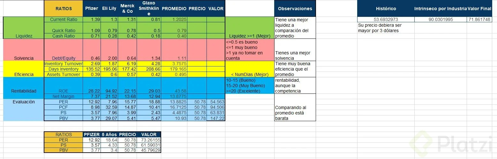

# Invertir en Bolsa: Análisis Fundamental

>1. Introducción al análisis fundamental

## 1.1. Objetivos

* Calcular el valor intrínseco de una compañía.
* Valuar correctamente una empresa.
* Detectar oportu nidades de compra.

## 1.2. ¿Qué es el análisis fundamental y para qué se utiliza?

Es el análisis que nos ayuda a determinar el valor intrínsico de una empresa, es decir el valor que debería ser cotizado la acción. Esto nos ayuda a encontrar empresas que estan subvaluada o sobrevaluada.

## 1.3. ¿Cuáles son las webs usadas para hacer análisis fundamental?

* **Morningstar:** La usaremos para ver los ratios.
* **Investing:** La usaremos para ver los Estados Contables de las empresas.

Para poder buscar la empresa en estas webs, se necesita saber el ticker de la empresa

>2. Conocer y entender los Estados Financieros de una Empresa

## 2.1. Qué es un balance general

Es el estado contable donde se ve que tiene la empresa y como lo financió.

| ACTIVOS | PASIVOS | PATRIMONIO |
| ------- | ------- | ---------- |
| Activos Corrientes: Dinero que puedo conseguir rapidamente en menos de 12 meses | Pasivos Corrientes: Deuda a pagar en menos de 12 meses | Patrimonio: Capital de los accionistas. |
| Activos No Corrientes: Dinero que tardaría en liquidar | Pasivos No Corrientes: Deuda con plazo mayor a 12 meses | Ganancias Retenidas: Ganancias generadas y ahún no distribuidas. |

$$
ACTIVOS = PASIVOS + PATRIMONIO
$$

### Obtener Balance General

1. Buscar en Investing.com la empresa
2. Financials >> Balance Sheet
    * Total Current Assets : activo corriente
    * Total Assets: activo corriente + activo no corriente
    * Total Current Liabilities: Pasivos corrientes
    * Total Liabilities: Pasivo corriente + pasivo no corriente
    * Total equity: es el patrimonio total (capital de accionistas y las ganancias generadas aún no distribuidas)

## 2.2 Estado de resultados

Es el estado contable que nos muestra los ingresos y egresos de capital que tiene la empresa contablemente hablando.

* Ingresos o ventas
* Costo de venta
* Beneficio Bruto
* Gastos (operativos,administrativos)
* Beneficio Operativo (EBITDA)
* Depreciaciones y Amortizaciones
* EBIT
* Intereses e impuestos
* Beneficio neto

_EBITDA: Earnings, before, interest, axes, depreciation and amortization_

### Obtener estado de resultados.

1. Buscar en Investing.com la empresa
2. Financials >> Income Statement

## 2.3. Estado de Flujo de efectivo

Es el estado contable que muestra el ingreso y egreso de Efectivo.

| CFO cash Flow Operations | CFI Cash Flow Investments | CFF Cash Flow Financing |
| --- | --- | --- |
| Flujo de caja de desarrollo de actividades | Flujo de caja proveniente de inversiones | Flujo de cada de financiación |

### Obtener estado de resultados.

1. Buscar en Investing.com la empresa
2. Financials >> Cash Flow Statement

>3. ¿Qué es y cómo evaluar la liquidez de una empresa?

## 3.1. La importancia del pago de deudas a corto plazo

### Liquidez

Es la capacidad de una empresa para pagar su deuda a corto plazo.

**¿Por qué es importante?**
¿Invertirías en una empresa $l.ooo.ooo que debe y tiene dólares en el Banco?
Conocer la liquidez de una compañía nos ayuda a saber cuan seguro estará nuestro dinero en el corto plazo.

## 3.2. Ratio

Que sucede si la empresa no es capaz de vender lo que tiene en su inventario?

**Formula de Current Ratio:**

$ \frac{Activos Corrientes}{Pasivos Corrientes}$

### Obtener estado de resultados.

1. Buscar en Investing.com la empresa
2. Financials >> Ratios

_Para poder escoger una empresa es recomendable un currente ratio mayor a 1.5_

**Resumen:**
_Este ratio nos ayuda a medir la capacidad que tiene una empresa de cubrir sus deudas de corto plazo_

## 3.3. Quick Ratio

¿Puede pagar sus deudas del corto plazo con 10 que posee a pesar de no ser capaz de vender su stock?

**Formula:**

$\frac{Activos\ corrientes — Inventario}{Pasivos corrientes}$

### Obtener estado de resultados.

1. Buscar en Investing.com la empresa
2. Financials >> Ratios

## 3.4. Cash Ratio

¿Puede la empresa pagar
todas sus deudas del corto
plazo con lo que tiene
actualmente en el Banco?

**Formula:**

$\frac{Efectivo}{Pasivos corrientes}$

_Al no encontrar el key en una pagina, nosotros mismo lo calculamos desde el balance general._

x = Total Currente Assets > Cash and short term investment
y = Total Current Liabilities

>4. ¿Qué es y cómo evaluar la solvencia de una empresa?

## 4.1. La importancia del pago de deudas en el largo plazo

### Solvencia

Es la capacidad que tiene una empresa de pagar sus deudas de largo plazo.

## 4.2. Debt Equity

**Formula:**

$\frac{Pasivos}{Patrimonio}$

¿En qué porcentaje se encuentra la empresa financiada por  deuda?

### Obtener estado de resultados.

1. Buscar en Investing.com la empresa
2. Financials >> Ratios

>5. ¿A qué se denomina empresa eficiente?

## 5.1. ¿Por qué es tan importante la eficiencia de una empresa?

La eficiencia es la capacidad que tiene una empresa de generar ingresos con sus recursos.

_Es importante medir la eficiencia cuando las empresas no son solventes ni liquidas_

## 5.2. Inventory turnover

El Inventory Turnover es un indicador de eficiencia que mide cuántas veces una empresa vende y reemplaza su inventario durante un período. Evalúa qué tan eficaz es la empresa en la gestión de su inventario para generar ventas.

**Formula:**

$\frac{Costo del periodo}{Inventario promedio}$

_Donde el inventario promedio seria del invitario inicial y final del periodo_

**Interpretación de un Inventory Turnover:**
El Inventory Turnover es 4, lo que significa que la empresa vende y repone su inventario 4 veces al año. Esto puede ser un indicador positivo de una buena rotación de inventarios, aunque dependerá de la industria y el contexto.

## 5.3. Days inventory

**Formula:**

$\frac{365}{Inventory Turnover}$

¿Cada cuántos días renueva su inventario?

## 5.4. Assets Turnover

**Formula:**

$\frac{Ventas}{Activo fijo}$

¿Cuán buena es usando sus activos para generar ingresos?

>6. ¿Cómo detectar empresas rentables?

## 6.1. Introducción a los ratios de rentabilidad

### Rentabilidad

Es la capacidad de una empresa de generar ganancias.

_Es importante analizar la rentabilidad de una empresa cuando tenga baja eficiencia_

## 6.2. ROE Return on Equity

**Formula:**

$\frac{Beneficio neto}{Capital de los accionistas}$

¿Cuántos dólares de ganancia le corresponden a cada dólar de patrimonio?
_Significa que si hay 10$ de beneficio y 10$ de capital, entonces, por cada dolar que ponemos hay 1 un dolar de ganancia._

## 6.3. Net Margin: margen de beneficio neto

**Formula:**

$\frac{Beneficio neto}{Ventas}$

¿Qué porcentaje del dinero que ingresa se queda en la empresa?

>7. Detectar empresas con potencial de inversión

## 7.1. Valuación

Es hallar el valor intrínseco de una
empresa.

Ejemplo (pelota firmada):
¿Cuánto vale realmente?

## 7.2. Earnings Per Share o EPS: Cuanto gana una empresa por acción

**Formula:**

$\frac{Beneficio neto — dividendos}{Acciones en circulación}$

¿Cuántos dólares beneficio generó la empresa para cada accionista?

## 7.3. Indicador de valor: Price Earning Ratio

El **Price-to-Earnings Ratio (P/E)** es un indicador financiero que compara el precio actual de una acción con las ganancias por acción (EPS) de la empresa. Evalúa cuánto están dispuestos a pagar los inversionistas por cada dólar de ganancia generado por la empresa.

---

**Fórmula**

**1. A nivel de la acción:**

$\text{P/E Ratio} = \frac{\text{Precio de la Acción}}{\text{Ganancias por Acción (EPS)}}$

- **Ganancias por Acción (EPS):**  

$\text{EPS} = \frac{\text{Ganancias Totales}}{\text{Acciones en Circulación}}$

**2. A nivel de la empresa (P/E total):**

$\text{P/E Ratio} = \frac{\text{Capitalización de Mercado}}{\text{Ganancias Totales}}$

---

## **Interpretación del P/E Ratio**

### **1. P/E Ratio bajo (<15):**
- Los inversionistas pagan menos por cada dólar de ganancia.
- Puede indicar que la empresa está subvalorada o enfrenta desafíos financieros.

### **2. P/E Ratio alto (>20):**
- Los inversionistas están dispuestos a pagar más por cada dólar de ganancia.
- Sugiere altas expectativas de crecimiento o sobrevaloración.

### **3. Comparación por industria:**
El P/E Ratio varía según el sector. Ejemplos:
- Empresas tecnológicas: Ratios más altos debido a expectativas de rápido crecimiento.
- Empresas de sectores tradicionales: Ratios más bajos por menor volatilidad.

## 7.4. Indicador de valor: Price to Sales Ratio

El **Price-to-Sales Ratio (P/S)** es un indicador financiero que compara el precio de mercado de una acción con los ingresos por ventas generados por la empresa. Evalúa cuánto están dispuestos a pagar los inversionistas por cada dólar de ventas.

---

### **Fórmulas**

**1. A nivel de la empresa (P/S total):**

$
\text{P/S Ratio} = \frac{\text{Capitalización de Mercado}}{\text{Ingresos Totales}}
$

- **Capitalización de mercado:** Precio actual de la acción multiplicado por el número total de acciones en circulación.  
- **Ingresos Totales:** Ventas totales de la empresa durante un período (generalmente el último año fiscal).

**2. A nivel de acción (P/S por acción):**

$
\text{P/S Ratio} = \frac{\text{Precio de la Acción}}{\text{Ingresos por Acción}}
$

- **Ingresos por Acción (Sales per Share):**  
$
\text{Ingresos por Acción} = \frac{\text{Ingresos Totales}}{\text{Acciones en Circulación}}
$

---

**Ejemplo Práctico**

**Datos Ficticios:**
- **Precio actual de la acción:** $50  
- **Acciones en circulación:** 10 millones  
- **Ingresos Totales (Sales):** $200 millones  

1. **Calcular la Capitalización de Mercado:**
$
\text{Capitalización de Mercado} = \text{Precio de la Acción} \times \text{Acciones en Circulación}
$
$
\text{Capitalización de Mercado} = 50 \times 10,000,000 = 500,000,000 \, \text{(500 millones de dólares)}
$

2. **Calcular el P/S Ratio:**
$
\text{P/S Ratio} = \frac{\text{Capitalización de Mercado}}{\text{Ingresos Totales}}
$
$
\text{P/S Ratio} = \frac{500,000,000}{200,000,000} = 2.5
$

---

**Interpretación del P/S Ratio**

**1. P/S Ratio bajo (<1):**
- Los inversionistas están pagando menos de $1 por cada $1 de ingresos.
- Puede indicar que la empresa está subvalorada o tiene problemas financieros.

**2. P/S Ratio alto (>2 o 3):**
- Los inversionistas están pagando más de $2-$3 por cada $1 de ingresos.
- Sugiere potencial de crecimiento o que la empresa está sobrevalorada.

**3. Promedio por industria:**
El P/S Ratio varía según el sector. Ejemplos:
- Empresas tecnológicas: Suelen tener ratios más altos por altas expectativas de crecimiento.
- Sectores tradicionales: Suelen tener ratios más bajos.

---

## **Conclusión**
El **Price-to-Sales Ratio** es útil para valorar empresas en función de sus ingresos. Sin embargo, debe complementarse con otros indicadores financieros como el **P/E Ratio** y el **Debt-to-Equity Ratio** para una evaluación completa.

## 7.5. Book Value: Cuánto vale lo que posee la empresa

$ \frac{Patrimonio}{cantidad de acciones} $

¿Qué porcentaje del patrimonio le corresponde a cada acción?

## 7.8. Indicador de valor: Price to Book Value

$ \frac{Precio}{BV} $

¿Cuánto pagan los accionistas cada dólar propio de la empresa?

## 7.9. Indicador de valor: Price to Cash Flow

$ \frac{Precio}{\frac{Cash Flow
Operativo}{acciones} } $

¿Cuánto pagan los accionistas cada dólar de ganancia en
efectivo?

>8. Detectar señales de compra

