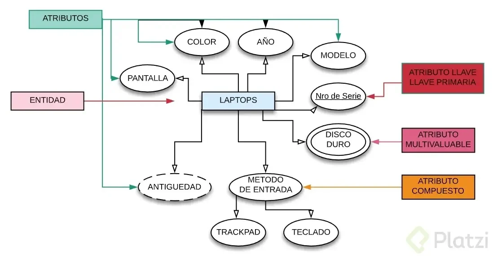
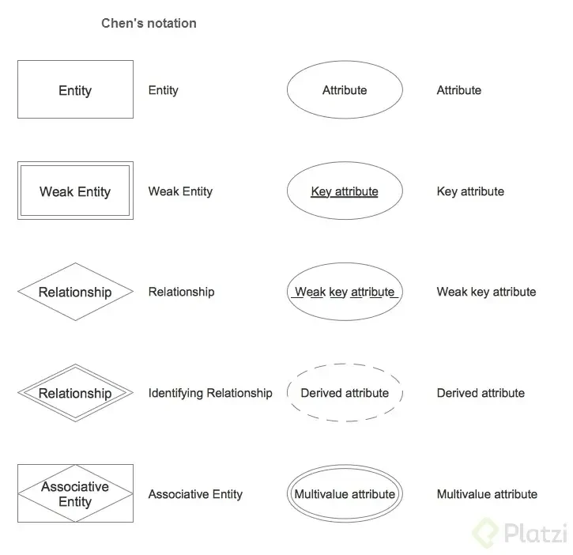
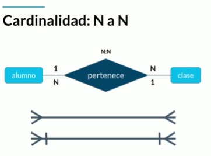
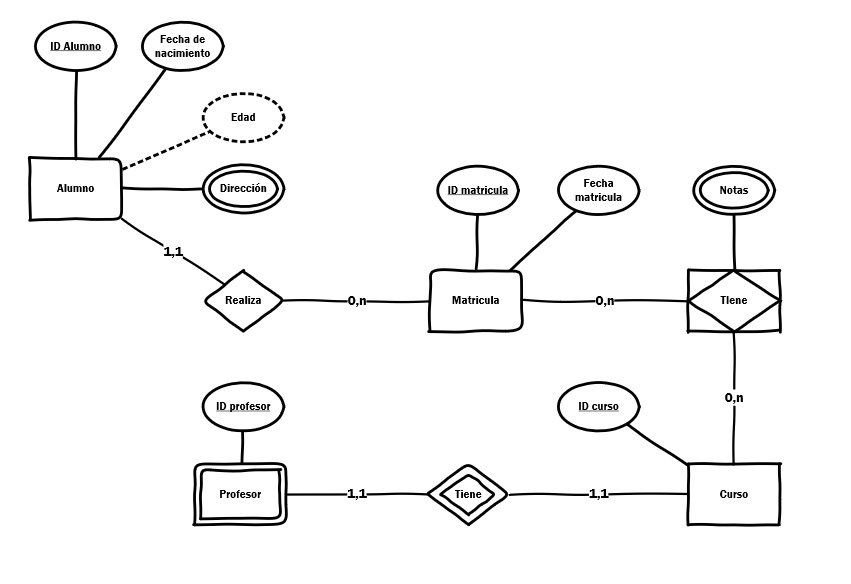
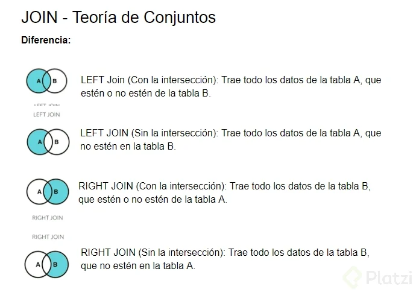
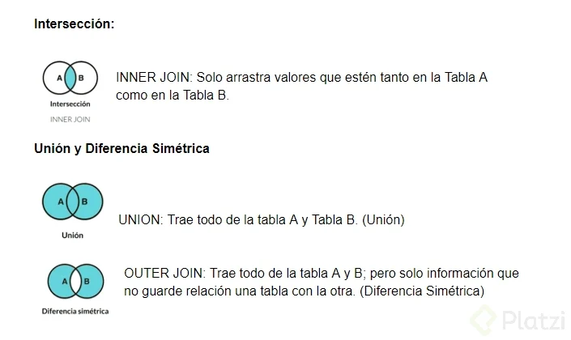

# Fundamentos de Bases de Datos

## Tabla de Contenido

[TOC]

Las bases de datos entran cuando hacemos la transición a medios digitales.

**Tipos de bases de datos:**

Relacionales: En la industria hay varias compañías dedicadas a ser manejadoras de bases de datos relacionales como SQL Server, Oracle, MariaDB, entre otras.
No relacionales: Todavía están avanzando y existen ejemplos muy distintos como cassandra, elasticsearch, neo4j, MongoDB, entre otras.

Servicios:

- Auto administrados: Es la base de datos que instalas tú y te encargas de actualizaciones, mantenimiento, etc.
- Administrados: Servicios que ofrecen las nubes modernas como Azure y no debes preocuparte por mantenimiento o actualizaciones.

## 1. Introducción a las bases de datos relacionales

### 1.1. Historia de las bases de datos relacionales

Las bases de datos surgen de la necesidad de conservar la información más allá de lo que existe en la memoria RAM.

Las bases de datos basadas en archivos eran datos guardados en texto plano, fáciles de guardar pero muy difíciles de consultar y por la necesidad de mejorar esto nacen las bases de datos relacionales. Su inventor Edgar Codd dejó ciertas reglas para asegurarse de que toda la filosofía de las bases de datos no se perdiera, estandarizando el proceso.

### 1.2. Qué son entidades y atributos

En bases de datos, una entidad es la representación de un objeto o concepto del mundo real que se describe en una base de datos. Las entidades se describen en la estructura de la base de datos empleando un modelo de datos.

#### 1.2.1. ¿Qué es una entidad?

Una entidad es algo similar a un objeto (programación orientada a objetos) y representa algo en el mundo real, incluso algo abstracto. Tienen atributos que son las cosas que los hacen ser una entidad y por convención se ponen en plural.

Ejemplo de entidad en bases de datos

En la imagen puedes observar como ejemplo que la enidad Laptops posee diferentes atributos como colo, pantalla, año, modelo, etc.



#### 1.2.2. ¿Qué es un atributo?

Son las características o propiedades que describen a la entidad (se encierra en un óvalo). Los atributos se componen de:

Los atributos compuestos son aquellos que tienen atributos ellos mismos.

Los atributos llave son aquellos que identifican a la entidad y no pueden ser repetidos. Existen:

- Naturales: son inherentes al objeto como el número de serie
- Clave artificial: no es inherente al objeto y se asigna de manera arbitraria.

**Tipos de entidades:**

- Entidades fuertes: son entidades que pueden sobrevivir por sí solas.

- Entidades débiles: no pueden existir sin una entidad fuerte y se representan con un cuadrado con doble línea.

Identidades débiles por identidad: no se diferencian entre sí más que por la clave de su identidad fuerte.
Identidades débiles por existencia: se les asigna una clave propia.

**Cómo representar las entidades en bases de datos:**

Existen varios tipos de notaciones para los modelos entidad relacionamiento. Chen es uno de los más utilizados para diagramar lógicamente la base de datos. Aquí te mostramos un ejemplo.


| Concepto               | Descripción                                                                                              |
|------------------------|----------------------------------------------------------------------------------------------------------|
| Entidad Fuerte         | Una entidad que puede existir por sí misma y tiene una clave primaria propia para identificación única. |
| Entidad Débil          | Una entidad que depende de otra entidad (entidad propietaria) para su identificación.                     |
| Relación               | Una asociación entre dos o más entidades que describe cómo se relacionan entre sí.                        |
| Relación de Identificación | Una relación en la que la clave primaria de una entidad débil incluye al menos un atributo de la clave primaria de la entidad fuerte a la que está relacionada. |
| Entidad Asociativa     | Una entidad que se utiliza para descomponer una relación muchos a muchos en relaciones uno a muchos.      |
| Atributo               | Una propiedad o característica de una entidad.                                                            |
| Clave Primaria         | Atributo o conjunto de atributos que identifican de manera única a cada instancia de una entidad.         |
| Atributo Llave Débil   | Atributo que forma parte de la clave primaria de una entidad débil, que depende de otra entidad para su identificación. |
| Atributo Derivado      | Atributo cuyo valor se deriva o calcula a partir de otros atributos.                                       |
| Atributo Multivaluado  | Atributo que puede tener múltiples valores para una única instancia de una entidad.                        |

### 1.3. Relaciones

Las relaciones nos permiten ligar o unir nuestras diferentes entidades y se representan con rombos. Por convención se definen a través de verbos.

Las relaciones tienen una propiedad llamada cardinalidad y tiene que ver con números. Cuántos de un lado pertenecen a cuántos del otro lado:


Tambien tenemos a la cardinalidad de muchos a muchos, donde muchas veces tenemos que hacer una tabla intermedia para poder tratarlas o hay algunas herramientas como power bi que ya crea internamente esta tabla intermedia.



### 1.4. Diagrama ER

Este sería un diagram entidad relación con notación chen



### 1.5. Diagrama Físico: tipos de datos y constraints

Para llevar a la práctica un diagrama debemos ir más allá y darle detalle con parámetros como:

Tipos de dato:

- Texto: CHAR(n), VARCHAR(n), TEXT
- Números: INTEGER, BIGINT, SMALLINT, DECIMAL(n,s), NUMERIC(n,s)
- Fecha/hora: DATE, TIME, DATETIME, TIMESTAMP
- Lógicos: BOOLEAN

Constraints (Restricciones)

- NOT NULL: Se asegura que la columna no tenga valores nulos
- UNIQUE: Se asegura que cada valor en la columna no se repita
- PRIMARY KEY: Es una combinación de NOT NULL y UNIQUE
- FOREIGN KEY: Identifica de manera única una tupla en otra tabla
- CHECK: Se asegura que el valor en la columna cumpla una condición dada
- DEFAULT: Coloca un valor por defecto cuando no hay un valor especificado
- INDEX: Se crea por columna para permitir búsquedas más rápidas

### 1.6. Diagrama Físico: normalización

La normalización como su nombre lo indica nos ayuda a dejar todo de una forma normal. Esto obedece a las 12 reglas de Codd y nos permiten separar componentes en la base de datos:

- Primera forma normal (1FN): Atributos atómicos (Sin campos repetidos)
- Segunda forma normal (2FN): Cumple 1FN y cada campo de la tabla debe depender de una clave única.
- Tercera forma normal (3FN): Cumple 1FN y 2FN y los campos que NO son clave, NO deben tener dependencias.
- Cuarta forma normal (4FN): Cumple 1FN, 2FN, 3FN y los campos multivaluados se identifican por una clave única.

## Ejemplo de Tabla sin Normalizar y Proceso de Normalización

### Tabla sin Normalizar

| ID_Pedido | Nombre_Cliente | Dirección_Cliente           | Teléfono_Cliente | Producto | Cantidad | Precio_Unidad | Precio_Total | Fecha_Pedido | Estado_Pedido |
|-----------|----------------|-----------------------------|------------------|----------|----------|---------------|--------------|--------------|---------------|
| 1         | Juan Pérez     | Calle Mayor 123, Madrid    | +34 654 321 000  | Camiseta | 2        | 10.00€        | 20.00€       | 2023-11-15   | Pendiente     |
| 1         | Juan Pérez     | Calle Mayor 123, Madrid    | +34 654 321 000  | Pantalón | 1        | 50.00€        | 50.00€       | 2023-11-15   | Pendiente     |
| 2         | María García   | Avenida del Sol 456, Barcelona | +34 932 456 789 | Camisa   | 1        | 35.00€        | 35.00€       | 2023-11-16   | Enviado       |
| 2         | María García   | Avenida del Sol 456, Barcelona | +34 932 456 789 | Zapatos  | 2        | 20.00€        | 40.00€       | 2023-11-16   | Enviado       |

### Problemas de la Tabla sin Normalizar

- Anomalías de inserción: No se puede insertar un nuevo producto sin especificar un pedido y un cliente.
- Anomalías de actualización: Si se cambia la dirección de un cliente, se debe actualizar en todas las filas de sus pedidos.
- Anomalías de eliminación: Si se elimina un pedido, se elimina también la información de los productos asociados.
- Redundancia de datos: La información del cliente se repite para cada producto en el mismo pedido.

### Normalización 1NF (Primera Forma Normal)

#### Tabla Cliente

| ID_Cliente | Nombre_Cliente | Dirección_Cliente           | Teléfono_Cliente |
|------------|----------------|-----------------------------|------------------|
| 1          | Juan Pérez     | Calle Mayor 123, Madrid    | +34 654 321 000  |
| 2          | María García   | Avenida del Sol 456, Barcelona | +34 932 456 789 |

#### Tabla Producto

| ID_Producto | Nombre_Producto | Precio_Unidad |
|-------------|-----------------|---------------|
| 1           | Camiseta        | 10.00€        |
| 2           | Pantalón        | 50.00€        |
| 3           | Camisa          | 35.00€        |
| 4           | Zapatos         | 20.00€        |

#### Tabla Pedido

| ID_Pedido | ID_Cliente | Fecha_Pedido | Estado_Pedido |
|-----------|------------|--------------|---------------|
| 1         | 1          | 2023-11-15   | Pendiente     |
| 2         | 2          | 2023-11-16   | Enviado       |

#### Tabla Detalle_Pedido

| ID_Detalle_Pedido | ID_Pedido | ID_Producto | Cantidad |
|-------------------|-----------|-------------|----------|
| 1                 | 1         | 1           | 2        |
| 2                 | 1         | 2           | 1        |
| 3                 | 2         | 3           | 1        |
| 4                 | 2         | 4           | 2        |

### Beneficios de la Normalización 1NF

- Elimina las anomalías de inserción.
- Reduce la redundancia de datos.

### Normalización 2NF (Segunda Forma Normal)

La segunda forma normal (2NF) requiere que todas las tablas no claves estén completamente dependientes de la clave primaria. En otras palabras, no se pueden almacenar datos que dependan solo de una parte de la clave primaria.

#### Tabla Pedido 2NF

| ID_Pedido | ID_Cliente | Fecha_Pedido | Estado_Pedido |
|-----------|------------|--------------|---------------|
| 1         | 1          | 2023-11-15   | Pendiente     |
| 2         | 2          | 2023-11-16   | Enviado       |

#### Tabla Detalle_Pedido 2NF

| ID_Detalle_Pedido | ID_Pedido | ID_Producto | Cantidad | Precio_Total |
|-------------------|-----------|-------------|----------|--------------|
| 1                 | 1         | 1           | 2        | 20.00€       |
| 2                 | 1         | 2           | 1        | 50.00€       |
| 3                 | 2         | 3           | 1        | 35.00€       |
| 4                 | 2         | 4           | 2        | 40.00€       |

##### Problema de la tabla 2NF

- Anomalías de actualización: Si se cambia el precio de un producto, se debe actualizar en todos los detalles de los pedidos en los que se ha comprado.

##### Solución

Crear una nueva tabla Precio_Producto para almacenar los precios de los productos de forma independiente.

#### Tabla Precio_Producto

| ID_Producto | Precio_Unidad | Fecha_Vigencia | Fecha_Baja |
|-------------|---------------|----------------|------------|
| 1           | 10.00€        | 2023-11-01     | NULL       |
| 2           | 50.00€        | 2023-11-01     | NULL       |
| 3           | 35.00€        | 2023-11-10     | NULL       |
| 4           | 20.00€        | 2023-11-10     | NULL       |

#### Tabla Detalle_Pedido_Actualizado

| ID_Detalle_Pedido | ID_Pedido | ID_Producto | Cantidad | ID_Precio_Producto |
|-------------------|-----------|-------------|----------|---------------------|
| 1                 | 1         | 1           | 2        | 1                   |
| 2                 | 1         | 2           | 1        | 2                   |
| 3                 | 2         | 3           | 1        | 3                   |
| 4                 | 2         | 4           | 2        | 4                   |

#### Beneficios de la normalización 2NF

- Elimina las anomalías de actualización relacionadas con los precios de los productos.

### Normalización 3NF (Tercera Forma Normal)

La tercera forma normal (3NF) requiere que todas las tablas no claves estén completamente dependientes de la clave primaria y que no existan dependencias transitivas entre atributos no claves.

#### Problema de la tabla 3NF

- Dependencia transitiva: El atributo Precio_Total en la tabla Detalle_Pedido_Actualizado depende transitivamente del atributo ID_Cliente a través del atributo ID_Pedido.

##### Solución 3NF

Crear una nueva tabla Pedido_Cliente para almacenar la información de los pedidos y clientes de forma conjunta.

#### Tabla Pedido_Cliente

| ID_Pedido | ID_Cliente | Fecha_Pedido | Estado_Pedido |
|-----------|------------|--------------|---------------|
| 1         | 1          | 2023-11-15   | Pendiente     |
| 2         | 2          | 2023-11-16   | Enviado       |

#### Tabla Detalle_Pedido_Final

| ID_Detalle_Pedido | ID_Pedido | ID_Producto | Cantidad | ID_Precio_Producto |
|-------------------|-----------|-------------|----------|---------------------|
| 1                 | 1         | 1           | 2        | 1                   |
| 2                 | 1         | 2           | 1        | 2                   |
| 3                 | 2         | 3           | 1        | 3                   |
| 4                 | 2         | 4           | 2        | 4                   |

#### Beneficios de la normalización 3NF

- Elimina las dependencias transitivas.
- Reduce la redundancia de datos.

### Normalización BCNF (Forma Normal de Boyce-Codd)

La forma normal de Boyce-Codd (BCNF) es una forma más restrictiva de la 3NF que elimina todas las dependencias determinantes no triviales.

## 2. RDBMS (MySQL) o como hacer lo anterior de manera práctica

RDB (relational database)

RDBMS (Relational DataBase Management System) Sistema Manejador de Bases de datos relacionales.

La diferencia entre ambos es que las RDD son un conjunto de datos pertenecientes ( o al menos en teoría) a un mismo tipo de contexto, que guarda los datos de forma persistente para un posterior uso, y el Sistema de gestión de RDBMS o sistema manejador, es el que nos permite acceder a ella, es un software, herramienta que sirve de conexión entre las BBDD y el usuario (nos presenta una interfaz para poder gestionarla, manejarla).

RDBMS

MySQL
PostgreSQL
Etc
Todas toman un lenguaje base, pero cada uno lo apropia, imponiéndole diferentes reglas y características.

### 2.1. Clientes gráficos

Son RDBMS que instalas en tu local como workbench o data bearer

### 2.2. Servicios administrados

Hoy en día muchas empresas ya no tienen instalados en sus servidores los RDBMS sino que los contratan a otras personas. Estos servicios administrados cloud te permiten concentrarte en la base de datos y no en su administración y actualización.

## 3. SQL hasta en la sopa

### 3.1. Historia de SQL

SQL significa Structured Query Language y tiene una estructura clara y fija. Su objetivo es hacer un solo lenguaje para consultar cualquier manejador de bases de datos volviéndose un gran estándar.

Ahora existe el NOSQL o Not Only Structured Query Language que significa que no sólo se utiliza SQLen las bases de datos no relacionales.

### 3.2. DDL

SQL tiene dos grandes sublenguajes:

DDL o Data Definition Language que nos ayuda a crear la estructura de una base de datos. Existen 3 grandes comandos:

- Create: Nos ayuda a crear bases de datos, tablas, vistas, índices, etc.

```sql
-- PostgreSQL
CREATE TABLE Empleados (
    ID SERIAL PRIMARY KEY,
    Nombre VARCHAR(100),
    Apellido VARCHAR(100),
    Edad INTEGER,
    Cargo VARCHAR(100)
);

-- SQLserver
CREATE TABLE Empleados (
    ID INT PRIMARY KEY IDENTITY(1,1),
    Nombre NVARCHAR(100),
    Apellido NVARCHAR(100),
    Edad INT,
    Cargo NVARCHAR(100)
);
```

- Alter: Ayuda a alterar o modificar entidades.

```sql
-- PostgreSQL
ALTER TABLE Empleados
ADD COLUMN Salario DECIMAL(10,2);

-- SQLserver
ALTER TABLE Empleados
ADD Salario DECIMAL(10,2);
```

- Drop: Nos ayuda a borrar. Hay que tener cuidado al utilizarlo.

```sql
-- PostgreSQL
DROP TABLE IF EXISTS Empleados;

-- SQLserver
DROP TABLE IF EXISTS Empleados;
```

3 objetos que manipularemos con el lenguaje DDL:

- Database o bases de datos
- Table o tablas. Son la traducción a SQL de las entidades
- View o vistas: Se ofrece la proyección de los datos de la base de datos de forma entendible.

### 3.3. CREATE VIEW y DDL ALTER

Crear vistas sirve tomar datos colocarlo de una forma presentables que podamos consultar constantemente.

- Crear vista

```sql
-- PostgreSQL
CREATE VIEW VistaEmpleados AS
SELECT ID, Nombre, Apellido, Cargo
FROM Empleados
WHERE Edad > 30;

-- SQLserver
CREATE VIEW VistaEmpleados AS
SELECT ID, Nombre, Apellido, Cargo
FROM Empleados
WHERE Edad > 30;
```

- Alterar vista

```sql
-- PostgreSQL
CREATE OR REPLACE VIEW VistaEmpleados AS
SELECT ID, Nombre, Apellido, Cargo, Salario
FROM Empleados;

-- SQLserver
CREATE OR ALTER VIEW VistaEmpleados AS
SELECT ID, Nombre, Apellido, Cargo, Salario
FROM Empleados;
```

### 3.4. DML

DML trata del contenido de la base de datos. Son las siglas de Data Manipulation Language y sus comandos son:

- Insert: Inserta o agrega nuevos registros a la tabla.

```sql
-- PostgreSQL
INSERT INTO Empleados (Nombre, Apellido, Edad, Cargo, Salario)
VALUES ('Juan', 'Perez', 35, 'Gerente', 50000.00);

-- SQLserver
INSERT INTO Empleados (Nombre, Apellido, Edad, Cargo, Salario)
VALUES ('Juan', 'Perez', 35, 'Gerente', 50000.00);
```

- Update: Actualiza o modifica los datos que ya existen.

```sql
-- PostgreSQL
UPDATE Empleados
SET Cargo = 'Analista'
WHERE ID = 1;

-- SQLserver
UPDATE Empleados
SET Cargo = 'Analista'
WHERE ID = 1;
```

- Delete: Esta sentencia es riesgosa porque puede borrar el contenido de una tabla.

```sql
-- PostgreSQL
DELETE FROM Empleados
WHERE ID = 1;

-- SQLserver
DELETE FROM Empleados
WHERE ID = 1;
```

- Select: Trae información de la base de datos.

```sql
-- PostgreSQL
SELECT * FROM Empleados;

-- SQLserver
SELECT * FROM Empleados;
```

### 3.5.¿Qué tan standard es SQL?

La utilidad más grande de SQL fue unificar la forma en la que pensamos y hacemos preguntas a un repositorio de datos. Ahora que nacen nuevas bases de datos igualmente siguen tomando elementos de SQL.

### 3.6. Tablas independientes

Una buena práctica es comenzar creando las entidades que no tienen una llave foránea.
Generalmente en los nombres de bases de datos se evita usar eñes o acentos para evitar problemas en los manejadores de las bases de datos.

### 3.7. Tablas dependientes

Despues de crear las tablas independientes, se crean las dependientes, además tneemos las siguientes opciones

- CASCADE: Si se actualiza o elimina una fila en la tabla principal (Departamentos en este caso), automáticamente se actualizan o eliminan las filas correspondientes en la tabla secundaria (Empleados).
- SET NULL: Si se actualiza o elimina una fila en la tabla principal, los valores de las columnas en la tabla secundaria se establecen en NULL.
- SET DEFAULT: Si se actualiza o elimina una fila en la tabla principal, los valores de las columnas en la tabla secundaria se establecen en el valor predeterminado especificado.
- NO ACTION (o RESTRICT): Se rechaza la acción de actualización o eliminación si hay filas relacionadas en la tabla secundaria.

Tabla independiente

```sql
-- PostgreSQL
CREATE TABLE Departamentos (
    ID SERIAL PRIMARY KEY,
    Nombre VARCHAR(100),
    Descripcion TEXT
);

-- SQLserver
CREATE TABLE Departamentos (
    ID INT PRIMARY KEY IDENTITY(1,1),
    Nombre NVARCHAR(100),
    Descripcion NVARCHAR(MAX)
);
```

Tabla dependiente

```sql
-- PostgreSQL
CREATE TABLE Empleados (
    ID SERIAL PRIMARY KEY,
    Nombre VARCHAR(100),
    Apellido VARCHAR(100),
    DepartamentoID INTEGER REFERENCES Departamentos(ID) ON UPDATE CASCADE ON DELETE SET NULL
);

-- SQLserver
CREATE TABLE Empleados (
    ID INT PRIMARY KEY IDENTITY(1,1),
    Nombre NVARCHAR(100),
    Apellido NVARCHAR(100),
    DepartamentoID INT FOREIGN KEY REFERENCES Departamentos(ID) ON UPDATE CASCADE ON DELETE SET NULL
);
```

### 3.8. Tablas transitivas

Las tablas transitivas sirven como puente para unir dos tablas que tienen relación de muchos a muchos. No tienen contenido semántico.

Reverse Engineer nos reproduce el esquema o DER del cual nos basamos para crear nuestras tablas. Es útil cuando llegas a un nuevo trabajo y quieres entender cuál fue la mentalidad que tuvieron al momento de crear las bases de datos.

```sql
-- PostgreSQL
CREATE TABLE Asignaciones (
    ID SERIAL PRIMARY KEY,
    EmpleadoID INTEGER REFERENCES Empleados(ID),
    ProyectoID INTEGER REFERENCES Proyectos(ID)
);

-- SQLserver
CREATE TABLE Asignaciones (
    ID INT PRIMARY KEY IDENTITY(1,1),
    EmpleadoID INT FOREIGN KEY REFERENCES Empleados(ID),
    ProyectoID INT FOREIGN KEY REFERENCES Proyectos(ID)
);
```

## 4. Consultas a una base de datos

### 4.1. Estructura básica de un Query

```sql
-- PostgreSQL
SELECT columna1, columna2, SUM(columna3) AS total
FROM tabla
WHERE condicion
GROUP BY columna1, columna2
HAVING SUM(columna3) > 100
ORDER BY columna1 ASC, columna2 DESC;

-- SQLserver
SELECT columna1, columna2, SUM(columna3) AS total
FROM tabla
WHERE condicion
GROUP BY columna1, columna2
HAVING SUM(columna3) > 100
ORDER BY columna1 ASC, columna2 DESC;
```

- SELECT: Especifica las columnas que se deben recuperar en los resultados de la consulta.
- FROM: Indica la(s) tabla(s) de donde se deben recuperar los datos.
- WHERE: Filtra las filas basadas en una condición específica.
- GROUP BY: Agrupa filas que tienen el mismo valor en una o más columnas especificadas.
- HAVING: Filtra los resultados de las filas agrupadas basadas en una condición específica.
- ORDER BY: Ordena los resultados en función de una o más columnas, ya sea de forma ascendente (ASC) o descendente (DESC).

### 4.2. Join




#### Left Join

```sql
-- PostgreSQL
SELECT *
FROM tabla1
LEFT JOIN tabla2 ON tabla1.id = tabla2.id;


-- SQLserver
SELECT *
FROM tabla1
LEFT JOIN tabla2 ON tabla1.id = tabla2.id;
```

#### Left Join sin intersección

```sql
-- PostgreSQL
SELECT *
FROM tabla1
LEFT JOIN tabla2 ON tabla1.id = tabla2.id
WHERE tabla2.id IS NULL;


-- SQLserver
SELECT *
FROM tabla1
LEFT JOIN tabla2 ON tabla1.id = tabla2.id
WHERE tabla2.id IS NULL;
```

#### Inner Join

```sql
-- PostgreSQL
SELECT *
FROM tabla1
INNER JOIN tabla2 ON tabla1.id = tabla2.id;

-- SQLserver
SELECT *
FROM tabla1
INNER JOIN tabla2 ON tabla1.id = tabla2.id;
```

#### Full Outer Join

```sql
-- PostgreSQL
SELECT *
FROM tabla1
FULL OUTER JOIN tabla2 ON tabla1.id = tabla2.id;

-- SQLserver
SELECT *
FROM tabla1
FULL OUTER JOIN tabla2 ON tabla1.id = tabla2.id;
```

#### Full Outer Join sin intersección

```sql
-- PostgreSQL
SELECT *
FROM tabla1
FULL OUTER JOIN tabla2 ON tabla1.id = tabla2.id
WHERE tabla1.id IS NULL OR tabla2.id IS NULL;

-- SQLserver
SELECT *
FROM tabla1
FULL OUTER JOIN tabla2 ON tabla1.id = tabla2.id
WHERE tabla1.id IS NULL OR tabla2.id IS NULL;
```

### 4.3. Like y Beetwen

Para like usamos lo siguiente

1) _: Representa un solo carácter en la posición especificada.Por ejemplo, si quieres encontrar palabras que tengan exactamente cinco letras y comiencen con "A", podrías usar: LIKE 'A____'.
2) []: Representa un solo carácter dentro del conjunto especificado.Por ejemplo, LIKE '[abc]%' encontraría todas las palabras que comiencen con "a", "b" o "c".
3) [^]: Representa un solo carácter que no esté dentro del conjunto especificado.Por ejemplo, LIKE '[^aeiou]%' encontraría todas las palabras que no comiencen con una vocal.
4) (%): representa todo

```sql
-- PostgreSQL
SELECT *
FROM tabla
WHERE columna LIKE '%patron%';

-- SQLserver
SELECT *
FROM tabla
WHERE columna LIKE '%patron%';
```

Para beetwen

```sql
-- PostgreSQL
SELECT *
FROM tabla
WHERE columna BETWEEN valor1 AND valor2;

-- SQLserver
SELECT *
FROM tabla
WHERE columna BETWEEN valor1 AND valor2;
```

### 4.4. Nested queries

Los Nested queries significan que dentro de un query podemos hacer otro query. Esto sirve para hacer join de tablas, estando una en memoria. También teniendo un query como condicional del otro.

Este proceso puede ser tan profundo como quieras, teniendo infinitos queries anidados.
Se le conoce como un producto cartesiano ya que se multiplican todos los registros de una tabla con todos los del nuevo query. Esto provoca que el query sea difícil de procesar por lo pesado que puede resultar.

```sql
SELECT title, date_publi, status
FROM posts
WHERE date_publi = (
    SELECT MAX(date_publi)
    FROM posts
);

Select NuevaTabla.Fecha, Count(*) As Cant
From (
    Select Date(Min(fecha_publicacion)) As Fecha, Year(fecha_publicacion) As Año
    From posts
    Group By Año
) As NuevaTabla
Group By NuevaTabla.Fecha
Order By NuevaTabla.Fecha;
```

### 4.5. ¿Cómo convertir una pregunta en un query SQL?

De pregunta a Query

- SELECT: Lo que quieres mostrar
- FROM: De dónde voy a tomar los datos
- WHERE: Los filtros de los datos que quieres mostrar
- GROUP BY: Los rubros por los que me interesa agrupar la información
- ORDER BY: El orden en que quiero presentar mi información
- HAVING: Los filtros que quiero que mis datos agrupados tengan

## 5. Manejo de datos no relacionales

### 5.1. Top level collection con Firebase

El modelo de bases de datos no relacionales es un poco más cercano al mundo real en su comportamiento.

Las top level collections son las colecciones que se tienen de inmediato o entrada en el proyecto.
Firebase es un servicio que tiene múltiples opciones y está pensado principalmente para aplicaciones móviles y web.

> Firebase es gratis hasta 1gb, 1.5 millones de operaciones de lectura y 600 mil de escritura

Firebase:

- Firebase es una plataforma de desarrollo de aplicaciones móviles y web que ofrece una amplia gama de herramientas y servicios para ayudar a los desarrolladores a construir, mejorar y hacer crecer sus aplicaciones.
- Algunas de las características principales de Firebase incluyen autenticación de usuarios, base de datos en tiempo real, almacenamiento de archivos, análisis, mensajería en la nube, hosting de aplicaciones web y mucho más.
- Firebase permite a los desarrolladores crear aplicaciones de alta calidad de manera más rápida y eficiente al proporcionar una infraestructura lista para usar y herramientas de desarrollo que facilitan tareas comunes.

Firestore:

- Firestore es un servicio de base de datos en la nube ofrecido por Firebase que se utiliza para almacenar y sincronizar datos en tiempo real entre clientes y servidores.
- Firestore es una base de datos NoSQL que se basa en el modelo de datos de documentos y colecciones. Los datos se organizan en documentos que se almacenan dentro de colecciones, y cada documento se representa en formato JSON.
- Una de las características clave de Firestore es su capacidad para sincronizar datos en tiempo real entre clientes y servidores. Esto significa que los cambios realizados en los datos en un dispositivo se reflejan automáticamente en todos los demás dispositivos conectados a la misma base de datos, proporcionando una experiencia de aplicación fluida y en tiempo real para los usuarios.

### 5.2. Creando y borrando documentos en Firestore

Tipos de datos en Firestore:

- String: Cualquier tipo de valor alfanumérico
- Number: Soporta enteros y flotantes.
- Boolenan: Los clásicos valores True y False
- Map: Permite agregar un documento dentro de otro.
- Array: Permite agregar un conjunto de datos (soporte multi type) sin nombre e identificador.
- Null: Indica que no se ha definido un valor.
- Timestamp: Permite almacenar fechas (guarda el año, mes, día y hora).
- Geopoint: Guarda una localización geográfica (coordenadas latitud-longitud).
- Reference: Permite referencia un documento (relaciona dos documentos, no importa su colección).

### 5.3. Colecciones vs subcolecciones

La particularidad de las top level collections es que existen en el primer nivel de manera intrínseca. Las subcolecciones ya no vivirán al inicio de la base de datos.

Si tienes una entidad separada que vas a referenciar desde muchos lugares es recomendado usar un top level collection. Por el otro lado si se necesita hacer algo intrínseco al documento es aconsejable usar subcolecciones.

>Un top level collection se utilizaria para relaciones de tipo "agregacion". Mientras que una sub collection se utilizaria para relaciones tipo "composicion".
>
>Por ejemplo:
>
>Tenemos Estudiantes, Cursos y Notas. Los estudiantes tiene cursos y los cursos tiene estudiantes. Si se elimina un curso los estudiantes no deben ser eliminados. Lo mismo si se elimina un estudiante los cursos no deben ser elimiandos. Esto es una relacion de agregacion. Aqui se usaria top level collection para estudiantes y cursos.
>
>Los estudiantes tienen notas y las notas pertenecen a un estudiante. Si se elimina un estudiante, tiene sentido eliminar las notas. Esto es una relacion de composicion. Aqui se usarian las subcollections. El estudiante tendría una subcollection de notas.

## 6. Bases de datos en la vida real

### 6.1. Big Data

Big Data es un concepto que nace de la necesidad de manejar grandes cantidades de datos. La tendencia comenzó con compañías como YouTube al tener la necesidad de guardar y consultar mucha información de manera rápida.
Es un gran movimiento que consiste en el uso de diferentes tipos de bases de datos.

### 6.2. Data warehouse

Data Warehouse trata de guardar cantidades masivas de datos para la posteridad. Allí se guarda todo lo que no está viviendo en la aplicación pero es necesario tenerlo.
Debe servir para guardar datos por un largo periodo de tiempo y estos datos se deben poder usar para poder encontrar cuestiones interesantes para el negocio.

### 6.3. Data mining

El Data Mining se dedica a minar datos, a extraerlos de donde sea que estén (archivos muertos, base de datos actual, etc…) y hacer sentido de ellos para darles un uso.

### 6.4. ETL

ETL son las siglas de Extract, Transform, Load (extraer, transformar y cargar). Se trata de tomar datos de archivos muertos y convertirlos en algo que sea de utilidad para el negocio.
También ayuda a tomar los datos vivos de la aplicación, transformarlos y guardarlos en un data warehouse periódicamente.

### 6.5. Business intelligence

Business Intelligence es una parte muy importante de las carreras de datos ya que es el punto final del manejo de estos. Su razón de ser es tener la información lista, clara y que tenga todos los elementos para tomar decisiones en una empresa.
Es necesario tener una buena sensibilidad por entender el negocio, sus necesidades y la información que puede llevar a tomar decisiones en el momento adecuado al momento de realizar business intelligence.

### 6.6 Machine Learning

Machine Learning tiene significados que varían. Es una serie de técnicas que involucran la inteligencia artificial y la detección de patrones.
Machine learning para datos tiene un gran campo de acción y es un paso más allá del business intelligence.
Nos ayuda a hacer modelos que encuentran patrones fortuitos encontrando correlaciones inesperadas.

Tiene dos casos de uso particulares:

Clasificación
Predicción

### 6.7. Data Science

Data Science es aplicar todas las técnicas de procesamiento de datos. En su manera más pura tiene que ver con gente con un background de estadísticas y ciencias duras.
