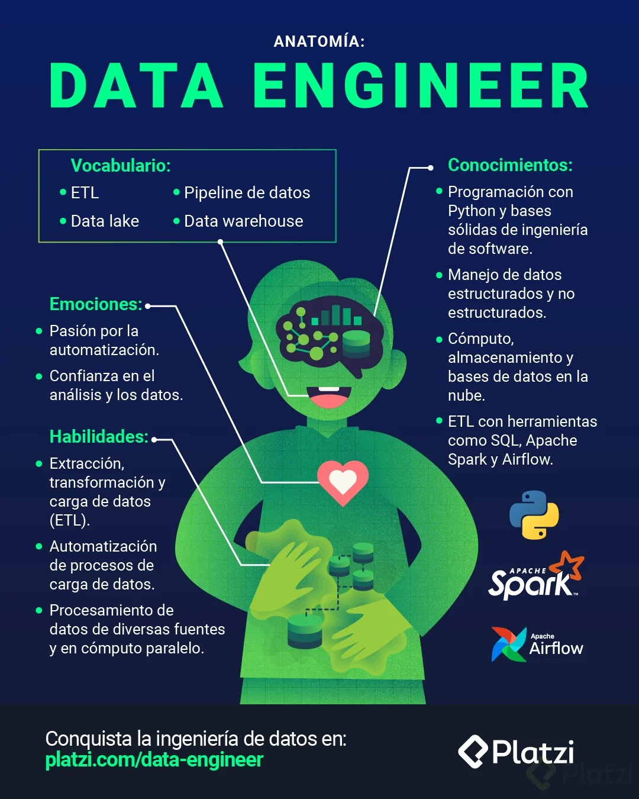
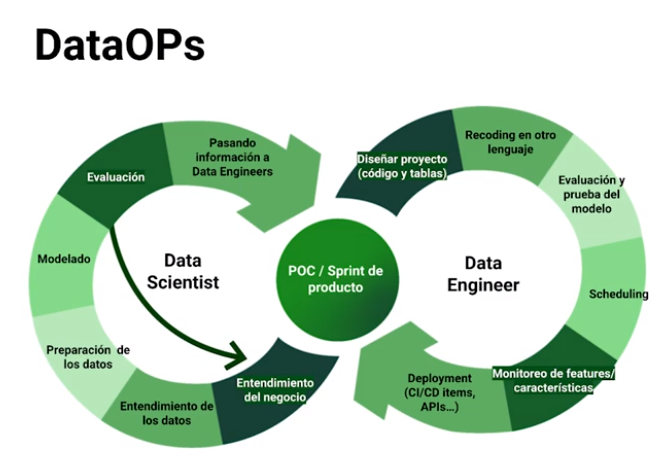
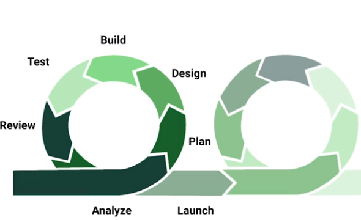
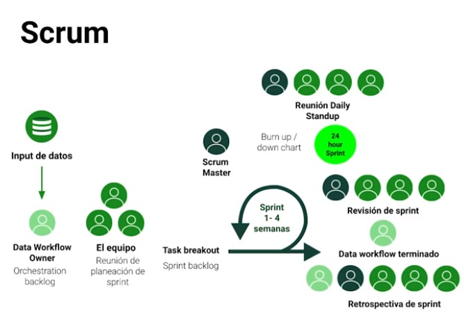
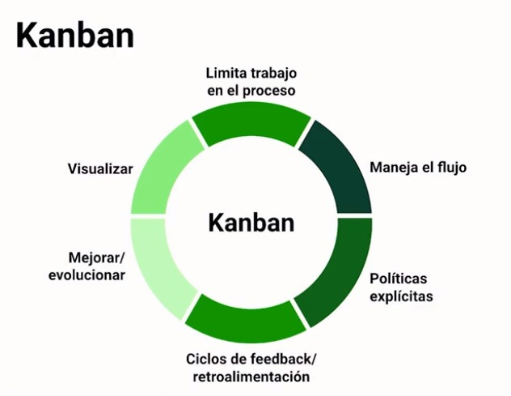
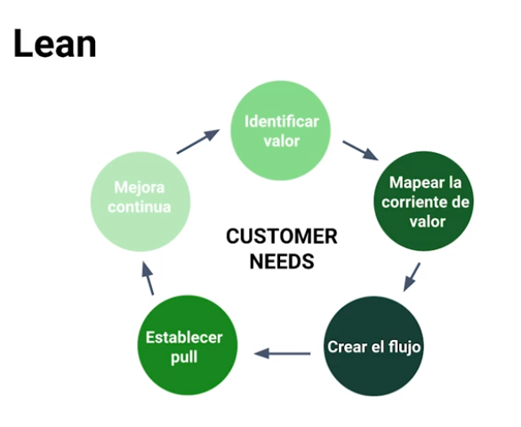
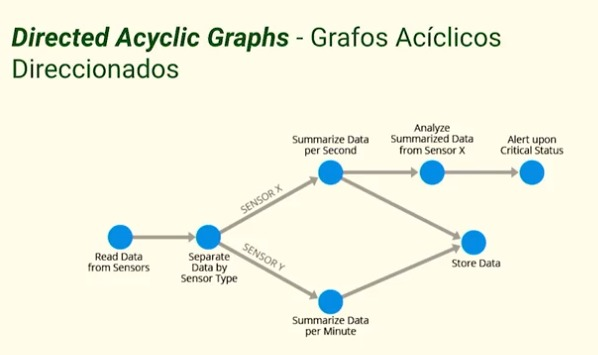
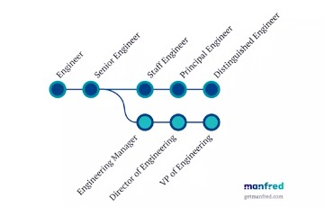
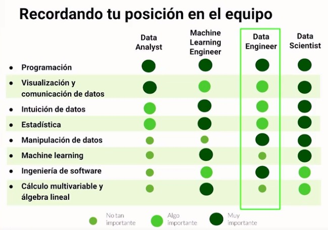
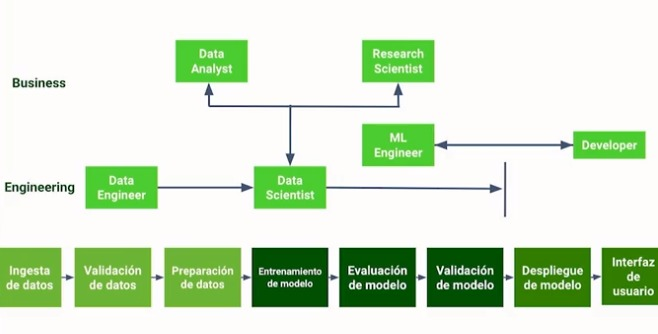

# 📊 Fundamentos de Ingeniería de Datos

## Tabla de Contenido

[TOC]

## Data Engineer: ¿Qué es?

La Ingeniería de Datos es una disciplina que se enfoca en el desarrollo y gestión de arquitecturas de datos, pipelines de procesamiento y sistemas para analizar y visualizar información. Un Data Engineer es un profesional especializado en diseñar, construir y mantener estas infraestructuras.

## ¿Cómo Convertirse en Data Engineer?

1. **Educación y Habilidades:**
    - Adquirir conocimientos en bases de datos, programación y procesamiento de datos.
    - Dominar lenguajes como Python, SQL, y herramientas como Apache Spark.

2. **Experiencia Práctica:**
    - Participar en proyectos de ingeniería de datos.
    - Crear y mantener pipelines de datos.

3. **Formación Continua:**
    - Mantenerse al tanto de las últimas tecnologías y tendencias en el campo.

### ¿Dónde ejercer como Data Engineer?

*StartUp
*Empresas de software
*Corporaciones

## 🔄 Integración de DevOps, Lean y Agile en DataOps

### DataOps: Resumen

DataOps es una metodología que busca mejorar la colaboración y eficiencia en el ciclo de vida de los datos. Combina prácticas de desarrollo de software con operaciones de datos para lograr una entrega más rápida y confiable de información de calidad.

{width=500px}

## Integración de Metodologías

### 🚀 Agile en DataOps

{width=500px}

* **Scrum:**

Roles definidos (Scrum Master, Product Owner, Equipo de Desarrollo).
Iterativo e incremental en sprints.
Eventos predeterminados (Sprint Planning, Daily Scrum, Sprint Review, Sprint Retrospective).
Uso de Backlog de Producto y Sprint Backlog.
Estimaciones de tiempo (puntos de historia).
{width=500px}

* **Kanban:**

Roles flexibles, sin roles predeterminados.
Flujo continuo de trabajo, sin iteraciones fijas.
No tiene eventos predeterminados.
Utiliza un tablero Kanban para visualizar el flujo de trabajo.
No tiene Sprint Backlog ni Backlog de Producto.
Evita estimaciones de tiempo, se centra en limitar el trabajo en curso (WIP).
{width=500px}

* **Kanban:**
    -Trello
    -Jira
    -Asana

### 🔄 Lean en DataOps

- **Eliminación de Desperdicios:**
  - Identificar y eliminar actividades que no agregan valor.
  - Mejora continua en la entrega de datos.
{width=500px}

### 🤝 DevOps en DataOps

- **Colaboración:**
  - Superar las barreras entre desarrollo y operaciones.
  - Automatización en todas las etapas del ciclo de vida de los datos.
{width=500px}

### Por Qué se Integra

1. **Colaboración Efectiva:**
    - Rompe silos entre equipos para una colaboración más efectiva.

2. **Automatización Integral:**
    - La automatización abarca desde la recolección hasta el monitoreo de datos.

3. **Entrega Continua:**
    - Facilita entregas continuas y rápidas de datos.

4. **Mejora Continua:**
    - Fomenta la mejora continua en todos los aspectos del ciclo de vida de los datos.

## Lengujes de Programación para Data Engineering

* Python:
>Nos ayuda mucho en Data Science, posee muchas librerías de código científico.
Puede ser más lento que otras opciones.
Es muy sencillo.

*  R:
>Es un antecesor de Python.
Es muy útil para trabajar con estadísticas y modelos.
Importante para analistas.

* Scala:
>Usa java de base.
Con la implementación y optimización de PySpark bajó su necesidad.
Interesante para programación funcional.

* Java:
>Scala corre sobre java.
Su escalabilidad es envidiable.
Puede ser un cómodo siguiente paso.

*  JavaScript:
>Navaja suiza para web developers.
Super flexible y útil para muchos ámbitos.
Imponente por la cantidad de herramientas que tiene.
Visualizaciones de datos más bellas posibles.

* C++ y derivados:
>Columna vertebral para muchos proyectos.
Curva de aprendizaje potente.
Muchas herramientas usan C en el fondo.
Implementaciones modernas ayudan a que no sea tan difícil de implementar.

## Donde y como escribir codigo de ingeniería de datos

*  Jupyter notebooks : Jupyter Lab
*  IDE : Data Spell
*  Editor de codigo : VsCode
*  Complementos : Tener de amiga a la terminal, usar tambien git, github o gitlab.

## Automatización y Scripting

- Porque debo automatizar las tareas?
    * Para trabajar de manera inteligente
    * Optimizar el proceso
    * Utilizar recursos externos
- Porque debo usar python?
    * Porque es un lenguaje sencillo
    * Librerias variadas
    * Comunidad activa
    * Multiplataforma
> **Cuando debemos automatizar una tarea?**
Cuando se aplique la regla Beetlejuice, que quiere decir que despues de repetir 3 veces la tarea, tendras mas claro lo que vas a automatizar y porque

## Fuentes de Datos

- SQL
    * Lenguaje de consulta pero tambien el nombre con que se identifican las bases de datos
    * Excelentes para las transacciones por los principios ACID (Atomicity, Consistency, Isolation, Durability)
- NoSQL
    * Por su cercania a los lenguajes de programacion son utiles para guardar objetos flexibles
    * La mas famosa es mongoDB, otras importantes como Redis, ElasticSearch, HBase
- API
    * Consume informacion de otras plataformas
    * Permite utilizar capacidades mandando un input, recibiendo un output
    * Pueden ser creadas por uno, externas y de paga
- Web scraping
    * Es traernos informacion disponible que esta en internet
    * parsehub, Scrapy

## Procesamiento de Datos

> El procesamiento de datos se refiere al conjunto de operaciones y transformaciones realizadas en datos para obtener información útil. Incluye la recopilación, limpieza, análisis y presentación de datos de manera que se puedan tomar decisiones informadas.
Para ello tenemos:
- Apache Spark:
Motor de procesamiento de datos en memoria y distribuido.

- Pipeline:
Secuencia lógica de etapas de procesamiento de datos, que se encarga de extraer, luego transforma y mandar la data trasnformada a otro lado.

- Cómputo Paralelo (en Spark):
Realización simultánea de tareas en múltiples nodos para mayor eficiencia, es usada por apache spark.

### Pipelines

- Para automatizar pipelines nos surgen tres preguntas: ¿Qué se va a correr? ¿En qué secuencia? ¿Cuándo y cada cuanto se va a correr?

Airflow nos ayuda a automatizar estas tareas, contestándonos las 3 preguntas. El que apoyándonos a conectar tareas de código que vamos a correr, conectándolas en secuencia y también con un manejador de tiempos para que se corra con una definición de cada cuánto se van a correr todo esto por medio de una interfaz web muy sencilla.

En el formato DAG es como le hablamos a Airflow para que ejecute las tareas en un grafo acíclico dirigido podemos indicarle cuales tareas irán al principio y cuales irán al final, poniendo los pasos con las dependencias adecuadas.
{width=500px}

## Apache Airflow

- Orquestar y programar workflows de datos con Apache Airflow.

## Contenedores y Empaquetamiento: Docker y Kubernetes

- Empaquetar y distribuir aplicaciones y entornos con contenedores.

## Manejo de Ambientes

- Gestionar entornos de desarrollo, prueba y producción de manera efectiva.

## Testing de Software y Datos

- Implementar pruebas para garantizar la calidad de software y datos.
    * Pruebas unitarias (de funciones)
    * Pruebas de integración ( para saber si integra bien con otras librerias, apis o aplicaciones)
    * Pruebas E2E para saber si el resultado es lo que esperamos
    * Y otras pruebas

## CI/CD

> Debemos de hacer integraciones continuas o entregas continuas y esta muy asociado a DevOps, es bueno conocerlo, pero habrá expertos en esto. DevOps está enfocado en el ciclo de desarrollo de software y el proceso de despliegue de Código a producción. Mientras que DataOps está enfocado en el ciclo de vida de los datos, se usa para garantizar la calidad de los datos y mejorar la velocidad en que estos son entregados.

## Servidores y Computación en la Nube para Data

- Alternativas del mercado y sus similitudes
    * AWS
    * Azure
    * Google Cloud

- Cosas a tener en cuenta
    * Manteniendo recursos
    * Manteniendo usuarios
    * Manteniendo costos
    * Distribuyendo carga
    * Consideraciones de seguridad

## Medición de indicadores y seguimiento a proyectos
Es importante tener medidores para detectar problemas antes que crezcan.
- Puntos de riesgo:
    * A la entrada del servicio
    * A la entrada del modelo
    * Durante el proceso
    * Datos de consulta externa
    * A la salida del modelo
    * A la salida del servicio
    * Lo que s ele msotro al cliente

- Para tener visibiidad:
    * Tener dashboards
    * Tener alertas y notificaciones

## Buscando Oportunidades

- LinkedIn
- Meetup
- Torre
- GetOnBoard
- Aprender Ingles es importante

## Ganando Seniority

- El primer día aprende
- El primer mes contribuye
- El primer año mentorea
- Luego no tengas miedo de ir por más

## Evolución en el rol

{width=500px}
{width=500px}

**Y hay un tercer camino:**
*  Cambiar a Ciencia de datos
*  Arquitectura
*  DevOps y Cloud

## Trabajando en equipo como Data Engineer
>Los data engineer trabajan en equipo, hay cuatro roles muy importantes Data Analyst, nos ayuda a presentar los datos, los ingenieros de machine learning nos ayudan a publicar modelos, los data Scientist nos ayudan en todo el proceso, pero no saben mucho publicar código en producción con otros lenguajes de programación. Nuestro rol, es apoyar a los tres perfiles con procesos de datos adecuado, a poca latencia y muy escalables y estables, somos un soporte. Colaboramos con personas de producto y con el equipo de desarrollo de apps, para poder conectarnos a las fuentes de datos.

{width=500px}

>Pasos y roles en el flujo de trabajo del data sciencie

{width=500px}
---

# DevOps y DataOps: Buscan mejorar la eficiencia y la calidad del trabajo

**DevOps** y **DataOps** son dos metodologías diferentes que buscan mejorar la eficiencia y la calidad del trabajo en la gestión de software y datos, respectivamente. Aunque tienen objetivos diferentes, ambos se centran en la automatización, la colaboración y la mejora continua.

A continuación, se detallan las diferencias, similitudes y límites de ambas metodologías:

## Diferencias

- **DevOps** se enfoca en la automatización del ciclo de vida del software, desde el desarrollo hasta la implementación y operación, mientras que **DataOps** se centra en la automatización del ciclo de vida de los datos, desde la adquisición hasta el análisis y la entrega.

- **DevOps** busca mejorar la integración y la colaboración entre los equipos de desarrollo y operaciones, mientras que **DataOps** se enfoca en la colaboración entre los equipos de datos y de negocio.

- **DevOps** busca aumentar la velocidad y la calidad de la entrega de software, mientras que **DataOps** busca mejorar la calidad y la agilidad en la gestión de datos.

## Similitudes

- Ambas metodologías se basan en la automatización y la mejora continua para mejorar la eficiencia y la calidad del trabajo.

- Ambas fomentan la colaboración y la integración entre los equipos de trabajo para lograr sus objetivos.

- Ambas buscan una entrega más rápida y eficiente de sus respectivos productos, ya sea software o datos.

## Límites

- **DevOps** no se centra en la gestión de datos y su calidad, mientras que **DataOps** no se enfoca en el ciclo de vida completo del software.

- Cada metodología tiene un conjunto diferente de herramientas y prácticas que no son necesariamente aplicables a la otra.

- Ambas metodologías pueden ser difíciles de implementar en organizaciones con culturas y estructuras resistentes al cambio.

## 5 Herramientas para DevOps y DataOps:

### Herramientas de DevOps

1. **Jenkins:** Automatización de integración continua y entrega continua.
2. **Docker:** Plataforma de contenedores para creación, distribución y ejecución de aplicaciones.
3. **Ansible:** Automatización de TI para configuración, gestión y orquestación de sistemas.
4. **GitLab:** Gestión de repositorios de código con colaboración y seguimiento del ciclo de vida del software.
5. **Kubernetes:** Plataforma de orquestación de contenedores para gestión y escalabilidad de aplicaciones.

### Herramientas de DataOps

1. **Airflow:** Plataforma de orquestación de flujo de trabajo para automatización de procesos de datos.
2. **Databricks:** Plataforma de análisis de datos que facilita la integración y colaboración entre equipos.
3. **Apache Kafka:** Plataforma de streaming de datos para procesamiento y entrega en tiempo real.
4. **Talend:** Herramienta de integración de datos para extracción, transformación y carga de datos.
5. **Snowflake:** Plataforma de almacenamiento de datos en la nube para análisis y gestión segura y escalable de datos.

## Conclusión

La Ingeniería de Datos es un campo dinámico y esencial en el mundo de la ciencia de datos. El Data Engineer desempeña un papel crucial en la creación y mantenimiento de infraestructuras para el procesamiento y análisis de datos. La combinación de habilidades técnicas, experiencia práctica y la adopción de metodologías ágiles son fundamentales para tener éxito en esta profesión en constante evolución.
