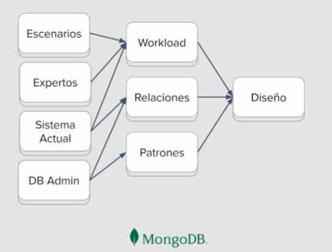
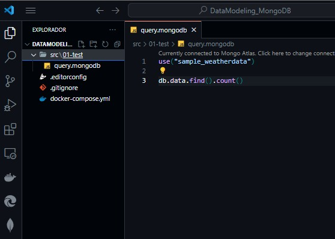

# Modelado de Datos en MongoDB

## 1. Introducción

### 1.1. Introducción

El objetivo de este curso es descubrir y saber como implementar patrones que nos permitan obtener beneficios al momento de modelar un negocio a nivel de bases de datos no relacional.

Los beneficios que se pueden obtener son:

* Buen rendimiento
* Productividad en desarrollo → Al tener una buena arquitectura y un buen modelado nos permite como desarrolladores hacer consultas mas simples y mucho mas eficientes.
* Minimizar costos → Un buen modelado nos permite minimizar costos, por ejemplo, en operaciones de lectura y escritura.

MongoDB es categorizada como una base de datos NoSQL y en base a documentos, convirtiéndose así en una base de datos muy poderosa y flexible. Pero por ser flexible no significa que no tenga una estructura, ya que al igual que otras bases de datos existen patrones y estructuras que nos ayudan a modelar nuestros datos.

Otra característica muy especial de MongoDB es que podemos desarrollar nuestro modelo de datos de forma iterativa, esto quiere decir, que si nuestra aplicación va creciendo a nivel de características y funcionalidades paralelamente podemos ir iterando nuestro modelado de datos sin perjudicar al negocio.

La flexibilidad de Mongo nos permite hacer esto de forma dinámica haciendo uso de unos determinados patrones, mientras que otro tipo de base de datos como lo son las relacionales o tabulares tendríamos que correr todo un proceso de migraciones si deseamos modificar a nivel de estructura nuestra base de datos.

### 1.2. Conceptos fundamentales de NoSQL y MongoDB

Para modelar de una forma correcta es importante tener claro los siguientes conceptos:

1. Los datos son almacenados en documentos legibles, los documentos se almacenan en formato JSON (JavaScript Object Notation), en donde los datos se almacenan en pares clave-valor. Sin embargo, el formato JSON es usado solo para el formato de lectura ya que internamente o en el proceso de escritura, MongoDB utiliza el formato BSON que es un formato binario que proporciona mayor rendimiento.

2. Los documentos son almacenados en colecciones, lo cual nos indica que en esa colección se guardan documentos que comparten información. Las colecciones pueden ser: Usuarios, Productos, Categorías, etc.

3. El Diagrama ER (Entidad Relación), es un diagrama que nos permite modelar y visualizar nuestros datos, además de conocer como están relacionadas nuestras entidades. La entidad no son mas que las colecciones previamente definidas y la relación son lineas que unen estas entidades para indicar como éstas interactúan entre sí.

### 1.3. Metodología para el modelamientode de datos

1. Requerimientos.
2. Identificar ER.
3. Aplicar patrones.

Cada una de estas fases se rodea de ciertos aspectos.

* `Escenario:` Como serán los escenarios del modelo de negocio. (Ej: Como un usuario usará la app, donde podra editar sus mensajes o como comprará un producto)

* `Expertos:` Necesitamos expertos relacionados a nuestro tipo de negocio. (Ej: Si nos planeamos ofrecer un software orientado a la contabilidad, necesitamos a un experto, quien nos explique los conceptos que debemos manejar para su desarrollo.)

* `Sistema actual:` Tener en cuenta como funciona su sistema actual. Analizar como llevan a cabo sus tareas de la forma actual. (Ej: Las empresas llevan una gestión de sus ventas en un excel)

* `DB Admin:` El experto en modelado que une todas estas caracteristicas y llega a un resultado.

**Este resultado serían 3 cosas:**

* `Workload:` Donde indentificamos la carga de trabajo, las operaciones importantes, el tamaño de los datos, las consultas y posibles suposiciones.

* `Relaciones:` Lo obtenemos partir de a los sistemas actuales y el experto en modelado de datos. Identifcamos las entidades, atributos, restricciones y relaciones.

* `Patrones:` Cuando tenemos el diagrama de entidad-relación identificamos los patrones en el modelo de negocio que nos permiten realizar optimizaciónes de la carga de trabajo o obtener un mejor desempeño de la misma.

Todo esto nos lleva a un Diseño.



## 2. Proyecto

### 2.1. Creando la base de datos con MongoDB Atlas

[Enlace](./introduccion_MongoDB.md)

### 2.2. Workload

El Workload o Carga de trabajo se construye tomando en cuenta los Escenarios, los Expertos y el Sistema Actual y nos permite identificar que cosas tenemos y como se comportan para así empezar a tomar decisiones a nivel de diseño en nuestra base de datos.

Para construir el Workload podemos usar un documento (no limitativo) que nos permita empezar a definir el modelado y saber que aspectos debemos tener en cuenta al momento de diseñar la base de datos. El documento puede tener las siguientes secciones:

* Casos de usos: Describimos lo mas importante acerca del caso de negocio que se esté manejando.
* Sección principal: Se resaltan los actores principales.
Suposiciones acerca del negocio: Establecemos ciertas declaraciones que pueden ir variando a través del tiempo.
* Operaciones: Se detallan mas a fondo los actores que influyen en nuestro negocio y la forma en la que se relacionan con nuestra base de datos resaltando aspectos importantes como: frecuencia, información que se envía, tipo de operación, etc.
* Entidades: Creamos ciertas entidades que existen en nuestro negocio, así como suponer ciertas cosas sobre ellas gracias a la información suministrada por los expertos en el area.
* Observaciones finales: Pueden ser acotaciones generales con respecto a la información recolectada.

📌 Mongo Atlas posee un sistema de replicación y cuando escribimos en una base de datos puede existir un delay mientras se replica la información en otros nodos.

[Templato para usar](./templates/Workload%20Template.pdf)

### 2.3. Entorno de Trabajo con MongoDB: Atlas, GitHub y VSCode

Como indica el anterior markdown de introducción de MongoDB, este sería el entorno de trabajo



## 3. Validación de datos

### 3.1. Validando strings

Hay que realizar validacion de datos para la integridad de la informacion.

MongoDB es muy flexible, como tambien otras bases de datos noSQL basadas en documentos.

Pero hay que respetar ciertas reglas de negocio. Y tambien las entidades tienen ciertas reglas de negocio que hay que respetar.

En este [enlace](https://www.mongodb.com/docs/manual/reference/bson-types/) podras ver todos los demas tipos de datos de mongo.

```JSON
    use('store')

    db.users.drop()

    db.createCollection('users', {
    validator: { // creamos un validador
        $jsonSchema: { // le indicamos que es un esquema
        bsonType: 'object', // le decimos que es un documento
        required: ['email', 'password'], // le indicamos que propiedades van a ser obligatorios insertar
        properties: { // colocamos las propiedades del documento
            name: {
            bsonType: 'string' // indicamos que name debe ser siempre un string
            },
            last_name: {
            bsonType: 'string' // indicamos que name debe ser siempre un string
            },
            email: {
            bsonType: 'string'
            },
            password: {
            bsonType: 'string'
            }
        }
        }
    }
    })
```

### 3.2. Validando enums, numbers y booleans

1. Numbers
Tipo de dato numerico, este no requiere comillas y solo acepta numeros. Este tambien puede tener un valor minimo y maximo.

    ```json
    age: {
        bsonType: 'number', // tipo numero
        minimum: 18, // valor minimo
        maximum: 100, // valor maximo
    },
    ```

2. Boolean
Tipo de dato booleano, que puede ser verdadero o falso. Pueden recibir: true y false.

    ```json
    isSingle: {
        bsonType: 'bool'
    },
    ```

3. Enums
El Enumerador es el tipo de dato que solo acepta una serie de opciones acotadas. ¿Solo Strings? Tambien numeros y booleanos han sido permitidos.

    ```json
    role: {
        enum: ['customer', 'seller', 'admin', 2, false]
    },
    ```

### 3.3. Validando arrays y subdocumentos

```JSON
use('store')

db.products.drop()

db.createCollection('products', {
  validator: { // creamos un validador
    $jsonSchema: { // le indicamos que es un esquema
      bsonType: 'object', // le decimos que es un documento
      required: ['name'], // le indicamos que propiedades van a ser obligatorios insertar
      properties: { // colocamos las propiedades del documento
        name: {
          bsonType: 'string' // indicamos que name debe ser siempre un string
        },
        sizes: { // Validamos un array
          bsonType: 'array',
          items: {
            bsonType: 'array',
            minItems: 1, // le indicamos que minimo haya un item
            uniqueItems: true, // Validamos que los items sean unicos
            items: {
              bsonType: 'string'
            }
          }
        },
        category: { // validamos un subdocumento
          bsonType: 'object',
          properties: {
            name: {
              bsonType: 'string'
            },
            image: {
              bsonType: 'string'
            }
          }
        }
      }
    }
  }
})
```

### 3.4. Reto: expresión regular para contraseñas

Se pueden usar con el indicador pattern Normalmente se escriben con diagonal expression diagonal Ej /[0-9]/ Para mongo se elimina la diagonall y se pone en su lugar las comillas dobles “[0-9]”

^ -> indica inicio $ -> indica fin
“^[a-zA-Z0-9]{8,100}$” Con letras de la y numeros minimo 8 maximo 100 “^[a-zA-Z0-9]{8,}$” Con letras y numeros desde 8 hasta infinito

Aparte de validar campos, se pueden usar como parte de los filtros. https://www.mongodb.com/docs/manual/reference/operator/query/regex/

```JSON
password: { // propiedad
    bsonType: 'string', // tipo del objeto
    pattern: '^[A-Za-z0-9]{8,}$' // patron regex
},
```

### 3.5. Tips para validación en MongoDB

Si queremos que no se ingrese otras propiedades, solo las que mencionamos en nuestro esquema, tenemos que ingresar la siguiente propiedad.
`additionalProperties: false,`

#### Reajustar el esquema sin borrar

Primero, para ver la informacion de las colecciones:

```JSON
use("platzi_store");
db.getCollectionInfos();
```

Actualizar el esquema

Para cambiarlo, hay que enviar toda la definicion del validador porque va a re-escribirlo. Y requiere de un usuario con permisos de administrador en la base de datos.

Cambiar permisos (Mongo Atlas)
Ir a la administracion de la base de datos
Ir a Security
Ir a Database Access
Editar/Elevar los permisos del usuario elegido (incluso para el original)
Pasar del Read and write to any database a Atlas admin
Guardar los cambios con Update User

Comando de actualización

```JSON
db.runCommand({
    collMod: 'users', // coleccion a modificar
    validator: { // propiedad de la coleccion a modificar
        $jsonSchema: {
            bsonType: 'object', // igual
            required: ['email', 'password', 'role'], // igual
            additionalProperties: true, // el cambio
            properties: {...} // igual
        }
    }
})
```

## 4. Relaciones

### 4.1. Embeber vs. referenciar

1. Embeber: Usar sub-documentos para realizar las relaciones, que esta un documento dentro de otro.

   * Mejora rendimiento en busqueda de muchos datos relacionados
   * Limitado a 1-1 y 1-N en una direccion
   * Cambios contenidos

2. Referenciar: Los documentos estan separados y se hacen referencia entre ellos con identificadores. En UML, se expresan con cajitas separadas y una cardinalidad.

   * Reduce el tamaño de la base de datos
   * No repetir datos
   * Actualizacion de datos unica para muchos
   * Permite 1-1, 1-N, N-1 y N-N

#### Preguntas para decidir cual

¿Que tan frecuente es consultada esa información?
¿Que tan frecuente se actualiza esa información?
¿La información se consulta en conjunto o por partes?

### 4.2. Relaciones 1 a 1 embebidas

**Relaciones 1 a 1 embebidas:**

La utilizamos cuando tenemos una dependencia interna de ciertos atributos que estan relacionados o que se repiten para diferentes casos. Entonces se realizaran subdocumentos que contengan esos atributos relacionados.

**Casos recomendables de uso:**

En el 90% de los casos, cuando hay una relacion 1:1, esta suele ser embebida.

Cuando la informacion se consulta en conjunto
Los sub-documentos sean una dependencia directa

**Por ejemplo:**

Tenemos en una tienda online un usuario que tiene una direccion de su casa y otra de envio. Estas direcciones tienen varios atributos que comparten y para cada uno estan relacionados.

Entonces agrupamos estas propiedades en sub-documentos (objetos) en direccion casa y direccion de envio.

Insertar datos para embebed 1-1

```JSON
db.users.insertOne({ // insertar un documento
    name: "pam", // propiedad del documento
    address: { // subdocumento (Embebido)
        street: "Calle falsa 123", // propiedad del subdocumento
        city: "Sprinfield",
        zip: 1234
    },
    shipping_address: {
        street: "Calle falsa 124",
        city: "Sprinfield",
        zip: "1235"
    }
})
```

Consultar datos en embebed 1-1

```JSON
db.users.find({
    "address.city": "Sprinfield" // Filtrar con una propiedad de un sub-documento
})
```

### 4.3. Relaciones 1 a 1 referenciadas

Este se usa cuando se superan las restricciones, como pueden ser:

* Peso maximo de 16MB: Esto podria pasar si se llena con muchas propiedades y/o muy pesadas, como pueden ser binarios, imagenes, videos, etc.
* Consultas lentas: Al realizar una peticion, puede que se procese informacion innecesaria (Se puede superar con restringir las propiedades que se entregaran) o muy pesada.
* Se requieran acelerar ciertas consultas: Puede que se requieran hacer consultas que requieran mucha velocidad para grandes cantidad de documentos y dejemos apartado los detalles que no se requiren para esas consultas. Como puede ser en productos y el detalle de esos productos.

Insertar

```json
db.stores.insertOne({
    storeId: "ST001", // permitira la relacion
    name: "PamplonaStore",
    address:  "Calle falsa 123",
    city: "Sprinfield",
    state: "Londres",
    zip: "1234"
})

db.stores_details.insertOne({
    storeId: "ST001", // repetimos el storeID, ya que es 1-1
    description: "PamplonaStore asdasdasd",
    services: ["Ropa", "Deportivo"],
    manager: {
        name: "Mario",
        cellphone: "123412412"
    }
})
```

Consultar

```json
// Se puede consultar por separado

db.stores.findOne({ // consultar la tienda
    storeId: "ST001"
})

db.stores_details.findOne({ // consultar los detalles de tienda
    storeId: "ST001"
})
// Oooo.. Usar el agregation framework lookup
```

#### Agregation framework lookup

Permite consultar otros documentos y formar una relacion.

PD: Si no estan los campos puede que se agreguen datos no esperados. Ya que funciona como: si estan los datos en los documentos correspondientes se comprueba, si faltan ambos no funciona y agrega elementos no esperados. Puede que este detectando cuando faltan propiedades como valores nulos que compara. Parece ser esto ultimo. Esto puede retornar matrices 2d de los que encuentre nulos en ambos colecciones.

```json
// Consulta
db.stores.aggregate([ // desde stores, usamos el aggregate
    {
        $lookup: { // parte desde stores
          from: 'stores_details', // agregamos cual coleccion queremos conectar
          localField: 'storeId', // que campo los enlaza, en stores
          foreignField: 'storeId', // que campo los enlaza, en stores_details
          as: 'detail' // donde dejara la relacion
        }
    }
])
```

### 4.4. Relaciones 1 a muchos embebidas

La relacion embebida 1 a muchos embebida es tener una lista (arreglo) de sub-documentos de una coleccion. El documento puede tener varios sub-documentos de una coleccion y esos sub-documentos dependen del documento padre y solo tienen ese.

**Casos de uso:**

* Cuando la informacion es consultada en conjunto
* El arreglo de subdocumentos no peligre el limite de 16MB
* Cuando los sub-documentos son una dependencia
* Cuando los dub-docs son 1:few (1 a pocos)

Insertar

```json
db.orders.insertOne({
    user_id: ObjectId('64966222a80142b1ef0dbb5a'), // referencia a un ObjectID de un usuario
    date: "2020-12-12",
    items: [
        {
            name: 'Camiseta',
            price: 12000,
            qty: 1
        },
        {
            name: 'Pantalon',
            price: 16000,
            qty: 2
        },
    ]
})
```

Consultar

```json
// buscar el id de un usuario
db.users.find()

// ver las ordenes de compra
db.orders.find()

// Buscar algo en concreto de las ordenes
db.orders.find({
  "items.qty": 2
})
```

### 4.5. Relaciones 1 a muchos referenciadas

En las relaciones 1 a muchos referenciadas un documento puede estar asociado a otros documentos de otra coleccion, esto mediante una identificacion que normalmente estan en la otra coleccion y que indican al documento.

**Casos de uso:**

* Cuando la relacion puede incrementar considerablemente
* Cuando la entidad se actualiza de forma constante
* Cuando la entidad es usada por muchos documentos

```json
// Crear un usuario
db.users.insertOne({
    name: 'pedro',
    address: 'San carlos 123'
})
```

```json
// Conseguir el object id del usuario
db.users.findOne({name: 'pedro'}) 
/* Resultado
{
  "_id": {
    "$oid": "6497b8b4affb4e4355c4f297"
  },
  "name": "pedro",
  "address": "San carlos 123"
}
*/
```

```json
// Con el object id del usuario (_id.$oid) se le agrega a las ordenes

db.orders.insertMany([
    {
        user_id: ObjectId('6497b8b4affb4e4355c4f297'),
        total: 1300,
        date: '2023-23-25'
    },
    {
        user_id: ObjectId('6497b8b4affb4e4355c4f297'),
        total: 2400,
        date: '2023-12-02'
    },
])
```

```json
// Para buscar las ordenes asociadas al usuario
db.orders.find({
    user_id: ObjectId('6497b8b4affb4e4355c4f297')
})

// para un usuario, mostrarme sus ordenes
// Lookup del agregation framework
db.users.aggregate([
    {
        $lookup: { // join
          from: `orders`,
          localField: `_id`,
          foreignField: 'user_id',
          as: 'orders'
        }
    }
])
```

```json
// Consultar por una sola orden de compra
db.orders.aggregate([
    {
        $match: { // filtrar
          _id: ObjectId('6497b99410c8b687cb183d2a') // order id
        }
    },
    {
        $lookup: { //Join
          from: `users`,
          localField: `user_id`,
          foreignField: '_id',
          as: 'user'
        }
    }
])
```

### 4.6. Relaciones muchos a muchos

La relacion muchos a muchos (N-N) es cuando un documento de una coleccion A puede estar relacionado con varios documentos de una coleccion B y viceversa. Esta relacion es siempre Referencial.

**Se pueden realizar de 2 formas:**

* Con una coleccion intermediaria, que hace de puente entre 1 o más colecciones.
* Embeber dentro de cada documento un arreglo con los identificadores de sus relaciones.

**Casos de uso:**

* Usar referencia cuando la relacion es N-N

Ejemplo:
Primera parte.

Un producto puede pertenecer a varias tiendas y una tienda puede tener varios productos. Lo realizaremos mediante un arreglo para referenciar.

Se utiliza una nomenclatura como cualquier otra propiedad pero con un doble corchete y de tipo ObjectId: products_ids[]:<ObjectId>.

Insertar productos

```json
db.products.insertMany([
    {
        name: 'Product 1',
        sizes: ['L', 'M'],
        price: 12
    },
    {
        name: 'Product 2',
        sizes: ['S', 'M'],
        price: 9
    },
    {
        name: 'Product 3',
        sizes: ['L', 'M', 'XL'],
        price: 16
    },
])
```

Insertar Tiendas

```json
db.stores.insertMany([
    {
        name: 'Store A',
        products_ids: [
            ObjectId("64991cdf44ec03dd012ecccd"),
            ObjectId("64991cdf44ec03dd012eccce")
        ]
    },
    {
        name: 'Store B',
        products_ids: [
            ObjectId("64991cdf44ec03dd012ecccc"),
            ObjectId("64991cdf44ec03dd012eccce")
        ]
    },
])
```

Usar LookUp

```json
db.stores.aggregate([
    {
        $lookup: {
          from: 'products',
          localField: 'products_ids', // automaticamente detecta que es una lista
          foreignField: '_id',
          as: 'products'
        }
    }
])
```

### 4.7. Referencias circulares o bidireccionales

Es parte del N-N. Donde cada coleccion tiene documentos que apuntan a todos los relacionados de otra coleccion (O en la misma).

**Casos de uso:**

* Usa refencia cuando la relacion es n-n
* Cuando la información es consultada en conjunto. Por si necesitamos las referencias que tiene algun documento sin importal cual sea. Para resolver más facil relaciones y rapido.

Facilitar la busqueda de ID
para el proximo proceso

```json
db.products.aggregate([
  { 
    $lookup: { // buscar las id que necesitamos
      from: 'stores',
      localField: '_id',
      foreignField: 'products_ids',
      as: 'stores'
    }
  },
  {
    $project: { // filtrar para ver mejor las id
      _id: 1, // id producto
      stores: { // en tiendas
        _id: 1 // id tienda
      }
    }
  }
])
```

Ver las tiendas en el producto

```json
use("platzi_store")
db.products.find()

db.products.aggregate([
  { 
    $lookup: { // buscar las id que necesitamos
      from: 'stores',
      localField: 'stores_ids',
      foreignField: '_id',
      as: 'stores'
    }
  }
])
```

## 5. Patrones

### 5.1. Desnormalización

Es el proceso de optimizar el funcionamiento de una BD agregando datos redundantes.

* Esto es hacer duplicidad de datos y agregar direcciones no essenciales para acelerar las consultas o reducir la cantidad.

* Esta mal visto la duplicidad de datos en una base de datos relacional, pero en una base de datos documental puede ser un aliado. Porque nos ahorramos consultas o aceleramos esas mismas consultas por tener indexacion.

* Tambien permite mantener datos historicos, datos que no queremos que cambien en una instancia, aunque tengan cambios sus origines.

* Reduce los Join y simplifica las consultas.

Ejemplo
Tenemos una coleccion 'order' que esta desnormalizada, donde se hace embeding a los productos como items. Estos tendran la referencia sus productos correspondientes (product_id), datos extra como la cantidad (qty) y datos que pueden o no ser actualizados por ser una instancia de la orden (title, price) y que se quieran acceder rapidamente.

### 5.2. Computed pattern

Es realizar solo los computos necesarios cuando hay cambios, para no calcularlos durante las consultas.

**Casos de uso:**

* No recalcular en cada consulta, ya que se actualiza cuando es necesario. Pre-calculo para consultas.
* Reduce las consultas necesarias y simplifica las consultas, a costa de las actualizaciones.
* Cuando necesitas calcular un valor a partir de otros campos en un documento y mostrar el resultado en una consulta o informe.
* Cuando es más frecuente la lectura que la escritura.
* Calcular el valor por cada lectura es costoso, es mejor pre calcular en cada escritura.
* No requiere hacer busquedas innecesarias de valores ya agregados, ya que puede ser incremental.
* Se puede manipular con un lenguaje de programacion.

Ejemplo
Se hara una orden de compra dinamica, en donde, al agregar productos a la orden esta actualizara el valor total que es la suma de todos los productos multiplicado su cantidad.

Creamos una nueva orden de compra

```json
db.orders.insertOne({
    user_id: ObjectId('6497b8b4affb4e4355c4f297'),
    date: '2020-12-12',
    total: 0, // nuevo campo que sera la suma de los items
    items: [] //normalmente empieza sin nada una orden de compra
})
```

Guardamos el ObjectID generado
Creamos un script para agregar items add-item.mongodb, en el que se agrega un item a la lista y se suma al precio el valor extra.

```json
db.orders.updateOne( // actualizamos la orden
    { // hacemos match con la orden que queremos actualizar
        _id: ObjectId('649cb8c89f973670e36e123f')   
    },
    {   // mostramos el cambio, agregando un nuevo elemento
        $push: { // agregar elemento
            items: { // quien se lo agrego
                name: 'Producto 1',
                qty: 2,
                price: 12,
                product_id: ObjectId('649923f457514437ac501dd4')  
            }
        },
        $inc: { // incrementador
            total: 12 * 2 // total = total + price * qty
        }
    }
)
```

### 5.3. Simplicidad vs. rendimiento

* En mongo se prefiere la simplicidad
* Es mejor ir desde un modelo simple e ir agregando complejidad, que comenzar con algo complejo y remover esa complejidad
* Hay que buscar un balance

Simplicidad

* Equipos pequeños
* Embebido > Referenciado
* Consultas frecuentes se priorizan para indexar

Rendimiento/Complejidad

* Equipos grandes, como pueden ser conformado por cientificos de datos
* Embebido y Referenciado segun el caso o ambos
* Consultas frecuentes se indexan y se usan patrones

Recordar la metodologia

1. Requerimientos (Workflow)
2. Identificar ER
3. Aplicar patrones
