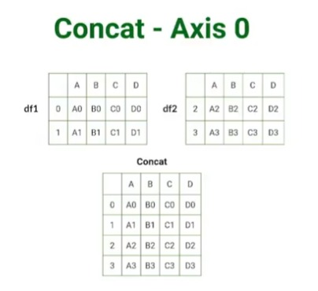
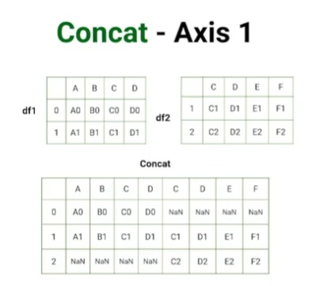
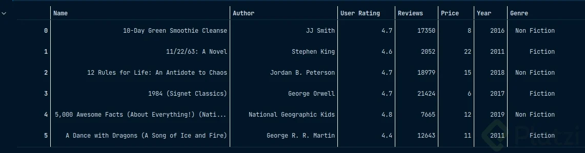
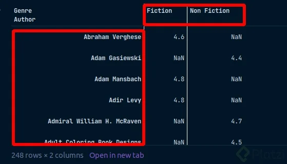
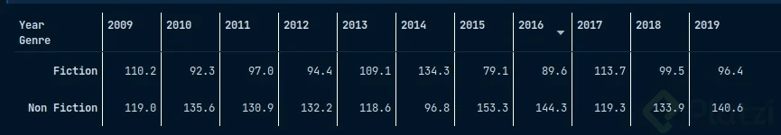
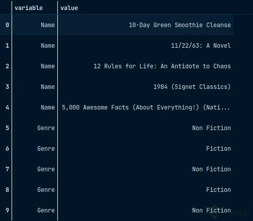
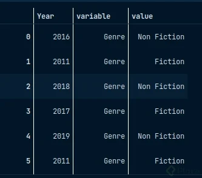

# 📊 Apuntes de NumPy y Pandas

Las 2 librerías muy importantes para la manipulación en la ciencia de datos (Numpy y Pandas)

---

## NumPy

Es una librería enfocada al cálculo numérico y manejo de Arrays.

* Es muy veloz, hasta 50 veces más rápido que usar una lista de Python o C.
* Optimiza el almacenamiento en memoria.
* Maneja distintos tipos de datos.
* Es una librería muy poderosa, se pueden crear redes neuronales desde cero.

### 🚀 Introducción a NumPy

1. **Importar NumPy:** Cómo importar la biblioteca NumPy.

    ```python
    import numpy as np
    ```

2. **Arrays en NumPy:** el objeto principal de numpy es el array, por lo cual siempre debemos convertir los datos en array

    ```python
    lista = [1, 2 , 3, 4, 5, 6, 7, 8, 9] 
    lista
    ---> [1, 2, 3, 4, 5, 6, 7, 8, 9]
    lista_convertida = np.array(lista)
    lista_convertida
    ---> [1, 2, 3, 4, 5, 6, 7, 8, 9]
    #--------------------------------------
    matriz = [[1, 2, 3], [4, 5, 6], [7, 8, 9]]
    matriz_convertida = np.array(matriz)
    matriz_convertida
    ---> array([[1, 2, 3],
                [4, 5, 6],
                [7, 8, 9]])
    ```

3. **Acceso a los elementos:** El *indexado* nos permite acceder a los elementos de los array y matrices.

    >lista

    | Index | 0 | 1 | 2 | 3 | 4 | 5 | 6 | 7 | 8 |
    |-------|---|---|---|---|---|---|---|---|---|
    | 0     | 1 | 2 | 3 | 4 | 5 | 6 | 7 | 8 | 9 |

    ```python
    lista_convertida[1:6]
    ---> array([2, 3, 4, 5, 6])

    lista_convertida[:6]
    ---> array([1, 2, 3, 4, 5, 6])

    lista_convertida[2:]
    ---> array([3, 4, 5, 6, 7, 8, 9])

    lista_convertida[::3]
    ---> array([1, 4, 7])
    ```

    >Matriz

    | Index | 0 | 1 | 2 |
    |-------|---|---|---|
    | 0     | 1 | 2 | 3 |
    | 1     | 4 | 5 | 6 |
    | 2     | 7 | 8 | 9 |

    ```python
    matriz_convertida[0]
    ---> array([1, 2, 3])

    matriz_convertida[0, 2]
    ---> 3

    matriz_convertida[1:]
    ---> array([[4, 5, 6],
                [7, 8, 9]])

    matriz_convertida[1:, 0:2]
    ---> array([[4, 5],
                [7, 8]])
    ```

4. **tipos de datos:** Los arrays de NumPy solo pueden contener un tipo de dato, ya que esto es lo que le confiere las ventajas de la *optimización de memoria.*

    ```python
    arr = np.array([1, 2, 3, 4])
    arr.dtype
    ---> dtype('int64')

    #Si queremos usar otro tipo de dato, lo podemos definir en la declaración del array.
    arr = np.array([1, 2, 3, 4], dtype = 'float64')
    arr.dtype
    ---> dtype('float64')
    arr
    ---> array([1., 2., 3., 4.])

    #También se puede cambiar a tipo booleano recordando que los números diferentes de 0 se convierten en True.
    arr = np.array([0, 1, 2, 3, 4])
    arr = arr.astype(np.bool_)
    arr
    ---> array([False,  True,  True,  True,  True])

    arr = np.array([0, 1, 2, 3, 4])
    arr = arr.astype(np.string_)
    arr
    ---> array([b'0', b'1', b'2', b'3', b'4'], dtype='|S21')

    arr = np.array(['0', '1', '2', '3', '4'])
    arr = arr.astype(np.int8)
    arr
    ---> array([0, 1, 2, 3, 4], dtype=int8)
    ```

5. **Dimensiones:** Con las matrices podemos crear varias dimensiones, vamos a nombrarlas

    * Scalar, Un solo dato o valor

    0

    * Vector, Una serie de datos

    | 0 | 1 | 2 | 3 | 4 | 5 | 6 | 7 | 8 |
    |---|---|---|---|---|---|---|---|---|

    * Matriz, Hoja de cálculo

    | Color   | País      | Edad | Fruta   |
    |---------|-----------|------|---------|
    | Rojo    | España    | 24   | Pera    |
    | Amarillo| Colombia  | 30   | Manzana |

    * Tensor. Series de tiempo o Imágenes

    |       | Dimensión 0 | Dimensión 1 | Dimensión 2 |
    |-------|-------------|-------------|-------------|
    | Índice 0 | [0, 1, 2]   | [3, 4, 5]   | [6, 7, 8]   |
    | Índice 1 | [9, 10, 11] | [12, 13, 14]| [15, 16, 17]|
    | Índice 2 | [18, 19, 20]| [21, 22, 23]| [24, 25, 26]|

    ```python
    # Declarando un escalar.
    scalar = np.array(42)
    print(scalar)
    scalar.ndim
    ---> 42
    ---> 0

    # Declarando un vector.
    vector = np.array([1, 2, 3])
    print(vector)
    vector.ndim

    ---> [1 2 3]
    ---> 1

    # Declarando una matriz.
    matriz = np.array([[1, 2, 3], [4, 5, 6]])
    print(matriz)
    matriz.ndim
    ----[[1 2 3]
        [4 5 6]]
    ---> 2

    # Declarando un tensor.
    tensor = np.array([[[1, 2, 3], [4, 5, 6], [7, 8, 9], [10, 11, 12]],[[13, 13, 15], [16, 17, 18], [19, 20, 21], [22, 23, 24]]])
    print(tensor)
    tensor.ndim
    ---> [[[ 1  2  3]
            [ 4  5  6]
            [ 7  8  9]
            [10 11 12]]

            [[13 13 15]
            [16 17 18]
            [19 20 21]
            [22 23 24]]]
    ---> 3
    ```

6. **Agregar o eliminar dimenciones:**

    ```python
    # Se puede definir el número de dimensiones desde la declaración del array
    vector = np.array([1, 2, 3], ndmin = 10)
    print(vector) 
    vector.ndim 

    ---> [[[[[[[[[[1 2 3]]]]]]]]]]
    ---> 10

    # Se pueden expandir dimensiones a los array ya existentes con expand_dims(). Axis = 0 hace referencia a las filas, mientras que axis = 1 a las columnas.
    expand = np.expand_dims(np.array([1, 2, 3]), axis = 0)
    print(expand)
    expand.ndim 

    ---> [[1 2 3]]
    ---> 2

    # Remover/comprimir las dimensiones que no están siendo usadas.
    print(vector, vector.ndim) 
    vector_2 = np.squeeze(vector)
    print(vector_2, vector_2.ndim)

    ---> [[[[[[[[[[1 2 3]]]]]]]]]] 10
    ---> [1 2 3] 1
    ```

7. **Creando arrays:** Numpy nos da varios métodos muy eficientes para poder crear arrays desde 0.

    ```python
    # Este método de NumPy nos permite generar arrays sin definir previamente una lista.
    np.arange(0,10)
    ---> array([0, 1, 2, 3, 4, 5, 6, 7, 8, 9])

    # Un tercer argumento permite definir un tamaño de paso.
    np.arange(0,20,2)
    ---> array([ 0,  2,  4,  6,  8, 10, 12, 14, 16, 18])

    # np.zeros() Nos permite definir estructuras o esquemas.
    np.zeros(3)
    ---> array([0., 0., 0.])
    np.zeros((10,5))
    ---> array([[0., 0., 0., 0., 0.],
        [0., 0., 0., 0., 0.],
        [0., 0., 0., 0., 0.],
        [0., 0., 0., 0., 0.],
        [0., 0., 0., 0., 0.],
        [0., 0., 0., 0., 0.],
        [0., 0., 0., 0., 0.],
        [0., 0., 0., 0., 0.],
        [0., 0., 0., 0., 0.],
        [0., 0., 0., 0., 0.]])

    # De igual manera, tenemos np.ones()
    np.ones(3)
    ---> array([1., 1., 1.])

    # np.linspace() Permite generar una array definiendo un inicio, un final y cuantas divisiones tendrá.
    np.linspace(0, 10 , 10)
    --->  array([ 0.,1.11111111,2.22222222,  3.33333333,  4.44444444,
            5.55555556,  6.66666667,  7.77777778,  8.88888889, 10.])

    # También podemos crear una matriz con una diagonal de 1 y el resto de 0.
    np.eye(4)
    ----> array([[1., 0., 0., 0.],
            [0., 1., 0., 0.],
            [0., 0., 1., 0.],
            [0., 0., 0., 1.]])

    # Otro método importante es generar números aleatorios.
    np.random.rand()
    ---> 0.37185218178880153

    np.random.rand(4)
    ---> array([0.77923054, 0.90495575, 0.12949965, 0.55974303])

    np.random.rand(4,4)
    ---> array([[0.26920153, 0.24873544, 0.02278515, 0.08250538],
                [0.16755087, 0.59570639, 0.83604996, 0.57717126],
                [0.00161574, 0.27857138, 0.33982786, 0.19693596],
                [0.69474123, 0.01208492, 0.38613157, 0.609117  ]])

    np.random.randint(1,15)
    ---> 7

    np.random.randint(1,15, (3,3))
    ---> array([[ 4,  2,  9],
                [ 5,  7,  8],
                [14, 14,  4]])
    ```

8. **Shape y Reshape:** Hay 2 funciones muy importantes de los arreglos (Shape y Reshape). La forma de un arreglo nos va a decir con que estructura se está trabajando (tamaño, manipular, ingresar).

    ```python
    # SHAPE
    # Indica la forma del arreglo.
    arr = np.random.randint(1,10,(3,2))
    arr.shape
    ---> (3, 2)

    arr
    ---> array([[4, 2],
            [4, 8],
            [4, 3]])

    # RESHAPE
    # Transforma el arreglo mientras se mantengan los elementos.
    arr.reshape(1,6)
    ----> array([[4, 2, 4, 8, 4, 3]])

    arr.reshape(2,3)
    ---> array([[4, 2, 4],
            [8, 4, 3]])

    np.reshape(arr,(1,6))
    ---> array([[4, 2, 4, 8, 4, 3]])

    #Se puede hacer un reshape como lo haría C o Fortran

    np.reshape(arr,(2,3), 'C')
    ---> array([[4, 2, 4],
                [8, 4, 3]])

    np.reshape(arr,(2,3), 'F')
    ---> array([[4, 4, 8],
                [4, 2, 3]])

    # Además, existe la opción de hacer reshape según como esté optimizado nuestro computador. En este caso es como en C.

    np.reshape(arr,(2,3), 'A')
    ---> array([[4, 2, 4],
        [8, 4, 3]])
    ```

9. **funciones principales:**

    ```python
    arr = np.random.randint(1, 20, 10)
    arr
    ---> array([ 6, 11, 15, 12,  9, 17,  7,  7, 12,  3])

    matriz = arr.reshape(2,5)
    matriz
    ---> array([[ 6, 11, 15, 12,  9],
                [17,  7,  7, 12,  3]])

    # .max Para el máximo
    arr.max() ----> 17
    matriz.max() ----> 17
    matriz.max(1) ---> array([15, 17])
    matriz.max(0) --->rray([17, 11, 15, 12,  9])

    # También tenemos .argmax() que nos devuelve la posición del elemento
    arr.argmax() ---> 9
    matriz.argmax(0) ---> array([0, 1, 1, 0, 1])

    # De forma análoga tenemos .min()
    arr.min() ---> 3
    arr.argmin() ---> 3
    matriz.min(0) ---> array([ 6,  7,  7, 12,  3])
    matriz.argmin(1) ---> array([6, 3])

    # Podemos saber la distancia entre el valor más bajo con el más alto.
    arr.ptp() # 17 - 3 ---> 14
    matriz.ptp(0)  ---> array([11,  4,  8,  0,  6])

    #ANÁLISIS ESTADÍSTICOS
    #Ordenar los elementos:
    arr.sort() ---> array([ 3,  6,  7,  7,  9, 11, 12, 12, 15, 17])

    # Obtener un percentil (Busca la posición que esta a la mitad):
    np.percentile(arr, 50) ---> 10.0

    # Media:
    np.median(arr) ---> 10.0

    # Desviación estándar:
    np.std(arr) ---> 4.0853396431631

    # Varianza:
    np.var(arr) ---> 16.69

    # Promedio:
    np.mean(arr) ---> 9.9

    # Lo mismo aplica para las matrices.
    np.median(matriz, 1) ---> array([ 7., 12.])

    # CONCATENACIÓN
    # Se pueden unir dos arrays

    a = np.array([[1,2], [3,4]])
    b= np.array([5, 6])
    np.concatenate((a,b), axis = 0)

    ---> ValueError: all the input arrays must have same number of dimensions, but the array at index 0 has 2 dimension(s) and the array at index 1 has 1 dimension(s)

    # El error anterior es debido a que ‘a’ tiene 2 dimensiones, mientras que ‘b’ tiene 1.
    a.ndim ---> 2
    b.ndim ---> 1

    # Debemos poner ‘b’ en 2 dimensiones también.

    b = np.expand_dims(b, axis = 0)
    np.concatenate((a,b), axis = 0)
    ---> array([[1, 2],
                [3, 4],
                [5, 6]])

    # De igual manera, podemos agregarlo en el otro eje

    np.concatenate((a,b), axis = 1)

    ValueError: all the input array dimensions for the concatenation axis must match exactly, but along dimension 0, the array at index 0 has size 2 and the array at index 1 has size 1

    # Como ‘b’ es una fila y no una columna, no se puede concatenar a menos que se aplique la transpuesta.

    # La transpuesta pone nuestro array en sentido opuesto, si el array original es (1,2), con la transpuesta quedará (2,1)

    b.T
    ---> array([[5],
            [6]])

    np.concatenate((a,b.T), axis = 1)
    ---> array([[1, 2, 5],
                [3, 4, 6]])
    ```

10. **Copy:** .copy() nos permite copiar un array de NumPy en otra variable de tal forma que al modificar el nuevo array los cambios no se vean reflejados en array original.

    ```python
    arr = np.arange(0, 11)
    arr ----> array([ 0,  1,  2,  3,  4,  5,  6,  7,  8,  9, 10])

    # Tomamos un trozo del array original
    arr[0:6] ----> array([0, 1, 2, 3, 4, 5])
    trozo_de_arr = arr[0:6]

    # Queremos pasar todas nuestras variables a 0
    trozo_de_arr[:] = 0
    trozo_de_arr ----> array([0, 0, 0, 0, 0, 0])

    # Se han modificado los datos del array original porque seguía haciendo referencia a esa variable.
    arr ----> array([ 0,  0,  0,  0,  0,  0,  6,  7,  8,  9, 10])

    # Con .copy() creamos una copia para no dañar nuestro array original
    arr_copy = arr.copy()
    arr_copy[:] = 100
    arr_copy ----> array([100, 100, 100, 100, 100, 100, 100, 100, 100, 100, 100])
    arr ----> array([ 0,  0,  0,  0,  0,  0,  6,  7,  8,  9, 10])
    ```

11. **Condiciones:** Las condiciones nos permiten hacer consultas más específicas.

    ```python
    arr = np.linspace(1,10,10, dtype = 'int8')
    arr 
    ---> array([ 1,  2,  3,  4,  5,  6,  7,  8,  9, 10], dtype=int8)

    # Regresa un array de booleanos dónde la condición se cumple.
    indices_cond = arr > 5
    indices_cond
    ---> array([False, False, False, False, False,  True,  True,  True,  True, True])

    # Regresa los valores para dónde la condiciones True.
    arr[indices_cond] 
    ---> array([ 6,  7,  8,  9, 10], dtype=int8)

    # Múltiples condiciones.
    arr[(arr > 5) & (arr < 9)] 
    ---> array([6, 7, 8], dtype=int8)

    # Modificar los valores que cumplan la condición.
    arr[arr > 5] = 99
    arr
    ---> array([ 1,  2,  3,  4,  5, 99, 99, 99, 99, 99], dtype=int8)
    ```

12. **Operaciones:**

    ```python
    # Existen diferentes operaciones que se pueden usar para los arrays de NumPy.
    lista = [1,2]
    lista ----> [1, 2]

    # Una lista de Python entiende que quieres duplicar los datos. No es lo que buscamos.
    lista * 2
    ---> [1, 2, 1, 2]

    # Pero Numpy lo entiende mucho mejor
    arr = np.arange(0,10)
    arr2 = arr.copy()
    arr ----> array([0, 1, 2, 3, 4, 5, 6, 7, 8, 9])

    # Ahora multiplicamos por un vector:
    arr * 2
    ---> array([ 0,  2,  4,  6,  8, 10, 12, 14, 16, 18])

    # Operación suma de vectores:
    arr + 2 
    ---> array([ 2,  3,  4,  5,  6,  7,  8,  9, 10, 11])

    # División con un vector
    # Como en este caso la primera posición del array es 0, muestra un error pero, no detiene el proceso.
    1 / arr

    ---> RuntimeWarning: divide by zero encountered in true_divide
    Entry point for launching an IPython kernel.

    ---> array([    inf,   1.  , 0.5 , 0.33333333, 0.25 ,0.2, 0.16666667, 0.14285714, 0.125 , 0.11111111])

    #Elevar a un vector:
    arr**2
    ---> array([ 0,  1,  4,  9, 16, 25, 36, 49, 64, 81])

    # Sumar dos arrays de igual dimensiones las hace elemento por elemento:
    arr + arr2
    ---> array([ 0,  2,  4,  6,  8, 10, 12, 14, 16, 18])

    # Lo mismo aplica para matrices.
    matriz = arr.reshape(2,5)
    matriz2 = matriz.copy()
    matriz
    ---> array([[0, 1, 2, 3, 4],
            [5, 6, 7, 8, 9]])
    matriz - matriz2
    ---> array([[0, 0, 0, 0, 0],
            [0, 0, 0, 0, 0]])

    # Una operación importante es la de punto por punto, aquí dos formas de hacerla:
    np.matmul(matriz, matriz2.T)
    ---> array([[ 30,  80],
            [ 80, 255]])
    matriz @ matriz2.T
    ---> array([[ 30,  80],
        [ 80, 255]])
    ```

## Pandas

Pandas está enfocada a la manipulación y análisis de datos.

* Al estar construido sobre NumPy es veloz.
* Requiere poco código para manipular los datos.
* Soporta múltiples formatos de archivos.
* Ordena los datos en una alienación inteligente.
* Se pueden manejar grandes cantidades de datos, hacer analítica y generar dashboards.

### 🚀 Introducción a Pandas

1. **Importar Pandas:** Cómo importar la biblioteca Pandas.

    ```python
    import pandas as pd
    ```

2. **Series en Pandas:** Es muy parecido a un array de una dimensión (o vector) de NumPy.

    • Arreglo unidimensional indexado
    • Búsqueda por índice
    • Slicing
    • Operaciones aritméticas
    • Distintos tipos de datos

    ```python
    import pandas as pd

    serie = pd.Series([1, 2, 3, 4, 5])

    psg_players = pd.Series(['Navas','Mbappe','Neymar','Messi'], index=[1,7,10,30])

    psg_players
    ---> 1      Navas
        7     Mbappe
        10    Neymar
        30     Messi
        dtype: object

    dict = {1: 'Navas', 7: 'Mbappe', 10: 'Neymar', 30:'Messi'}
    pd.Series(dict)
    ---> 1 Navas
    7 Mbappe
    10 Neymar
    30 Messi
    dtype: object

    psg_players[7]
    ----> 'Mbappe'

    psg_players[0:3]
    -----> 0     Navas
        1    Mbappe
        2    Neymar
        dtype: object
    ```

3. **DataFrames en Pandas:** Muy parecido a las estructuras matriciales trabajadas con NumPy.

    • Estructura principal
    • Arreglo de dos dimensiones
    • Búsqueda por índice (columnas o filas)
    • Slicing
    • Operaciones aritméticas
    • Distintos tipos de datos
    • Tamaño variable

    ```python
    import pandas as pd

    datos = {'Nombre': ['Alice', 'Bob', 'Charlie'],
             'Edad': [25, 30, 35]}
    df = pd.DataFrame(datos)

    dict = {'Jugador':['Navas','Mbappe','Neymar','Messi'],
    'Altura':[183.0, 170.0, 170.0, 163.0],
    'Goles':[2, 200, 150, 500]}
    df_players = pd.DataFrame(dict, index=[1,7,10,30])
    --->   Jugador Altura Goles
            1 Navas    183    2
            7 Mbappe   170    200
            10 Neymar   170    150
            30 Messi    163    500

    df_players.columns
    ---> Index(['Jugador', 'Altura', 'Goles'], dtype='object')

    df_players.index
    ------> RangeIndex(start=0, stop=4, step=1)
    ```

### 🔄 Operaciones Básicas en Pandas

1. **Leer archivos CSV y JSON con Pandas:**

    ```python
    pd.read_csv('/work/DataFrames/bestsellers-with-categories.csv')

    # En algunas ocasiones el archivo podría estar separado por " | " y se vería así.
    # Para solucionar esto, usamos el atributo "Sep = ’ , ’ " y ya quedará bien organizado.
    pd.read_csv('/work/DataFrames/bestsellers-with-categories.csv', sep=  ' | ')

    # Cambiar el encabezado, lo podemos hacer con “Header”, este pondrá de encabezado los valores que tenga en esa posición.
    pd.read_csv('/work/DataFrames/bestsellers-with-categories.csv', header = 2)

    # Cambiar el nombre de las columnas con “names”.
    pd.read_csv('/work/DataFrames/bestsellers-with-categories.csv',header = 0, names = ['Namesss', 'Authhhhhor', 'User Rating', 'Reviews', 'Price', 'Year', 'Genre'])

    # Para ***agregar un archivo ‘JSON’***, se hace de igual manera, pero en esta ocasión usamos
    pd.read_json('/work/DataFrames/hpcharactersdataraw.json')
    ```

2. **Filtrado con loc y iloc:** Cuando queremos navegar por un dataFrame estas funciones permiten filtrar datos de manera más específica

    ```python
    import pandas as pd
    df_books = pd.read_csv('bestsellers-with-categories.csv', sep=',', header=0)
    # Filtro por fila
    df_books[0:4]
    ---> # Muestra las filas del indice 0 al 4
    # Filtro por columna
    df_books[['Autor', 'Libro']]
    ---> # Muestra la columna de autor y libro

    # Pero que pasaria si queremos filtrar por fila y columna al mismo tiempo?, ahí aparece loc e iloc

    # LOC
    # Filtra según un label

    df_books.loc[:]
    ---> #muestra todos los datos del dataFrame

    df_books.loc[0:4] 
    ---> #muestra los datos de la fila 0 a la fila 4

    df_books.loc[0:4, ['Name', 'Author']] 
    ----> #filtra los datos de la fila que va de 0 a 4 y de las columnas Name y Author

    df_books.loc[:, ['Reviews']] * -1
    ---> #multiplica por -1 todos los valores de la columna Reviews

    df_books.loc[:, ['Author']] == 'JJ Smith' 
    ----> #muestra la columna Author con True en los valores que cumplen la condicion y False para los que no la cumplen

    # ILOC
    # Filtra por indices

    df_books.iloc[:] ---> #muestra todos los datos del dataframe

    df_books.iloc[:4, 0:2] ---> #muestra los datos de las filas que van de 0 a 3 y las columnas con indices 0 y 1

    df_books.iloc[1,3] ---> #muestra el dato alojado en la fila 1 columna 3
    ```

3. **Agregar o eliminar datos:** Muchas ocasiones necesitamos agregar, eliminar o separar datos y pandas nos ofrece varias funciones para que este proceso se vuelva mucho más sencillo.

    ```python
    # Muestra las primeras 5 líneas del DataFrame
    df_books.head() 
    ---> muestra las primeras 5 lineas del dataFrame

    # Eliminar columnas de la salida pero no del DataFrame
    df_books.drop('Genre', axis=1).head()
    ---> #elimina la columna Genre de la salida pero no del dataFrame

    # Si queremos eliminarlo del dataframe
    df_books.drop('Genre', axis=1, inplace=True).head()

    # Eliminar una columna
    del df_books['Price'] 
    ---> #elimina la columna Price del dataFrame

    # Eliminar filas
    df_books.drop(0, axis=0)
    ---> #elimina la fila 0 del dataFrame

    # Eliminar un conjunto de filas mediante una lista
    df_books.drop([0,1,2], axis=0)
    ---> #elimina las filas 0, 1 y 2 del dataFrame

    # Elimina un conjunto de filas mediante un rango
    df_books.drop(range(0,10), axis=0)
    ---> #elimina las primeras 10 filas del dataFrame

    # Agregar una nueva columna con valores Nan
    df_books['Nueva_columna'] = np.nan
    ---> #Crea una nueva columna con el nombre de Nueva_columna de valores Nan

    # Mostrar el número de filas o columnas que tiene un DataFrame
    df_books.shape[0]
    ---> #Muestra el numero de filas que posee el dataFrame

    # Agregar valores a una nueva columna
    data = np.arange(0, df_books.shape[0])
    df_books['Rango'] = data
    ---> #Crea una nueva columna llamada Rango con los valores del array

    # Para añadir filas se utiliza la función append de Python añadiendo como parámetro una lista, diccionario o añadiendo los valores manualmente.
    df_books.append(df_books)
    ---> #Duplica las filas del dataFrame porque se agrega a si mismo
    nueva_fila = {'nombre': 'Juan', 'apellido': 'Alarcon7'}
    df = df.append(nueva_fila, ignore_index=True)
    ---> # Añade una nueva fila a un dataframe que tiene dos columnas
    ```

4. **Manejo de datos nulos:** Los datos nulos son dolores de cabeza para este mundo de la ciencia de datos y se van a encontrar mucho en nuestros DataFrames.

    ```python
    # Creamos un DataFrame con algunos valores nulos
    import pandas as pd
    import numpy as np

    dict = {'Col1':[1,2,3,np.nan],
    'Col2':[4, np.nan,6,7],
    'Col3':['a','b','c', None]}
    df = pd.DataFrame(dict)
    ---> Col1 Col2 Col3
    0   1       4    a
    1   2     nan    b
    2   3       6    c
    3  nan      7   None

    # Identificar valores nulos en un DataFrame
    df.isnull()
    ---->    Col1   Col2   Col3
    0       false   false  false
    1       false   true   false
    2       false   false  false
    3       true    false  true

    # Identificar valores nulos con un valor numérico
    df.isnull()*1
    ---> Col1   Col2   Col3
    0       0      0       0
    1       0      1       0
    2       0      0       0
    3       1      0       1

    # Sustituir los valores nulos por una cadena
    df.fillna('Missing')
    --->  Col1   Col2   Col3
    0       1.0    4.0     a
    1       2.0  Missing   b
    2       3.0    6.0     c
    3       Missing 7.0  Missing

    # Sustituir valores nulos por una medida estadística realizada con los valores de las columnas
    df.fillna(df.mean())
    ---->    Col1   Col2   Col3
    0           1      4      a
    1           2      5.667  b
    2           3      6      c
    3           2      7     None

    # Sustituir valores nulos por valores de interpolación
    df.interpolate()
    ---->    Col1   Col2   Col3
    0           1      4      a
    1           2      5      b
    2           3      6      c
    3           3      7     None

    # Eliminar valores nulos
    df.dropna()
    --->  Col1   Col2   Col3
    0       1      4      a
    2       3      6      c

    # Eliminar todos los valores nulo de una columna
    df.dropna(subset='col1')
    ```

5. **Filtrado por condiciones:** Funciona por lógica booleana y retorna los valores que están en “True”. Es muy útil porque en ocasiones queremos filtrar o separar datos.

    ```python
    # Llamamos los datos de un archivo csv para manejarlos
    df_books = pd.read_csv('bestsellers-with-categories.csv')
    df_books.head(2) ---> #muestra los primeros dos registros del dataFrame

    # Mostrar datos que sean mayores a cierto valor
    mayor2016 = df_books['Year'] > 2016
    mayor2016
    ---> #muestra el dataFrame con valores booleanos. True para libros publicados desde el 2017

    # Filtrar datos en nuestro DataFrame que sean mayores a cierto valor
    df_books[mayor2016]
    ---> #filtra los datos que cumplen con la condicion

    # También se puede colocar la condición directamente como parámetro
    df_books[df_books['Year'] > 2016]
    ---> #filtra los datos que cumplen con la condicion

    # Mostrar los datos que sean igual a cierto valor
    genreFiction = df_books['Genre'] == 'Fiction'
    genreFiction ---> #muestra el dataFrame con valores booleanos. True para libros de tipo Fiction

    # Filtrado con varias condiciones
    df_books[genreFiction & mayor2016]
    ---> #Filtra los libros que sean de tipo Fiction y que hayan sido publicado desde 2017

    # Filtrado con negación
    df_books[~mayor2016]
    ---> #Filtra los libros publicados antes o igual al 2016
    ```

6. **Funciones principales de Pandas:** Hay ciertas funciones que son muy importantes y que siempre estaremos usando a la hora de hacer análisis de datos, para mayor facilidad y comprensión del DataFrame.

    ```python
    # Mostrar las primeras dos líneas de registro
    df_books.head(2)
    ---> #muestra los primeros dos registros del dataFrame

    # Mostrar los diferentes datos que contiene el DataFrame
    df_books.info()
    ---> py
    RangeIndex: 550 entries, 0 to 549        #numero de registro
    Data columns (total 7 columns):          #total de columnas

    #   Column       Non-Null Count  Dtype  #tipos de cada columna
    ---  ------       --------------  -----
    0   Name         550 non-null    object
    1   Author       550 non-null    object
    2   User Rating  550 non-null    float64
    3   Reviews      550 non-null    int64
    4   Price        550 non-null    int64
    5   Year         550 non-null    int64
    6   Genre        550 non-null    object
    dtypes: float64(1), int64(3), object(3)

    # Obtener diferentes datos estadísticos de las columnas numéricas.
    df_books.describe()
    --->  User.Rating  Reviews   Price     Year
    count    550       550       550       550
    mean    4.618   11953.281    13.1      2014
    std     0.226   11731.132    10.84     3.165
    min      3.3        37         0       2009
    25%      4.5      4058         7       2011
    50%      4.7      8580        11       2014
    75%      4.8    17253.25      16       2017
    max      4.9      87841      105       2019

    # Mostrar los últimos 5 registros del DataFrame
    df_books.tail()
    ---> #muestra los ultimos 5 registros

    # Obtener el uso de la memoria de cada columna
    df_books.memory_usage(deep=True)
    --->
    Index            128
    Name           59737
    Author         39078
    User Rating     4400
    Reviews         4400
    Price           4400
    Year            4400
    Genre          36440
    dtype: int64

    # Obtener cuantos datos tenemos de algo en específico
    df_books['Author'].value_counts()
    ---> Muestra cuantos datos hay de cada autor

    # Eliminar registros duplicados
    df_books.drop_duplicates()

    # Ordenar los registros según valores de la columna (orden ascendente)
    df_books.sort_values('Year')
    ---> #ordena los valores de menor a mayor segun el año

    # Ordenar los registros según valores de la columna (orden descendente)
    df_books.sort_values('Year', ascending=False)
    ---> #ordena los valores de mayor a menor segun el año
    ```

7. **groupby:** Permite agrupar datos en función de los demás. Es decir, hacer el análisis del DataFrame en función de una de las columnas.

    ```python
    # Agrupar por Author y mostrar el conteo de los datos de las demás columnas
    df_books.groupby('Author').count()
    --->              Name    User Rating    Reviews    Price    Year   Genre
    Abraham Verghese    2      2     2         2       2       2
    Adam Gasiewski      1       1     1         1       1       1
    Adam Mansbach       1       1     1         1       1       1
    Adir Levy           1       1      1         1       1       1

    # Agrupar por Author y mostrar la media de los datos de las demás columnas
    df_books.groupby('Author').median()
    --->            User Rating    Reviews    Price    Year
    Abraham Verghese   4.6          4866       11      2010.5
    Adam Gasiewski     4.4          3113       6       2017
    Adam Mansbach      4.8          9568       9       2011
    Adir Levy          4.8          8170       13      2019

    # La columna Author, en los casos anteriores, pasa a ser el índice.
    #----------------------------------------------------------------

    # Podemos usar loc y acceder a un dato específico del DataFrame. Agrupar por autor y mostrar la suma de los valores de las demás columnas para William Davis
    df_books.groupby('Author').sum().loc['William Davis']
    ---> 
    User Rating        8.8
    Reviews        14994.0
    Price             12.0
    Year            4025.0
    Name: William Davis, dtype: float64

    # Agrupar por author y mostrar la suma de los valores de las demás columnas. Colocar los índices que el DataFrame trae por defecto
    df_books.groupby('Author').sum().reset_index()
    --->              Author    User Rating    Reviews    Price    Year 
    0         Abraham Verghese      9.2         9732       22      4021
    1         Adam Gasiewski        4.4         3113       6       2017
    2         Adam Mansbach         4.8         9568       9       2011
    3         Adir Levy             4.8         8170       13      2019

    # La función agg() permite aplicar varias funciones al DataFrame una vez agrupado según una columna específica. Agrupar por Author y mostrar el mínimo y máximo de las demás columnas
    df_books.groupby('Author').agg(['min','max'])
    ---> #muestra cada columna dividida en dos: min y max. Estas contienen los valores maximo y minimo de la columna para cada Author

    # Agrupar por Author, obtener el mínimo y máximo de la columna ‘Reviews’ y sumar los valores de la columna ‘User Rating’
    df_books.groupby('Author').agg({'Reviews':['min','max'], 'User Rating':'sum'})
    --->                 Reviews min    Reviews max    User Rating 
    Abraham Verghese         4866           4866          9.2
    Adam Gasiewski           3113           3113          4.4
    Adam Mansbach            9568           9568          4.8
    Adir Levy                8170           8170          4.8

    # Agrupar por ‘Author - Year’ y contar los valores de las demás columnas
    df_books.groupby(['Author','Year']).count()
    --->                        Name    User Rating    Reviews    Price    Genre
    ('Abraham Verghese', 2010)   1       1     1         1        1
    ('Abraham Verghese', 2011)   1       1      1         1        1
    ('Adam Gasiewski', 2017)     1       1      1         1        1
    ('Adam Mansbach', 2011)      1       1      1         1        1
    ```

8. **Combinando DataFrames:** Existen diferentes formas de fusionar dos DataFrames. Esto se hace a través de la lógica de combinación como se muestra a continuación:

    
    
    
    

    ```python
    # Como podemos usar la lógica anteriormente vista en código, usando los parámetros de Pandas

    # CONCAT

    # En esta ocasión vamos a crear un DataFrame nuevo
    df1 = pd.DataFrame({'A':['A0', 'A1', 'A2','A3'],
                        'B':['B0', 'B1', 'B2','B3'],
                        'C':['C0', 'C1', 'C2','C3'],
                        'D':['D0', 'D1', 'D2','D3']})

    df2 = pd.DataFrame({'A':['A4', 'A5', 'A6','A7'],
                        'B':['B4', 'B5', 'B6','B7'],
                        'C':['C4', 'C5', 'C6','C7'],
                        'D':['D4', 'D5', 'D6','D7']})

    # Concatenar los DataFrames
    pd.concat([df1,df2])
    ---> A  B   C   D
    0   A0  B0  C0  D0
    1   A1  B1  C1  D1
    2   A2  B2  C2  D2
    3   A3  B3  C3  D3
    0   A4  B4  C4  D4
    1   A5  B5  C5  D5
    2   A6  B6  C6  D6
    3   A7  B7  C7  D7

    # Corregir los índices
    pd.concat([df1,df2], ignore_index= True)
    ---> A  B   C   D
    0   A0  B0  C0  D0
    1   A1  B1  C1  D1
    2   A2  B2  C2  D2
    3   A3  B3  C3  D3
    4   A4  B4  C4  D4
    5   A5  B5  C5  D5
    6   A6  B6  C6  D6
    7   A7  B7  C7  D7

    # Por axis 1
    pd.concat([df1,df2], axis = 1)
    ---> A  B   C   D   A.1 B.1 C.1 D.1
    0   A0  B0  C0  D0  A4  B4  C4  D4
    1   A1  B1  C1  D1  A5  B5  C5  D5
    2   A2  B2  C2  D2  A6  B6  C6  D6
    3   A3  B3  C3  D3  A7  B7  C7  D7

    # MERGE

    # MERGE 1
    izq = pd.DataFrame({'key' : ['k0', 'k1', 'k2','k3'],
    'A' : ['A0', 'A1', 'A2','A3'],
    'B': ['B0', 'B1', 'B2','B3']})

    der = pd.DataFrame({'key' : ['k0', 'k1', 'k2','k3'],
    'C' : ['C0', 'C1', 'C2','C3'],
    'D': ['D0', 'D1', 'D2','D3']})

    # Unir el DataFrame Der a Izq
    izq.merge(der)
    ---> key A  B   C   D
    0   k0  A0  B0  C0  D0
    1   k1  A1  B1  C1  D1
    2   k2  A2  B2  C2  D2
    3   k3  A3  B3  C3  D3

    # MERGE 2
    izq = pd.DataFrame({'key' : ['k0', 'k1', 'k2','k3'],
    'A' : ['A0', 'A1', 'A2','A3'],
    'B': ['B0', 'B1', 'B2','B3']})

    der = pd.DataFrame({'key_2' : ['k0', 'k1', 'k2','k3'],
    'C' : ['C0', 'C1', 'C2','C3'],
    'D': ['D0', 'D1', 'D2','D3']})

    # Hay diferencias entre algunas columnas, por esa razón hay que separarlos de esta manera:
    izq.merge(der, left_on = 'key', right_on='key_2')
    ---> key A  B   key_2   C   D
    0   k0  A0  B0  k0    C0  D0
    1   k1  A1  B1  k1    C1  D1
    2   k2  A2  B2  k2    C2  D2
    3   k3  A3  B3  k3    C3  D3

    # MERGE 3
    izq = pd.DataFrame({'key' : ['k0', 'k1', 'k2','k3'],
    'A' : ['A0', 'A1', 'A2','A3'],
    'B': ['B0', 'B1', 'B2','B3']})

    der = pd.DataFrame({'key_2' : ['k0', 'k1', 'k2',np.nan],
    'C' : ['C0', 'C1', 'C2','C3'],
    'D': ['D0', 'D1', 'D2','D3']})

    # Si tenemos un NaNen nuestro DataFrame, pandas no lo detectará como un mach. Se soluciona con How, dando así, una preferencia.
    izq.merge(der, left_on = 'key', right_on='key_2', how='left')
    ---> key A  B   key_2   C   D
    0   k0  A0  B0  k0    C0  D0
    1   k1  A1  B1  k1    C1  D1
    2   k2  A2  B2  k2    C2  D2
    3   k3  A3  B3  NaN  NaN  NaN

    # JOIN

    # Join Es otra herramienta para hacer exactamente lo mismo, una combinación. La diferencia es que join va a ir a los índices y no a columnas específicas.

    izq = pd.DataFrame({'A': ['A0','A1','A2'],
                        'B':['B0','B1','B2']},
                        index=['k0','k1','k2'])

    der =pd.DataFrame({'C': ['C0','C1','C2'],
                        'D':['D0','D1','D2']},
                        index=['k0','k2','k3'])

    # Combinamos izq con der
    izq.join(der)
    ---> A  B   C   D
    k0  A0  B0  C0  D0
    k1  A1  B1  nan nan
    k2  A2  B2  C1  D1

    # Traer todos los datos aunque no hagan match.
    izq.join(der, how = 'outer')
    ---> A  B   C   D
    k0  A0  B0  C0  D0
    k1  A1  B1  nan nan
    k2  A2  B2  C1  D1
    k3  nan nan C2  D2
    ```

    > *En temas de performance y velocidad, ¿cuál es mejor el Merge o el Join, cuando se trata de miles de registros?*
    >*Respuesta:*
    >*join suele ser mejor*

9. **groupby:** Es un comando muy poderoso que nos deja aplicar funciones a nuestro DataFrame

    ```python
    # Creamos unos DataFrame habitual
    import pandas as pd
    df_books = pd.read_csv('/work/DataFrames/bestsellers-with-categories.csv')
    df_books.head(2)

    # Creamos nuestra función
    def two_times(value):
        return value * 2

    # Lo aplicamos a la columna de User Rating
    df_books['User Rating'].apply(two_times)
    ---> Se multiplica por 2 todos los valores de la columna

    # Podemos guardarlo en una columna nueva
    df_books['User Rating2'] =df_books['User Rating'].apply(two_times)

    # Se pueden crear lambda functions
    df_books['User Rating2'] =df_books['User Rating'].apply(lambda x: x* 3)
    ---> Multiplica todos los valores por 3

    # Apply en varias columnas con condiciones, hay que especificar a que los vamos a aplicar (filas o columnas)
    df_books.apply(lambda x: x['User Rating'] * 2 if x['Genre'] == 'Fiction' else x['User Rating'], axis = 1)
    ---> Multiplica por 2 a los datos que cumplan la condición 
    ```

### Pivot y Melt

Hola, te doy la bienvenida a la clase de pivot_table y melt, dos funciones que sirven para cambiar la estructura de nuestro DataFrame de acuerdo a nuestras necesidades.

1. **Pivot_table:**

    Esta función puede traer recuerdos a las personas interesadas en el mundo del SQL, ya que Oracle, PostgreSQL y otros motores de bases de datos la tienen implementada desde hace muchos años. Pivot, básicamente, transforma los valores de determinadas columnas o filas en los índices de un nuevo DataFrame, y la intersección de estos es el valor resultante.
\
    Entiendo que esto puede sonar algo confuso, pero no te preocupes, todo queda mucho más claro con un ejemplo.

    ```python
    # Carga el DataFrame que hemos usado en el curso
    df_books = pd.read_csv('bestsellers with categories.csv',sep=',',header=0)

    # Explóralo viendo sus primeras 5 filas
    df_books.head()
    ```

    

    ```python
     # Aplica pivot_table
    df_books.pivot_table(index='Author',columns='Genre',values='User Rating')
    ```

    Como resultado, los valores de Author pasan a formar el índice por fila y los valores de Genre pasan a formar parte de los índices por columna, y el User Rating se mantiene como valor.

    

    ```python
     # Ejecuta la siguiente variación
    df_books.pivot_table(index='Genre',columns='Year', values='User Rating',aggfunc='sum')
    ```

    

2. **melt:**

    El método melt toma las columnas del DataFrame y las pasa a filas, con dos nuevas columnas para especificar la antigua columna y el valor que traía.
\
    Por ejemplo, simplemente al imprimir las cinco primeras filas del DataFrame con las columnas de Name y Genre se tiene este resultado.

    ```python
    # Para ello ejecuta la siguiente línea en tu Jupyter Notebook
    ddf_books[['Name','Genre']].head(5).melt()
    ```

    Ahora cada resultado de las dos columnas pasa a una fila de este modo a tipo llave:valor.
    

    ```python
    # En el siguiente ejemplo ejecutemos melt de esta manera
    df_books.melt(id_vars='Year',value_vars='Genre')
    ```

    Simplemente, podemos seleccionar las columnas que no quiero hacer melt usando el parámetro id_vars. Para este caso Year y también la única columna que quiero aplicar el melt, para este caso Genre con la propiedad value_vars.
    
