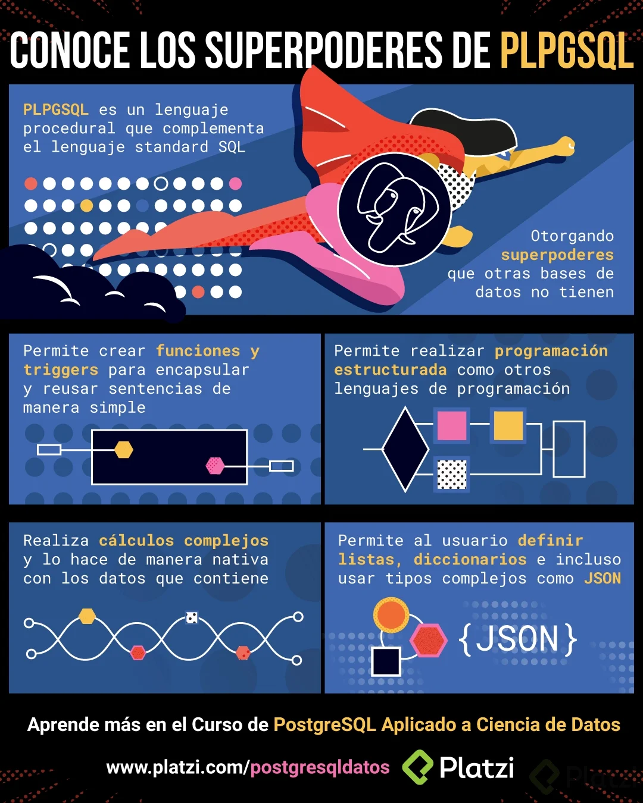

# PostgreSQL para Ciencia de Datos

## 1. Particularidades de PostgreSQL

### 1.1. Diferencias entre otros manejadores y PostgreSQL

- Código libre y orientado a la comunidad
- Base de datos adaptada y madura, soporta JSON y funciones estadísticas
- PL/pgSQL (Procedural Language/PostgreSQL)
- Manejo de objetos
- Particiones en las tablas mediante estrategias
- Common table expressions tratamiento de tablas virtuales, más eficiente en tiempo de ejecusión
- Window functions trata de encontrar relaciones entre un registro y el resto de registros

### 1.2. Conoce los superpoderes de PLPGSQL



### 1.3. PLPGSQL: Stored procedures

PLPGSQL es un lenguaje ampliado derivado desde el SQL pudiendo ejecutar codigo SQL estandar y funciones especificas de este lenguaje

EXISTEN

- Store procedures Integran lógica a la sentencias SQL. Se han ido incluyendo en el estándar SQL. No regresan ningún valor.

- Functions Son mas avanzadas estan hechas en el lenguaje de PLPGSQL, Regresan tipos de datos. Tienen más flexibilidad. No son estándar de SQL.

```sql
--Creación de un Stored Procedure
CREATE OR REPLACE PROCEDURE crea_tabla_clientes()
LANGUAGE SQL
AS $$
    DROP TABLE IF EXISTS clientes;
    CREATE TABLE clientes(
        id_cliente SERIAL PRIMARY KEY,
        nombre VARCHAR(100),
        apellido VARCHAR(100),
        direccion VARCHAR(255)
    )
$$;

--Llamamos al stored procedure
call crea_tabla_clientes()

--Creación de una función
CREATE OR REPLACE FUNCTION crea_tabla_pedidos()
RETURNS VOID
LANGUAGE plpgsql
AS $$
    BEGIN
        DROP TABLE IF EXISTS pedidos;
        CREATE TABLE pedidos(
            id_pedidos SERIAL PRIMARY KEY,
            id_cliente INT REFERENCES clientes(id_cliente),
            fecha_pedido DATE,
            total NUMERIC(10,2)
        );
    END
$$;

--Llamamos a la función
SELECT crea_tabla_pedidos()
```

### 1.4. PLPGSQL: conteo, registro y triggers

```sql
--Conteo
CREATE OR REPLACE FUNCTION consulta_usuarios()
-- si no deseas retornar nada puedes colocar void en lugar de integer
RETURNS integer
LANGUAGE plpgsql
AS $BODY$
DECLARE
    rec pasajero%ROWTYPE;
    contador integer := 0;
BEGIN
    --recorre la tabla pasajero y guarda cada fila en la variable rec
    FOR rec IN SELECT * FROM pasajero LOOP 
        RAISE NOTICE 'id: %, Nombre: %', rec.id, rec.nombre;
        contador := contador + 1;
    END LOOP;

    RAISE NOTICE 'Cantidad de registros: %', contador;
    RETURN contador;
END
$BODY$;

--Triggers
-- tabla de ejemplo
CREATE TABLE empleados (
    id SERIAL PRIMARY KEY,
    nombre VARCHAR(100),
    salario NUMERIC(10, 2)
);

-- funcion plpgsql
CREATE OR REPLACE FUNCTION mostrar_cambios()
RETURNS TRIGGER AS
$$
BEGIN
    RAISE NOTICE 'Registro actualizado:';
    RAISE NOTICE 'ID antiguo: %, Nombre antiguo: %, Salario antiguo: %',
                 OLD.id, OLD.nombre, OLD.salario;
    RAISE NOTICE 'ID nuevo: %, Nombre nuevo: %, Salario nuevo: %',
                 NEW.id, NEW.nombre, NEW.salario;
    RETURN NEW;
END;
$$
LANGUAGE plpgsql;

-- creacion de trigger
CREATE TRIGGER tr_actualizacion_empleados
AFTER UPDATE ON empleados
FOR EACH ROW
EXECUTE FUNCTION mostrar_cambios();
-- si quieres que el trigger se ejecute antes de la operacion cambiar
-- after update por BEFORE UPDATE
```

### 1.5. PLPGSQL: Aplicado a data science

```sql
CREATE OR REPLACE FUNCTION movies_stats()
RETURNS VOID
LANGUAGE plpgsql
AS $$
DECLARE
    total_rated_r REAL := 0.0;
    total_larger_thank_100 REAL := 0.0;
    total_published_2006 REAL := 0.0;
    average_duracion REAL := 0.0;
    average_rental_price REAL := 0.0;
BEGIN
    total_rated_r := COUNT(*) FROM peliculas WHERE clasificacion = 'R';
    total_larger_thank_100 := COUNT(*) FROM peliculas WHERE duracion > 100;
    total_published_2006 := COUNT(*) FROM peliculas WHERE anio_publicacion = 2006;
    average_duracion := AVG(duracion) FROM peliculas;
    average_rental_price := AVC(precio_renta) FROM peliculas;

    TRUNCATE TABLE peliculas_estadisticas;
    --Truncate borra datos que había en la tabla y guarda nuevos datos

    INSERT INTO peliculas_estadisticas (tipo_estadisticas, total)
    VALUES
        ('Peliculas con clasificacion R', total_rate_r),
        ('Peliculas de mas de 100 minutos', total_larger_than_100),
        ('Peliculas publicadas en 2006', total_published_2006),
        ('Promedio de duracion en minutos', average_duracion),
        ('Precio promedio de renta', average_rental_price);
END
$$;

SELECT movies_stats();

SELECT * FROM peliculas_estadisticas;
```

### 1.6. Integración con otros lenguajes

Como la mayoría de las bases de datos, PostgreSQL cuenta con conectores para diferentes lenguajes de programación, de tal forma que si trabajas con Python, PHP, Java, JavaScript y todos sus frameworks, exista una forma de extraer datos de PostgreSQL y posteriormente utilizar las propiedades de los lenguajes procedurales para transformar y utilizar los datos.

El lenguaje estándar utilizado en bases de datos relacionales es SQL (Structured Query Language), un lenguaje que tiene una estructura sumamente útil para hacer solicitudes de datos, en especial tomando como abstracción un diseño tabular de datos. Sin embargo, carece de estructuras de control y otras abstracciones que hacen poderosos a los lenguajes procedurales de programación.

#### PL/pgSQL

Como respuesta a los puntos débiles de SQL como estándar, PostgreSQL respondió originalmente creando un lenguaje propio llamado PL/pgSQL (Procedural Language/PostgreSQL Structured Query Language) que es literalmente un superset de SQL que incluye propiedades de un lenguaje estructurado que, por un lado, nos permite crear funciones complejas y triggers; y, por el otro lado, agrega estructuras de control, cursores, manejo de errores, etc.

#### Otros lenguajes

Sin embargo, en muchos sentidos, aunque PL/pgSQL ayuda en los casos más genéricos para generar estructuras y funcionalidades más complejas, no se compara con lenguajes completamente independientes y no ligados directamente a una base de datos.

La respuesta sin embargo tampoco es los conectores normales que, si bien resuelven la parte de un lenguaje más complejo, añaden por otro lado una separación de la base de datos, ya que debe correr en un servidor separado y hacer llamadas entre ellos con la latencia como un colateral.

Para mitigar estos problemas tomando lo mejor de ambos mundos, los desarrolladores de PostgreSQL se dedicaron a hacer implementaciones de diversos lenguajes a manera de plugin.

##### C

La biblioteca que permite al lenguaje C ejecutarse en PostgreSQL es llamada libpq y es una interfaz de programación que permite extender y hacer de interfaz para permitir a otros lenguajes ejecutarse en esta base de datos.

Puedes encontrar más información de esta interfaz en el siguiente [link](https://www.postgresql.org/docs/11/libpq.html)

##### PL/Tcl

Tcl (Tool Command Language) es un lenguaje diseñado con la simpleza en mente y su paradigma consiste en que todo en él es un comando, incluyendo la estructura del lenguaje que, sin embargo, son suficientemente flexibles para poderse sobreescribir, haciéndolo un lenguaje sumamente extensible.

Todo lo anterior es ideal para la integración con el manejador de PostgreSQL ya que permite elaborar comandos para ejecutar las sentencias SQL y extenderlas facilmente.

Si quieres leer más del tema, puedes hacerlo en el siguiente [link](https://www.postgresql.org/docs/11/pltcl.html)

##### PL/Perl

Perl es un lenguaje de programación que implementa una estructura de bloques de código y que toma inspiración de programas como C, sh, AWK, entre otros. Y es especialmente bueno para el tratamiento de cadenas de texto. Sin embargo, no se encuentra limitado como un lenguaje de script.

Dada la propiedad de englobar funcionalidad en forma de bloque y de la rapidez y facilidad con la que trabaja con datos tipo cadena, este lenguaje es ideal para el tratamiento de información de una base de datos relacional.

Para conocer más de la implementación de este lenguaje con PostgreSQL puedes leer el siguiente [link](https://www.postgresql.org/docs/11/plperl.html)

##### PL/Python

Python, al ser de los lenguajes de programación más extendidos entre programadores de servicios Backend, es una implementación particularmente interesante para PostgreSQL.

Python es un lenguaje de programación fuerte en tratamiento de estructura de datos y tiene un paradigma múltiple con fuertes componentes orientados a objetos, estructurados y una fuerte influencia del paradigma funcional.

Parte de sus fortalezas son sus implementaciones de funciones map, reduce y filter en conjunto con list comprehensions, sets, diccionarios y generadores.

Dadas las propiedades nativas para manejar estructuras de datos complejas, es un lenguaje ideal para manejar la salida de un query SQL.

La implementación de Python para PostgreSQL te permite crear funciones complejas en un lenguaje completo y popular sin tener que utilizar PL/pgSQL. Puedes ver un ejemplo a continuación de la misma función en PL/pgSQL y PL/Python.

###### PL/pgSQL function

```sql
CREATE FUNCTION pgmax (a integer, b integer)
RETURNS integer
AS $$
BEGIN
   IF a > b THEN
       RETURN a;
   ELSE
       RETURN b;
   END IF;
END
$$ LANGUAGE plpgsql;
```

###### PL/Python function

```python
CREATE FUNCTION pymax (a integer, b integer)
RETURNS integer
AS $$
   if a > b:
       return a
   return b
$$ LANGUAGE plpythonu;

CREATE EXTENSION plpythonu;
SELECT pgmax(200,9);
```

Para instalar el lenguaje Python en PostgreSQL, una vez instaladas las bibliotecas apropiadas para cada Sistema Operativo, es necesario ejecutar el siguiente query:

CREATE EXTENSION plpythonu

Si quieres profundizar más en esta implementación puedes encontrar más información [aquí](https://www.postgresql.org/docs/11/plpython.html).

### 1.7. Tipos de Datos Personalizados

```sql
CREATE TYPE humor AS ENUM ('triste', 'normal', 'feliz');

CREATE TABLE persona_prueba(
    nombre text,
    humor_actual humor
);

INSERT INTO persona_prueba VALUES ('Pablo', 'molesto');

INSERT INTO persona_prueba VALUES ('Pablo', 'feliz');

SELECT * FROM persona_prueba;
```

## 2. Casos Prácticos

### 2.1. Agregación de datos

Agregación se refiere a la agrupación de datos.

```sql
SELECT ciudad,
    COUNT(cliente_id) AS n
FROM clientes AS c
INNER JOIN direcciones AS d ON c.direccion_id = d.direccion_id
INNER JOIN ciudades AS ci ON d.ciudad_id = ci.ciudad_id
GROUP BY ciudad
ORDER BY n DESC
```
