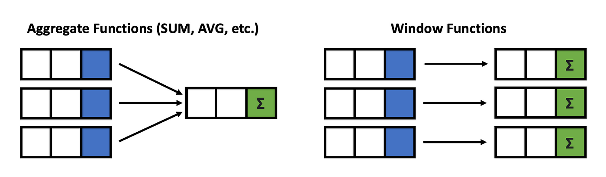
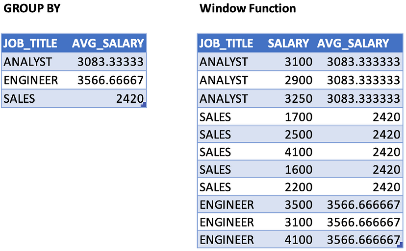

# PostgreSQL para Ciencia de Datos

## 1. Particularidades de PostgreSQL

### 1.1. Diferencias entre otros manejadores y PostgreSQL

- Código libre y orientado a la comunidad
- Base de datos adaptada y madura, soporta JSON y funciones estadísticas
- PL/pgSQL (Procedural Language/PostgreSQL)
- Manejo de objetos
- Particiones en las tablas mediante estrategias
- Common table expressions tratamiento de tablas virtuales, más eficiente en tiempo de ejecusión
- Window functions trata de encontrar relaciones entre un registro y el resto de registros

### 1.2. Conoce los superpoderes de PLPGSQL


### 1.3. PLPGSQL: Stored procedures

PLPGSQL es un lenguaje ampliado derivado desde el SQL pudiendo ejecutar codigo SQL estandar y funciones especificas de este lenguaje

EXISTEN

- Store procedures Integran lógica a la sentencias SQL. Se han ido incluyendo en el estándar SQL. No regresan ningún valor.

- Functions Son mas avanzadas estan hechas en el lenguaje de PLPGSQL, Regresan tipos de datos. Tienen más flexibilidad. No son estándar de SQL.

```sql
--Creación de un Stored Procedure
CREATE OR REPLACE PROCEDURE crea_tabla_clientes()
LANGUAGE SQL
AS $$
    DROP TABLE IF EXISTS clientes;
    CREATE TABLE clientes(
        id_cliente SERIAL PRIMARY KEY,
        nombre VARCHAR(100),
        apellido VARCHAR(100),
        direccion VARCHAR(255)
    )
$$;

--Llamamos al stored procedure
call crea_tabla_clientes()

--Creación de una función
CREATE OR REPLACE FUNCTION crea_tabla_pedidos()
RETURNS VOID
LANGUAGE plpgsql
AS $$
    BEGIN
        DROP TABLE IF EXISTS pedidos;
        CREATE TABLE pedidos(
            id_pedidos SERIAL PRIMARY KEY,
            id_cliente INT REFERENCES clientes(id_cliente),
            fecha_pedido DATE,
            total NUMERIC(10,2)
        );
    END
$$;

--Llamamos a la función
SELECT crea_tabla_pedidos()
```

### 1.4. PLPGSQL: conteo, registro y triggers

```sql
--Conteo
CREATE OR REPLACE FUNCTION consulta_usuarios()
-- si no deseas retornar nada puedes colocar void en lugar de integer
RETURNS integer
LANGUAGE plpgsql
AS $BODY$
DECLARE
    rec pasajero%ROWTYPE;
    contador integer := 0;
BEGIN
    --recorre la tabla pasajero y guarda cada fila en la variable rec
    FOR rec IN SELECT * FROM pasajero LOOP
        RAISE NOTICE 'id: %, Nombre: %', rec.id, rec.nombre;
        contador := contador + 1;
    END LOOP;

    RAISE NOTICE 'Cantidad de registros: %', contador;
    RETURN contador;
END
$BODY$;

--Triggers
-- tabla de ejemplo
CREATE TABLE empleados (
    id SERIAL PRIMARY KEY,
    nombre VARCHAR(100),
    salario NUMERIC(10, 2)
);

-- funcion plpgsql
CREATE OR REPLACE FUNCTION mostrar_cambios()
RETURNS TRIGGER AS
$$
BEGIN
    RAISE NOTICE 'Registro actualizado:';
    RAISE NOTICE 'ID antiguo: %, Nombre antiguo: %, Salario antiguo: %',
                 OLD.id, OLD.nombre, OLD.salario;
    RAISE NOTICE 'ID nuevo: %, Nombre nuevo: %, Salario nuevo: %',
                 NEW.id, NEW.nombre, NEW.salario;
    RETURN NEW;
END;
$$
LANGUAGE plpgsql;

-- creacion de trigger
CREATE TRIGGER tr_actualizacion_empleados
AFTER UPDATE ON empleados
FOR EACH ROW
EXECUTE FUNCTION mostrar_cambios();
-- si quieres que el trigger se ejecute antes de la operacion cambiar
-- after update por BEFORE UPDATE
```

### 1.5. PLPGSQL: Aplicado a data science

```sql
CREATE OR REPLACE FUNCTION movies_stats()
RETURNS VOID
LANGUAGE plpgsql
AS $$
DECLARE
    total_rated_r REAL := 0.0;
    total_larger_thank_100 REAL := 0.0;
    total_published_2006 REAL := 0.0;
    average_duracion REAL := 0.0;
    average_rental_price REAL := 0.0;
BEGIN
    total_rated_r := COUNT(*) FROM peliculas WHERE clasificacion = 'R';
    total_larger_thank_100 := COUNT(*) FROM peliculas WHERE duracion > 100;
    total_published_2006 := COUNT(*) FROM peliculas WHERE anio_publicacion = 2006;
    average_duracion := AVG(duracion) FROM peliculas;
    average_rental_price := AVC(precio_renta) FROM peliculas;

    TRUNCATE TABLE peliculas_estadisticas;
    --Truncate borra datos que había en la tabla y guarda nuevos datos

    INSERT INTO peliculas_estadisticas (tipo_estadisticas, total)
    VALUES
        ('Peliculas con clasificacion R', total_rate_r),
        ('Peliculas de mas de 100 minutos', total_larger_than_100),
        ('Peliculas publicadas en 2006', total_published_2006),
        ('Promedio de duracion en minutos', average_duracion),
        ('Precio promedio de renta', average_rental_price);
END
$$;

SELECT movies_stats();

SELECT * FROM peliculas_estadisticas;
```

### 1.6. Integración con otros lenguajes

Como la mayoría de las bases de datos, PostgreSQL cuenta con conectores para diferentes lenguajes de programación, de tal forma que si trabajas con Python, PHP, Java, JavaScript y todos sus frameworks, exista una forma de extraer datos de PostgreSQL y posteriormente utilizar las propiedades de los lenguajes procedurales para transformar y utilizar los datos.

El lenguaje estándar utilizado en bases de datos relacionales es SQL (Structured Query Language), un lenguaje que tiene una estructura sumamente útil para hacer solicitudes de datos, en especial tomando como abstracción un diseño tabular de datos. Sin embargo, carece de estructuras de control y otras abstracciones que hacen poderosos a los lenguajes procedurales de programación.

#### PL/pgSQL

Como respuesta a los puntos débiles de SQL como estándar, PostgreSQL respondió originalmente creando un lenguaje propio llamado PL/pgSQL (Procedural Language/PostgreSQL Structured Query Language) que es literalmente un superset de SQL que incluye propiedades de un lenguaje estructurado que, por un lado, nos permite crear funciones complejas y triggers; y, por el otro lado, agrega estructuras de control, cursores, manejo de errores, etc.

#### Otros lenguajes

Sin embargo, en muchos sentidos, aunque PL/pgSQL ayuda en los casos más genéricos para generar estructuras y funcionalidades más complejas, no se compara con lenguajes completamente independientes y no ligados directamente a una base de datos.

La respuesta sin embargo tampoco es los conectores normales que, si bien resuelven la parte de un lenguaje más complejo, añaden por otro lado una separación de la base de datos, ya que debe correr en un servidor separado y hacer llamadas entre ellos con la latencia como un colateral.

Para mitigar estos problemas tomando lo mejor de ambos mundos, los desarrolladores de PostgreSQL se dedicaron a hacer implementaciones de diversos lenguajes a manera de plugin.

##### C

La biblioteca que permite al lenguaje C ejecutarse en PostgreSQL es llamada libpq y es una interfaz de programación que permite extender y hacer de interfaz para permitir a otros lenguajes ejecutarse en esta base de datos.

Puedes encontrar más información de esta interfaz en el siguiente [link](https://www.postgresql.org/docs/11/libpq.html)

##### PL/Tcl

Tcl (Tool Command Language) es un lenguaje diseñado con la simpleza en mente y su paradigma consiste en que todo en él es un comando, incluyendo la estructura del lenguaje que, sin embargo, son suficientemente flexibles para poderse sobreescribir, haciéndolo un lenguaje sumamente extensible.

Todo lo anterior es ideal para la integración con el manejador de PostgreSQL ya que permite elaborar comandos para ejecutar las sentencias SQL y extenderlas facilmente.

Si quieres leer más del tema, puedes hacerlo en el siguiente [link](https://www.postgresql.org/docs/11/pltcl.html)

##### PL/Perl

Perl es un lenguaje de programación que implementa una estructura de bloques de código y que toma inspiración de programas como C, sh, AWK, entre otros. Y es especialmente bueno para el tratamiento de cadenas de texto. Sin embargo, no se encuentra limitado como un lenguaje de script.

Dada la propiedad de englobar funcionalidad en forma de bloque y de la rapidez y facilidad con la que trabaja con datos tipo cadena, este lenguaje es ideal para el tratamiento de información de una base de datos relacional.

Para conocer más de la implementación de este lenguaje con PostgreSQL puedes leer el siguiente [link](https://www.postgresql.org/docs/11/plperl.html)

##### PL/Python

Python, al ser de los lenguajes de programación más extendidos entre programadores de servicios Backend, es una implementación particularmente interesante para PostgreSQL.

Python es un lenguaje de programación fuerte en tratamiento de estructura de datos y tiene un paradigma múltiple con fuertes componentes orientados a objetos, estructurados y una fuerte influencia del paradigma funcional.

Parte de sus fortalezas son sus implementaciones de funciones map, reduce y filter en conjunto con list comprehensions, sets, diccionarios y generadores.

Dadas las propiedades nativas para manejar estructuras de datos complejas, es un lenguaje ideal para manejar la salida de un query SQL.

La implementación de Python para PostgreSQL te permite crear funciones complejas en un lenguaje completo y popular sin tener que utilizar PL/pgSQL. Puedes ver un ejemplo a continuación de la misma función en PL/pgSQL y PL/Python.

###### PL/pgSQL function

```sql
CREATE FUNCTION pgmax (a integer, b integer)
RETURNS integer
AS $$
BEGIN
   IF a > b THEN
       RETURN a;
   ELSE
       RETURN b;
   END IF;
END
$$ LANGUAGE plpgsql;
```

###### PL/Python function

```python
CREATE FUNCTION pymax (a integer, b integer)
RETURNS integer
AS $$
   if a > b:
       return a
   return b
$$ LANGUAGE plpythonu;

CREATE EXTENSION plpythonu;
SELECT pgmax(200,9);
```

Para instalar el lenguaje Python en PostgreSQL, una vez instaladas las bibliotecas apropiadas para cada Sistema Operativo, es necesario ejecutar el siguiente query:

CREATE EXTENSION plpythonu

Si quieres profundizar más en esta implementación puedes encontrar más información [aquí](https://www.postgresql.org/docs/11/plpython.html).

### 1.7. Tipos de Datos Personalizados

```sql
CREATE TYPE humor AS ENUM ('triste', 'normal', 'feliz');

CREATE TABLE persona_prueba(
    nombre text,
    humor_actual humor
);

INSERT INTO persona_prueba VALUES ('Pablo', 'molesto');

INSERT INTO persona_prueba VALUES ('Pablo', 'feliz');

SELECT * FROM persona_prueba;
```

## 2. Casos Prácticos

### 2.1. Agregación de datos

Agregación se refiere a la agrupación de datos.

```sql
SELECT ciudad,
    COUNT(cliente_id) AS n
FROM clientes AS c
INNER JOIN direcciones AS d ON c.direccion_id = d.direccion_id
INNER JOIN ciudades AS ci ON d.ciudad_id = ci.ciudad_id
GROUP BY ciudad
ORDER BY n DESC
```

### 2.2. Presentación

Al tener una parte de logica muy fuerte se piensa mas en que datos queremos obtener.
Es igual de importante la historia que queremos contar y la forma en que vamos a presentar los datos
La presentación de los datos tiene que ser pensada desde la planeación de que datos se buscaran

Ejemplos

Si queremos mostrar los cambios de algo a lo largo del tiempo una grafica de barra o grafica de linea puede ser de utilidad
Tambien considerar que segmentos de la grafica se quiere enfocar, donde los datos muestran buenos resultados para mantenerlos asi o en donde los datos son deficientes para que se mejore esa area

A la hora de hacer los queries tambien pensar en como quieres mostrar esos datos, de que manera , que punto quiere apoyar en una discusion en un argumento y que historia quieres contar

Evaluar si en tu fuente de datos existen los datos para construir la historia que quieres contar

Ejemplo: Si quieres contar los cambios de algo a traves del tiempo alguno de los campos de tus datos tiene que ser una fecha

**Dashboards** la mayoria de los datos se consumen en este formato, hay distintos tipos de Dashboards para resaltar informacion ya sea del dia o del mes, o ver el total de unos datos en el tiempo, o usando graficas de pie para mostrar la relacion que existe entre los datos. Al escoger la forma de mostrarlo pensar en que historia quiero contar, pues ciertos graficos por defecto resaltan cierta informacion o relacion de los datos La presentacion es muy importante ya que presentar un mismo informe de una forma u otra puede cambiar la forma en que los datos se interpretan y la historia que se cuenta, por lo cual es tan importante tambien conocer muy bien el negocio y los datos del mismo, para contar historias que ayuden a tomar buenas decisiones.

### 2.3. Trabajando con objetos

Una caracteristica muy importante de PostgreSQL es su capacidad de trabajar con estructuras JSON.

JSON Texto plano - Es unicamente un string de texto.
JSON Binary - Es más rápido de procesar ya que se guarda como un archivo binario.

El uso de objetos nos dará más flexibilidad en el trabajo.

```sql
-- DROP TABLE ordenes;
CREATE TABLE ordenes(
  id serial NOT NULL PRIMARY KEY,
  info json NOT NULL
);

INSERT INTO ordenes (info)
VALUES (
  '{"cliente": "David Shanchez", "items": { "producto": "Biberon", "cantidad": "24" }}'
),
(
  '{"cliente": "Jorge Luis", "items": { "producto": "Carro hotweels", "cantidad": "2" }}'
),
(
  '{"cliente": "Sancho Panza", "items": { "producto": "Caja", "cantidad": "13" }}'
);

-- regresa el valor aun en formato json
SELECT
  info -> 'cliente' AS cliente
FROM ordenes;

-- regresa el valor en formato string
SELECT
  info ->> 'cliente' AS cliente
FROM ordenes;

-- usando filtros con un campo json
SELECT
  info ->> 'cliente' AS cliente
FROM ordenes
WHERE info -> 'items' ->> 'producto' = 'Biberon';

--Trabajando con objetos
--Forma 1
SELECT
    MAX((info -> 'items' ->> 'cantidad')::INTEGER),
    MIN((info -> 'items' ->> 'cantidad')::INTEGER),
    SUM((info -> 'items' ->> 'cantidad')::INTEGER),
    AVG((info -> 'items' ->> 'cantidad')::INTEGER)
FROM orders;

--Forma 2
SELECT 
    MIN(
        CAST (info -> 'items' ->> 'cantidad' AS INTEGER)
    ),
    MAX(
        CAST (info -> 'items' ->> 'cantidad' AS INTEGER)
    ),
    AVG(
        CAST (info -> 'items' ->> 'cantidad' AS INTEGER)
    ),
    SUM(
        CAST (info -> 'items' ->> 'cantidad' AS INTEGER)
    )
FROM ordenes;
```

### 2.4. Common table expressions

Las Common Table Expressions (CTEs) son una característica de SQL que permite definir una consulta nombrada dentro de otra consulta, es decir crear tablas virtuales y reutilizarla en otra consulta. Esto proporciona una forma de modularizar y reutilizar partes de una consulta SQL, lo que puede hacer que las consultas sean más legibles y mantenibles.

Aquí tienes ejemplos de CTEs en niveles básico, intermedio y avanzado:

#### Nivel Básico

En este ejemplo, utilizaremos una CTE para calcular la suma de los primeros 10 números naturales:

```sql
WITH numeros AS (
    SELECT generate_series(1, 10) AS numero
)
SELECT SUM(numero) AS suma_total
FROM numeros;
```

En este caso, la CTE llamada numeros genera una serie de números del 1 al 10. Luego, fuera de la CTE, realizamos una consulta que suma todos los números generados.

#### Nivel Intermedio

En este ejemplo, utilizaremos una CTE para encontrar los empleados que ganan más que el salario promedio en una tabla de empleados:

```sql
WITH salario_promedio AS (
    SELECT AVG(salario) AS salario_promedio
    FROM empleados
)
SELECT nombre, salario
FROM empleados
WHERE salario > (SELECT salario_promedio FROM salario_promedio);
```

Aquí, la CTE salario_promedio calcula el salario promedio de todos los empleados. Luego, la consulta principal selecciona los empleados cuyos salarios son mayores que el salario promedio calculado en la CTE.

#### Nivel Avanzado

En este ejemplo, utilizaremos múltiples CTEs y combinaremos los resultados utilizando una consulta final:

```sql
WITH
  cte_ventas AS (
    SELECT producto_id, SUM(monto) AS total_ventas
    FROM ventas
    GROUP BY producto_id
  ),
  cte_productos_mas_vendidos AS (
    SELECT producto_id
    FROM cte_ventas
    WHERE total_ventas > 1000
  )
SELECT p.nombre, v.total_ventas
FROM cte_productos_mas_vendidos c
JOIN cte_ventas v ON c.producto_id = v.producto_id
JOIN productos p ON p.id = v.producto_id;
```

En este ejemplo, la primera CTE (cte_ventas) calcula el total de ventas para cada producto. Luego, la segunda CTE (cte_productos_mas_vendidos) selecciona los productos que tienen ventas totales superiores a 1000. Finalmente, la consulta principal une las CTEs y selecciona el nombre del producto y el total de ventas para cada producto que cumple con el criterio especificado.

### 2.5. Window functions

Las funciones de ventana (window functions) son una característica poderosa de SQL que te permite realizar cálculos sobre un conjunto de filas relacionadas con la fila actual. Aquí tienes ejemplos en niveles básico, intermedio y avanzado utilizando funciones de ventana:

```sql
--En esta consulta, la función SUM() se utiliza como una función de ventana con la cláusula OVER. Estamos calculando la suma acumulativa de la columna monto ordenada por la columna fecha.
SELECT fecha, monto,
       SUM(monto) OVER (ORDER BY fecha) AS suma_acumulativa
FROM ventas;

--Aquí, la función RANK() se utiliza como una función de ventana para asignar un rango a cada fila en función del valor de la columna monto. Las filas con el mismo valor de monto recibirán el mismo rango, y los rangos serán asignados en orden descendente.
SELECT fecha, monto,
       RANK() OVER (ORDER BY monto DESC) AS ranking_ventas
FROM ventas;

--Salario promedio
SELECT JOB_TITLE, SALARY, AVG(SALARY) OVER(PARTITION BY JOB_TITLE) AS AVG_SALARY
FROM salary_info
--Verificamos duplicados creando particiones de columnas combinadas
SELECT *
FROM (
    SELECT id,
    ROW_NUMBER() OVER(
        PARTITION BY
            nombre,
            apellido,
            email,
            colegiatura,
            fecha_incorporacion,
            carrera_id,
            tutor_id
        ORDER BY id ASC
         )AS row,
    *
    FROM public.alumnos
    )AS duplicados
WHERE duplicados.row > 1;
```

Las Window Functions son similares a la agregación realizada en la cláusula GROUP BY. Sin embargo, las filas no se agrupan en una sola fila, cada fila conserva su identidad separada. Es decir, una Window Functions puede devolver un solo valor para cada fila.




### 2.6. Top 10

```sql
SELECT
    peliculas.pelicula_id AS id,
    peliculas.titulo,
    COUNT(*) AS numero_rentas,
    ROW_NUMBER () OVER (
        ORDER BY COUNT(*) DESC
    ) AS lugar
FROM rentas
    INNER JOIN inventarios ON rentas.inventario_id = inventarios.inventario_id
    INNER JOIN peliculas ON inventarios.pelicula_id = peliculas.pelicula_id
GROUP BY peliculas.pelicula_id
ORDER BY numero_rentas DESC
LIMIT 10;
```

### 2.7. Actualizando precios

```sql
--Crear el PLPGSQL
CREATE OR REPLACE FUNCTION public.precio_peliculas_tipo_cambio()
    returns trigger
    LANGUAGE plpgsql
AS $$
BEGIN
    INSERT INTO precio_peliculas_tipo_cambio(
    pelicula_id,
    tipo_cambio_id,
    precio_tipo_cambio,
    ultima_actualizacion
    )
    select  NEW.pelicula_id,
            tipos_cambio.tipo_cambio_id,
            tipos_cambio.cambio_usd * NEW.precio_renta AS precio_tipo_cambio,
            CURRENT_TIMESTAMP
    FROM tipos_cambio
    WHERE tipos_cambio.codigo = 'MXN';
    RETURN NEW;
END
$$
;

--Crear el trigger
DROP TRIGGER IF EXISTS trigger_update_tipos_cambio
  ON public.peliculas;

CREATE TRIGGER trigger_update_tipos_cambio
    AFTER INSERT OR UPDATE
    ON public.peliculas
    FOR EACH ROW
    EXECUTE PROCEDURE public.precio_peliculas_tipo_cambio();
```

### 2.8. Usando rank y percent rank

Las funciones RANK, DENSE_RANK y PERCENT_RANK son funciones de ventana en SQL que se utilizan para asignar rangos a filas dentro de un conjunto de datos ordenado. Aquí te explico las diferencias y te doy un ejemplo de cada una:

1. RANK: Esta función asigna un rango a cada fila en función de su valor de ordenación. Si hay filas con valores idénticos, todas recibirán el mismo rango y el siguiente rango será saltado.
2. DENSE_RANK: Similar a RANK, pero los rangos se asignan de manera secuencial, sin saltar ningún rango, incluso si hay filas con valores idénticos.
3. PERCENT_RANK: Esta función calcula el rango relativo de cada fila como un valor entre 0 y 1, donde 0 representa la primera fila y 1 representa la última fila. Este valor se calcula dividiendo el rango menos 1 por el número total de filas menos 1.

```sql
SELECT 
    peliculas.pelicula_id AS id,
    peliculas.titulo,
    COUNT(*) AS numero_rentas,
    DENSE_RANK () OVER (
        ORDER BY COUNT(*) DESC
    ) AS lugar
FROM rentas
    INNER JOIN inventarios ON rentas.inventario_id = inventarios.inventario_id
    INNER JOIN peliculas ON inventarios.pelicula_id = peliculas.pelicula_id
GROUP BY peliculas.pelicula_id
ORDER BY numero_rentas DESC
;
```
