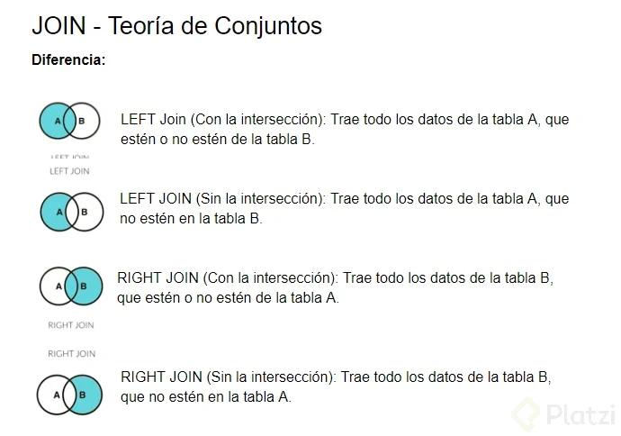
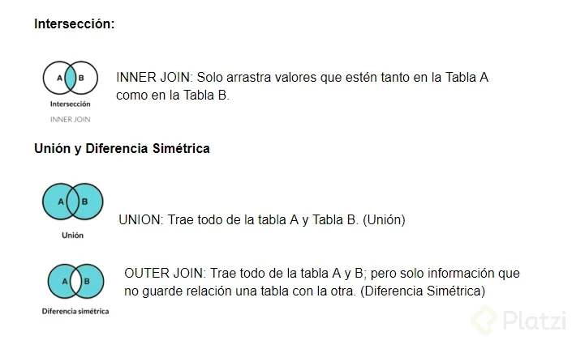

# PostgreSQL Práctico

## 1. Introducción

### 1.1. Breve historia de SQL

SQL (Structured Query Language - Lenguaje de consulta estructurada) es un lenguaje que se basó en 2 principios fundamentales:

- Teoría de conjuntos.
- Álgebra relacional de Edgar Codd (científico informático inglés).
 ⠀
SQL fue creada en 1974 por IBM. Originalmente fue llamado SEQUEL, posteriormente se cambió el nombre por problemas de derechos de autor. ⠀

Relation Company (actualmente con el nombre Oracle) creó el software Oracle V2 en 1979.

Mas adelante SQL se convertiría en un lenguaje estándar que unifica todo dentro de las bases de datos relacionales, se convierte en una norma ANSI o ISO.

### 1.2. Álgebra relacional

El álgebra relacional estudia basicamente las operaciones que se pueden realizar entre diversos conjuntos de datos. ⠀

No confundir las relaciones del álgebra relacional con las relaciones de una base de datos relacional.

- Las relaciones de una base de datos es cuando unes dos tablas.
- Las relaciones en álgebra relacional se refiere a una tabla. - La diferencia es conceptual: Las tablas pueden tener tuplas repetidas pero en el álgebra relacional cada relación no tiene un cuerpo, no tiene un primer ni último row. ⠀

Tipos de operadores

- Operadores unarios.- Requiere una relación o tabla para funcionar. 
  - Proyección (π): Equivale al comando Select. Saca un número de columnas o atributos sin necesidad de hacer una unión con una segunda tabla. π<Nombre, Apellido, Email>(Tabla_Alumno)
  - Selección (σ): Equivale al comando Where. Consiste en el filtrado de de tuplas. σ<Suscripción=Expert>(Tabla_Alumno) ⠀

- Operadores binarios.- Requiere más de una tabla para operar.
  - Producto cartesiano (x): Toma todos los elementos de una tabla y los combina con los elementos de la segunda tabla. Docentes_Quinto_A x Alumnos_Quinto_A
  - Unión (∪): Obtiene los elementos que existen en una de las tablas o en la otra de las tablas. Alumnos_Quinto_A x Alumnos_Quinto_B
  - Diferencia (-): Obtiene los elementos que existe en una de las tablas pero que no corresponde a la otra tabla. Alumnos_planExpertPlus - Alumnos_planFree

### 1.3. Qué es una proyección (SELECT)

```sql
-- Todos los registros
SELECT *
  FROM PRUEBAS.ALUMNOS;

--Alias
SELECT nombre as "name",
    apellido as "last name"
    FROM PRUEBAS.ALUMNOS;

--Conteo
SELECT COUNT(id)
  FROM PRUEBAS.ALUMNOS;

--Sumatoria
SELECT SUM(colegiatura)
  FROM PRUEBAS.ALUMNOS;

--Promedio
SELECT AVG(colegiatura)
  FROM PRUEBAS.ALUMNOS;

--Minimo
SELECT MIN(colegiatura)
  FROM PRUEBAS.ALUMNOS;

--Maximo
SELECT MAX(colegiatura)
  FROM PRUEBAS.ALUMNOS;

--Case
SELECT nombre,
    apellido,
    colegiatura,
  CASE
    WHEN (colegiatura > 4000) THEN 'Mayor a 4000'
    WHEN (colegiatura = 2000) THEN 'Igual a 2000'
    ELSE 'Mayor a 2000 y menor que 4000'
  END AS costo
FROM pruebas.alumnos;
```

### 1.4. Origen (FROM)

```sql
--Alias Tabla
SELECT AL.nombre,
    AL.apellido,
    AL.colegiatura
   FROM PRUEBAS.ALUMNOS AS AL;

--Union dos tablas
SELECT *
FROM PRUEBAS.ALUMNOS  AS AL
JOIN PRUEBAS.CARRERAS AS CA
    ON AL.CARRERA_ID = CA.ID;

--Conexion a tabla en una base de datos remota
SELECT *
  FROM dblink('dbname=somedb
               port=5432
               host=someserver
               user=someuser
               password=somepwd',
               'SELECT gid,
                       area,
                       parimeter,
                       state,
                       country,
                       tract,
                       blockgroup,
                       block,
                       the_geom
                  FROM massgis.cens2000blocks'
  ) AS blockgroups
```

### 1.5. Productos cartesianos (JOIN)




### 1.6. Selección (WHERE)

```sql
--Igual
SELECT *
  FROM PRUEBAS.ALUMNOS
 WHERE colegiatura = 2000;

--Mayor que
SELECT *
  FROM PRUEBAS.ALUMNOS
 WHERE colegiatura > 2000;

--Menor que
SELECT *
  FROM PRUEBAS.ALUMNOS
 WHERE colegiatura < 4000;

--Entre
--Opcion No. 1


SELECT *
  FROM PRUEBAS.ALUMNOS
 WHERE colegiatura > 2000
   AND colegiatura < 4000;

--Opcion No. 2
SELECT *
  FROM PRUEBAS.ALUMNOS
 WHERE colegiatura BETWEEN 2000 AND 4000;

--And y Or
--Opcion No. 1
SELECT *
  FROM PRUEBAS.ALUMNOS
 WHERE nombre = 'Edin'
   AND (apellido = 'Keatch' OR apellido = 'Grishin');

--Opcion No. 2
SELECT *
  FROM PRUEBAS.ALUMNOS
 WHERE nombre = 'Edin'
   AND apellido = 'Keatch'
    OR apellido = 'Grishin';

--Comodin que empieza con Al
SELECT *
  FROM PRUEBAS.ALUMNOS
 WHERE nombre LIKE 'Al%';

--Comodin que termina con Al
SELECT *
  FROM PRUEBAS.ALUMNOS
 WHERE nombre LIKE '%er';

--Comodin que contiene con er
SELECT *
  FROM PRUEBAS.ALUMNOS
 WHERE nombre LIKE '%er%';

--Comodin que no contiene con er
SELECT *
  FROM PRUEBAS.ALUMNOS
 WHERE nombre NOT LIKE '%er%';

--Comodin que varia la ultima letra
SELECT *
  FROM PRUEBAS.ALUMNOS
 WHERE nombre LIKE 'Ali_'

--Null
SELECT *
  FROM PRUEBAS.ALUMNOS
 WHERE apellido IS NULL;

--Not Null
SELECT *
  FROM PRUEBAS.ALUMNOS
 WHERE apellido IS NOT NULL;

--In
SELECT *
  FROM PRUEBAS.ALUMNOS
 WHERE nombre IN ('Wanda', 'Hilde', 'Veriee');
```

### 1.7. Ordenamiento (ORDER BY)

```sql
--Ordenamiento
SELECT *
  FROM PRUEBAS.ALUMNOS
ORDER BY fecha_incorporacion;

--Ascendente
SELECT *
  FROM PRUEBAS.ALUMNOS
ORDER BY fecha_incorporacion ASC;

Descendente
SELECT *
  FROM PRUEBAS.ALUMNOS
ORDER BY fecha_incorporacion DESC;
```

### 1.7. Agregación y limitantes (GROUP BY y LIMIT)

```sql
--Agrupación 1 Campo
SELECT CA.carrera
FROM PRUEBAS.ALUMNOS AL JOIN PRUEBAS.CARRERAS CA
  ON AL.CARRERA_ID = CA.ID
GROUP BY ca.carrera;

--Agrupación 2 Campos
SELECT CA.carrera,
    AL.colegiatura
FROM PRUEBAS.ALUMNOS AL
JOIN PRUEBAS.CARRERAS CA
    ON AL.CARRERA_ID = CA.ID
GROUP BY al.colegiatura, ca.carrera;

--Limite
SELECT *
FROM PRUEBAS.ALUMNOS
LIMIT 10;

--Limitar a partir de un numero, se usa para paginación empieza desde el registro 6 hasta el 15
SELECT *
FROM PRUEBAS.ALUMNOS
OFFSET 5
LIMIT 10;
```

## 2. Ejercitando tu SQL

### 2.1. El primero

```sql
--Primera forma
SELECT *
FROM platzi.alumnos
FETCH FIRST 5 ROW ONLY;

--Segunda forma
SELECT *
FROM platzi.alumnos
LIMIT 5;

--Tercera forma
SELECT *
FROM (
    SELECT ROW_NUMBER() OVER() AS row_id, *
    FROM platzi.alumnos
) AS alumnos_with_row_num
WHERE row_id <= 5;
```

### 2.2. El segundo más alto

```sql
--Primera forma con menor rendimiento
SELECT DISTINCT colegiatura
FROM platzi.alumnos AS a1
WHERE 2 = (
SELECT COUNT (DISTINCT colegiatura)
FROM platzi.alumnos a2
WHERE a1.colegiatura <= a2.colegiatura
);

--Segunda forma
SELECT DISTINCT colegiatura, tutor_id
FROM platzi.alumnos
WHERE tutor_id = 20
ORDER BY colegiatura DESC
LIMIT 1 OFFSET 1;

--Tercera forma
SELECT
FROM platzi.alumnos AS datos_alumnos
INNER JOIN(
    SELECT DISTINCT colegiatura
    FROM platzi.alumnos
    WHERE tutor_id = 20
    ORDER BY colegiatura DESC
    LIMIT 1 OFFSET 1
)AS segunda_mayor_colegiatura
ON datos_alumnos.colegiatura = segunda_mayor_colegiatura.colegiatura;

--Cuarta forma
SELECT *
FROM platzi.alumnos AS datos_alumnos 
WHERE colegiatura = (
    SELECT DISTINCT colegiatura
    FROM platzi.alumnos
    WHERE tutor_id = 20 
    ORDER BY colegiatura DESC
    LIMIT 1 OFFSET 1
);

--Quinta forma
SELECT *
FROM platzi.alumnos AS datos_alumnos
WHERE colegiatura = (
    SELECT MAX(colegiatura)
    FROM platzi.alumnos
    WHERE tutor_id = 20
);
```

### 2.3. Seleccionar de un set de opciones

```sql
SELECT *
FROM platzi.alumnos
WHERE id IN (
    SELECT id
    FROM platzi.alumnos
    WHERE tutor_id = 30
        AND carrera_id = 31
);
```

### 2.4. Manejador de Tiempo

```sql
SELECT EXTRACT(YEAR FROM fecha_incorporacion) AS anio_incorporacion
FROM platzi.alumnos;

SELECT DATE_PART('YEAR', fecha_incorporacion) AS anio_incorporacion
FROM platzi.alumnos;

SELECT DATE_PART('YEAR', fecha_incorporacion) AS anio_incorporacion,
        DATE_PART('MONTH', fecha_incorporacion) AS mes_incorporacion,
        DATE_PART('DAY', fecha_incorporacion) AS dia_incorporacion
FROM platzi.alumnos

SELECT EXTRACT(HOUR FROM fecha_incorporacion) AS hora,
       EXTRACT(MINUTE FROM fecha_incorporacion) AS minutos,
       EXTRACT(SECOND FROM fecha_incorporacion) AS segundos
FROM platzi.alumnos;

SELECT *
FROM platzi.alumnos
WHERE DATE_PART('YEAR', fecha_incorporacion) = 2018
AND DATE_PART('MONTH', fecha_incorporacion) = 5;
```

### 2.5. Duplicados

```sql
--Verifica los duplicados
SELECT *
FROM platzi.alumnos AS ou
WHERE (
    SELECT COUNT(*)
    FROM platzi.alumnos AS inr
    WHERE ou.id = inr.id
) > 1;

SELECT (platzi.alumnos.*)::text, COUNT(*)
FROM platzi.alumnos
GROUP BY platzi.alumnos.*
HAVING COUNT(*) > 1;

--Verificamos duplicados concatenando texto
SELECT (
    platzi.alumnos.nombre,
    platzi.alumnos.apellido,
    platzi.alumnos.email,
    platzi.alumnos.colegiatura,
    platzi.alumnos.fecha_incorporacion,
    platzi.alumnos.carrera_id,
    platzi.alumnos.tutor_id
    )::text, COUNT(*)
FROM platzi.alumnos
GROUP BY  platzi.alumnos.nombre,
    platzi.alumnos.apellido,
    platzi.alumnos.email,
    platzi.alumnos.colegiatura,
    platzi.alumnos.fecha_incorporacion,
    platzi.alumnos.carrera_id,
    platzi.alumnos.tutor_id
HAVING COUNT(*) > 1;

--Verificamos duplicados creando particiones de columnas combinadas
SELECT *
FROM (
    SELECT id,
    ROW_NUMBER() OVER(
        PARTITION BY
            nombre,
            apellido,
            email,
            colegiatura,
            fecha_incorporacion,
            carrera_id,
            tutor_id
        ORDER BY id ASC
         )AS row,
    *
    FROM platzi.alumnos
    )AS duplicados
WHERE duplicados.row > 1;

--Eliminamos duplicados
DELETE FROM platzi.alumnos
WHERE id IN(
SELECT table_alumnos.id
FROM (
    SELECT
        ROW_NUMBER() OVER(
            PARTITION BY
            a1.nombre,
            a1.apellido,
            a1.email,
            a1.colegiatura,
            a1.fecha_incorporacion,
            a1.carrera_id,
            a1.tutor_id
            ORDER BY a1.id ASC
        ) AS row_alumnos, a1.*
    FROM platzi.alumnos as a1
) AS table_alumnos
WHERE table_alumnos.row_alumnos>1
)
```

### 2.6. Selectores de rango

```sql
SELECT int4range(1,20) @> 3;
--Esta consulta trae un entero pequeño y pregunta si el rango contiene al numero 3

SELECT numrange(11,20) && numrange(20.0, 30.0);
--Esta consulta trae un resultado booleano, ya que los && consultan entre los dos rangos de números de alta precisión si existen valores solapados entre ambos

SELECT LOWER int8range(15,25);
--Simplemente trae el menor número del rango. Funciona igual con UPPER

SELECT int4range(10,20) * int4range(15,25);
--Esta consulta trae el rango numérico que comparten ambos rangos

SELECT ISEMPTY(numrange(1,5));
--Booleano que detecta si el rango esta vacío
```

### 2.7. Maximos y Minimos

```sql
SELECT fecha_incorporacion
FROM platzi.alumnos
ORDER BY fecha_incorporacion DESC
LIMIT 1;

SELECT carrera_id,
    MAX(fecha_incorporacion)
FROM platzi.alumnos
GROUP BY carrera_id
ORDER BY carrera_id;

-- RETO

SELECT MIN(nombre) AS nombre_minimo
FROM platzi.alumnos;

SELECT MIN(nombre) AS nombre_minimo, tutor_id
FROM platzi.alumnos
GROUP BY tutor_id;
```

### 2.8. Self Joins

Un "self join" es una operación en la que una tabla se une consigo misma. Es decir, se trata de una unión entre dos instancias de la misma tabla, pero que se tratan como si fueran dos tablas distintas en la consulta SQL.

```sql
--En este caso en esta tabla esta el id tutor ya que hay alumnos que dan tutorias.
SELECT a.nombre, a.apellido, t.nombre,t.apellido
FROM platzi.alumnos AS a
INNER JOIN platzi.alumnos AS t
ON a.tutor_id = t.id;
```

### 2.9. Barras

```sql
SELECT lpad('sql',15,'*')
--Hace que la cadena "sql" mida forzosamente 15 caracteres y que se rellene con *

SELECT CONCAT(nombre, ' ', apellido) ,colegiatura, LPAD('|', CAST(colegiatura AS int)/100, '|') AS coleg_bar
FROM platzi.alumnos;
```

### 2.10. Generando series

```sql
--Genera una serie del 1 al 10 con un salto de 2 en 2
SELECT * FROM generate_series(1,10,2);

SELECT *
FROM generate_series('2020-09-01 00:00:00'::timestamp,
                        '2020-09-04 12:00:00', '10 hours');
```

### 2.11. Expresiones regulares

```sql
SELECT *
FROM usuarios
WHERE email ~* '^[a-zA-Z0-9._%+-]+@[a-zA-Z0-9.-]+\.[a-zA-Z]{2,}$';
```

- ~* se utiliza para realizar una comparación con una expresión regular, y el ^ y el $ indican que la expresión regular debe coincidir con toda la cadena de texto.
- La expresión regular '^[a-zA-Z0-9._%+-]+@[a-zA-Z0-9.-]+\.[a-zA-Z]{2,}$' describe un patrón de dirección de correo electrónico válido. Esta expresión regular verifica que la cadena comience con uno o más caracteres alfanuméricos, seguidos de un símbolo @, seguido de uno o más caracteres alfanuméricos, un punto (.), y al menos dos letras alfabéticas.
- La función ~* hace que la comparación sea insensible a mayúsculas y minúsculas

## 3. Conceptos de SQL avanzado

### 3.1. Bases de datos distribuidas

Las bases de datos distribuidas: es una colección de múltiples bases de datos separadas físicamente que se comunican mediante una red informática.

VENTAJAS:

-desarrollo modular.
-incrementa la confiabilidad.
-mejora el rendimiento.
-mayor disponibilidad.
-rapidez de respuesta.

DESVENTAJAS:

-Manejo de seguridad.
-complejidad de procesamiento.
-Integridad de datos más compleja.
-Costo.

TIPOS:

Homogéneas: mismo tipo de BD, manejador y sistema operativo. (aunque esté distribuida).
Heterogénea: puede que varíen alguna de los anteriores características. -OS -Sistema de bases de datos. -Modelo de datos.

ARQUITECTURAS:

- cliente-servidor: donde hay una BD principal y tiene varias BD que sirven como clientes o como esclavas que tratarán de obtener datos de la principal, a la que normalmente se hacen las escrituras.

- Par a par (peer 2 peer): donde todos los puntos en la red de bd son iguales y se hablan como iguales sin tener que responder a una sola entidad.

- multi manejador de bases de datos.

ESTRATEGIA DE DISEÑO:

- top down: es cuando planeas muy bien la BD y la vas configurando de arriba hacia abajo de acuerdo a tus necesidades.
- bottom up: ya existe esa BD y tratas de construir encima.

ALMACENAMIENTO DISTRIBUIDO:

- Fragmentación: qué datos van en dónde.

  - fragmentación horizontal: (sharding) partir la tabla que estás utilizando en diferentes pedazos horizontales.
  - fragmentación vertical: cuando parto por columnas.
  - fragmentación mixta: cuando tienes algunas columnas y algunos datos en un lugar y algunas columnas y algunas tuplas en otro lugar.

- Replicación: tienes los mismos datos en todas ala BBDD no importa donde estén.

  - replicación completa: cuando toda al BD está en varias versiones a lo largo del globo, toda la información está igualita en todas las instancias de BD.
  - replicación parcial: cuando algunos datos están replicados y compartidos en varias zonas geográficas
  - sin replicación: no estás replicando nada de los datos, cada uno está completamente separa y no tienen que estarse hablando para sincronizar datos entre ellas.

DISTRIBUCIÓN DE DATOS:

- Distribución: cómo va a pasar la data entre una BD y otra. Tiene que ver mucho con networking, tiempos, latencia, etc. Pueden ser:

- Centralizada: cuando la distribuyes des un punto central a todas las demás Particionada: está partida en cada una de las diversas zonas geográficas y se comparten información entre ellas. Replicada: tener la misma información en todas y entre ellas se hablan para siempre tener la misma versión.

### 3.2. Queries distribuídos

Para los querys distribuidos, se debe tomar en cuenta varios factores para poder traer datos de diferentes regiones y disminuir el tiempo de transferencia de datos, la formula que mas se aplica es la siguiente.

1. Retraso total de acceso:
El retraso total de acceso se refiere al tiempo que se tarda en acceder a los datos en cada nodo del sistema distribuido. Este tiempo incluye el tiempo de latencia de red y el tiempo de acceso a disco. Para calcularlo, debes sumar los tiempos de acceso a cada nodo.
2. Volumen total de datos:
El volumen total de datos se refiere a la cantidad total de datos que se están transfiriendo entre los nodos. Esto puede ser determinado por el tamaño de las filas de la tabla y el número total de filas que se están transfiriendo.
3. Tasa de transferencia:
La tasa de transferencia se refiere a la velocidad a la que los datos pueden transferirse entre los nodos. Esto puede verse afectado por el ancho de banda de la red, la congestión de la red y otros factores.
4. Cálculo del retraso total de comunicación:
Una vez que tengas los valores para el retraso total de acceso, el volumen total de datos y la tasa de transferencia, puedes calcular el retraso total de comunicación utilizando la fórmula que proporcionaste:

```sh
Retraso total de comunicación = (Retraso total de acceso) + (volumen total de datos / tasa de transferencia)
```

con esta formula podremos tener firentes casos:


### 3.3. Sharding

Es un tipo de partición horizontal para nuestras bases de datos. Divide las tuplas de nuestras tablas en diferentes ubicaciones de acuerdo a ciertos criterios de modo que para hacer consultas, las tendremos que dirigir al shard o parte que corresponda.

Cuándo usar
Cuando tenemos grandes volúmenes de información estática que representa un problema para obtener solo unas cuantas tuplas en consultas frecuentes.

Inconvenientes
Cuando debamos hacer joins frecuentemente entre shards
Baja elasticidad. Los shards crecen de forma irregular unos más que otros y vuelve a ser necesario usar sharding (subsharding)
La llave primaria pierde utilidad

### 3.4. Window functions

¿Qué son?

Realizan cálculos en algunas tuplas que se encuentran relacionadas con la tupla actual.

¿Para que sirven?

Evitan el uso de self joins y reduce la complejidad alrededor de la analítica, agregaciones y uso de cursores.

### 3.5. Particiones y agregación

- ROW_NUMBER(): nos da el numero de la tupla que estamos utilizando en ese momento.
- - OVER([PARTITION BY column] [ORDER BY column DIR]): nos deja Particionar y Ordenar la window function.
- PARTITION BY(column/s): es un group by para la window function, se coloca dentro de OVER.
- FIRST_VALUE(column): devuelve el primer valor de una serie de datos.
- LAST_VALUE(column): Devuelve el ultimo valor de una serie de datos.
- NTH_VALUE(column, row_number): Recibe la columna y el numero de row que queremos devolver de una serie de datos
- RANK(): nos dice el lugar que ocupa de acuerdo a el orden de cada tupla, deja gaps entre los valores.
- DENSE_RANK(): Es un rango mas denso que trata de eliminar los gaps que nos deja RANK.
- PERCENT_RANK(): Categoriza de acuerdo a lugar que ocupa igual que los anteriores pero por porcentajes.
