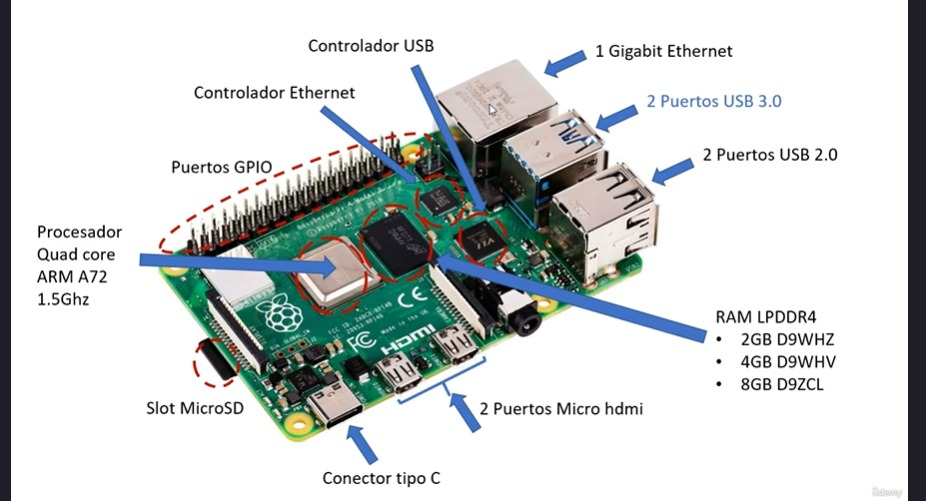

# INTRODUCCIÓN

## 1. Instalación y Puesta en Marcha
---

### **1.1. Partes de Raspberry PI 4**



### **1.2. Instalando  el SO**

1. Se descarga el app para poder instalar el SO en el microSD en el siguiente [enlace](https://www.raspberrypi.com/software/).
2. Recomendable instalar el SO Raspberry PI OS Full.
3. Luego colocar el microSD en la placa de Rapberry, y lo conectas con un monitor, teclado y mouse para instalar el SO del microSD boteable.
4. Si no detecta el monitor, ingresa a los archivos del microSD booteable y busca el que se llama `config.txt` y quita el comentario de `hdmi_safe=1`.
5. Si queremos conectarnos remotamente, tenemos que crear un archivo en blanco y sin extensiones llamado `ssh`

### **1.3. Accediendo remotamente**

Hay dos formas:

* Lineas de comando SSH: Nos conectamos por medio de Putty
* Escritorio remoto VNC: Nos conectamos por medio de VNC Viewer

Sin embargo, ni una de las dos formas esta permitido, es por eso que la configuramos inicialmente.

1. Para conectarnos a las dos formas necesitamos la IP de la Raspberry.
2. Para ello podemos ver nuestra ip por medio de `ipconfig`, si nosotros tenemos la ip 192.168.1.10, lo más probable es que la Raspberry tenga las que continúan, podemos probarle mediente `ping 192.168.1.11` y asi sucesivamente; o tambien usando `nmap -sn 192.168.1.0/24
` para rastrear todos los dispositivos en la red.
3. Descargas el PuTTY, recomendable uno portable(Bynari), o VNC Viewer.
4. Al ingresar colocas la IP y va a ver un login y password por defecto para ingresar que son `user: pi` `password: raspberry`
    ```sh
    sudo su
    raspi-config
    # Interfaz grafica:
    # 1. interface options
    # 2. VNC enable
    ```
5. Abrimos en VNC Viewer, y colocamos la ip

### **1.4. Comandos Básicos**

```sh
sudo su
apt-get update # Actualiza la lista de repositorios
apt-get upgrade # actualiza todo
apt-get install idle # Opcional - ide para python
pwd # Ruta actual
ls # Lista de directorios y archivos
cd # Moverse entre directorios
mkdir # Crear directorios
clear # Limpiar pantalla
touch # Crear archivos
nano # Editar o crear archivo de texto
cat # Ver contenido de archivo
cp # Copiar archivos
rm # Borra archivos
rm -rf # Borra directorios
df -h # Información del disco
free -h # Información de la memoria
cat /proc/meminfo # Información mas detallada de la memoria
cat /proc/cpuinfo # Información detallada del CPU
ifconfig # Información de red
route -n # Para ver nuestro gateway
```

### 1.5. 